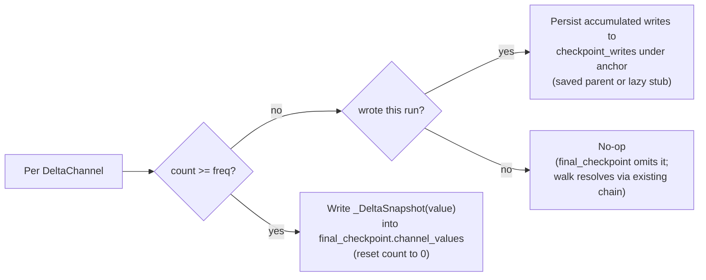
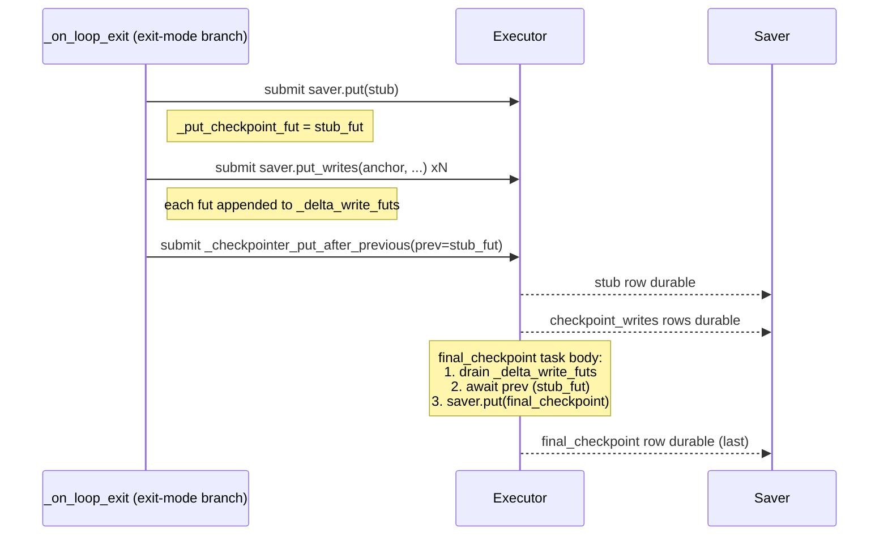
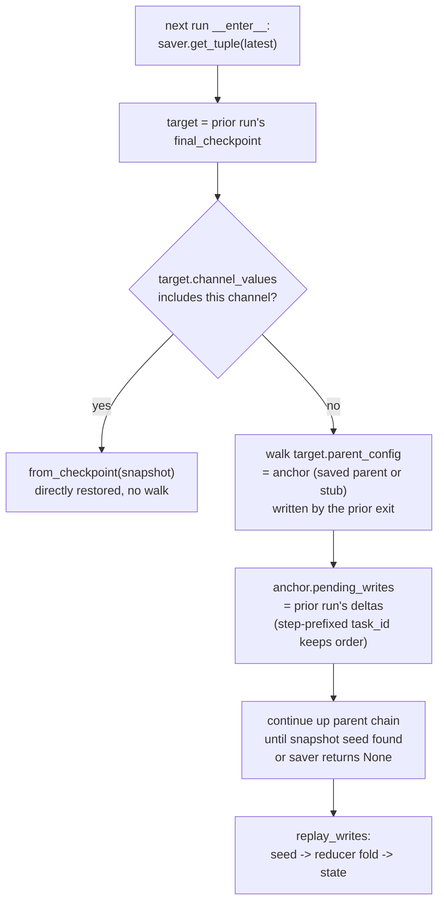

# Exit-mode Delta Persistence Redesign

## Why this change

`force_delta_snapshot=exiting and durability=="exit"` (in `_loop.py:947`) currently forces a full `_DeltaSnapshot` for every `DeltaChannel` that has data, on every run that uses `durability="exit"`. This is the case even when the run made zero writes to the channel and even when the channel's `snapshot_frequency` would not have fired. The TODO at [`libs/langgraph/langgraph/pregel/_checkpoint.py:161-165`](libs/langgraph/langgraph/pregel/_checkpoint.py) already calls this out:

```161:165:libs/langgraph/langgraph/pregel/_checkpoint.py
                # TODO: force-snapshot on every exit is wasteful for short
                # runs — a 1-message run still serialises the full state.
                # The right fix is to persist checkpoint_writes for delta
                # channels in durability="exit" mode so ancestor replay
                # works, eliminating the need for force-snapshot entirely.
```

The reason force-snapshot is needed today is that exit-mode `put_writes` does not persist writes (`if self.durability != "exit" and ...` at [`_loop.py:411`](libs/langgraph/langgraph/pregel/_loop.py)) and `after_tick` clears `checkpoint_pending_writes` ([`_loop.py:641`](libs/langgraph/langgraph/pregel/_loop.py)), so the intermediate writes that produced the in-memory state are gone by exit time and ancestor replay would have nothing to replay.

In parallel, the sync loop never initializes `_delta_write_futs` and its `_checkpointer_put_after_previous` (lines 1227-1241) does not drain delta-channel write futures before calling `put`. The async loop does drain them. With a multi-worker `BackgroundExecutor`, sync mode therefore has a latent race: a checkpoint can be persisted before the writes that produced it.

There is also a third latent issue, currently masked by force-snapshot: in exit mode the **count for the last superstep gets bumped twice**. The intermediate `_put_checkpoint({"source":"loop"})` from `after_tick` reads `self.updated_channels` and increments `delta_updates_since_snapshot[ch] += 1` for each delta channel. Then `_suppress_interrupt` calls `_put_checkpoint(self.checkpoint_metadata, exiting=True)` and re-runs the same increment because `self.updated_channels` is never cleared and the early-return at lines 934-936 only fires when the in-memory checkpoint id matches the last-saved id (it does not in exit mode, since intermediate calls did not save). Today force-snapshot always resets every count to 0 right after, so the inflated counts never persist; once we drop force-snapshot they will, causing snapshots to fire one superstep early after every exit-mode run.

Finally, the `_suppress_interrupt` method itself is misnamed: it already does four unrelated things (persist exit-mode checkpoint, suppress GraphInterrupt, emit lifecycle/stream events, save final output), with the comment block at lines 1411-1430 acknowledging this. This redesign adds a fifth (orchestrate stub + delta writes); to keep the diff readable and the call-site self-describing we **rename** the method to `_on_loop_exit` (Section 0). The fuller split into bounded helpers is intentionally deferred to its own plan, [split loop exit helpers](split_loop_exit_helpers_a252b918.plan.md) — the rename is the minimum we need here.

## Terminology

- **`final_checkpoint`** — a *role*, not a fixed object. For a given run it is the checkpoint object created at that run's exit by `create_checkpoint(exiting=True)` and persisted by `saver.put`; it becomes the thread head once the run completes. From the next run's perspective the same row is now its parent / read target. Earlier drafts of this plan called it "F". When the distinction matters (e.g. in the read-path diagram) we qualify it as "prior run's final_checkpoint".
- **`stub`** — a row in `checkpoints` with empty `channel_values` / `channel_versions` / `versions_seen`, persisted lazily at exit only when (a) no parent is yet in the saver AND (b) at least one delta channel has writes that the count-based decision didn't snapshot. Its sole job is to anchor those writes' `checkpoint_id` so ancestor walks find them.
- **anchor** — the `checkpoint_id` under which exit-mode delta writes are tagged in `checkpoint_writes`. Equals the saved parent's id on resumed runs, or the stub's id on first runs that need write persistence.

## High-level design

The redesign drops `force_delta_snapshot` entirely and replaces it with a per-channel count-based decision plus **lazy** anchoring. At exit we already know everything we need (per-channel update counts, accumulated writes, whether a persisted parent exists), so we only do the minimum work each run actually requires:

| Per-channel state at exit | Action |
|---|---|
| `count >= snapshot_frequency` | Snapshot in `final_checkpoint.channel_values` (no write persistence) |
| `count < snapshot_frequency` and channel had writes this run | Persist writes under the anchor (saved parent or stub) |
| Channel untouched this run | Nothing — `final_checkpoint` omits it; walk resolves via existing chain |

The anchor parent is:
- The existing saved parent's id, if `__enter__` found one in the saver, **or**
- A fresh empty stub persisted lazily at exit, but **only** when at least one channel actually needs delta persistence on a first-ever run

The redesign breaks into three concerns; each has its own diagram below.

### Per-channel decision at exit

What happens to *one* delta channel when the run is closing.



### Visibility ordering at exit

Three groups of I/O run concurrently on the executor; the saver row for `final_checkpoint` MUST become durable last so external readers (next run, concurrent `get_state`) never see a partial view.



The order is enforced by two existing rendezvous primitives — no new sync primitives needed:

- **`_put_checkpoint_fut` chain** — `_checkpointer_put_after_previous` awaits `prev` before running. Putting the stub fut at the head of the chain means `final_checkpoint`'s put is structurally guaranteed to wait for the stub.
- **`_delta_write_futs`** — drained by `_checkpointer_put_after_previous` before it does the actual `put`. Appending exit-write futures here means `final_checkpoint`'s put waits for them too.

`checkpoint_writes` has no FK on `checkpoints`, so the stub put and the exit-write puts can run concurrently — they only need to finish before `final_checkpoint` is durable, which the rendezvous above guarantees. The step-prefixed task_id makes the saver's `ORDER BY task_id, idx` yield chronological superstep order, preserving reducer correctness for non-commutative reducers like `add_messages`. (Sync mode also requires Section 1's drain fix; otherwise its `_checkpointer_put_after_previous` would not look at `_delta_write_futs`.)

### Read path: next run reconstructing state

How `__enter__` of the *next* run (or any `get_state`) hydrates a delta channel from the previous run's `final_checkpoint` — the one the previous exit just wrote, now sitting at the thread head in the saver. (`final_checkpoint` is a *role*: the head a run writes at exit; the next run reads it as its parent.)



The walk only consumes `pending_writes` from strict ancestors (it never reads target's own pending_writes), which is what makes the mid-run `get_state` consistency guarantee in Section 8b possible.

## Changes

### 0. Rename `_suppress_interrupt` to `_on_loop_exit`

[`libs/langgraph/langgraph/pregel/_loop.py`](libs/langgraph/langgraph/pregel/_loop.py): the existing `_suppress_interrupt` method (line 1039) does four things — only one of which is interrupt suppression. The full split into bounded helpers is tracked in [its own plan](split_loop_exit_helpers_a252b918.plan.md) and intentionally **not** done here. This redesign only does the minimum naming fix so the new exit-time orchestration (Section 6) lives inside a method whose name matches its job:

- Rename the method `_suppress_interrupt` → `_on_loop_exit` (signature and body unchanged).
- Update the two `stack.push(self._suppress_interrupt)` callsites:
  - `SyncPregelLoop.__enter__` (line 1431)
  - `AsyncPregelLoop.__aenter__` (line 1690)
- Update the comment block at lines 1411-1430 to refer to the new name.

That's it — nothing else moves in this section. All existing tests pass unchanged.

### 1. Sync drain symmetry (independent fix)

[`libs/langgraph/langgraph/pregel/_loop.py`](libs/langgraph/langgraph/pregel/_loop.py)
- In `SyncPregelLoop.__enter__` (~line 1376), set `self._delta_write_futs = []` before constructing `BackgroundExecutor`. This activates the existing `_delta_write_futs.append(fut)` branch in the base `put_writes` (line 440-443).
- Update `SyncPregelLoop._checkpointer_put_after_previous` (line 1227-1241) to drain pending futures via `concurrent.futures.wait(...)` (or `.result()` per fut) before calling `self.checkpointer.put(...)`, mirroring the async version.

### 2. Track whether a persisted parent already exists

[`libs/langgraph/langgraph/pregel/_loop.py`](libs/langgraph/langgraph/pregel/_loop.py) — both `SyncPregelLoop.__enter__` (~line 1325) and `AsyncPregelLoop.__aenter__` (~line 1574). Before the `if saved is None: saved = CheckpointTuple(...)` fallback, capture whether the saver actually returned something:

```python
saved_was_real = saved is not None
...
self._saved_parent_id = saved.checkpoint["id"] if saved_was_real else None
self._saved_parent_config = self.checkpoint_config if saved_was_real else None
```

`_saved_parent_config` is the config to use as the `put_writes` anchor at exit; capture it BEFORE any later `_put_checkpoint` mutates `self.checkpoint_config`. We do **not** persist anything here — stub creation, if needed, happens lazily at exit.

### 3. Exit-mode write accumulator

[`libs/langgraph/langgraph/pregel/_loop.py`](libs/langgraph/langgraph/pregel/_loop.py)
- Add `_exit_delta_writes: list[tuple[int, str, str, Any]] | None` field on `PregelLoop` (step, task_id, channel, value). Initialize to `[]` in both `__enter__`/`__aenter__` when `self.durability == "exit"` and `self.checkpointer is not None`; otherwise `None`.
- In `_first` (line 829-859), after `apply_writes` for input writes, capture delta-channel input writes into the accumulator (so a very first run's input is reconstructible from the lazily-created stub):
  ```python
  if self._exit_delta_writes is not None:
      for c, v in input_writes:
          if isinstance(self.specs.get(c), DeltaChannel):
              # synthetic task_id "INPUT" is fine; the step prefix on persist makes it sort first
              self._exit_delta_writes.append((self.step, "INPUT", c, v))
  ```
- In `after_tick`, immediately after `apply_writes` and BEFORE `self.checkpoint_pending_writes.clear()` (line 641), capture delta-channel writes:
  ```python
  if self._exit_delta_writes is not None:
      for tid, ch, v in self.checkpoint_pending_writes:
          if isinstance(self.specs.get(ch), DeltaChannel):
              self._exit_delta_writes.append((self.step, tid, ch, v))
  ```

#### 3a. Pre-existing bug: plain input loses sub-freq delta state in sync/async durability

[`libs/langgraph/langgraph/pregel/_loop.py`](libs/langgraph/langgraph/pregel/_loop.py) `_first` plain input path (line 853-883). Today the Command input path explicitly persists every write via `put_writes` ([_loop.py:783-794](libs/langgraph/langgraph/pregel/_loop.py)) — its comment block says exactly "ensures durability". The plain input path does NOT — it only feeds `apply_writes` then `_put_checkpoint("input")`. For non-delta channels and for delta channels that snapshot, `final_checkpoint.channel_values` captures the value. **For sub-freq delta channels, the input write lives only in in-memory channels and is never durably stored anywhere a walk can find** (it's not in `C_input.channel_values`, not in any `pending_writes`, and `walks ignore target.pending_writes`).

This was masked previously by force-snapshot in exit mode. With force-snapshot dropped, plus more users running `snapshot_frequency` ≫ 1, the gap surfaces. Fix is to mirror the Command path:

```python
elif input_writes := deque(map_input(input_keys, self.input)):
    discard_tasks = prepare_next_tasks(...)
    updated_channels = apply_writes(...)

    # Mirror the Command path: durably store delta-channel input writes so
    # sub-freq inputs are recoverable on read. (Non-delta channels are fully
    # captured in C_input.channel_values via apply_writes + create_checkpoint;
    # only delta channels need explicit put_writes here.)
    delta_input = [
        (c, v) for c, v in input_writes
        if isinstance(self.specs.get(c), DeltaChannel)
    ]
    if delta_input:
        self.put_writes(NULL_TASK_ID, delta_input)

    self.updated_channels = updated_channels
    self._put_checkpoint({"source": "input"})
```

**This fix is complete for resumed runs** — `put_writes` tags the writes with `self.checkpoint["id"]` which is the saved parent's id, present in the saver, so walks from C_input's descendants find them.

**This fix is incomplete for first-run sync/async** — at that moment `self.checkpoint["id"]` is the synthetic-empty id which is NOT persisted, so the writes orphan. Two follow-up options (deferred from this redesign):

- Extend the lazy-stub mechanism (Section 6) to ALL durability modes' first run — uniform structure but adds a stub row to first-run sync/async.
- Force-snapshot delta channels in `_put_checkpoint("source": "input")` only when `_saved_parent_id is None` — first-run-only special case for sync/async, no extra row.

Either follow-up is independent of the exit-mode redesign and can be picked up after merge. The `tests-write` matrix in Section 8a includes a regression test that exposes the first-run gap (currently expected to fail; will be flipped to xpass once the follow-up lands).

### 4. Snapshot decision (drop force entirely; extract pure helper)

[`libs/langgraph/langgraph/pregel/_loop.py`](libs/langgraph/langgraph/pregel/_loop.py) line 947 — remove the `force_delta_snapshot=exiting and self.durability == "exit"` argument from the `create_checkpoint` call. The decision is now purely count-based for every channel in every mode.

[`libs/langgraph/langgraph/pregel/_checkpoint.py`](libs/langgraph/langgraph/pregel/_checkpoint.py):
- Remove the `force_delta_snapshot` parameter from `create_checkpoint`, the `force` parameter from `_should_snapshot_delta`, and the corresponding code paths (lines 152-176 collapse into the count-based branch only). Update docstrings and delete the TODO at lines 161-165.
- Extract a pure helper used by both the create_checkpoint mutating path and the exit peek-ahead path:
  ```python
  def decide_delta_snapshots(
      channels: Mapping[str, BaseChannel],
      counts: Mapping[str, int],
  ) -> set[str]:
      """Return the set of DeltaChannel names that should snapshot now,
      i.e. count >= snapshot_frequency. No mutation."""
      return {
          name for name, ch in channels.items()
          if isinstance(ch, DeltaChannel)
          and ch.is_available()
          and counts.get(name, 0) >= ch.snapshot_frequency
      }
  ```
  `create_checkpoint` calls this once and uses the result in its existing branching. `_on_loop_exit` (via `_put_exit_delta_writes`) calls this BEFORE `_put_checkpoint` so it can decide stub/writes ahead of time without re-implementing the rule.

### 5. Fix the `delta_updates_since_snapshot` double-bump in exit-mode

[`libs/langgraph/langgraph/pregel/_loop.py`](libs/langgraph/langgraph/pregel/_loop.py) `_put_checkpoint` (lines 937-980). Today the count-bump runs unconditionally. In exit mode the last superstep's count gets bumped twice: once by the intermediate `after_tick` call, once by the `_suppress_interrupt` call. Fix by gating the bump on `not exiting`:

```python
def _put_checkpoint(self, metadata: CheckpointMetadata) -> None:
    exiting = metadata is self.checkpoint_metadata
    if exiting and self.checkpoint["id"] == self.checkpoint_id_saved:
        return

    if not exiting:
        prev_counts = dict(
            self.checkpoint_metadata.get("delta_updates_since_snapshot", {}) or {}
        )
        new_counts = dict(prev_counts)
        if self.updated_channels:
            for ch_name in self.updated_channels:
                if isinstance(self.channels.get(ch_name), DeltaChannel):
                    new_counts[ch_name] = new_counts.get(ch_name, 0) + 1
        metadata["step"] = self.step
        metadata["parents"] = self.config[CONF].get(CONFIG_KEY_CHECKPOINT_MAP, {})
        self.checkpoint_metadata = metadata
    else:
        # Exit just finalises what the prior loop call already counted.
        new_counts = dict(
            self.checkpoint_metadata.get("delta_updates_since_snapshot", {}) or {}
        )
    ...
```

This was a pre-existing latent bug, hidden by force-snapshot resetting all counts. After we drop force-snapshot, leaving it unfixed would make snapshots fire one superstep early after every exit-mode run.

### 6. Persist accumulated delta writes at exit (lazy stub, ordered before `final_checkpoint`)

[`libs/langgraph/langgraph/pregel/_loop.py`](libs/langgraph/langgraph/pregel/_loop.py) `_on_loop_exit` (renamed from `_suppress_interrupt` in Section 0). Inside its existing `durability == "exit"` persist branch (today: `_put_checkpoint(self.checkpoint_metadata); _put_pending_writes()`), insert `_put_exit_delta_writes()` as a new FIRST step so the stub + delta writes get staged BEFORE `final_checkpoint`'s put — `final_checkpoint`'s put-after-previous then naturally waits on them via the existing rendezvous primitives:

```python
def _on_loop_exit(self, exc_type, exc_value, traceback) -> bool | None:
    # ...existing top of method unchanged (durability + nesting predicate)...
    if self.durability == "exit" and (
        not self.is_nested
        or exc_value is not None
        or all(NS_END not in part for part in self.checkpoint_ns)
    ):
        # NEW: stage stub + delta writes so final_checkpoint's put waits on them.
        self._put_exit_delta_writes()
        # final_checkpoint's _checkpointer_put_after_previous now sees
        # prev = stub_fut (if any) and drains _delta_write_futs (the exit writes)
        # before saver.put(final_checkpoint).
        self._put_checkpoint(self.checkpoint_metadata)
        # Last-superstep pending writes still anchor on final_checkpoint.id
        # (used by resume-after-interrupt, not by delta replay).
        self._put_pending_writes()
    # ...remaining GraphInterrupt suppression / final-output capture unchanged...
```

`_put_exit_delta_writes` (sync + async variants) implements the lazy-stub, ordered-submission policy:

```python
def _put_exit_delta_writes(self) -> None:
    if not self._exit_delta_writes or self.checkpointer is None:
        return

    # 1. Peek at the snapshot decision without mutating state.
    counts = self.checkpoint_metadata.get("delta_updates_since_snapshot", {}) or {}
    will_snapshot = decide_delta_snapshots(self.channels, counts)

    # 2. Filter; channels that will snapshot have their state in final_checkpoint.
    pending = [
        (step, tid, ch, v)
        for (step, tid, ch, v) in self._exit_delta_writes
        if ch not in will_snapshot
    ]
    if not pending:
        return

    # 3. Resolve anchor; create a stub at the head of the put-chain only when needed.
    if self._saved_parent_config is not None:
        anchor_config = self._saved_parent_config
    else:
        anchor_config = self._initial_checkpoint_config  # synthetic empty id captured at __enter__
        empty_cp = empty_checkpoint_with_id(
            anchor_config[CONF][CONFIG_KEY_CHECKPOINT_ID]
        )
        # Inject at the head of _put_checkpoint_fut chain so final_checkpoint.put
        # awaits it as `prev`.
        self._put_checkpoint_fut = self.submit(
            self.checkpointer.put, anchor_config, empty_cp, {"step": -2}, {},
        )

    # 4. Group by (step, task_id) to preserve append order, persist with step-prefixed
    #    synthetic task ids; append each fut to _delta_write_futs so
    #    final_checkpoint.put drains them.
    grouped: dict[tuple[int, str], list[tuple[str, Any]]] = {}
    for step, tid, ch, v in pending:
        grouped.setdefault((step, tid), []).append((ch, v))
    for (step, tid), entries in grouped.items():
        synth_tid = f"{step:08d}-{tid}"
        fut = self.submit(
            self.checkpointer.put_writes, anchor_config, entries, synth_tid,
        )
        self._delta_write_futs.append(fut)
```

The async variant is structurally identical, using `aput`/`aput_writes`.

**Visibility invariant (recap):** `final_checkpoint`'s `_checkpointer_put_after_previous` drains `_delta_write_futs` and awaits `prev` BEFORE the actual `put`. With the stub fut placed in `prev` and exit-write futs placed in `_delta_write_futs`, `final_checkpoint` is the structural last-to-publish; when it becomes durable the stub row and all `checkpoint_writes` rows already exist. `checkpoint_writes` has no FK on `checkpoints`, so stub put and exit-write puts can run concurrently — they only need to finish before `final_checkpoint` is durable, which the rendezvous above guarantees. This depends on Section 1 (sync drain) actually being implemented; otherwise the sync loop would publish `final_checkpoint` before the writes were durable.

The synthetic task id is purely a saver-side ordering hint. `DeltaChannel.replay_writes` consumes only values, never task_ids, so this does not affect reducer semantics or any other channel type. Other channel types' writes are not in `_exit_delta_writes` and continue to flow only through `_put_pending_writes` with original task_ids (last-superstep only, used for resume after interrupt).

### 7. `_initial_checkpoint_config` capture

[`libs/langgraph/langgraph/pregel/_loop.py`](libs/langgraph/langgraph/pregel/_loop.py) `__enter__`/`__aenter__`: stash a snapshot of `self.checkpoint_config` immediately after `saved` is resolved (before any `_put_checkpoint` mutates it), as `self._initial_checkpoint_config`. This is the config handed to `_put_exit_delta_writes` for the lazy-stub branch — its `CONFIG_KEY_CHECKPOINT_ID` is the synthetic empty id, which is the id we want the stub to be persisted under.

### 8. Tests

[`libs/langgraph/tests/test_delta_channel_migration.py`](libs/langgraph/tests/test_delta_channel_migration.py) and/or `tests/test_pregel.py` / `tests/test_pregel_async.py`.

#### 8a. Write-path / structural tests

- **First run, no delta writes** (e.g. graph with delta channel but never invoked, or invoked without touching it): assert exactly one row in `checkpoints` after the run (no stub, no orphan).
- **First run, all delta channels reach `>= snapshot_frequency`**: assert `final_checkpoint` contains snapshots for those channels and **no stub** is written; one checkpoint row total.
- **First run, at least one channel below frequency with writes**: assert exactly one stub is written (regardless of how many channels need writes — stub is shared); deltas land on stub with step-prefixed task ids; reading state from `final_checkpoint` reconstructs the correct value.
- **Resumed run, sub-frequency writes**: anchor is the existing saved parent; **no stub** created; deltas land on the saved parent; ordering preserved across supersteps using `add_messages` with observable order.
- **Resumed run, snapshot fires for some channels and not others**: assert snapshot channels have no exit-delta writes persisted; non-snapshot channels' writes go to the saved parent.
- **Mixed snapshot/no-snapshot first run**: snapshot channels appear in `final_checkpoint.channel_values`; non-snapshot channels' writes share a single lazily-created stub.
- **Visibility ordering**: install a checkpointer wrapper that records the order of `put` and `put_writes` calls; assert that for any successful exit, every stub `put` and every exit-delta `put_writes` completes before `final_checkpoint`'s `put` does.
- **Count parity**: run the same graph with `durability="sync"` and with `durability="exit"`; assert the persisted `delta_updates_since_snapshot` (and resulting snapshot timing on subsequent runs) match — i.e. exit mode no longer over-counts.
- **Sync-mode race regression**: simulate a slow `put_writes` and a fast next-step `put`; assert ancestor walk sees all writes mid-run (covers cross-thread `get_state` callers).
- **Plain input survives `get_state` (sub-freq delta, resumed run)** — set up a thread with a saved parent that has a delta channel snapshot. New sync (or async) durability invocation passes plain input touching that channel with sub-freq counts. Without running any superstep that mutates the channel further, call `get_state` and assert the input is reflected in the channel state. Today this fails for plain input but passes for Command input — the Section 3a fix closes that asymmetry. (First-run variant of this test is expected to remain failing/`xfail` until one of the Section 3a follow-ups lands.)

#### 8b. Read-path tests

The whole redesign is only as good as the next run's ability to reconstruct state. These tests load the saver back as the source of truth and drive reads through the public surface (`get_state` / a fresh `Pregel.invoke` resume).

- **Multi-run replay chain** — drive K consecutive exit-mode runs (each below `snapshot_frequency`), with each superstep writing one observable item to an `add_messages` channel. After every run, open a *fresh* loop and assert the channel contains items in chronological order across all prior runs. Verifies (a) writes round-trip correctly across multiple anchors (stub for run 1, saved parent for runs 2..K), (b) step-prefixed task_id ordering survives `(task_id, idx)` sorting at every saver, and (c) `from_checkpoint` + `replay_writes` produces the same result as the in-memory channel did at exit.
- **Snapshot + tail deltas** — run 1 writes enough to trigger snapshot for channel A, leaves channel B sub-frequency; run 2 writes both. From a fresh loop after run 2: A reconstructs as `from_checkpoint(snapshot_in_run1_final_checkpoint)` + run 2's writes; B reconstructs purely via walk back to stub/parent + accumulated writes. Asserts that snapshot and delta paths interleave correctly within a single read.
- **Cross-saver conformance** — parametrise the multi-run replay test over `InMemorySaver`, `SqliteSaver`, `AsyncSqliteSaver`, `PostgresSaver`, `AsyncPostgresSaver`. The Postgres and SQLite savers each ship their own optimised `get_delta_channel_history` implementation (`postgres/base.py`, `checkpoint-sqlite/.../_delta.py`); the test must exercise those paths, not just the default walk in `BaseCheckpointSaver`.
- **Forked-thread isolation (lock-down)** — from the same saved parent CP, run two separate exit-mode runs producing `final_a` and `final_b`; both runs' writes end up tagged with CP.id. From `final_a`, `get_state` should NOT include `final_b`'s writes in the reconstruction (or, if today's behaviour does include them, the test documents the limitation explicitly so we surface it before merge instead of after). This is a pre-existing forking concern surfaced by exit-mode now anchoring writes on shared parents; the test's job is to lock current behaviour down so we don't silently change it.
- **Mid-run `get_state` consistency** — start an exit-mode run on thread T from another thread/coroutine; before the run completes, call `get_state(T)`. Assert the read returns the *prior* head's state (run not yet committed) and never observes a partial view (e.g. exit-delta writes appearing on the prior parent without `final_checkpoint` published, or vice versa). Relies on the `walks ignore target.pending_writes` invariant plus the new put-order invariant.
- **Metadata round-trip** — drive K consecutive exit-mode runs, each writing once. After run i, open the saver directly (`saver.get_tuple(latest_config)`) and assert `metadata["delta_updates_since_snapshot"][channel] == i`, except at `i == snapshot_frequency` where it must be `0` AND `final_checkpoint.channel_values[channel]` must be a `_DeltaSnapshot`. Catches both the count double-bump regression and the metadata serialisation path (Postgres JSONB / SQLite JSON / memory dict).
- **Mixed durability round-trip** — alternate `durability="sync"` and `durability="exit"` runs on the same thread; assert the count chain stays monotonic and that snapshots fire at exactly the expected step regardless of which mode produced the increments.

### 9. Docs / comments

- Remove `force_delta_snapshot` from `create_checkpoint` and `_should_snapshot_delta` in [`_checkpoint.py`](libs/langgraph/langgraph/pregel/_checkpoint.py); delete the TODO at lines 161-165 since the underlying problem is fixed.
- Add a comment in `_put_exit_delta_writes` documenting the visibility-ordering invariant (stub fut → `_put_checkpoint_fut` head; write futs → `_delta_write_futs`; `final_checkpoint`'s put-after-previous is the structural rendezvous).
- Add a comment near `_put_checkpoint`'s exiting branch explaining why the count-bump is gated (avoids the double-bump that force-snapshot used to mask).
- Add a comment near `_put_exit_delta_writes` explaining the synthetic task_id ordering trick and why it is safe / delta-only.