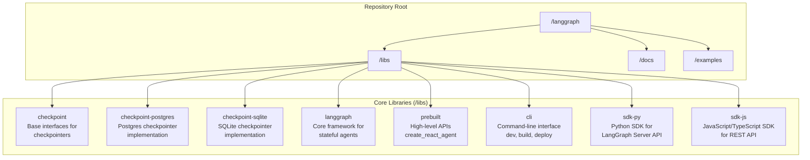
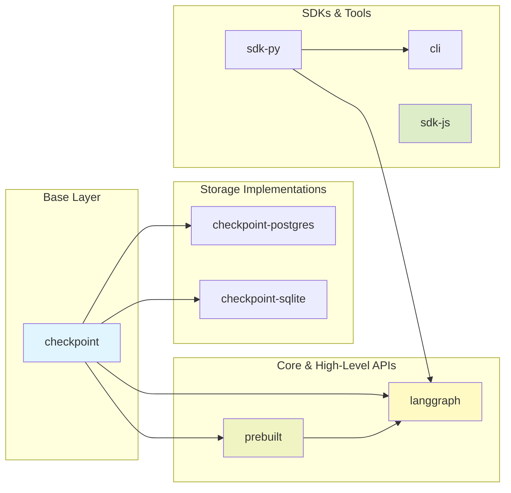
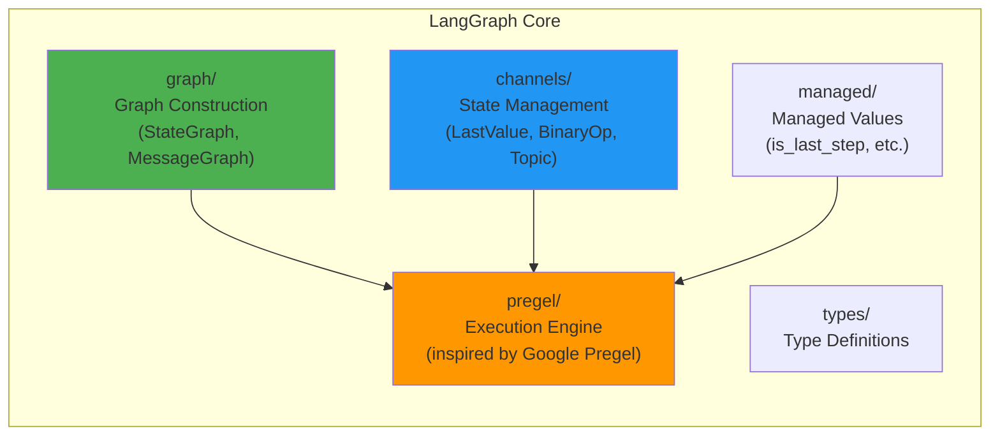
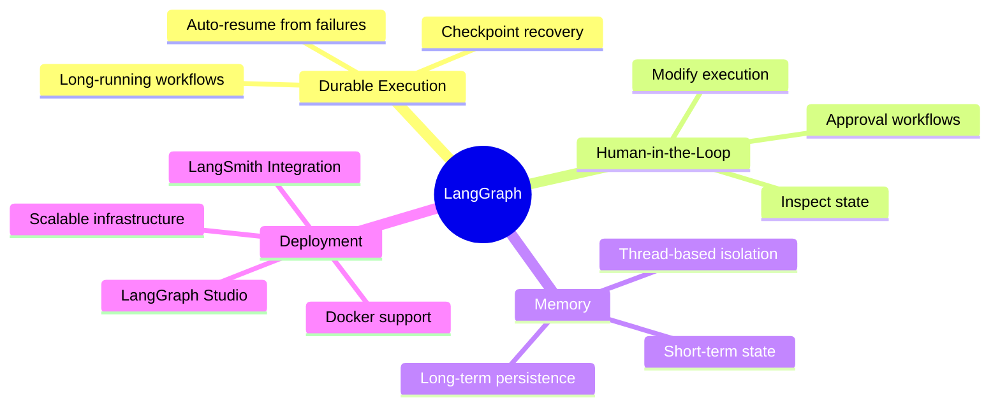
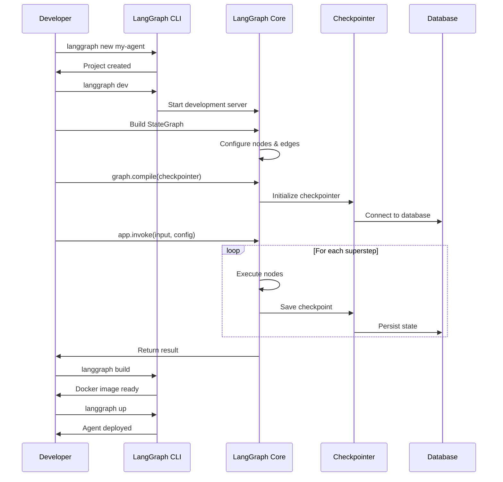
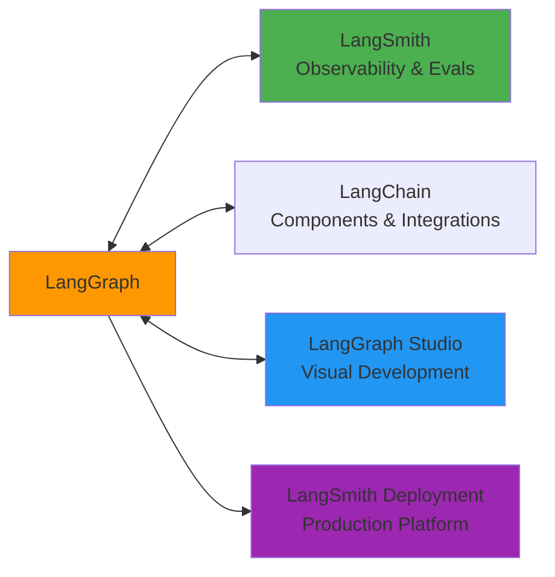
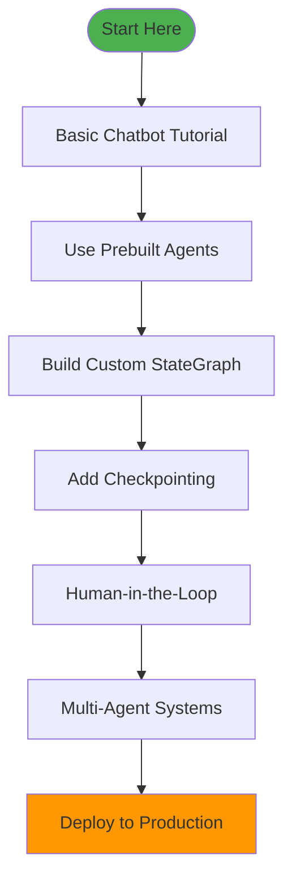

# LangGraph Repository Architecture

## Overview
LangGraph is a low-level orchestration framework for building, managing, and deploying long-running, stateful AI agents. The repository is organized as a **monorepo** containing multiple interconnected libraries.

---

## 🏗️ Repository Structure



---

## 🔗 Dependency Graph



---

## 📦 Library Details

### 1. **checkpoint** - Persistence Layer
Base interfaces for LangGraph checkpointers that provide:
- State persistence across runs
- "Memory" between interactions
- Human-in-the-loop capabilities
- Thread-based state management

**Key Components:**
```
checkpoint/
├── langgraph/checkpoint/base/     # Base interfaces
├── langgraph/checkpoint/memory/   # In-memory implementation
├── langgraph/checkpoint/serde/    # Serialization/deserialization
├── langgraph/cache/base/          # Cache interfaces
└── langgraph/store/base/          # Store interfaces
```

---

### 2. **checkpoint-postgres** & **checkpoint-sqlite**
Concrete implementations of checkpoint savers:
- **Postgres**: Production-ready persistent storage
- **SQLite**: Lightweight, file-based storage
- Both support async operations
- Include cache and store implementations

---

### 3. **langgraph** - Core Framework ⚡
The heart of the system - a low-level orchestration framework.

**Architecture:**


**Key Modules:**
- **pregel/**: Core execution engine with async support
  - `_algo.py`: Graph algorithms
  - `_loop.py`: Execution loop
  - `_executor.py`: Task execution
  - `_checkpoint.py`: Checkpointing logic
  - `main.py`: Main Pregel class

- **graph/**: Graph building blocks
  - `state.py`: StateGraph (main graph type)
  - `message.py`: MessageGraph (for chat applications)
  - `_node.py`: Node definitions
  - `_branch.py`: Conditional branching

- **channels/**: State channels
  - Different update strategies (last value, reduce, etc.)
  - Topic channels for pub/sub patterns

---

### 4. **prebuilt** - High-Level APIs 🎯
Pre-configured components for common patterns:

```python
from langgraph.prebuilt import create_react_agent

# Quick ReAct agent setup
agent = create_react_agent(model, tools, prompt="...")
```

**Components:**
- `create_react_agent`: ReAct-style tool-calling agent
- `ToolNode`: Executes tool calls
- `ValidationNode`: Validates tool calls against schemas

---

### 5. **cli** - Command Line Interface 🛠️
Official CLI for LangGraph development and deployment:

**Commands:**
- `langgraph new`: Create new project from template
- `langgraph dev`: Development server with hot reload
- `langgraph up`: Launch in Docker
- `langgraph build`: Build Docker image
- `langgraph dockerfile`: Generate Dockerfile

**Configuration:** `langgraph.json`
```json
{
  "dependencies": ["langchain_openai", "./your_package"],
  "graphs": {
    "my_graph": "./your_package/file.py:graph"
  },
  "env": "./.env",
  "python_version": "3.11"
}
```

---

### 6. **sdk-py** - Python SDK 🐍
Client library for interacting with LangGraph Server API:

```python
from langgraph_sdk import get_client

client = get_client()
assistants = await client.assistants.search()
thread = await client.threads.create()

async for chunk in client.runs.stream(thread_id, assistant_id, input=input):
    print(chunk)
```

---

### 7. **sdk-js** - JavaScript/TypeScript SDK 📘
JS/TS SDK for interacting with LangGraph REST API (minimal in Python repo).

---

## 🎯 Core Concepts

### 1. State Graph
Central abstraction for building stateful workflows:
```python
from langgraph.graph import StateGraph

graph = StateGraph(StateSchema)
graph.add_node("node1", node1_function)
graph.add_node("node2", node2_function)
graph.add_edge("node1", "node2")
graph.set_entry_point("node1")
app = graph.compile(checkpointer=checkpointer)
```

### 2. Checkpointing
Automatic state persistence:
- State saved at every "superstep"
- Resume from any checkpoint
- Time-travel debugging
- Human-in-the-loop patterns

### 3. Channels
Different state update strategies:
- **LastValue**: Keep only the latest value
- **BinaryOperatorAggregate**: Reduce values (sum, concat, etc.)
- **Topic**: Pub/sub message passing
- **EphemeralValue**: Temporary state

### 4. Pregel-Inspired Execution
Based on Google's Pregel graph processing model:
- Superstep-based execution
- Message passing between nodes
- Parallel execution where possible
- Fault-tolerant with checkpointing

---

## 🚀 Key Features



---

## 📂 Directory Layout

```
langgraph/
├── libs/                          # All libraries
│   ├── checkpoint/               # ✅ Base checkpointer interfaces
│   ├── checkpoint-postgres/      # 🐘 Postgres implementation
│   ├── checkpoint-sqlite/        # 📦 SQLite implementation
│   ├── cli/                      # 🛠️ Command-line tools
│   ├── langgraph/                # ⚡ Core framework
│   │   ├── _internal/           # Internal utilities
│   │   ├── channels/            # State channels
│   │   ├── graph/               # Graph builders
│   │   ├── managed/             # Managed values
│   │   ├── pregel/              # Execution engine
│   │   └── utils/               # Helper utilities
│   ├── prebuilt/                # 🎯 High-level APIs
│   ├── sdk-js/                  # 📘 JS/TS SDK
│   └── sdk-py/                  # 🐍 Python SDK
├── docs/                         # Documentation
│   ├── docs/
│   │   ├── concepts/            # Core concepts
│   │   ├── tutorials/           # Getting started
│   │   ├── how-tos/             # Guides
│   │   └── reference/           # API reference
│   └── mkdocs.yml               # Docs configuration
├── examples/                     # Example implementations
│   ├── rag/                     # RAG examples
│   ├── multi_agent/             # Multi-agent systems
│   ├── memory/                  # Memory patterns
│   ├── reflection/              # Self-reflection agents
│   ├── rewoo/                   # ReWOO implementation
│   └── ...
├── AGENTS.md                     # Development guide
├── CONTRIBUTING.md               # Contribution guidelines
└── README.md                     # Main readme
```

---

## 🔄 Typical Workflow



---

## 🧪 Development Commands

Each library supports:
```bash
cd libs/<library-name>
make format    # Run code formatters
make lint      # Run linter
make test      # Execute test suite
```

---

## 🌟 Key Benefits

1. **Durable Execution**: Persist through failures, resume automatically
2. **Human-in-the-Loop**: Inspect and modify state at any point
3. **Comprehensive Memory**: Short-term and long-term stateful memory
4. **Production Ready**: Scalable deployment with LangGraph Platform
5. **Debugging**: LangSmith integration for deep visibility
6. **Low-Level Control**: No abstraction of prompts or architecture

---

## 🔗 Integration Ecosystem



---

## 📚 Additional Resources

- **Docs**: https://langchain-ai.github.io/langgraph/
- **API Reference**: https://reference.langchain.com/python/langgraph/
- **Examples**: 60+ examples in `/examples`
- **Tutorials**: Step-by-step guides in `/docs/docs/tutorials`
- **LangChain Academy**: Free course on LangGraph basics
- **Forum**: https://forum.langchain.com/

---

## 🎓 Learning Path



---

## 📝 Summary

**LangGraph** is a comprehensive framework for building production-grade AI agents with:
- **8 libraries** organized as a monorepo
- **Pregel-inspired** execution engine for stateful workflows
- **Flexible persistence** via pluggable checkpointers
- **Developer-friendly** CLI and SDKs
- **Production-ready** deployment options
- **Rich ecosystem** with LangChain and LangSmith

The architecture separates concerns beautifully:
- **checkpoint**: Persistence abstraction
- **langgraph**: Core orchestration
- **prebuilt**: Quick-start components
- **cli/sdk**: Developer tooling

This makes LangGraph suitable for everything from simple chatbots to complex multi-agent systems running in production at scale.


