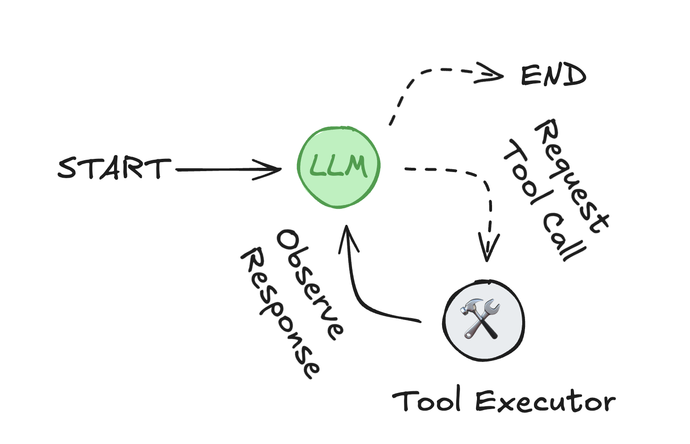

# Agents

## What is an agent?

An *agent* consists of three components: a **large language model (LLM)**, a set of **tools** it can use, and a **prompt** that provides instructions.

The LLM operates in a loop. In each iteration, it selects a tool to invoke, provides input, receives the result (an observation), and uses that observation to inform the next action. The loop continues until a stopping condition is met — typically when the agent has gathered enough information to respond to the user.

<figure markdown="1">
{: style="max-height:400px"}
<figcaption>Agent loop: the LLM selects tools and uses their outputs to fulfill a user request.</figcaption>
</figure>

## Basic configuration

Use [`create_react_agent`](https://python.langchain.com/docs/api_reference/langgraph.prebuilt.chat_agent_executor/#create-react-agent) to instantiate an agent:

```python
from langgraph.prebuilt import create_react_agent

def get_weather(city: str) -> str:
    """Get weather for a given city."""
    return f"It's always sunny in {city}!"

agent = create_react_agent(
    model="anthropic:claude-3-7-sonnet-latest",
    tools=[get_weather],
    prompt="You are a helpful assistant"
)

# Run the agent
agent.invoke({"messages": "what is the weather in sf"})
```

## LLM configuration

Use [init_chat_model](https://python.langchain.com/api_reference/langchain/chat_models/langchain.chat_models.base.init_chat_model.html) to configure an LLM with specific parameters,
such as temperature:

```python
from langchain.chat_models import init_chat_model
from langgraph.prebuilt import create_react_agent

# highlight-next-line
model = init_chat_model(
    "anthropic:claude-3-7-sonnet-latest",
    # highlight-next-line
    temperature=0
)

agent = create_react_agent(
    # highlight-next-line
    model=model,
    tools=[get_weather],
)
```

## Custom Prompts

Prompts instruct the LLM how to behave. They can be:

* **Static**: A fixed string or list of [messages](https://python.langchain.com/docs/concepts/messages/)
* **Dynamic**: a list of messages generated at **runtime** based on input or configuration

### Dynamic prompts

Define a function that returns a message list based on the agent's state and configuration:

```python
from langchain_core.runnables import RunnableConfig
from langgraph.prebuilt.chat_agent_executor import AgentState
from langgraph.prebuilt import create_react_agent

def prompt(state: AgentState, config: RunnableConfig):
    user_name = config.get("configurable", {}).get("user_name")
    system_msg = f"You are a helpful assistant. Address the user as {user_name}."
    return [{"role": "system", "content": system_msg}] + state["messages"]

agent = create_react_agent(
    model="anthropic:claude-3-7-sonnet-latest",
    tools=[get_weather],
    # highlight-next-line
    prompt=prompt
)

agent.invoke(
    {"messages": "what is the weather in sf"},
    # highlight-next-line
    config={"configurable": {"user_name": "John Smith"}}
)
```

See the [context](./context.md) page for more information.

### Static prompts

Define a fixed prompt string or list of messages. 

```python
from langgraph.prebuilt import create_react_agent

agent = create_react_agent(
    model="anthropic:claude-3-7-sonnet-latest",
    tools=[get_weather],
    # A static prompt that never changes
    # highlight-next-line
    prompt="Never answer questions about the weather."
)

agent.invoke(
    {"messages": "what is the weather in sf"},
)
```

## Structured output

To produce structured responses conforming to a schema, use the `response_format` parameter. The schema can be defined with a `Pydantic` model or `TypedDict`. The result will be accessible via the `structured_response` field.

```python
from pydantic import BaseModel
from langgraph.prebuilt import create_react_agent

class WeatherResponse(BaseModel):
    conditions: str

agent = create_react_agent(
    model="anthropic:claude-3-7-sonnet-latest",
    tools=[get_weather],
    # highlight-next-line
    response_format=WeatherResponse  # (1)!
)

response = agent.invoke({"messages": "what is the weather in sf"})

# highlight-next-line
response["structured_response"]
```

1. To provide a system prompt when generating structured response, use a tuple `(prompt, schema)`, e.g., `response_format=(prompt, WeatherResponse)`.

!!! Note "LLM post-processing"

    Structured output requires an additional call to the LLM to format the response according to the schema.

