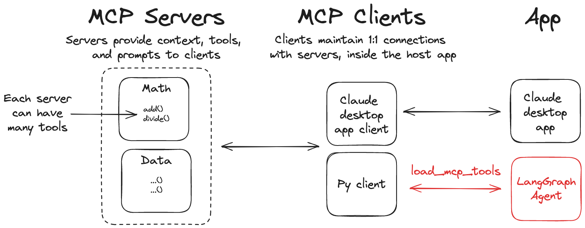

---
search:
  boost: 2
tags:
  - agent
hide:
  - tags
---

# Use MCP

[Model Context Protocol (MCP)](https://modelcontextprotocol.io/introduction) is an open protocol that standardizes how applications provide tools and context to language models. LangGraph agents can use tools defined on MCP servers through the `langchain-mcp-adapters` library.



:::python
Install the `langchain-mcp-adapters` library to use MCP tools in LangGraph:

```bash
pip install langchain-mcp-adapters
```

:::

:::js
Install the `@langchain/mcp-adapters` library to use MCP tools in LangGraph:

```bash
npm install langchain-mcp-adapters
```

:::

## Use MCP tools

:::python
The `langchain-mcp-adapters` package enables agents to use tools defined across one or more MCP servers.

=== "In an agent"

    ```python title="Agent using tools defined on MCP servers"
    # highlight-next-line
    from langchain_mcp_adapters.client import MultiServerMCPClient
    from langgraph.prebuilt import create_react_agent

    # highlight-next-line
    client = MultiServerMCPClient(
        {
            "math": {
                "command": "python",
                # Replace with absolute path to your math_server.py file
                "args": ["/path/to/math_server.py"],
                "transport": "stdio",
            },
            "weather": {
                # Ensure you start your weather server on port 8000
                "url": "http://localhost:8000/mcp",
                "transport": "streamable_http",
            }
        }
    )
    # highlight-next-line
    tools = await client.get_tools()
    agent = create_react_agent(
        "anthropic:claude-3-7-sonnet-latest",
        # highlight-next-line
        tools
    )
    math_response = await agent.ainvoke(
        {"messages": [{"role": "user", "content": "what's (3 + 5) x 12?"}]}
    )
    weather_response = await agent.ainvoke(
        {"messages": [{"role": "user", "content": "what is the weather in nyc?"}]}
    )
    ```

=== "In a workflow"

    ```python title="Workflow using MCP tools with ToolNode"
    from langchain_mcp_adapters.client import MultiServerMCPClient
    from langchain.chat_models import init_chat_model
    from langgraph.graph import StateGraph, MessagesState, START, END
    from langgraph.prebuilt import ToolNode

    # Initialize the model
    model = init_chat_model("anthropic:claude-3-5-sonnet-latest")

    # Set up MCP client
    client = MultiServerMCPClient(
        {
            "math": {
                "command": "python",
                # Make sure to update to the full absolute path to your math_server.py file
                "args": ["./examples/math_server.py"],
                "transport": "stdio",
            },
            "weather": {
                # make sure you start your weather server on port 8000
                "url": "http://localhost:8000/mcp/",
                "transport": "streamable_http",
            }
        }
    )
    tools = await client.get_tools()

    # Bind tools to model
    model_with_tools = model.bind_tools(tools)

    # Create ToolNode
    tool_node = ToolNode(tools)

    def should_continue(state: MessagesState):
        messages = state["messages"]
        last_message = messages[-1]
        if last_message.tool_calls:
            return "tools"
        return END

    # Define call_model function
    async def call_model(state: MessagesState):
        messages = state["messages"]
        response = await model_with_tools.ainvoke(messages)
        return {"messages": [response]}

    # Build the graph
    builder = StateGraph(MessagesState)
    builder.add_node("call_model", call_model)
    builder.add_node("tools", tool_node)

    builder.add_edge(START, "call_model")
    builder.add_conditional_edges(
        "call_model",
        should_continue,
    )
    builder.add_edge("tools", "call_model")

    # Compile the graph
    graph = builder.compile()

    # Test the graph
    math_response = await graph.ainvoke(
        {"messages": [{"role": "user", "content": "what's (3 + 5) x 12?"}]}
    )
    weather_response = await graph.ainvoke(
        {"messages": [{"role": "user", "content": "what is the weather in nyc?"}]}
    )
    ```

:::

:::js
The `@langchain/mcp-adapters` package enables agents to use tools defined across one or more MCP servers.

=== "In an agent"

    ```typescript title="Agent using tools defined on MCP servers"
    // highlight-next-line
    import { MultiServerMCPClient } from "langchain-mcp-adapters/client";
    import { ChatAnthropic } from "@langchain/langgraph/prebuilt";
    import { createReactAgent } from "@langchain/langgraph/prebuilt";

    // highlight-next-line
    const client = new MultiServerMCPClient({
      math: {
        command: "node",
        // Replace with absolute path to your math_server.js file
        args: ["/path/to/math_server.js"],
        transport: "stdio",
      },
      weather: {
        // Ensure you start your weather server on port 8000
        url: "http://localhost:8000/mcp",
        transport: "streamable_http",
      },
    });

    // highlight-next-line
    const tools = await client.getTools();
    const agent = createReactAgent({
      llm: new ChatAnthropic({ model: "claude-3-7-sonnet-latest" }),
      // highlight-next-line
      tools,
    });

    const mathResponse = await agent.invoke({
      messages: [{ role: "user", content: "what's (3 + 5) x 12?" }],
    });

    const weatherResponse = await agent.invoke({
      messages: [{ role: "user", content: "what is the weather in nyc?" }],
    });
    ```

=== "In a workflow"

    ```typescript
    import { MultiServerMCPClient } from "langchain-mcp-adapters/client";
    import { StateGraph, MessagesZodState, START } from "@langchain/langgraph";
    import { ToolNode } from "@langchain/langgraph/prebuilt";
    import { ChatOpenAI } from "@langchain/openai";
    import { AIMessage } from "@langchain/core/messages";
    import { z } from "zod";

    const model = new ChatOpenAI({ model: "gpt-4" });

    const client = new MultiServerMCPClient({
      math: {
        command: "node",
        // Make sure to update to the full absolute path to your math_server.js file
        args: ["./examples/math_server.js"],
        transport: "stdio",
      },
      weather: {
        // make sure you start your weather server on port 8000
        url: "http://localhost:8000/mcp/",
        transport: "streamable_http",
      },
    });

    const tools = await client.getTools();

    const builder = new StateGraph(MessagesZodState)
      .addNode("callModel", async (state) => {
        const response = await model.bindTools(tools).invoke(state.messages);
        return { messages: [response] };
      })
      .addNode("tools", new ToolNode(tools))
      .addEdge(START, "callModel")
      .addConditionalEdges("callModel", (state) => {
        const lastMessage = state.messages.at(-1) as AIMessage | undefined;
        if (!lastMessage?.tool_calls?.length) {
          return "__end__";
        }
        return "tools";
      })
      .addEdge("tools", "callModel");

    const graph = builder.compile();

    const mathResponse = await graph.invoke({
      messages: [{ role: "user", content: "what's (3 + 5) x 12?" }],
    });

    const weatherResponse = await graph.invoke({
      messages: [{ role: "user", content: "what is the weather in nyc?" }],
    });
    ```

:::

## Custom MCP servers

:::python
To create your own MCP servers, you can use the `mcp` library. This library provides a simple way to define tools and run them as servers.

Install the MCP library:

```bash
pip install mcp
```

:::

:::js
To create your own MCP servers, you can use the `@modelcontextprotocol/sdk` library. This library provides a simple way to define tools and run them as servers.

Install the MCP SDK:

```bash
npm install @modelcontextprotocol/sdk
```

:::

Use the following reference implementations to test your agent with MCP tool servers.

:::python

```python title="Example Math Server (stdio transport)"
from mcp.server.fastmcp import FastMCP

mcp = FastMCP("Math")

@mcp.tool()
def add(a: int, b: int) -> int:
    """Add two numbers"""
    return a + b

@mcp.tool()
def multiply(a: int, b: int) -> int:
    """Multiply two numbers"""
    return a * b

if __name__ == "__main__":
    mcp.run(transport="stdio")
```

:::

:::js

```typescript title="Example Math Server (stdio transport)"
import { Server } from "@modelcontextprotocol/sdk/server/index.js";
import { StdioServerTransport } from "@modelcontextprotocol/sdk/server/stdio.js";
import {
  CallToolRequestSchema,
  ListToolsRequestSchema,
} from "@modelcontextprotocol/sdk/types.js";

const server = new Server(
  {
    name: "math-server",
    version: "0.1.0",
  },
  {
    capabilities: {
      tools: {},
    },
  }
);

server.setRequestHandler(ListToolsRequestSchema, async () => {
  return {
    tools: [
      {
        name: "add",
        description: "Add two numbers",
        inputSchema: {
          type: "object",
          properties: {
            a: {
              type: "number",
              description: "First number",
            },
            b: {
              type: "number",
              description: "Second number",
            },
          },
          required: ["a", "b"],
        },
      },
      {
        name: "multiply",
        description: "Multiply two numbers",
        inputSchema: {
          type: "object",
          properties: {
            a: {
              type: "number",
              description: "First number",
            },
            b: {
              type: "number",
              description: "Second number",
            },
          },
          required: ["a", "b"],
        },
      },
    ],
  };
});

server.setRequestHandler(CallToolRequestSchema, async (request) => {
  switch (request.params.name) {
    case "add": {
      const { a, b } = request.params.arguments as { a: number; b: number };
      return {
        content: [
          {
            type: "text",
            text: String(a + b),
          },
        ],
      };
    }
    case "multiply": {
      const { a, b } = request.params.arguments as { a: number; b: number };
      return {
        content: [
          {
            type: "text",
            text: String(a * b),
          },
        ],
      };
    }
    default:
      throw new Error(`Unknown tool: ${request.params.name}`);
  }
});

async function main() {
  const transport = new StdioServerTransport();
  await server.connect(transport);
  console.error("Math MCP server running on stdio");
}

main();
```

:::

:::python

```python title="Example Weather Server (Streamable HTTP transport)"
from mcp.server.fastmcp import FastMCP

mcp = FastMCP("Weather")

@mcp.tool()
async def get_weather(location: str) -> str:
    """Get weather for location."""
    return "It's always sunny in New York"

if __name__ == "__main__":
    mcp.run(transport="streamable-http")
```

:::

:::js

```typescript title="Example Weather Server (HTTP transport)"
import { Server } from "@modelcontextprotocol/sdk/server/index.js";
import { SSEServerTransport } from "@modelcontextprotocol/sdk/server/sse.js";
import {
  CallToolRequestSchema,
  ListToolsRequestSchema,
} from "@modelcontextprotocol/sdk/types.js";
import express from "express";

const app = express();
app.use(express.json());

const server = new Server(
  {
    name: "weather-server",
    version: "0.1.0",
  },
  {
    capabilities: {
      tools: {},
    },
  }
);

server.setRequestHandler(ListToolsRequestSchema, async () => {
  return {
    tools: [
      {
        name: "get_weather",
        description: "Get weather for location",
        inputSchema: {
          type: "object",
          properties: {
            location: {
              type: "string",
              description: "Location to get weather for",
            },
          },
          required: ["location"],
        },
      },
    ],
  };
});

server.setRequestHandler(CallToolRequestSchema, async (request) => {
  switch (request.params.name) {
    case "get_weather": {
      const { location } = request.params.arguments as { location: string };
      return {
        content: [
          {
            type: "text",
            text: `It's always sunny in ${location}`,
          },
        ],
      };
    }
    default:
      throw new Error(`Unknown tool: ${request.params.name}`);
  }
});

app.post("/mcp", async (req, res) => {
  const transport = new SSEServerTransport("/mcp", res);
  await server.connect(transport);
});

const PORT = process.env.PORT || 8000;
app.listen(PORT, () => {
  console.log(`Weather MCP server running on port ${PORT}`);
});
```

:::

:::python

## Additional resources

- [MCP documentation](https://modelcontextprotocol.io/introduction)
- [MCP Transport documentation](https://modelcontextprotocol.io/docs/concepts/transports)
- [langchain_mcp_adapters](https://github.com/langchain-ai/langchain-mcp-adapters)
  :::

:::js

## Additional resources

- [MCP documentation](https://modelcontextprotocol.io/introduction)
- [MCP Transport documentation](https://modelcontextprotocol.io/docs/concepts/transports)
- [`@langchain/mcp-adapters`](https://npmjs.com/package/@langchain/mcp-adapters)
  :::
