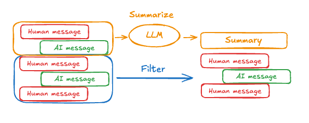

---
search:
  boost: 2
tags:
  - agent
hide:
  - tags
---

# Memory

LangGraph supports two types of memory essential for building conversational agents:

- **[Short-term memory](#short-term-memory)**: Tracks the ongoing conversation by maintaining message history within a session.
- **[Long-term memory](#long-term-memory)**: Stores user-specific or application-level data across sessions.

This guide demonstrates how to use both memory types with agents in LangGraph. For a deeper
understanding of memory concepts, refer to the [LangGraph memory documentation](../concepts/memory.md).

<figure markdown="1">
{: style="max-height:400px"}
<figcaption>Both <strong>short-term</strong> and <strong>long-term</strong> memory require persistent storage to maintain continuity across LLM interactions. In production environments, this data is typically stored in a database.</figcaption>
</figure>

!!! note "Terminology"

    In LangGraph:

    - *Short-term memory* is also referred to as **thread-level memory**.
    - *Long-term memory* is also called **cross-thread memory**.

    A [thread](../concepts/persistence.md#threads) represents a sequence of related runs
    grouped by the same `thread_id`.

## Short-term memory

Short-term memory enables agents to track multi-turn conversations. To use it, you must:

1. Provide a `checkpointer` when creating the agent. The `checkpointer` enables [persistence](../concepts/persistence.md) of the agent's state.
2. Supply a `thread_id` in the config when running the agent. The `thread_id` is a unique identifier for the conversation session.

```python
from langgraph.prebuilt import create_react_agent
from langgraph.checkpoint.memory import InMemorySaver

# highlight-next-line
checkpointer = InMemorySaver() # (1)!


def get_weather(city: str) -> str:
    """Get weather for a given city."""
    return f"It's always sunny in {city}!"


agent = create_react_agent(
    model="anthropic:claude-3-7-sonnet-latest",
    tools=[get_weather],
    # highlight-next-line
    checkpointer=checkpointer # (2)!
)

# Run the agent
config = {
    "configurable": {
        # highlight-next-line
        "thread_id": "1"  # (3)!
    }
}

sf_response = agent.invoke(
    {"messages": [{"role": "user", "content": "what is the weather in sf"}]},
    # highlight-next-line
    config
)

# Continue the conversation using the same thread_id
ny_response = agent.invoke(
    {"messages": [{"role": "user", "content": "what about new york?"}]},
    # highlight-next-line
    config # (4)!
)
```

1. The `InMemorySaver` is a checkpointer that stores the agent's state in memory. In a production setting, you would typically use a database or other persistent storage. Please review the [checkpointer documentation](../reference/checkpoints.md) for more options. If you're deploying with **LangGraph Platform**, the platform will provide a production-ready checkpointer for you.
2. The `checkpointer` is passed to the agent. This enables the agent to persist its state across invocations. Please note that 
3. A unique `thread_id` is provided in the config. This ID is used to identify the conversation session. The value is controlled by the user and can be any string.
4. The agent will continue the conversation using the same `thread_id`. This will allow the agent to infer that the user is asking specifically about the **weather** in New York. 

When the agent is invoked the second time with the same `thread_id`, the original message history from the first conversation is automatically included, allowing the agent to infer that the user is asking specifically about the **weather** in New York.

!!! Note "LangGraph Platform providers a production-ready checkpointer"

    If you're using [LangGraph Platform](./deployment.md), during deployment your checkpointer will be automatically configured to use a production-ready database.

### Manage message history

Long conversations can exceed the LLM's context window. Common solutions are:

* [Summarization](#summarize-message-history): Maintain a running summary of the conversation
* [Trimming](#trim-message-history): Remove first or last N messages in the history

This allows the agent to keep track of the conversation without exceeding the LLM's context window.

To manage message history, specify `pre_model_hook` — a function ([node](../concepts/low_level.md#nodes)) that will always run before calling the language model.

#### Summarize message history

<figure markdown="1">
{: style="max-height:400px"}
<figcaption>Long conversations can exceed the LLM's context window. A common solution is to maintain a running summary of the conversation. This allows the agent to keep track of the conversation without exceeding the LLM's context window.
</figcaption>
</figure>

To summarize message history, you can use [`pre_model_hook`][langgraph.prebuilt.chat_agent_executor.create_react_agent] with a prebuilt [`SummarizationNode`](https://langchain-ai.github.io/langmem/reference/short_term/#langmem.short_term.SummarizationNode):

```python
from langchain_anthropic import ChatAnthropic
from langmem.short_term import SummarizationNode
from langchain_core.messages.utils import count_tokens_approximately
from langgraph.prebuilt import create_react_agent
from langgraph.prebuilt.chat_agent_executor import AgentState
from langgraph.checkpoint.memory import InMemorySaver
from typing import Any

model = ChatAnthropic(model="claude-3-7-sonnet-latest")

summarization_node = SummarizationNode( # (1)!
    token_counter=count_tokens_approximately,
    model=model,
    max_tokens=384,
    max_summary_tokens=128,
    output_messages_key="llm_input_messages",
)

class State(AgentState):
    # NOTE: we're adding this key to keep track of previous summary information
    # to make sure we're not summarizing on every LLM call
    # highlight-next-line
    context: dict[str, Any]  # (2)!


checkpointer = InMemorySaver() # (3)!

agent = create_react_agent(
    model=model,
    tools=tools,
    # highlight-next-line
    pre_model_hook=summarization_node, # (4)!
    # highlight-next-line
    state_schema=State, # (5)!
    checkpointer=checkpointer,
)
```

1. The `InMemorySaver` is a checkpointer that stores the agent's state in memory. In a production setting, you would typically use a database or other persistent storage. Please review the [checkpointer documentation](../reference/checkpoints.md) for more options. If you're deploying with **LangGraph Platform**, the platform will provide a production-ready checkpointer for you.
2. The `context` key is added to the agent's state. The key contains book-keeping information for the summarization node. It is used to keep track of the last summary information and ensure that the agent doesn't summarize on every LLM call, which can be inefficient.
3. The `checkpointer` is passed to the agent. This enables the agent to persist its state across invocations.
4. The `pre_model_hook` is set to the `SummarizationNode`. This node will summarize the message history before sending it to the LLM. The summarization node will automatically handle the summarization process and update the agent's state with the new summary. You can replace this with a custom implementation if you prefer. Please see the [create_react_agent][langgraph.prebuilt.chat_agent_executor.create_react_agent] API reference for more details.
5. The `state_schema` is set to the `State` class, which is the custom state that contains an extra `context` key.

#### Trim message history

To trim message history, you can use [`pre_model_hook`][langgraph.prebuilt.chat_agent_executor.create_react_agent] with [`trim_messages`](https://python.langchain.com/api_reference/core/messages/langchain_core.messages.utils.trim_messages.html) function:

```python
# highlight-next-line
from langchain_core.messages.utils import (
    # highlight-next-line
    trim_messages,
    # highlight-next-line
    count_tokens_approximately
# highlight-next-line
)
from langgraph.prebuilt import create_react_agent

# This function will be called every time before the node that calls LLM
def pre_model_hook(state):
    trimmed_messages = trim_messages(
        state["messages"],
        strategy="last",
        token_counter=count_tokens_approximately,
        max_tokens=384,
        start_on="human",
        end_on=("human", "tool"),
    )
    # highlight-next-line
    return {"llm_input_messages": trimmed_messages}

checkpointer = InMemorySaver()
agent = create_react_agent(
    model,
    tools,
    # highlight-next-line
    pre_model_hook=pre_model_hook,
    checkpointer=checkpointer,
)
```

To learn more about using `pre_model_hook` for managing message history, see this [how-to guide](../how-tos/create-react-agent-manage-message-history.ipynb)

### Read in tools { #read-short-term }

LangGraph allows agent to access its short-term memory (state) inside the tools.

```python
from typing import Annotated
from langgraph.prebuilt import InjectedState, create_react_agent

class CustomState(AgentState):
    # highlight-next-line
    user_id: str

def get_user_info(
    # highlight-next-line
    state: Annotated[CustomState, InjectedState]
) -> str:
    """Look up user info."""
    # highlight-next-line
    user_id = state["user_id"]
    return "User is John Smith" if user_id == "user_123" else "Unknown user"

agent = create_react_agent(
    model="anthropic:claude-3-7-sonnet-latest",
    tools=[get_user_info],
    # highlight-next-line
    state_schema=CustomState,
)

agent.invoke({
    "messages": "look up user information",
    # highlight-next-line
    "user_id": "user_123"
})
```

See the [Context](./context.md#__tabbed_2_2) guide for more information.

### Write from tools { #write-short-term }

To modify the agent's short-term memory (state) during execution, you can return state updates directly from the tools. This is useful for persisting intermediate results or making information accessible to subsequent tools or prompts.

```python
from typing import Annotated
from langchain_core.tools import InjectedToolCallId
from langchain_core.runnables import RunnableConfig
from langchain_core.messages import ToolMessage
from langgraph.prebuilt import InjectedState, create_react_agent
from langgraph.prebuilt.chat_agent_executor import AgentState
from langgraph.types import Command

class CustomState(AgentState):
    # highlight-next-line
    user_name: str

def update_user_info(
    tool_call_id: Annotated[str, InjectedToolCallId],
    config: RunnableConfig
) -> Command:
    """Look up and update user info."""
    user_id = config["configurable"].get("user_id")
    name = "John Smith" if user_id == "user_123" else "Unknown user"
    # highlight-next-line
    return Command(update={
        # highlight-next-line
        "user_name": name,
        # update the message history
        "messages": [
            ToolMessage(
                "Successfully looked up user information",
                tool_call_id=tool_call_id
            )
        ]
    })

def greet(
    # highlight-next-line
    state: Annotated[CustomState, InjectedState]
) -> str:
    """Use this to greet the user once you found their info."""
    user_name = state["user_name"]
    return f"Hello {user_name}!"

agent = create_react_agent(
    model="anthropic:claude-3-7-sonnet-latest",
    tools=[update_user_info, greet],
    # highlight-next-line
    state_schema=CustomState
)

agent.invoke(
    {"messages": [{"role": "user", "content": "greet the user"}]},
    # highlight-next-line
    config={"configurable": {"user_id": "user_123"}}
)
```

For more details, see [how to update state from tools](../how-tos/update-state-from-tools.ipynb).

## Long-term memory

Use long-term memory to store user-specific or application-specific data across conversations. This is useful for applications like chatbots, where you want to remember user preferences or other information.

To use long-term memory, you need to:

1. [Configure a store](../how-tos/cross-thread-persistence.ipynb) to persist data across invocations.
2. Use the [`get_store`][langgraph.config.get_store] function to access the store from within tools or prompts.

### Read { #read-long-term }

```python title="A tool the agent can use to look up user information"
from langchain_core.runnables import RunnableConfig
from langgraph.config import get_store
from langgraph.prebuilt import create_react_agent
from langgraph.store.memory import InMemoryStore

# highlight-next-line
store = InMemoryStore() # (1)!

# highlight-next-line
store.put(  # (2)!
    ("users",),  # (3)!
    "user_123",  # (4)!
    {
        "name": "John Smith",
        "language": "English",
    } # (5)!
)

def get_user_info(config: RunnableConfig) -> str:
    """Look up user info."""
    # Same as that provided to `create_react_agent`
    # highlight-next-line
    store = get_store() # (6)!
    user_id = config["configurable"].get("user_id")
    # highlight-next-line
    user_info = store.get(("users",), user_id) # (7)!
    return str(user_info.value) if user_info else "Unknown user"

agent = create_react_agent(
    model="anthropic:claude-3-7-sonnet-latest",
    tools=[get_user_info],
    # highlight-next-line
    store=store # (8)!
)

# Run the agent
agent.invoke(
    {"messages": [{"role": "user", "content": "look up user information"}]},
    # highlight-next-line
    config={"configurable": {"user_id": "user_123"}}
)
```

1. The `InMemoryStore` is a store that stores data in memory. In a production setting, you would typically use a database or other persistent storage. Please review the [store documentation](../reference/store.md) for more options. If you're deploying with **LangGraph Platform**, the platform will provide a production-ready store for you.
2. For this example, we write some sample data to the store using the `put` method. Please see the [BaseStore.put][langgraph.store.base.BaseStore.put] API reference for more details.
3. The first argument is the namespace. This is used to group related data together. In this case, we are using the `users` namespace to group user data.
4. A key within the namespace. This example uses a user ID for the key.
5. The data that we want to store for the given user.
6. The `get_store` function is used to access the store. You can call it from anywhere in your code, including tools and prompts. This function returns the store that was passed to the agent when it was created.
7. The `get` method is used to retrieve data from the store. The first argument is the namespace, and the second argument is the key. This will return a `StoreValue` object, which contains the value and metadata about the value.
8. The `store` is passed to the agent. This enables the agent to access the store when running tools. You can also use the `get_store` function to access the store from anywhere in your code.

### Write { #write-long-term }

```python title="Example of a tool that updates user information"
from typing_extensions import TypedDict

from langgraph.config import get_store
from langgraph.prebuilt import create_react_agent
from langgraph.store.memory import InMemoryStore

store = InMemoryStore() # (1)!

class UserInfo(TypedDict): # (2)!
    name: str

def save_user_info(user_info: UserInfo, config: RunnableConfig) -> str: # (3)!
    """Save user info."""
    # Same as that provided to `create_react_agent`
    # highlight-next-line
    store = get_store() # (4)!
    user_id = config["configurable"].get("user_id")
    # highlight-next-line
    store.put(("users",), user_id, user_info) # (5)!
    return "Successfully saved user info."

agent = create_react_agent(
    model="anthropic:claude-3-7-sonnet-latest",
    tools=[save_user_info],
    # highlight-next-line
    store=store
)

# Run the agent
agent.invoke(
    {"messages": [{"role": "user", "content": "My name is John Smith"}]},
    # highlight-next-line
    config={"configurable": {"user_id": "user_123"}} # (6)!
)

# You can access the store directly to get the value
store.get(("users",), "user_123").value
```

1. The `InMemoryStore` is a store that stores data in memory. In a production setting, you would typically use a database or other persistent storage. Please review the [store documentation](../reference/store.md) for more options. If you're deploying with **LangGraph Platform**, the platform will provide a production-ready store for you.
2. The `UserInfo` class is a `TypedDict` that defines the structure of the user information. The LLM will use this to format the response according to the schema.
3. The `save_user_info` function is a tool that allows an agent to update user information. This could be useful for a chat application where the user wants to update their profile information.
4. The `get_store` function is used to access the store. You can call it from anywhere in your code, including tools and prompts. This function returns the store that was passed to the agent when it was created.
5. The `put` method is used to store data in the store. The first argument is the namespace, and the second argument is the key. This will store the user information in the store.
6. The `user_id` is passed in the config. This is used to identify the user whose information is being updated.

### Semantic search

LangGraph also allows you to [search](https://langchain-ai.github.io/langgraph/how-tos/memory/semantic-search/#using-in-create-react-agent) for items in long-term memory by semantic similarity.

### Prebuilt memory tools

**LangMem** is a LangChain-maintained library that offers tools for managing long-term memories in your agent. See the [LangMem documentation](https://langchain-ai.github.io/langmem/) for usage examples.


## Additional resources

* [Memory in LangGraph](../concepts/memory.md)
