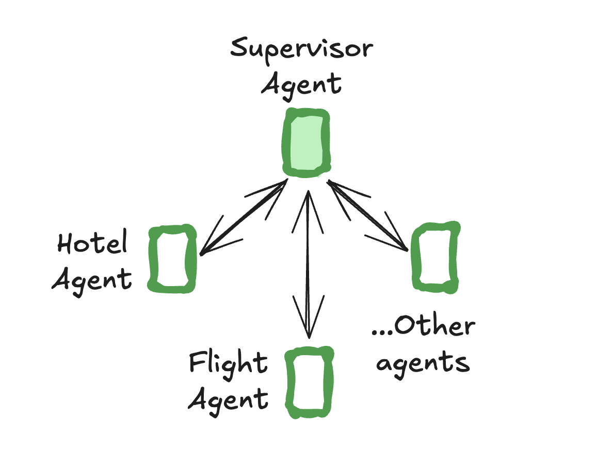
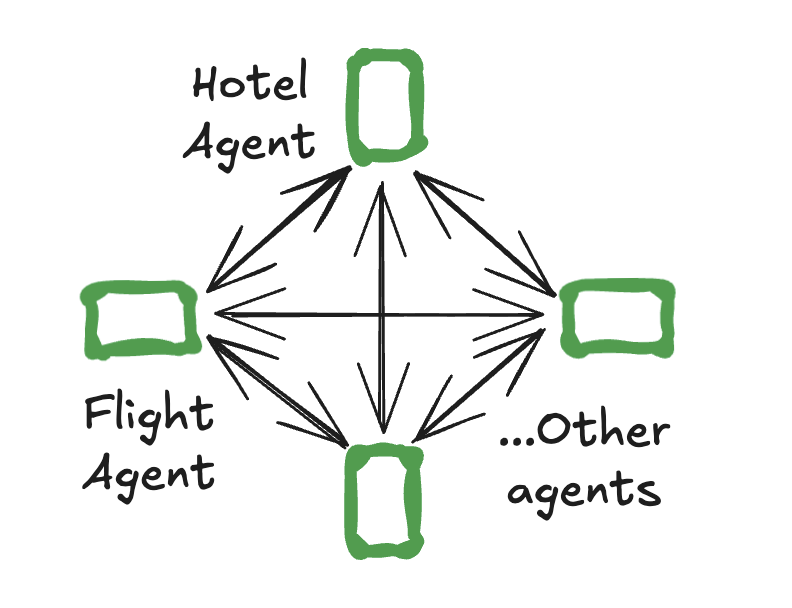

---
search:
  boost: 2
tags:
  - agent
hide:
  - tags
---

# Multi-agent

A single agent might struggle if it needs to specialize in multiple domains or manage many tools. To tackle this, you can break your agent into smaller, independent agents and composing them into a [multi-agent system](../concepts/multi_agent.md).

In multi-agent systems, agents need to communicate between each other. They do so via [handoffs](#handoffs) — a primitive that describes which agent to hand control to and the payload to send to that agent.

Two of the most popular multi-agent architectures are:

- [supervisor](#supervisor) — individual agents are coordinated by a central supervisor agent. The supervisor controls all communication flow and task delegation, making decisions about which agent to invoke based on the current context and task requirements.
- [swarm](#swarm) — agents dynamically hand off control to one another based on their specializations. The system remembers which agent was last active, ensuring that on subsequent interactions, the conversation resumes with that agent.

## Supervisor



Use [`langgraph-supervisor`](https://github.com/langchain-ai/langgraph-supervisor-py) library to create a supervisor multi-agent system:

```bash
pip install langgraph-supervisor
```

```python
from langchain_openai import ChatOpenAI
from langgraph.prebuilt import create_react_agent
# highlight-next-line
from langgraph_supervisor import create_supervisor

def book_hotel(hotel_name: str):
    """Book a hotel"""
    return f"Successfully booked a stay at {hotel_name}."

def book_flight(from_airport: str, to_airport: str):
    """Book a flight"""
    return f"Successfully booked a flight from {from_airport} to {to_airport}."

flight_assistant = create_react_agent(
    model="openai:gpt-4o",
    tools=[book_flight],
    prompt="You are a flight booking assistant",
    # highlight-next-line
    name="flight_assistant"
)

hotel_assistant = create_react_agent(
    model="openai:gpt-4o",
    tools=[book_hotel],
    prompt="You are a hotel booking assistant",
    # highlight-next-line
    name="hotel_assistant"
)

# highlight-next-line
supervisor = create_supervisor(
    agents=[flight_assistant, hotel_assistant],
    model=ChatOpenAI(model="gpt-4o"),
    prompt=(
        "You manage a hotel booking assistant and a"
        "flight booking assistant. Assign work to them."
    )
).compile()

for chunk in supervisor.stream(
    {
        "messages": [
            {
                "role": "user",
                "content": "book a flight from BOS to JFK and a stay at McKittrick Hotel"
            }
        ]
    }
):
    print(chunk)
    print("\n")
```

## Swarm



Use [`langgraph-swarm`](https://github.com/langchain-ai/langgraph-swarm-py) library to create a swarm multi-agent system:

```bash
pip install langgraph-swarm
```

```python
from langgraph.prebuilt import create_react_agent
# highlight-next-line
from langgraph_swarm import create_swarm, create_handoff_tool

transfer_to_hotel_assistant = create_handoff_tool(
    agent_name="hotel_assistant",
    description="Transfer user to the hotel-booking assistant.",
)
transfer_to_flight_assistant = create_handoff_tool(
    agent_name="flight_assistant",
    description="Transfer user to the flight-booking assistant.",
)

flight_assistant = create_react_agent(
    model="anthropic:claude-3-5-sonnet-latest",
    # highlight-next-line
    tools=[book_flight, transfer_to_hotel_assistant],
    prompt="You are a flight booking assistant",
    # highlight-next-line
    name="flight_assistant"
)
hotel_assistant = create_react_agent(
    model="anthropic:claude-3-5-sonnet-latest",
    # highlight-next-line
    tools=[book_hotel, transfer_to_flight_assistant],
    prompt="You are a hotel booking assistant",
    # highlight-next-line
    name="hotel_assistant"
)

# highlight-next-line
swarm = create_swarm(
    agents=[flight_assistant, hotel_assistant],
    default_active_agent="flight_assistant"
).compile()

for chunk in swarm.stream(
    {
        "messages": [
            {
                "role": "user",
                "content": "book a flight from BOS to JFK and a stay at McKittrick Hotel"
            }
        ]
    }
):
    print(chunk)
    print("\n")
```

## Handoffs

A common pattern in multi-agent interactions is **handoffs**, where one agent *hands off* control to another. Handoffs allow you to specify:

- **destination**: target agent to navigate to
- **payload**: information to pass to that agent

This is used both by `langgraph-supervisor` (supervisor hands off to individual agents) and `langgraph-swarm` (an individual agent can hand off to other agents).

To implement handoffs with `create_react_agent`, you need to:

1. Create a special tool that can transfer control to a different agent

    ```python
    def transfer_to_bob():
        """Transfer to bob."""
        return Command(
            # name of the agent (node) to go to
            # highlight-next-line
            goto="bob",
            # data to send to the agent
            # highlight-next-line
            update={"messages": [...]},
            # indicate to LangGraph that we need to navigate to
            # agent node in a parent graph
            # highlight-next-line
            graph=Command.PARENT,
        )
    ```

1. Create individual agents that have access to handoff tools:

    ```python
    flight_assistant = create_react_agent(
        ..., tools=[book_flight, transfer_to_hotel_assistant]
    )
    hotel_assistant = create_react_agent(
        ..., tools=[book_hotel, transfer_to_flight_assistant]
    )
    ```

1. Define a parent graph that contains individual agents as nodes:

    ```python
    from langgraph.graph import StateGraph, MessagesState
    multi_agent_graph = (
        StateGraph(MessagesState)
        .add_node(flight_assistant)
        .add_node(hotel_assistant)
        ...
    )
    ```

Putting this together, here is how you can implement a simple multi-agent system with two agents — a flight booking assistant and a hotel booking assistant:

```python
from typing import Annotated
from langchain_core.tools import tool, InjectedToolCallId
from langgraph.prebuilt import create_react_agent, InjectedState
from langgraph.graph import StateGraph, START, MessagesState
from langgraph.types import Command

def create_handoff_tool(*, agent_name: str, description: str | None = None):
    name = f"transfer_to_{agent_name}"
    description = description or f"Transfer to {agent_name}"

    @tool(name, description=description)
    def handoff_tool(
        # highlight-next-line
        state: Annotated[MessagesState, InjectedState], # (1)!
        # highlight-next-line
        tool_call_id: Annotated[str, InjectedToolCallId],
    ) -> Command:
        tool_message = {
            "role": "tool",
            "content": f"Successfully transferred to {agent_name}",
            "name": name,
            "tool_call_id": tool_call_id,
        }
        return Command(  # (2)!
            # highlight-next-line
            goto=agent_name,  # (3)!
            # highlight-next-line
            update={"messages": state["messages"] + [tool_message]},  # (4)!
            # highlight-next-line
            graph=Command.PARENT,  # (5)!
        )
    return handoff_tool

# Handoffs
transfer_to_hotel_assistant = create_handoff_tool(
    agent_name="hotel_assistant",
    description="Transfer user to the hotel-booking assistant.",
)
transfer_to_flight_assistant = create_handoff_tool(
    agent_name="flight_assistant",
    description="Transfer user to the flight-booking assistant.",
)

# Simple agent tools
def book_hotel(hotel_name: str):
    """Book a hotel"""
    return f"Successfully booked a stay at {hotel_name}."

def book_flight(from_airport: str, to_airport: str):
    """Book a flight"""
    return f"Successfully booked a flight from {from_airport} to {to_airport}."

# Define agents
flight_assistant = create_react_agent(
    model="anthropic:claude-3-5-sonnet-latest",
    # highlight-next-line
    tools=[book_flight, transfer_to_hotel_assistant],
    prompt="You are a flight booking assistant",
    # highlight-next-line
    name="flight_assistant"
)
hotel_assistant = create_react_agent(
    model="anthropic:claude-3-5-sonnet-latest",
    # highlight-next-line
    tools=[book_hotel, transfer_to_flight_assistant],
    prompt="You are a hotel booking assistant",
    # highlight-next-line
    name="hotel_assistant"
)

# Define multi-agent graph
multi_agent_graph = (
    StateGraph(MessagesState)
    .add_node(flight_assistant)
    .add_node(hotel_assistant)
    .add_edge(START, "flight_assistant")
    .compile()
)

# Run the multi-agent graph
for chunk in multi_agent_graph.stream(
    {
        "messages": [
            {
                "role": "user",
                "content": "book a flight from BOS to JFK and a stay at McKittrick Hotel"
            }
        ]
    }
):
    print(chunk)
    print("\n")
```

1. Access agent's state
2. The `Command` primitive allows specifying a state update and a node transition as a single operation, making it useful for implementing handoffs.
3. Name of the agent or node to hand off to.
4. Take the agent's messages and **add** them to the parent's **state** as part of the handoff. The next agent will see the parent state.
5. Indicate to LangGraph that we need to navigate to agent node in a **parent** multi-agent graph.

!!! Note
    This handoff implementation assumes that:

    - each agent receives overall message history (across all agents) in the multi-agent system as its input
    - each agent outputs its internal messages history to the overall message history of the multi-agent system

    Check out LangGraph [supervisor](https://github.com/langchain-ai/langgraph-supervisor-py#customizing-handoff-tools) and [swarm](https://github.com/langchain-ai/langgraph-swarm-py#customizing-handoff-tools) documentation to learn how to customize handoffs.