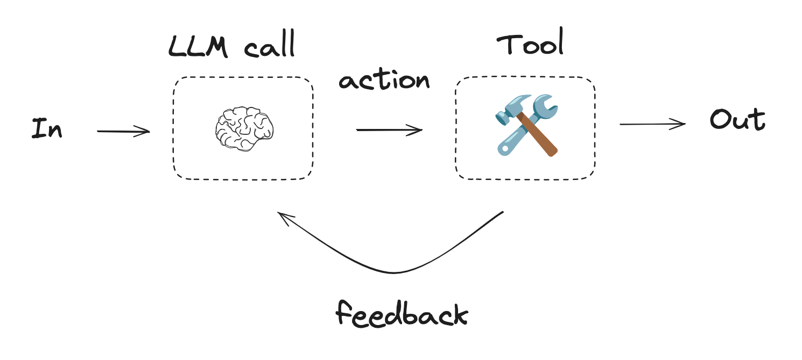

# Overview

## What is an agent?

An agent is a system that uses an LLM to control the flow of an application. The most common form of an agent is tool-calling agent.

In a tool-calling agent, an LLM is called repeatedly in a while-loop. At each step the LLM decides which tools to call, and what the inputs to those tools should be. Those tools are then executed, and the outputs are fed back into the LLM as observations. The while-loop terminates when the agent decides it has enough information to solve the user request and it is not worth calling any more tools.



## Why LangGraph?

Building agents with LangGraph has these central benefits:

- [**Memory**](./memory.md): Easy to add short-term memory (remember a single conversation) and long-term memory (remember information across conversations) to your agents.

- [**Human-in-the-loop**](./human-in-the-loop.md): Agent execution can be interrupted and resumed, allowing for tool call review, approval and editing via human input.

- [**Streaming**](./streaming.md): Support for streaming agent state to the user (or developer) over the course of agent's execution. You can stream agent progress, LLM tokens, tool updates, or all of those combined.

- [**Deployment**](./deployment.md): Easy onramp for testing, debugging, and deploying applications via [LangGraph Platform](https://langchain-ai.github.io/langgraph/concepts/langgraph_platform/). This includes [Studio](https://langchain-ai.github.io/langgraph/concepts/langgraph_studio/), an IDE that enables visualization, interaction, and debugging of workflows or agents. This also includes numerous [options](https://langchain-ai.github.io/langgraph/tutorials/deployment/) for deployment.

## Installation

* to [create agents](./agents.md):

    ```bash
    pip install -U langgraph
    ```

* to use prebuilt implementations of popular multi-agent architectures —  [supervisor](./multi-agent.md#supervisor) and [swarm](./multi-agent.md#swarm):

    ```bash
    pip install -U langgraph-supervisor
    pip install -U langgraph-swarm
    ```

* to use tools and other resources [from MCP servers](./mcp.md) in your agent:

    ```bash
    pip install -U langchain-mcp-adapters
    ```

* to manage short-term and long-term [memory](./memory.md) in your agent:

    ```bash
    pip install -U langmem
    ```