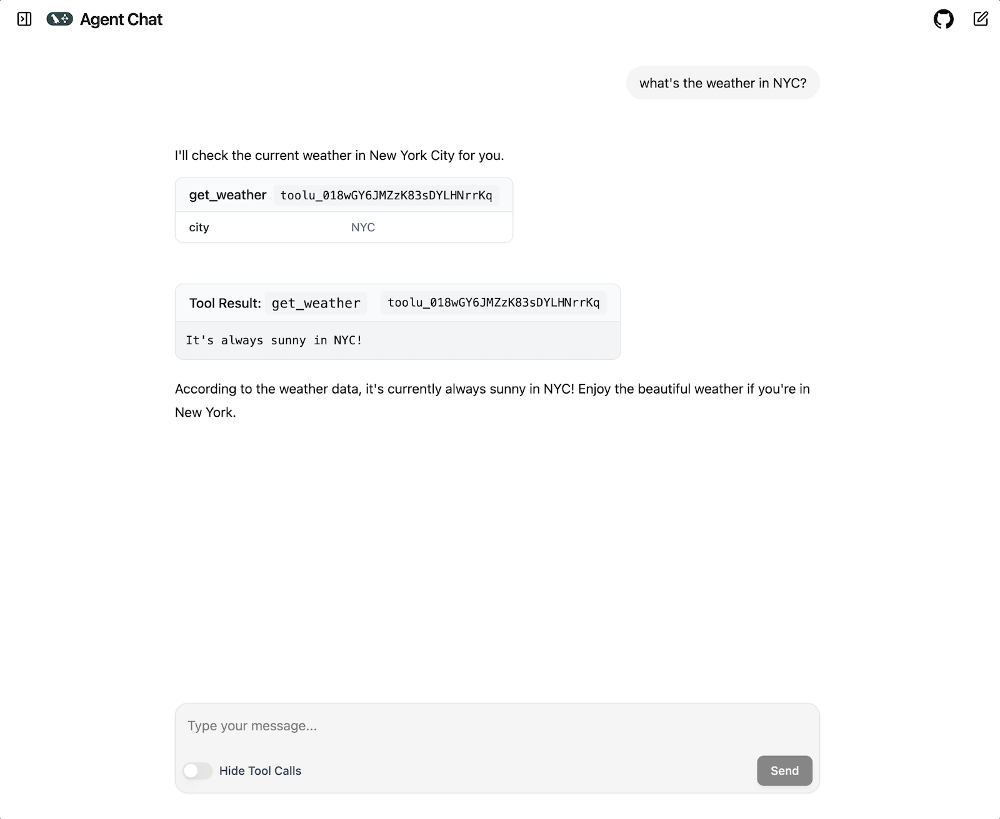
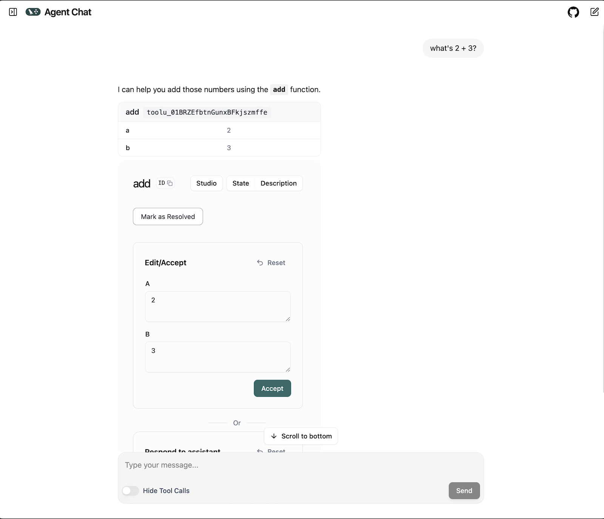

# UI

You can create a UI for interacting with your agent using [Agent Chat UI](https://github.com/langchain-ai/agent-chat-ui).

For example, if you have a LangGraph API server [running locally](./deployment.md#launch-langgraph-server-locally) or on [LangGraph Cloud](https://langchain-ai.github.io/langgraph/cloud/quick_start/), you can follow these steps to connect your app to a UI:

!!! Note
    If you are [running LangGraph API server locally](./deployment.md#launch-langgraph-server-locally), you can skip steps 2-4 and click `Continue`.

1. Navigate to [Agent Chat UI](https://agentchat.vercel.app)
2. Provide deployment URL: The URL of the LangGraph server you want to chat with.
3. Provide assistant/graph ID: The name of the graph, or ID of the assistant to use when fetching, and submitting runs via the chat interface.
4. (Optional) Provide LangSmith API Key: (only required for connecting to deployed LangGraph servers) Your LangSmith API key to use when authenticating requests sent to LangGraph servers.
5. Click `Continue`

You should see the following:

## Human-in-the-loop

Agent Chat UI has full support for [human-in-the-loop](../concepts/human_in_the_loop.md) workflows. To try it out, replace the agent code in `src/agent/graph.py` with this [agent implementation](./human-in-the-loop.md):

