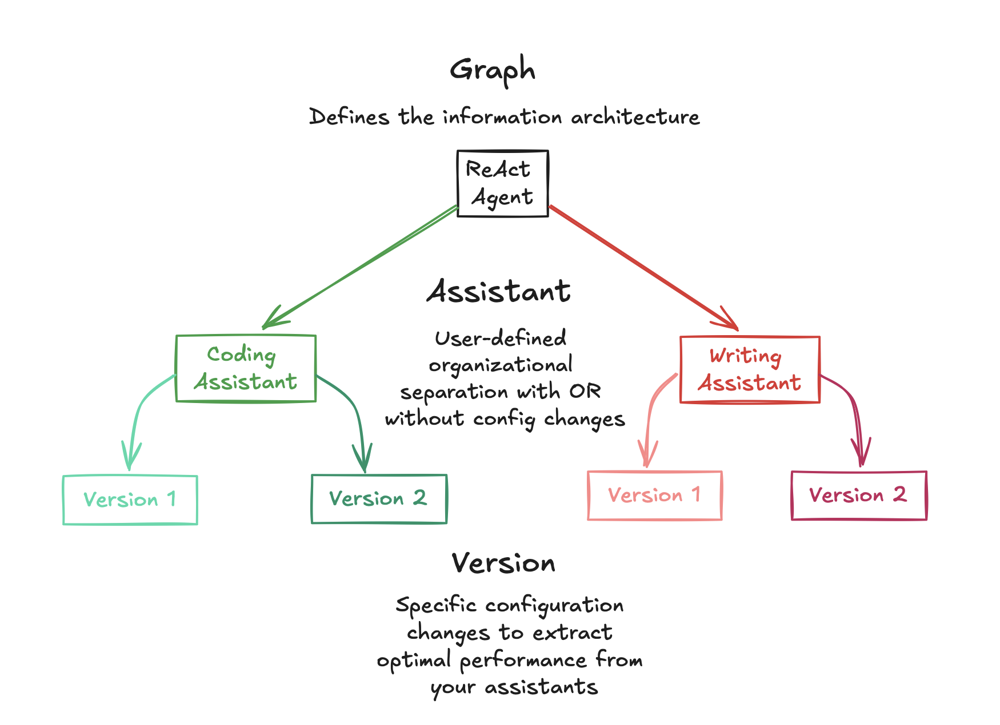

# API Concepts

This page describes the high-level concepts of the LangGraph Cloud API. The conceptual guide of LangGraph (Python library) is [here](../../concepts/high_level.md).

## Data Models

The LangGraph Cloud API consists of a few core data models: [Assistants](#assistants), [Threads](#threads), [Runs](#runs), and [Cron Jobs](#cron-jobs).

### Assistants

When building agents, it is fairly common to make rapid changes that *do not* alter the graph logic. For example, simply changing prompts or the LLM selection can have significant impacts on the behavior of the agents. Assistants offer an easy way to make and save these types of changes to agent configuration. This can have at least two use-cases:

* Assistants give developers a quick and easy way to modify and version graph version for experimentation.
* Assistants can be modified via LangGraph Studio, offering a no-code way to configure agents  (e.g., for business users). 

#### Configuring Assistants

In practice, an assistant is just an *instance* of a graph with a specific configuration. Because of this, multiple assistants can reference the same graph but can contain different configurations, such as prompts, models, and other graph configuration options. The LangGraph Cloud API provides several endpoints for creating and managing assistants. See the [API reference](../reference/api/api_ref.html#tag/assistantscreate) and [this how-to](../how-tos/configuration_cloud.md) for more details on how to create assistants.

#### Versioning Assistants

Once you've created an assistant, you can save and version it to track changes to the configuration over time. You can think about this at three levels:

1) The graph lays out the general agent application logic 
2) The agent configuration options represent parameters that can be changed 
3) Assistant versions save and track specific settings of the agent configuration options 

For example, if you have an agent that helps for planning trips, you can create a new assistant *for each user* that passes specific user preferences (e.g., desired airline and car service). As each user interacts with their own assistant, assistant versions can be saved that track the specific desires of the user. Read [this how-to](../how-tos/assistant_versioning.md) to learn how you can use assistant versioning through both the [Studio](../how-tos/index.md/#langgraph-studio) and the SDK.

### Threads

A thread contains the accumulated state of a group of runs. If a run is executed on a thread, then the [state][state] of the underlying graph of the assistant will be persisted to the thread. A thread's current and historical state can be retrieved. To persist state, a thread must be created prior to executing a run.

The state of a thread at a particular point in time is called a checkpoint.

For more on threads and checkpoints, see this section of the [LangGraph conceptual guide](../../concepts/low_level.md#persistence).

The LangGraph Cloud API provides several endpoints for creating and managing threads and thread state. See the [API reference](../reference/api/api_ref.html#tag/threadscreate) for more details.

### Runs

A run is an invocation of an assistant. Each run may have its own input, configuration, and metadata, which may affect execution and output of the underlying graph. A run can optionally be executed on a thread.

The LangGraph Cloud API provides several endpoints for creating and managing runs. See the [API reference](../reference/api/api_ref.html#tag/runscreate) for more details.

### Cron Jobs

It's often useful to run graphs on some schedule. LangGraph Cloud supports cron jobs, which run on a user defined schedule. The user specifies a schedule, an assistant, and some input. After than, on the specified schedule LangGraph cloud will:

- Create a new thread with the specified assistant
- Send the specified input to that thread

Note that this sends the same input to the thread every time. See the [how-to guide](../how-tos/cron_jobs.md) for creating cron jobs.

The LangGraph Cloud API provides several endpoints for creating and managing cron jobs. See the [API reference](../reference/api/api_ref.html#tag/runscreate/POST/threads/{thread_id}/runs/crons) for more details.

## Features

The LangGraph Cloud API offers several features to support complex agent architectures.

### Streaming

[Streaming](../../concepts/streaming.md) is critical for making LLM applications feel responsive to end users. When creating a streaming run, the streaming mode determines what data is streamed back to the API client. LangGraph Platform supports five streaming modes: `values`, `updates`, `messages-tuple`, `events`, and `debug`. See these [how-to guides](../../how-tos/index.md#streaming_1) for more details.

### Stateless Runs

All runs use the built-in checkpointer to store checkpoints for runs. However, it can often be useful to just kick off a run without worrying about explicitly creating a thread and without wanting to keep those checkpointers around. Stateless runs allow you to do this by exposing an endpoint that:

- Takes in user input
- Under the hood, creates a thread
- Runs the agent but skips all checkpointing steps
- Cleans up the thread afterwards

Stateless runs are still retried as regular retries are per node, while everything still in memory, so doesn't use checkpoints.

The only difference is in stateless background runs, if the task worker dies halfway (not because the run itself failed, for some external reason) then the whole run will be retried like any background run, but

- whereas a stateful background run would retry from the last successful checkpoint
- a stateless background run would retry from the beginning

See the [how-to guide](../how-tos/stateless_runs.md) for creating stateless runs.

### Webhooks

For all types of runs, langgraph cloud supports completion webhooks. When you create the run you can pass a webhook URL to be called when the completes (successfully or not). This is especially useful for background runs and cron jobs, as the webhook can give you an indication the run has completed and you can perform further actions for your appilcation.

See this [how-to guide](../how-tos/webhooks.md) to learn about how to use webhooks with LangGraph Cloud.

## Deployment

The LangGraph Cloud offers several features to support secure and robost deployments.

### Authentication

LangGraph applications deployed to LangGraph Cloud are automatically configured with LangSmith authentication. In order to call the API, a valid <a href="https://docs.smith.langchain.com/how_to_guides/setup/create_account_api_key#api-keys" target="_blank">LangSmith API key</a> is required.

### Local Testing

Before deploying your app in production to LangGraph Cloud, you may wish to test out your graph locally in order to ensure that everything is running as expected. Luckily, LangGraph makes this easy for you through use of the LangGraph CLI. Read more in this [how-to guide](../deployment/test_locally.md) or look at the [CLI reference](../reference/cli.md) to learn more.
