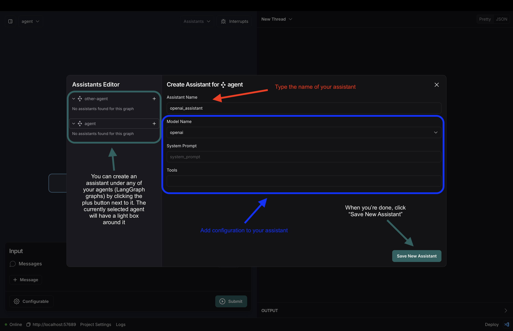
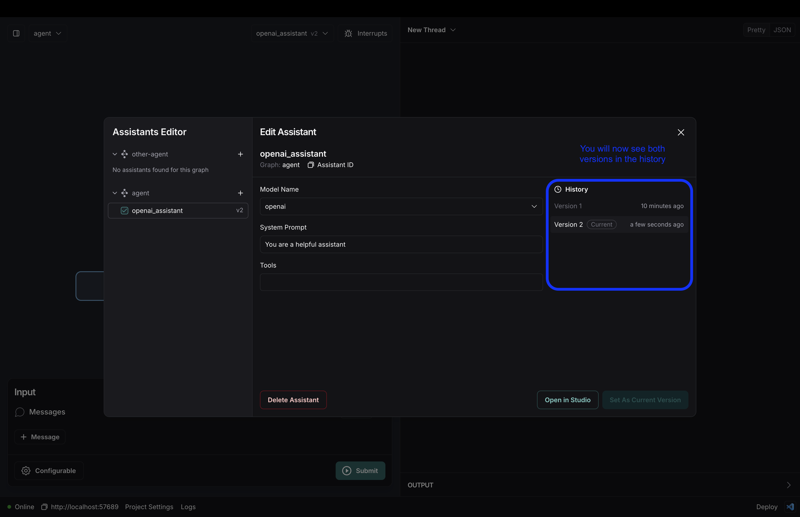
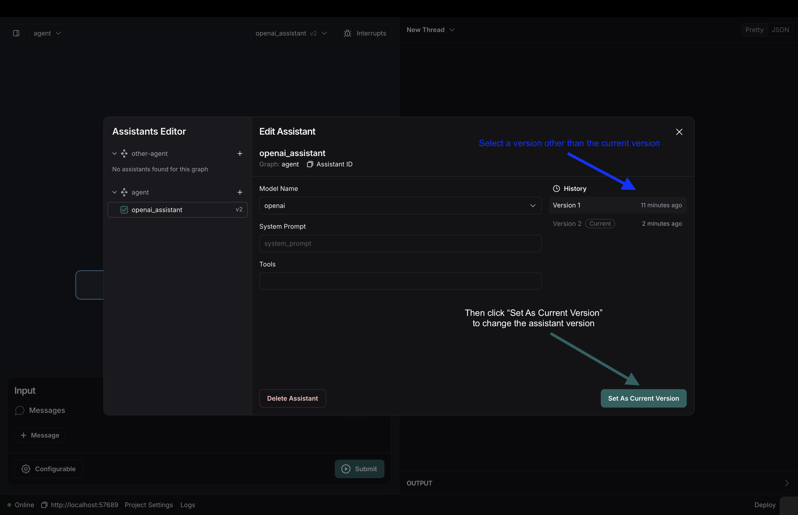

# How to version assistants

In this how-to guide we will walk through how you can create and manage different assistant versions. If you haven't already, you can read [this](../../concepts/assistants.md#versioning-assistants) conceptual guide to gain a better understanding of what assistant versioning is. This how-to assumes you have a graph that is configurable, which means you have defined a config schema and passed it to your graph as follows:

=== "Python"

    ```python
    class Config(BaseModel):
        model_name: Literal["anthropic", "openai"] = "anthropic"
        system_prompt: str

    agent = StateGraph(State, config_schema=Config)
    ```

=== "Javascript"

    ```js
    const ConfigAnnotation = Annotation.Root({
        modelName: Annotation<z.enum(["openai", "anthropic"])>({
            default: () => "anthropic",
        }),
        systemPrompt: Annotation<String>
    });

    // the rest of your code

    const agent = new StateGraph(StateAnnotation, ConfigAnnotation);
    ```

## Setup

First let's set up our client and thread. If you are using the Studio, just open the application to the graph called "agent". If using cURL, you don't need to do anything except copy down your deployment URL and the name of the graph you want to use.

=== "Python"

    ```python
    from langgraph_sdk import get_client

    client = get_client(url=<DEPLOYMENT_URL>)
    # Using the graph deployed with the name "agent"
    graph_name = "agent"
    ```

=== "Javascript"

    ```js
    import { Client } from "@langchain/langgraph-sdk";

    const client = new Client({ apiUrl: <DEPLOYMENT_URL> });
    // Using the graph deployed with the name "agent"
    const graphName = "agent";
    ```

## Create an assistant

For this example, we will create an assistant by modifying the model name that is used in our graph. We can create a new assistant called "openai_assistant" for this:

=== "Python"

    ```python
    openai_assistant = await client.assistants.create(graph_name, config={"configurable": {"model_name": "openai"}}, name="openai_assistant")
    ```

=== "Javascript"

    ```js
    const openaiAssistant = await client.assistants.create({graphId: graphName, config: { configurable: {"modelName": "openai"}}, name: "openaiAssistant"});
    ```

=== "CURL"

    ```bash
    curl --request POST \
    --url <DEPOLYMENT_URL>/assistants \
    --header 'Content-Type: application/json' \
    --data '{
    "graph_id": "agent",
    "config": {"model_name": "openai"},
    "name": "openai_assistant"
    }'
    ```

### Using the studio

To create an assistant using the studio do the following steps:

1. Click on the "Create New Assistant" button:

    

1. Use the create assistant pane to enter info for the assistant you wish to create, and then click create:

    

1. See that your assistant was created and is displayed in the Studio

    

1. Click on the edit button next to the selected assistant to manage your created assistant:

    

## Create a new version for your assistant

Let's now say we wanted to add a system prompt to our assistant. We can do this by using the `update` endpoint as follows. Please note that you must pass in the ENTIRE config (and metadata if you are using it). The update endpoint creates new versions completely from scratch and does not rely on previously entered config. In this case, we need to continue telling the assistant to use "openai" as the model.

=== "Python"

    ```python
    openai_assistant_v2 = await client.assistants.update(openai_assistant['assistant_id'], config={"configurable": {"model_name": "openai", "system_prompt": "You are a helpful assistant!"}})
    ```

=== "Javascript"

    ```js
    const openaiAssistantV2 = await client.assistants.update(openaiAssistant['assistant_id'], {config: { configurable: {"modelName": "openai", "systemPrompt": "You are a helpful assistant!"}}});
    ```

=== "CURL"

    ```bash
    curl --request PATCH \
    --url <DEPOLYMENT_URL>/assistants/<ASSISTANT_ID> \
    --header 'Content-Type: application/json' \
    --data '{
    "config": {"model_name": "openai", "system_prompt": "You are a helpful assistant!"}
    }'
    ```

### Using the studio

1. First, click on the edit button next to the `openai_assistant`. Then, add a system prompt and click "Save New Version":

    

1. Then you can see it is selected in the assistant dropdown:

    

1. And you can see all the version history in the edit pane for the assistant:

    

## Point your assistant to a different version

After having created multiple versions, we can change the version our assistant points to both by using the SDK and also the Studio. In this case we will be resetting the `openai_assistant` we just created two versions for to point back to the first version. When you create a new version (by using the `update` endpoint) the assistant automatically points to the newly created version, so following the code above our `openai_assistant` is pointing to the second version. Here we will change it to point to the first version:

=== "Python"

    ```python
    await client.assistants.set_latest(openai_assistant['assistant_id'], 1)
    ```

=== "Javascript"

    ```js
    await client.assistants.setLatest(openaiAssistant['assistant_id'], 1);
    ```

=== "CURL"

    ```bash
    curl --request POST \
    --url <DEPLOYMENT_URL>/assistants/<ASSISTANT_ID>/latest \
    --header 'Content-Type: application/json' \
    --data '{
    "version": 1
    }'
    ```


### Using the studio

To change the version, all you have to do is click into the edit pane for an assistant, select the version you want to change to, and then click the "Set As Current Version" button



## Using your assistant versions

Whether you are a business user iterating without writing code, or a developer using the SDK - assistant versioning allows you to quickly test different agents in a controlled environment, making it easy to iterate fast. You can use any of the assistant versions just how you would a normal assistant, and can read more about how to stream output from these assistants by reading [these guides](https://langchain-ai.github.io/langgraph/cloud/how-tos/#streaming) or [this one](https://langchain-ai.github.io/langgraph/cloud/how-tos/invoke_studio/) if you are using the Studio.

!!! warning "Deleting Assistants"
    Deleting as assistant will delete ALL of it's versions, since they all point to the same assistant ID. There is currently no way to just delete a single version, but by pointing your assistant to the correct version you can skip any versions that you don't wish to use.