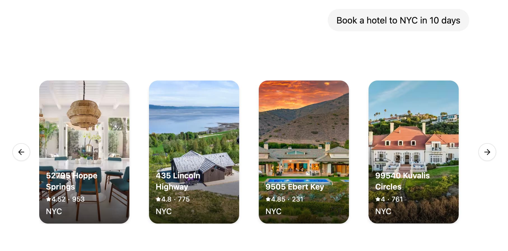

# How to implement Generative User Interfaces with LangGraph

!!! info "Prerequisites"

    - [LangGraph Platform](../../concepts/langgraph_platform.md)
    - [LangGraph Server](../../concepts/langgraph_server.md)
    - [`useStream()` React Hook](./use_stream_react.md)

Generative user interfaces (Generative UI) allows agents to go beyond text and generate rich user interfaces. This enables creating more interactive and context-aware applications where the UI adapts based on the conversation flow and AI responses.



LangGraph Platform supports colocating your React components with your graph code. This allows you to focus on building specific UI components for your graph while easily plugging into existing chat interfaces such as [Agent Chat](https://agentchat.vercel.app) and loading the code only when actually needed.

## Tutorial

### 1. Define and configure UI components

First, create your first UI component. For each component you need to provide an unique identifier that will be used to reference the component in your graph code.

```tsx title="src/agent/ui.tsx"
const WeatherComponent = (props: { city: string }) => {
  return <div>Weather for {props.city}</div>;
};

export default {
  weather: WeatherComponent,
};
```

Next, define your UI components in your `langgraph.json` configuration:

=== "Python agent"

    ```json title="langgraph.json"
    {
      "node_version": "20",
      "graphs": {
        "agent": "./src/agent.py:graph"
      },
      "ui": {
        "agent": "./src/agent/ui.tsx"
      }
    }
    ```

=== "JS agent"

    ```json title="langgraph.json"
    {
      "node_version": "20",
      "graphs": {
        "agent": "./src/agent/index.ts:graph"
      },
      "ui": {
        "agent": "./src/agent/ui.tsx"
      }
    }
    ```

The `ui` section points to the UI components that will be used by graphs. By default, we recommend using the same key as the graph name, but you can split out the components however you like, see [Customise the namespace of UI components](#customise-the-namespace-of-ui-components) for more details.

LangGraph Platform will automatically bundle your UI components code and styles and serve them as external assets that can be loaded by the `LoadExternalComponent` component. Some dependencies such as `react` and `react-dom` will be automatically excluded from the bundle.

CSS and Tailwind 4.x is also supported out of the box, so you can freely use Tailwind classes as well as `shadcn/ui` in your UI components.

=== "`src/agent/ui.tsx`"

    ```tsx
    import "./styles.css";

    const WeatherComponent = (props: { city: string }) => {
      return <div className="bg-red-500">Weather for {props.city}</div>;
    };

    export default {
      weather: WeatherComponent,
    };
    ```

=== "`src/agent/styles.css`"

    ```css
    @import "tailwindcss";
    ```

### 2. Send the UI components in your graph

=== "Python"

    ```python title="src/agent.py"
    import uuid
    from typing import Annotated, Sequence, TypedDict

    from langchain_core.messages import AIMessage, BaseMessage
    from langchain_openai import ChatOpenAI
    from langgraph.graph import StateGraph
    from langgraph.graph.message import add_messages
    from langgraph.graph.ui import AnyUIMessage, ui_message_reducer, push_ui_message


    class AgentState(TypedDict):  # noqa: D101
        messages: Annotated[Sequence[BaseMessage], add_messages]
        ui: Annotated[Sequence[AnyUIMessage], ui_message_reducer]


    async def weather(state: AgentState):
        class WeatherOutput(TypedDict):
            city: str

        weather: WeatherOutput = (
            await ChatOpenAI(model="gpt-4o-mini")
            .with_structured_output(WeatherOutput)
            .with_config({"tags": ["nostream"]})
            .ainvoke(state["messages"])
        )

        message = AIMessage(
            id=str(uuid.uuid4()),
            content=f"Here's the weather for {weather['city']}",
        )

        # Emit UI elements associated with the message
        push_ui_message("weather", weather, message=message)
        return {"messages": [message]}


    workflow = StateGraph(AgentState)
    workflow.add_node(weather)
    workflow.add_edge("__start__", "weather")
    graph = workflow.compile()
    ```

=== "JS"

    Use the `typedUi` utility to emit UI elements from your agent nodes:

    ```typescript title="src/agent/index.ts"
    import {
      typedUi,
      uiMessageReducer,
    } from "@langchain/langgraph-sdk/react-ui/server";

    import { ChatOpenAI } from "@langchain/openai";
    import { v4 as uuidv4 } from "uuid";
    import { z } from "zod";

    import type ComponentMap from "./ui.js";

    import {
      Annotation,
      MessagesAnnotation,
      StateGraph,
      type LangGraphRunnableConfig,
    } from "@langchain/langgraph";

    const AgentState = Annotation.Root({
      ...MessagesAnnotation.spec,
      ui: Annotation({ reducer: uiMessageReducer, default: () => [] }),
    });

    export const graph = new StateGraph(AgentState)
      .addNode("weather", async (state, config) => {
        // Provide the type of the component map to ensure
        // type safety of `ui.push()` calls as well as
        // pushing the messages to the `ui` and sending a custom event as well.
        const ui = typedUi<typeof ComponentMap>(config);

        const weather = await new ChatOpenAI({ model: "gpt-4o-mini" })
          .withStructuredOutput(z.object({ city: z.string() }))
          .withConfig({ tags: ["nostream"] })
          .invoke(state.messages);

        const response = {
          id: uuidv4(),
          type: "ai",
          content: `Here's the weather for ${weather.city}`,
        };

        // Emit UI elements associated with the AI message
        ui.push({ name: "weather", props: weather }, { message: response });

        return { messages: [response] };
      })
      .addEdge("__start__", "weather")
      .compile();
    ```

### 3. Handle UI elements in your React application

On the client side, you can use `useStream()` and `LoadExternalComponent` to display the UI elements.

```tsx title="src/app/page.tsx"
"use client";

import { useStream } from "@langchain/langgraph-sdk/react";
import { LoadExternalComponent } from "@langchain/langgraph-sdk/react-ui";

export default function Page() {
  const { thread, values } = useStream({
    apiUrl: "http://localhost:2024",
    assistantId: "agent",
  });

  return (
    <div>
      {thread.messages.map((message) => (
        <div key={message.id}>
          {message.content}
          {values.ui
            ?.filter((ui) => ui.metadata?.message_id === message.id)
            .map((ui) => (
              <LoadExternalComponent key={ui.id} stream={thread} message={ui} />
            ))}
        </div>
      ))}
    </div>
  );
}
```

Behind the scenes, `LoadExternalComponent` will fetch the JS and CSS for the UI components from LangGraph Platform and render them in a shadow DOM, thus ensuring style isolation from the rest of your application.

## How-to guides

### Provide custom components on the client side

If you already have the components loaded in your client application, you can provide a map of such components to be rendered directly without fetching the UI code from LangGraph Platform.

```tsx
const clientComponents = {
  weather: WeatherComponent,
};

<LoadExternalComponent
  stream={thread}
  message={ui}
  components={clientComponents}
/>;
```

### Show loading UI when components are loading

You can provide a fallback UI to be rendered when the components are loading.

```tsx
<LoadExternalComponent
  stream={thread}
  message={ui}
  fallback={<div>Loading...</div>}
/>
```

### Customise the namespace of UI components.

By default `LoadExternalComponent` will use the `assistantId` from `useStream()` hook to fetch the code for UI components. You can customise this by providing a `namespace` prop to the `LoadExternalComponent` component.

=== "`src/app/page.tsx`"

    ```tsx
    <LoadExternalComponent
      stream={thread}
      message={ui}
      namespace="custom-namespace"
    />
    ```

=== "`langgraph.json`"

    ```json
    {
      "ui": {
        "custom-namespace": "./src/agent/ui.tsx"
      }
    }
    ```

### Access and interact with the thread state from the UI component

You can access the thread state inside the UI component by using the `useStreamContext` hook.

```tsx
import { useStreamContext } from "@langchain/langgraph-sdk/react-ui";

const WeatherComponent = (props: { city: string }) => {
  const { thread, submit } = useStreamContext();
  return (
    <>
      <div>Weather for {props.city}</div>

      <button
        onClick={() => {
          const newMessage = {
            type: "human",
            content: `What's the weather in ${props.city}?`,
          };

          submit({ messages: [newMessage] });
        }}
      >
        Retry
      </button>
    </>
  );
};
```

### Pass additional context to the client components

You can pass additional context to the client components by providing a `meta` prop to the `LoadExternalComponent` component.

```tsx
<LoadExternalComponent stream={thread} message={ui} meta={{ userId: "123" }} />
```

Then, you can access the `meta` prop in the UI component by using the `useStreamContext` hook.

```tsx
import { useStreamContext } from "@langchain/langgraph-sdk/react-ui";

const WeatherComponent = (props: { city: string }) => {
  const { meta } = useStreamContext<
    { city: string },
    { MetaType: { userId?: string } }
  >();

  return (
    <div>
      Weather for {props.city} (user: {meta?.userId})
    </div>
  );
};
```

### Streaming UI messages from the server

You can stream UI messages before the node execution is finished by using the `onCustomEvent` callback of the `useStream()` hook. This is especially useful when updating the UI component as the LLM is generating the response.

```tsx
import { uiMessageReducer } from "@langchain/langgraph-sdk/react-ui";

const { thread, submit } = useStream({
  apiUrl: "http://localhost:2024",
  assistantId: "agent",
  onCustomEvent: (event, options) => {
    options.mutate((prev) => {
      const ui = uiMessageReducer(prev.ui ?? [], event);
      return { ...prev, ui };
    });
  },
});
```

Then you can push updates to the UI component by calling `ui.push()` / `push_ui_message()` with the same ID as the UI message you wish to update.

=== "Python"

    ```python
    from typing import Annotated, Sequence, TypedDict

    from langchain_anthropic import ChatAnthropic
    from langchain_core.messages import AIMessage, AIMessageChunk, BaseMessage
    from langgraph.graph import StateGraph
    from langgraph.graph.message import add_messages
    from langgraph.graph.ui import AnyUIMessage, push_ui_message, ui_message_reducer


    class AgentState(TypedDict):  # noqa: D101
        messages: Annotated[Sequence[BaseMessage], add_messages]
        ui: Annotated[Sequence[AnyUIMessage], ui_message_reducer]


    class CreateTextDocument(TypedDict):
        """Prepare a document heading for the user."""

        title: str


    async def writer_node(state: AgentState):
        model = ChatAnthropic(model="claude-3-5-sonnet-latest")
        message: AIMessage = await model.bind_tools(
            tools=[CreateTextDocument],
            tool_choice={"type": "tool", "name": "CreateTextDocument"},
        ).ainvoke(state["messages"])

        tool_call = next(
            (x["args"] for x in message.tool_calls if x["name"] == "CreateTextDocument"),
            None,
        )

        if tool_call:
            ui_message = push_ui_message("writer", tool_call, message=message)
            ui_message_id = ui_message["id"]

            # We're already streaming the LLM response to the client through UI messages
            # so we don't need to stream it again to the `messages` stream mode.
            content_stream = model.with_config({"tags": ["nostream"]}).astream(
                f"Create a document with the title: {tool_call['title']}"
            )

            content: AIMessageChunk | None = None
            async for chunk in content_stream:
                content = content + chunk if content else chunk

                push_ui_message(
                    "writer",
                    {"content": content.text()},
                    id=ui_message_id,
                    message=message,
                    # Use `merge=rue` to merge props with the existing UI message
                    merge=True,
                )

        return {"messages": [message]}
    ```

=== "JS"

    ```tsx
    import {
      Annotation,
      MessagesAnnotation,
      type LangGraphRunnableConfig,
    } from "@langchain/langgraph";
    import { z } from "zod";
    import { ChatAnthropic } from "@langchain/anthropic";
    import {
      typedUi,
      uiMessageReducer,
    } from "@langchain/langgraph-sdk/react-ui/server";
    import type { AIMessageChunk } from "@langchain/core/messages";

    import type ComponentMap from "./ui";

    const AgentState = Annotation.Root({
      ...MessagesAnnotation.spec,
      ui: Annotation({ reducer: uiMessageReducer, default: () => [] }),
    });

    async function writerNode(
      state: typeof AgentState.State,
      config: LangGraphRunnableConfig
    ): Promise<typeof AgentState.Update> {
      const ui = typedUi<typeof ComponentMap>(config);

      const model = new ChatAnthropic({ model: "claude-3-5-sonnet-latest" });
      const message = await model
        .bindTools(
          [
            {
              name: "create_text_document",
              description: "Prepare a document heading for the user.",
              schema: z.object({ title: z.string() }),
            },
          ],
          { tool_choice: { type: "tool", name: "create_text_document" } }
        )
        .invoke(state.messages);

      type ToolCall = { name: "create_text_document"; args: { title: string } };
      const toolCall = message.tool_calls?.find(
        (tool): tool is ToolCall => tool.name === "create_text_document"
      );

      if (toolCall) {
        const { id, name } = ui.push(
          { name: "writer", props: { title: toolCall.args.title } },
          { message }
        );

        const contentStream = await model
          // We're already streaming the LLM response to the client through UI messages
          // so we don't need to stream it again to the `messages` stream mode.
          .withConfig({ tags: ["nostream"] })
          .stream(`Create a short poem with the topic: ${message.text}`);

        let content: AIMessageChunk | undefined;
        for await (const chunk of contentStream) {
          content = content?.concat(chunk) ?? chunk;

          ui.push(
            { id, name, props: { content: content?.text } },
            // Use `merge: true` to merge props with the existing UI message
            { message, merge: true }
          );
        }
      }

      return { messages: [message] };
    }
    ```

=== "`ui.tsx`"

    ```tsx
    function WriterComponent(props: { title: string; content?: string }) {
      return (
        <article>
          <h2>{props.title}</h2>
          <p style={{ whiteSpace: "pre-wrap" }}>{props.content}</p>
        </article>
      );
    }

    export default {
      weather: WriterComponent,
    };
    ```

### Remove UI messages from state

Similar to how messages can be removed from the state by appending a RemoveMessage you can remove an UI message from the state by calling `remove_ui_message` / `ui.delete` with the ID of the UI message.

=== "Python"

    ```python
    from langgraph.graph.ui import push_ui_message, delete_ui_message

    # push message
    message = push_ui_message("weather", {"city": "London"})

    # remove said message
    delete_ui_message(message["id"])
    ```

=== "JS"

    ```tsx
    // push message
    const message = ui.push({ name: "weather", props: { city: "London" } });

    // remove said message
    ui.delete(message.id);
    ```

## Learn more

- [JS/TS SDK Reference](../reference/sdk/js_ts_sdk_ref.md)
