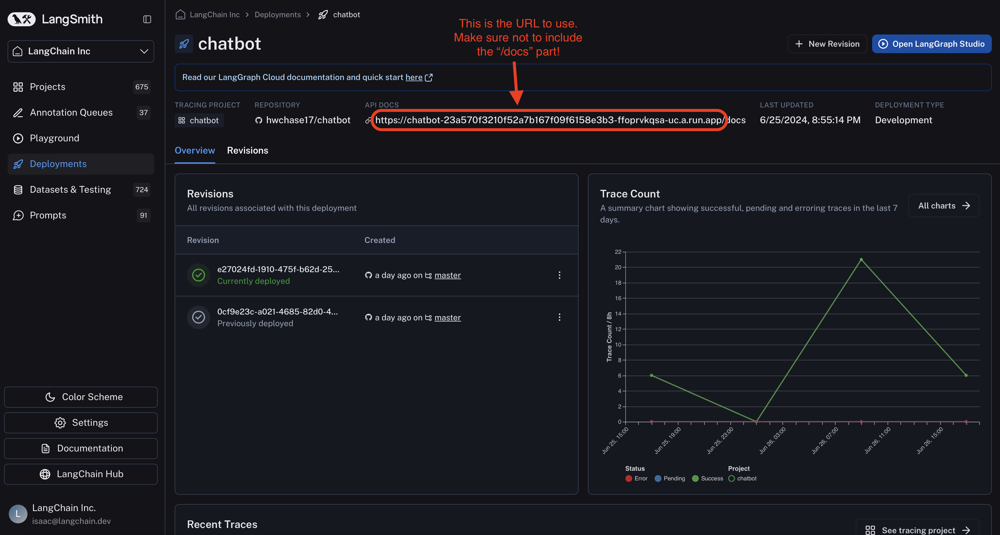

# LangGraph SDK

Once your graph has been deployed using LangGraph Cloud, interacting with it is made simple by using the LangGraph SDK.

Here are the steps to getting started with the SDK:

1. Download the SDK

| Python | Javascript |
|-------|-------|
| `pip install langgraph_sdk` |  `npm install @langchain/langgraph-sdk` |

2. Ensure that the `LANGCHAIN_API_KEY` environment variable is set, which you can do by running `export LANGCHAIN_API_KEY="my-api-key-value"` in the terminal. To confirm that it is, you can call `echo $LANGCHAIN_API_KEY` from the terminal.
3. Start the client with your URL. To find your URL, go to your deployment in LangGraph Cloud and find the url that links to the docs. You want to copy that entire url except for the "/docs" part, as shown in this screenshot: 

4. Then initialize the client as follows: 

<table>
<tr>
<th>
Python
</th>
<th>
Javascript
</th>
</tr>

<tr>

<td> 
<pre>
from langgraph_sdk import get_client
 
get_client client = get_client(url="your-deployment-url")
</pre>
</td>

<td class="code">
<pre>
import { Client } from "@langchain/langgraph-sdk"; 
 
const client = new Client({apiUrl:"whatever-your-url-is"});
</pre>
</td>

</tr>
</table>

5. Read the [SDK reference](https://langchain-ai.github.io/langgraph/cloud/reference/sdk/python_sdk_ref/) to learn about all the ways you can use it.