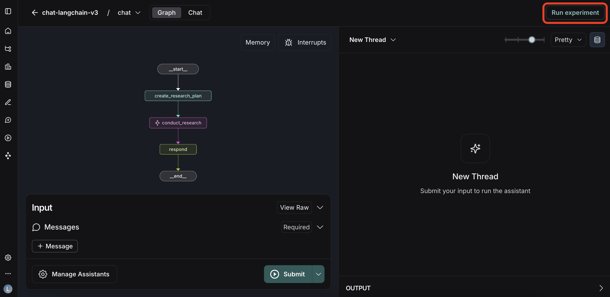
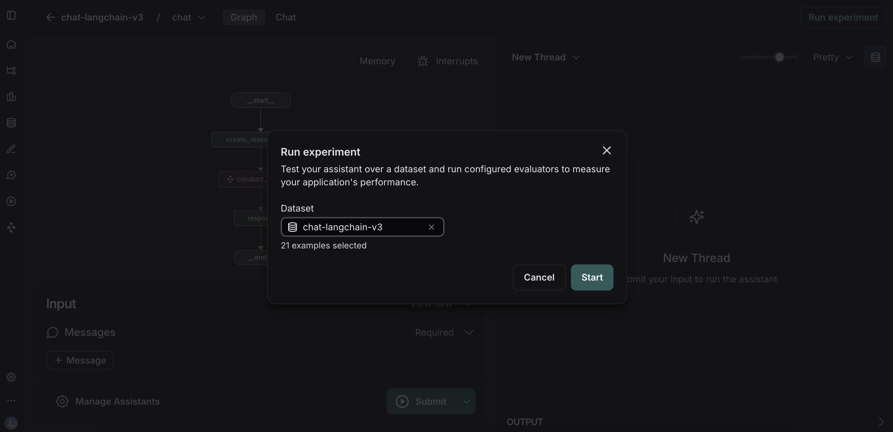
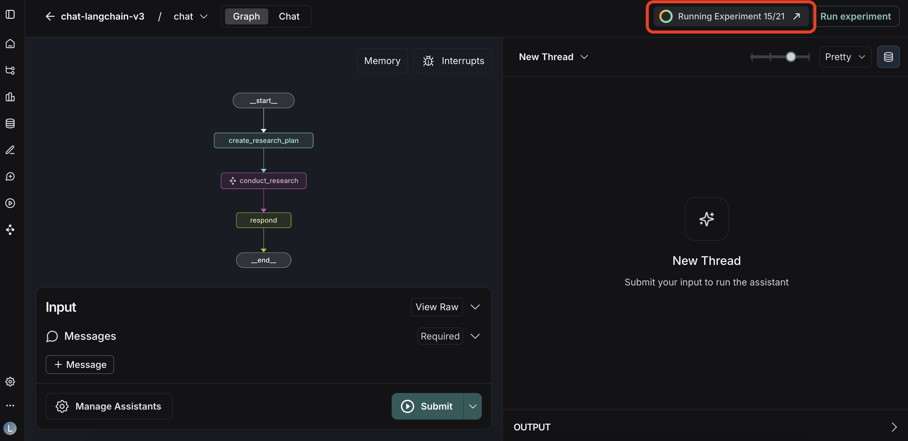

# Run experiments over a dataset

LangGraph Studio supports evaluations by allowing you to run your assistant over a pre-defined LangSmith dataset. This enables you to understand how your application performs over a variety of inputs, compare the results to reference outputs, and score the results using [evaluators](../../../agents/evals.md).

This guide shows you how to run an experiment end-to-end from Studio.

A key requirement is that the **input schema of your dataset must match the input of your LangGraph assistant**.

---

## Prerequisites

Before running an experiment, ensure you have the following:

1.  **A LangSmith dataset**: Your dataset should contain the inputs you want to test and reference outputs for comparison. The schema for the inputs must match what your assistant expects.
    * For more on creating datasets, see [How to Manage Datasets](https://docs.smith.langchain.com/evaluation/how_to_guides/manage_datasets_in_application#set-up-your-dataset).

2.  **(Optional) Evaluators**: You can attach evaluators (e.g., LLM-as-a-Judge, heuristics, or custom functions) to your dataset in LangSmith. These will run automatically after the graph has processed all inputs.
    * To learn more, read about [Evaluation Concepts](https://docs.smith.langchain.com/evaluation/concepts#evaluators).

3.  **A running application**: The experiment can be run against:
    * An application deployed on [LangGraph Platform](../../quick_start.md).
    * A locally running Python application started via the [langgraph-cli](../../../tutorials/langgraph-platform/local-server.md).

!!! info "Note"
    This feature is supported for all applications deployed on LangGraph Platform, or locally running Python applications. Support for the local JS server is coming soon.

---

## Step-by-step guide

### 1. Launch the experiment

Click the **Run experiment** button in the top right corner of the Studio page.

### 2. Select your dataset

In the modal that appears, select the dataset (or a specific dataset split) to use for the experiment and click **Start**.

### 3. Monitor the progress

All of the inputs in the dataset will now be run against the active assistant. Monitor the experiment's progress via the badge in the top right corner.

You can continue to work in Studio while the experiment runs in the background. Click the arrow icon button at any time to navigate to LangSmith and view the detailed experiment results.

---

## Troubleshooting

### "Run experiment" button is disabled

If the "Run experiment" button is disabled, check the following:

* **Deployed application**: If your application is deployed on LangGraph Platform, you may need to create a new revision to enable this feature.
* **Local development server**: If you are running your application locally, make sure you have upgraded to the latest version of the `langgraph-cli` (`pip install -U langgraph-cli`). Additionally, ensure you have tracing enabled by setting the `LANGSMITH_API_KEY` in your project's `.env` file.

### Evaluator results are missing

When you run an experiment, any attached evaluators are scheduled for execution in a queue. If you don't see results immediately, it likely means they are still pending.

### Input schema mismatch

If there is a mismatch between the dataset's schema and the graph's expected input schema, the experiment will not run. To fix this, you have two options:

1.  **Modify the dataset**: Adjust the field names and structure of your dataset's examples in LangSmith to match the assistant's interface.
2.  **Modify the graph**: Add a pre-processing node at the beginning of your graph to transform the incoming data from the dataset's format into the format the rest of your graph expects.