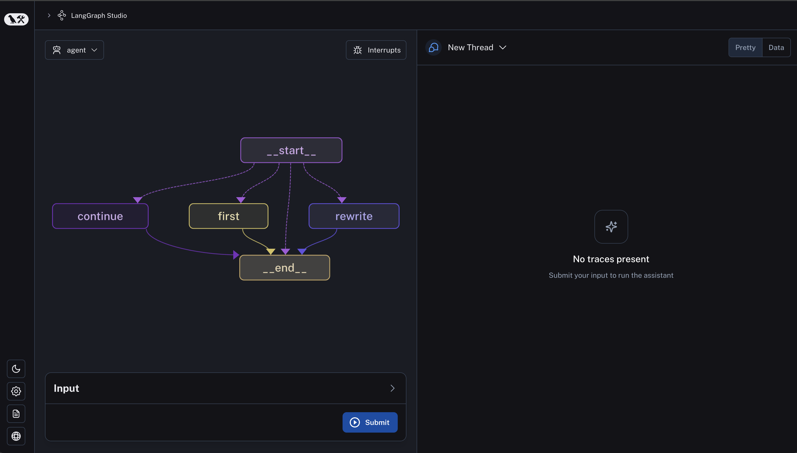

# Test Local Deployment

!!! warning "Browser Compatibility"
    Viewing the studio page of a local LangGraph deployment does not work in Safari. Use Chrome instead.

## Setup

Make sure you have [setup your app](https://langchain-ai.github.io/langgraph/cloud/deployment/setup/) correctly.

After you have your app setup, [start the API server](https://langchain-ai.github.io/langgraph/cloud/deployment/test_locally/#start-the-api-server) and ensure that it is working properly.

## Access Studio

Once you have succesfully started the API server, you can access the studio by going to the following URL: `https://smith.langchain.com/studio/?baseUrl=http://127.0.0.1:8123` (see warning above if using Safari).

If everything is working correctly you should see the studio show up looking something like this (with your graph diagram on the left hand side):

## Use the Studio for Testing

To learn about how to use the studio for testing, read the [LangGraph Studio how-tos](https://langchain-ai.github.io/langgraph/cloud/how-tos/#langgraph-studio).