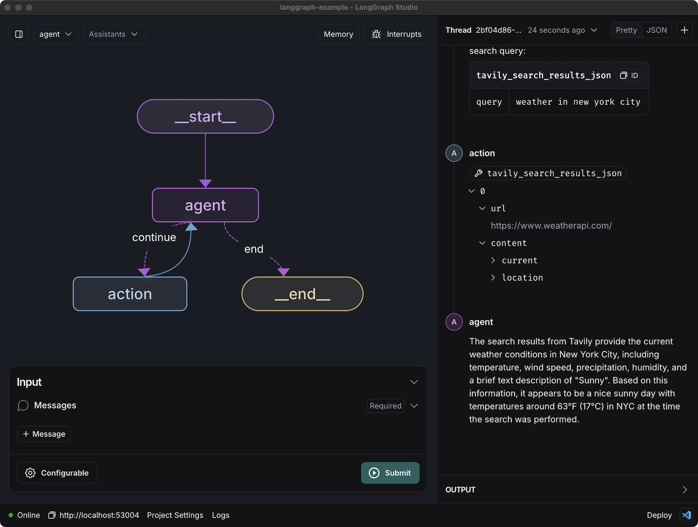

# Quick Start

In this tutorial you will build and deploy a simple chatbot agent that can look things up on the internet. You will be using [LangGraph Cloud](../concepts/langgraph_cloud.md), [LangGraph Studio](../concepts/langgraph_studio.md) to visualize and test it out, and [LangGraph SDK](./reference/sdk/python_sdk_ref.md) to interact with the deployed agent.

If you want to learn how to build an agent like this from scratch, take a look at the [LangGraph Quick Start tutorial](../tutorials/introduction.ipynb).

## Set up requirements

This tutorial will use:

- Anthropic for the LLM - sign up and get an API key [here](https://console.anthropic.com/)
- Tavily for the search engine - sign up and get an API key [here](https://app.tavily.com/)
- LangSmith for hosting - sign up and get an API key [here](https://smith.langchain.com/)

## Create and configure your app

First, let's set create all of the necessary files for our LangGraph application.

1. __Create application directory and files__

    Create a new application `my-app` with the following file structure:

    ```shell
    mkdir my-app
    ```

    === "Python"

            my-app/
            |-- agent.py            # code for your LangGraph agent
            |-- requirements.txt    # Python packages required for your graph
            |-- langgraph.json      # configuration file for LangGraph
            |-- .env                # environment files with API keys

    === "Javascript"

            my-app/
            |-- agent.ts            # code for your LangGraph agent
            |-- package.json        # Javascript packages required for your graph
            |-- langgraph.json      # configuration file for LangGraph
            |-- .env                # environment files with API keys


1. __Define your graph__

    === "Python"
        The `agent.py` file should contain code with your graph.

    === "Javascript"
        The `agent.ts` file should contain code with your graph.

    The following code example is a simple chatbot agent (similar to the one in the [previous tutorial](../tutorials/introduction.ipynb)). Specifically, it uses [create_react_agent][langgraph.prebuilt.chat_agent_executor.create_react_agent], a prebuilt [ReAct](../concepts/agentic_concepts.md#react-implementation)-style agent.

    The `agent` file needs to have a variable with a [CompiledGraph][langgraph.graph.graph.CompiledGraph] (in this case the `graph` variable).

    === "Python"

        ```python
        # agent.py
        from langchain_anthropic import ChatAnthropic
        from langchain_community.tools.tavily_search import TavilySearchResults
        from langgraph.prebuilt import create_react_agent

        model = ChatAnthropic(model="claude-3-5-sonnet-20240620")

        tools = [TavilySearchResults(max_results=2)]

        # compiled graph
        graph = create_react_agent(model, tools)
        ```

    === "Javascript"

        ```ts
        // agent.ts
        import { ChatAnthropic } from "@langchain/anthropic";
        import { TavilySearchResults } from "@langchain/community/tools/tavily_search";
        import { createReactAgent } from "@langchain/langgraph/prebuilt";

        const model = new ChatAnthropic({
          model: "claude-3-5-sonnet-20240620",
        });

        const tools = [
          new TavilySearchResults({ maxResults: 3, }),
        ];

        // compiled graph
        export const graph = createReactAgent({ llm: model, tools });
        ```

1. __Specify dependencies__

    === "Python"
        You should add dependencies for your graph(s) to `requirements.txt`.

    === "Javascript"
        You should add dependencies for your graph(s) to `package.json`.

    In this case we only require four packages for our graph to run:

    === "Python"

          ```python
          langgraph
          langchain_anthropic
          tavily-python
          langchain_community
          ```

    === "Javascript"

          ```js
          {
            "name": "my-app",
            "packageManager": "yarn@1.22.22",
            "dependencies": {
              "@langchain/community": "^0.3.11",
              "@langchain/core": "^0.3.16",
              "@langchain/langgraph": "0.2.18",
              "@langchain/anthropic": "^0.3.7"
            }
          }
          ```

1. __Create LangGraph configuration file__

    The [`langgraph.json`][langgraph.json] file is a configuration file that describes what graph(s) you are going to deploy. In this case we only have one graph: the compiled `graph` object from `agent.py` / `agent.ts`.

    === "Python"

        ```json
        {
          "dependencies": ["."],
          "graphs": {
            "agent": "./agent.py:graph"
          },
          "env": ".env"
        }
        ```

    === "Javascript"

        ```json
        {
          "node_version": "20",
          "dockerfile_lines": [],
          "dependencies": ["."],
          "graphs": {
            "agent": "./src/agent.ts:graph"
          },
          "env": ".env"
        }
        ```

    Learn more about the LangGraph CLI configuration file [here](./reference/cli.md#configuration-file).

1. __Specify environment variables__

    The `.env` file should have any environment variables needed to run your graph. This will only be used for local testing, so if you are not testing locally you can skip this step. 

    !!! warning
        The `.env` file should NOT be included with the rest of source code in your Github repository. When creating a deployment using LangGraph Cloud, you will be able to specify the environment variables manually.

    For this graph, we need two environment variables:

    ```shell
    ANTHROPIC_API_KEY=...
    TAVILY_API_KEY=...
    ```

!!! tip
    Learn more about different application structure options [here](../how-tos/index.md#application-structure).

Now that we have set everything up on our local file system, we are ready to test our graph locally.

## Test the app locally

To test the LangGraph app before deploying it using LangGraph Cloud, you can start the [LangGraph server](../concepts/langgraph_server.md) locally or use [LangGraph Studio](../concepts/langgraph_studio.md).

## Using local server

You can test your app by running [LangGraph server](../concepts/langgraph_server.md) locally. This is useful to make sure you have configured our [CLI configuration file][langgraph.json] correctly and can interact with your graph.

To run the server locally, you need to first install the LangGraph CLI:

```shell
pip install langgraph-cli
```

You can then test our API server locally. In order to run the server locally, you will need to add your `LANGSMITH_API_KEY` to the `.env` file.

```shell
langgraph up
```

This will start up the LangGraph API server locally. If this runs successfully, you should see something like:

```shell
Ready!
- API: http://localhost:8123
```

First, let's verify that the server is running correctly by calling `/ok` endpoint:

```shell
curl --request GET --url http://localhost:8123/ok
```

Output:

```
{"ok": "true"}
```

Now we're ready to test the app with the real inputs!

```shell
curl --request POST \
    --url http://localhost:8123/runs/stream \
    --header 'Content-Type: application/json' \
    --data '{
    "assistant_id": "agent",
    "input": {
        "messages": [
            {
                "role": "user",
                "content": "What is the weather in NYC?"
            }
        ]
    },
    "stream_mode": "updates"
}'
```

Output:

```
...

data: {
  "agent": {
    "messages": [
      {
        "content": "The search results from Tavily provide the current weather conditions in New York City, including temperature, wind speed, precipitation, humidity, and cloud cover. According to the results, as of 3:00pm on October 30th, 2024, it is overcast in NYC with a temperature of around 66°F (19°C), light winds from the southwest around 8 mph (13 km/h), and 66% humidity.\n\nSo in summary, the current weather in NYC is overcast with mild temperatures in the mid 60sF and light winds, based on the search results. Let me know if you need any other details!",
        "type": "ai",
        ...
      }
    ]
  }
}
```

You can see that our agent responds with the up-to-date search results!

###  Using LangGraph Studio Desktop

You can also test your app locally with [LangGraph Studio](../concepts/langgraph_studio.md). LangGraph Studio offers a new way to develop LLM applications by providing a specialized agent IDE that enables visualization, interaction, and debugging of complex agentic applications.

With visual graphs and the ability to edit state, you can better understand agent workflows and iterate faster. LangGraph Studio integrates with LangSmith allowing you to collaborate with teammates to debug failure modes.

LangGraph Studio is available as a [desktop app](https://studio.langchain.com/) for MacOS users. Once you have installed the app, you can select `my-app` directory, which will automatically start the server locally and load the graph in the UI.

To interact with your chatbot agent in LangGraph Studio, you can add a new message in the `Input` section and press `Submit`.



## Deploy to LangGraph Cloud

Once you've tested your graph locally and verified that it works as expected, you can deploy it to the LangGraph Cloud.

First, you'll need to turn the `my-app` directory into a GitHub repo and [push it to GitHub](https://docs.github.com/en/migrations/importing-source-code/using-the-command-line-to-import-source-code/adding-locally-hosted-code-to-github).

Once you have created your GitHub repository with a Python file containing your compiled graph as well as a `langgraph.json` with the configuration, you can head over to [LangSmith](https://smith.langchain.com/) and click on the graph icon (`LangGraph Cloud`) on the bottom of the left navbar. This will open the LangGraph deployments page. On this page, click the `+ New Deployment` button in the top right corner.


**_If you have not deployed to LangGraph Cloud before:_** there will be a button that shows up saying `Import from GitHub`. You’ll need to follow that flow to connect LangGraph Cloud to GitHub.

**_Once you have set up your GitHub connection:_** the new deployment page will look as follows:


To deploy your application, you should do the following:

1. Select your GitHub username or organization from the selector
1. Search for your repo to deploy in the search bar and select it
1. Choose a name for your deployment
1. In the `Git Branch` field, you can specify either the branch for the code you want to deploy, or the exact commit SHA.
1. In the `LangGraph API config file` field, enter the path to your `langgraph.json` file (which in this case is just `langgraph.json`)
1. If your application needs environment variables, add those in the `Environment Variables` section. They will be propagated to the underlying server so your code can access them. In this case, we will need `ANTHROPIC_API_KEY` and `TAVILY_API_KEY`.

Hit `Submit` and your application will start deploying!

After your deployment is complete, your deployments page should look as follows:


## Interact with your deployment

### Using LangGraph Studio (Cloud)

On the deployment page for your application,, you should see a button in the top right corner that says `LangGraph Studio`. Clicking on this button will take you to the web version of LangGraph Studio. This is the same UI that you interacted with when [testing the app locally](#using-langgraph-studio-recommended), but instead of using a local LangGraph server, it uses the one from your LangGraph Cloud deployment.


### Using LangGraph SDK

You can also interact with your deployed LangGraph application programmatically, using [LangGraph SDK](./reference/sdk/python_sdk_ref.md).

First, make sure you have the SDK installed:

=== "Python"

    ```shell
    pip install langgraph_sdk
    ```

=== "Javascript"

    ```shell
    yarn add @langchain/langgraph-sdk
    ```

Before using, you need to get the URL of your LangGraph deployment. You can find this in the `Deployment` view. Click the URL to copy it to the clipboard.

You also need to make sure you have set up your API key properly so you can authenticate with LangGraph Cloud.

```shell
export LANGSMITH_API_KEY=...
```

The first thing to do when using the SDK is to setup our client, access our assistant, and create a thread to execute a run on:

=== "Python"

     ```python
     from langgraph_sdk import get_client

     client = get_client(url=<DEPLOYMENT_URL>)
     # get default assistant
     assistants = await client.assistants.search(metadata={"created_by": "system"})
     assistant = assistants[0]
     # create thread
     thread = await client.threads.create()
     print(thread)
     ```

=== "Javascript"

     ```js
     import { Client } from "@langchain/langgraph-sdk";

     const client = new Client({ apiUrl: <DEPLOYMENT_URL> });
     // get default assistant
     const assistants = await client.assistants.search({ metadata: {"created_by": "system"} })
     const assistant = assistants[0];
     // create thread
     const thread = await client.threads.create();
     console.log(thread)
     ```

=== "CURL"

     ```bash
     curl --request POST \
         --url <DEPLOYMENT_URL>/assistants/search \
         --header 'Content-Type: application/json' \
         --data '{
             "limit": 10,
             "offset": 0,
             "metadata": {"created_by": "system"}
         }' &&
     curl --request POST \
         --url <DEPLOYMENT_URL>/threads \
         --header 'Content-Type: application/json' \
         --data '{}'
     ```

We can then execute a run on the thread:

=== "Python"

    ```python
    input = {
        "messages": [{"role": "user", "content": "What is the weather in NYC?"}]
    }

    async for chunk in client.runs.stream(
        thread["thread_id"],
        assistant["assistant_id"],
        input=input,
        stream_mode="updates",
    ):
        if chunk.data:
            print(chunk.data)
    ```

=== "Javascript"

    ```js
    const input = { "messages": [{ "role": "user", "content": "What is the weather in NYC?" }] };

    const streamResponse = client.runs.stream(
      thread["thread_id"],
      assistant["assistant_id"],
      {
        input,
        streamMode: "updates"
      }
    );
    for await (const chunk of streamResponse) {
      if (chunk.data) {
        console.log(chunk.data);
      }
    }
    ```

=== "CURL"

    ```bash
    curl --request POST \
      --url <DEPLOYMENT_URL>/threads/<THREAD_ID>/runs/stream \
      --header 'Content-Type: application/json' \
      --data '{
        "assistant_id": <ASSISTANT_ID>,
        "input": {
        "messages": [
            {
                "role": "user",
                "content": "What is the weather in NYC?"
            }
          ]
        },
        "stream_mode": "updates"
      }'
    ```

Output:

```
...

data: {
  "agent": {
    "messages": [
      {
        "content": "The search results from Tavily provide the current weather conditions in New York City, including temperature, wind speed, precipitation, humidity, and cloud cover. According to the results, as of 3:00pm on October 30th, 2024, it is overcast in NYC with a temperature of around 66°F (19°C), light winds from the southwest around 8 mph (13 km/h), and 66% humidity.\n\nSo in summary, the current weather in NYC is overcast with mild temperatures in the mid 60sF and light winds, based on the search results. Let me know if you need any other details!",
        "type": "ai",
        ...
      }
    ]
  }
}
```

## Next steps

Congratulations! If you've worked your way through this tutorial you are well on your way to becoming a LangGraph Cloud expert. Here are some other resources to check out to help you out on the path to expertise:

* [LangGraph How-to guides](../how-tos/index.md)
* [LangGraph Tutorials](../tutorials/index.md)