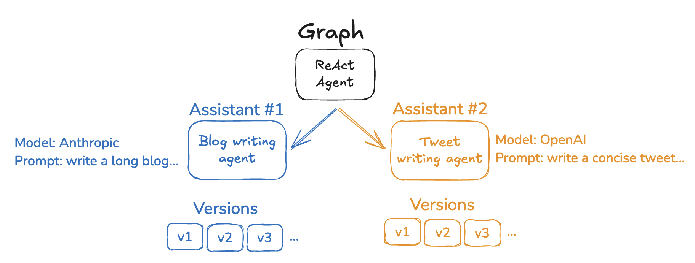

# Assistants

**Assistants** allow you to manage configurations (like prompts, LLM selection, tools) separately from your graph's core logic, enabling rapid changes that don't alter the graph architecture. It is a way to create multiple specialized versions of the same graph architecture, each optimized for different use cases through context/configuration variations rather than structural changes.

For example, imagine a general-purpose writing agent built on a common graph architecture. While the structure remains the same, different writing styles—such as blog posts and tweets—require tailored configurations to optimize performance. To support these variations, you can create multiple assistants (e.g., one for blogs and another for tweets) that share the underlying graph but differ in model selection and system prompt.

The LangGraph Cloud API provides several endpoints for creating and managing assistants and their versions. See the [API reference](../cloud/reference/api/api_ref.html#tag/assistants) for more details.

!!! info

    Assistants are a [LangGraph Platform](langgraph_platform.md) concept. They are not available in the open source LangGraph library.

## Configuration

:::python
Assistants build on the LangGraph open source concepts of configuration and [runtime context](low_level.md#runtime-context).
:::

While these features are available in the open source LangGraph library, assistants are only present in [LangGraph Platform](langgraph_platform.md). This is due to the fact that assistants are tightly coupled to your deployed graph. Upon deployment, LangGraph Server will automatically create a default assistant for each graph using the graph's default context and configuration settings.

In practice, an assistant is just an _instance_ of a graph with a specific configuration. Therefore, multiple assistants can reference the same graph but can contain different configurations (e.g. prompts, models, tools). The LangGraph Server API provides several endpoints for creating and managing assistants. See the [API reference](../cloud/reference/api/api_ref.html) and [this how-to](../cloud/how-tos/configuration_cloud.md) for more details on how to create assistants.

## Versioning

Assistants support versioning to track changes over time.
Once you've created an assistant, subsequent edits to that assistant will create new versions. See [this how-to](../cloud/how-tos/configuration_cloud.md#create-a-new-version-for-your-assistant) for more details on how to manage assistant versions.

## Execution

A **run** is an invocation of an assistant. Each run may have its own input, configuration, context, and metadata, which may affect execution and output of the underlying graph. A run can optionally be executed on a [thread](./persistence.md#threads).

The LangGraph Platform API provides several endpoints for creating and managing runs. See the [API reference](../cloud/reference/api/api_ref.html#tag/thread-runs/) for more details.
