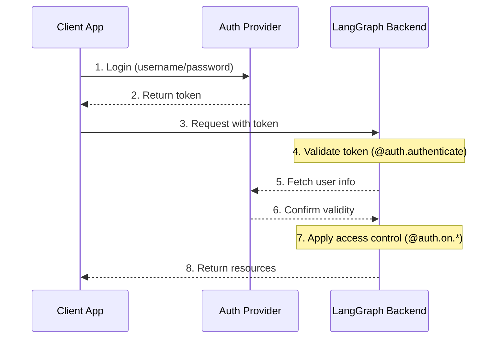

# Authentication & Access Control

LangGraph Platform provides a flexible authentication and authorization system that can integrate with most authentication schemes.

!!! note "Python only"

    We currently only support custom authentication and authorization in Python deployments with `langgraph-api>=0.0.11`. Support for LangGraph.JS will be added soon.

## Core Concepts

### Authentication vs Authorization

While often used interchangeably, these terms represent distinct security concepts:

- [**Authentication**](#authentication) ("AuthN") verifies _who_ you are. This runs as middleware for every request.
- [**Authorization**](#authorization) ("AuthZ") determines _what you can do_. This validates the user's privileges and roles on a per-resource basis.

In LangGraph Platform, authentication is handled by your [`@auth.authenticate`](../cloud/reference/sdk/python_sdk_ref.md#langgraph_sdk.auth.Auth.authenticate) handler, and authorization is handled by your [`@auth.on`](../cloud/reference/sdk/python_sdk_ref.md#langgraph_sdk.auth.Auth.on) handlers.

## Default Security Models

LangGraph Platform provides different security defaults:

### LangGraph Cloud

- Uses LangSmith API keys by default
- Requires valid API key in `x-api-key` header
- Can be customized with your auth handler

!!! note "Custom auth"
    Custom auth **is supported** for all plans in LangGraph Cloud.

### Self-Hosted

- No default authentication
- Complete flexibility to implement your security model
- You control all aspects of authentication and authorization

!!! note "Custom auth"
    Custom auth is supported for **Enterprise** self-hosted plans.
    Self-hosted lite plans do not support custom auth natively.

## System Architecture

A typical authentication setup involves three main components:

1. **Authentication Provider** (Identity Provider/IdP)

    * A dedicated service that manages user identities and credentials
    * Handles user registration, login, password resets, etc.
    * Issues tokens (JWT, session tokens, etc.) after successful authentication
    * Examples: Auth0, Supabase Auth, Okta, or your own auth server

2. **LangGraph Backend** (Resource Server)

    * Your LangGraph application that contains business logic and protected resources
    * Validates tokens with the auth provider
    * Enforces access control based on user identity and permissions
    * Doesn't store user credentials directly

3. **Client Application** (Frontend)

    * Web app, mobile app, or API client
    * Collects time-sensitive user credentials and sends to auth provider
    * Receives tokens from auth provider
    * Includes these tokens in requests to LangGraph backend

Here's how these components typically interact:



Your [`@auth.authenticate`](../cloud/reference/sdk/python_sdk_ref.md#langgraph_sdk.auth.Auth.authenticate) handler in LangGraph handles steps 4-6, while your [`@auth.on`](../cloud/reference/sdk/python_sdk_ref.md#langgraph_sdk.auth.Auth.on) handlers implement step 7.

## Authentication

Authentication in LangGraph runs as middleware on every request. Your [`@auth.authenticate`](../cloud/reference/sdk/python_sdk_ref.md#langgraph_sdk.auth.Auth.authenticate) handler receives request information and should:

1. Validate the credentials
2. Return [user info](../cloud/reference/sdk/python_sdk_ref.md#langgraph_sdk.auth.types.MinimalUserDict) containing the user's identity and user information if valid
3. Raise an [HTTP exception](../cloud/reference/sdk/python_sdk_ref.md#langgraph_sdk.auth.exceptions.HTTPException) or AssertionError if invalid

```python
from langgraph_sdk import Auth

auth = Auth()

@auth.authenticate
async def authenticate(headers: dict) -> Auth.types.MinimalUserDict:
    # Validate credentials (e.g., API key, JWT token)
    api_key = headers.get("x-api-key")
    if not api_key or not is_valid_key(api_key):
        raise Auth.exceptions.HTTPException(
            status_code=401,
            detail="Invalid API key"
        )

    # Return user info - only identity and is_authenticated are required
    # Add any additional fields you need for authorization
    return {
        "identity": "user-123",        # Required: unique user identifier
        "is_authenticated": True,      # Optional: assumed True by default
        "permissions": ["read", "write"] # Optional: for permission-based auth
        # You can add more custom fields if you want to implement other auth patterns
        "role": "admin",
        "org_id": "org-456"

    }
```

The returned user information is available:

- To your authorization handlers via [`ctx.user`](../cloud/reference/sdk/python_sdk_ref.md#langgraph_sdk.auth.types.AuthContext)
- In your application via `config["configuration"]["langgraph_auth_user"]`

??? tip "Supported Parameters"

    The [`@auth.authenticate`](../cloud/reference/sdk/python_sdk_ref.md#langgraph_sdk.auth.Auth.authenticate) handler can accept any of the following parameters by name:

    * request (Request): The raw ASGI request object
    * body (dict): The parsed request body
    * path (str): The request path, e.g., "/threads/abcd-1234-abcd-1234/runs/abcd-1234-abcd-1234/stream"
    * method (str): The HTTP method, e.g., "GET"
    * path_params (dict[str, str]): URL path parameters, e.g., {"thread_id": "abcd-1234-abcd-1234", "run_id": "abcd-1234-abcd-1234"}
    * query_params (dict[str, str]): URL query parameters, e.g., {"stream": "true"}
    * headers (dict[bytes, bytes]): Request headers
    * authorization (str | None): The Authorization header value (e.g., "Bearer <token>")
    
    In many of our tutorials, we will just show the "authorization" parameter to be concise, but you can opt to accept more information as needed
    to implement your custom authentication scheme.

## Authorization

After authentication, LangGraph calls your [`@auth.on`](../cloud/reference/sdk/python_sdk_ref.md#langgraph_sdk.auth.Auth.on) handlers to control access to specific resources (e.g., threads, assistants, crons). These handlers can:

1. Add metadata to be saved during resource creation by mutating the `value["metadata"]` dictionary directly. See the [supported actions table](##supported-actions) for the list of types the value can take for each action.
2. Filter resources by metadata during search/list or read operations by returning a [filter dictionary](#filter-operations).
3. Raise an HTTP exception if access is denied.

If you want to just implement simple user-scoped access control, you can use a single [`@auth.on`](../cloud/reference/sdk/python_sdk_ref.md#langgraph_sdk.auth.Auth.on) handler for all resources and actions. If you want to have different control depending on the resource and action, you can use [resource-specific handlers](#resource-specific-handlers). See the [Supported Resources](#supported-resources) section for a full list of the resources that support access control.

```python
@auth.on
async def add_owner(
    ctx: Auth.types.AuthContext,
    value: dict  # The payload being sent to this access method
) -> dict:  # Returns a filter dict that restricts access to resources
    """Authorize all access to threads, runs, crons, and assistants.

    This handler does two things:
        - Adds a value to resource metadata (to persist with the resource so it can be filtered later)
        - Returns a filter (to restrict access to existing resources)

    Args:
        ctx: Authentication context containing user info, permissions, the path, and
        value: The request payload sent to the endpoint. For creation
              operations, this contains the resource parameters. For read
              operations, this contains the resource being accessed.

    Returns:
        A filter dictionary that LangGraph uses to restrict access to resources.
        See [Filter Operations](#filter-operations) for supported operators.
    """
    # Create filter to restrict access to just this user's resources
    filters = {"owner": ctx.user.identity}

    # Get or create the metadata dictionary in the payload
    # This is where we store persistent info about the resource
    metadata = value.setdefault("metadata", {})

    # Add owner to metadata - if this is a create or update operation,
    # this information will be saved with the resource
    # So we can filter by it later in read operations
    metadata.update(filters)

    # Return filters to restrict access
    # These filters are applied to ALL operations (create, read, update, search, etc.)
    # to ensure users can only access their own resources
    return filters
```

### Resource-Specific Handlers {#resource-specific-handlers}

You can register handlers for specific resources and actions by chaining the resource and action names together with the [`@auth.on`](../cloud/reference/sdk/python_sdk_ref.md#langgraph_sdk.auth.Auth.on) decorator.
When a request is made, the most specific handler that matches that resource and action is called. Below is an example of how to register handlers for specific resources and actions. For the following setup:

1. Authenticated users are able to create threads, read thread, create runs on threads
2. Only users with the "assistants:create" permission are allowed to create new assistants
3. All other endpoints (e.g., e.g., delete assistant, crons, store) are disabled for all users.

!!! tip "Supported Handlers"

    For a full list of supported resources and actions, see the [Supported Resources](#supported-resources) section below.

```python
# Generic / global handler catches calls that aren't handled by more specific handlers
@auth.on
async def reject_unhandled_requests(ctx: Auth.types.AuthContext, value: Any) -> False:
    print(f"Request to {ctx.path} by {ctx.user.identity}")
    raise Auth.exceptions.HTTPException(
        status_code=403,
        detail="Forbidden"
    )

# Matches the "thread" resource and all actions - create, read, update, delete, search
# Since this is **more specific** than the generic @auth.on handler, it will take precedence
# over the generic handler for all actions on the "threads" resource
@auth.on.threads
async def on_thread_create(
    ctx: Auth.types.AuthContext,
    value: Auth.types.threads.create.value
):
    if "write" not in ctx.permissions:
        raise Auth.exceptions.HTTPException(
            status_code=403,
            detail="User lacks the required permissions."
        )
    # Setting metadata on the thread being created
    # will ensure that the resource contains an "owner" field
    # Then any time a user tries to access this thread or runs within the thread,
    # we can filter by owner
    metadata = value.setdefault("metadata", {})
    metadata["owner"] = ctx.user.identity
    return {"owner": ctx.user.identity}

# Thread creation. This will match only on thread create actions
# Since this is **more specific** than both the generic @auth.on handler and the @auth.on.threads handler,
# it will take precedence for any "create" actions on the "threads" resources
@auth.on.threads.create
async def on_thread_create(
    ctx: Auth.types.AuthContext,
    value: Auth.types.threads.create.value
):
    # Setting metadata on the thread being created
    # will ensure that the resource contains an "owner" field
    # Then any time a user tries to access this thread or runs within the thread,
    # we can filter by owner
    metadata = value.setdefault("metadata", {})
    metadata["owner"] = ctx.user.identity
    return {"owner": ctx.user.identity}

# Reading a thread. Since this is also more specific than the generic @auth.on handler, and the @auth.on.threads handler,
# it will take precedence for any "read" actions on the "threads" resource
@auth.on.threads.read
async def on_thread_read(
    ctx: Auth.types.AuthContext,
    value: Auth.types.threads.read.value
):
    # Since we are reading (and not creating) a thread,
    # we don't need to set metadata. We just need to
    # return a filter to ensure users can only see their own threads
    return {"owner": ctx.user.identity}

# Run creation, streaming, updates, etc.
# This takes precedenceover the generic @auth.on handler and the @auth.on.threads handler
@auth.on.threads.create_run
async def on_run_create(
    ctx: Auth.types.AuthContext,
    value: Auth.types.threads.create_run.value
):
    metadata = value.setdefault("metadata", {})
    metadata["owner"] = ctx.user.identity
    # Inherit thread's access control
    return {"owner": ctx.user.identity}

# Assistant creation
@auth.on.assistants.create
async def on_assistant_create(
    ctx: Auth.types.AuthContext,
    value: Auth.types.assistants.create.value
):
    if "assistants:create" not in ctx.permissions:
        raise Auth.exceptions.HTTPException(
            status_code=403,
            detail="User lacks the required permissions."
        )
```

Notice that we are mixing global and resource-specific handlers in the above example. Since each request is handled by the most specific handler, a request to create a `thread` would match the `on_thread_create` handler but NOT the `reject_unhandled_requests` handler. A request to `update` a thread, however would be handled by the global handler, since we don't have a more specific handler for that resource and action. Requests to create, update, 

### Filter Operations {#filter-operations}

Authorization handlers can return `None`, a boolean, or a filter dictionary.
- `None` and `True` mean "authorize access to all underling resources"
- `False` means "deny access to all underling resources (raises a 403 exception)"
- A metadata filter dictionary will restrict access to resources

A filter dictionary is a dictionary with keys that match the resource metadata. It supports three operators:

- The default value is a shorthand for exact match, or "$eq", below. For example, `{"owner": user_id}` will include only resources with metadata containing `{"owner": user_id}`
- `$eq`: Exact match (e.g., `{"owner": {"$eq": user_id}}`) - this is equivalent to the shorthand above, `{"owner": user_id}`
- `$contains`: List membership (e.g., `{"allowed_users": {"$contains": user_id}}`) The value here must be an element of the list. The metadata in the stored resource must be a list/container type.

A dictionary with multiple keys is treated using a logical `AND` filter. For example, `{"owner": org_id, "allowed_users": {"$contains": user_id}}` will only match resources with metadata whose "owner" is `org_id` and whose "allowed_users" list contains `user_id`.
See the reference [here](../cloud/reference/sdk/python_sdk_ref.md#langgraph_sdk.auth.types.FilterType) for more information.

## Common Access Patterns

Here are some typical authorization patterns:

### Single-Owner Resources

This common pattern lets you scope all threads, assistants, crons, and runs to a single user. It's useful for common single-user use cases like regular chatbot-style apps.

```python
@auth.on
async def owner_only(ctx: Auth.types.AuthContext, value: dict):
    metadata = value.setdefault("metadata", {})
    metadata["owner"] = ctx.user.identity
    return {"owner": ctx.user.identity}
```

### Permission-based Access

This pattern lets you control access based on **permissions**. It's useful if you want certain roles to have broader or more restricted access to resources.

```python
# In your auth handler:
@auth.authenticate
async def authenticate(headers: dict) -> Auth.types.MinimalUserDict:
    ...
    return {
        "identity": "user-123",
        "is_authenticated": True,
        "permissions": ["threads:write", "threads:read"]  # Define permissions in auth
    }

def _default(ctx: Auth.types.AuthContext, value: dict):
    metadata = value.setdefault("metadata", {})
    metadata["owner"] = ctx.user.identity
    return {"owner": ctx.user.identity}

@auth.on.threads.create
async def create_thread(ctx: Auth.types.AuthContext, value: dict):
    if "threads:write" not in ctx.permissions:
        raise Auth.exceptions.HTTPException(
            status_code=403,
            detail="Unauthorized"
        )
    return _default(ctx, value)


@auth.on.threads.read
async def rbac_create(ctx: Auth.types.AuthContext, value: dict):
    if "threads:read" not in ctx.permissions and "threads:write" not in ctx.permissions:
        raise Auth.exceptions.HTTPException(
            status_code=403,
            detail="Unauthorized"
        )
    return _default(ctx, value)
```

## Supported Resources

LangGraph provides three levels of authorization handlers, from most general to most specific:

1. **Global Handler** (`@auth.on`): Matches all resources and actions
2. **Resource Handler** (e.g., `@auth.on.threads`, `@auth.on.assistants`, `@auth.on.crons`): Matches all actions for a specific resource
3. **Action Handler** (e.g., `@auth.on.threads.create`, `@auth.on.threads.read`): Matches a specific action on a specific resource

The most specific matching handler will be used. For example, `@auth.on.threads.create` takes precedence over `@auth.on.threads` for thread creation.
If a more specific handler is registered, the more general handler will not be called for that resource and action.

???+ tip "Type Safety"
    Each handler has type hints available for its `value` parameter at `Auth.types.on.<resource>.<action>.value`. For example:
    ```python
    @auth.on.threads.create
    async def on_thread_create(
        ctx: Auth.types.AuthContext,
        value: Auth.types.on.threads.create.value  # Specific type for thread creation
    ):
        ...
    
    @auth.on.threads
    async def on_threads(
        ctx: Auth.types.AuthContext,
        value: Auth.types.on.threads.value  # Union type of all thread actions
    ):
        ...
    
    @auth.on
    async def on_all(
        ctx: Auth.types.AuthContext,
        value: dict  # Union type of all possible actions
    ):
        ...
    ```
    More specific handlers provide better type hints since they handle fewer action types.

#### Supported actions and types {#supported-actions}
Here are all the supported action handlers:

| Resource | Handler | Description | Value Type |
|----------|---------|-------------|------------|
| **Threads** | `@auth.on.threads.create` | Thread creation | [`ThreadsCreate`](../cloud/reference/sdk/python_sdk_ref.md#langgraph_sdk.auth.types.ThreadsCreate) |
| | `@auth.on.threads.read` | Thread retrieval | [`ThreadsRead`](../cloud/reference/sdk/python_sdk_ref.md#langgraph_sdk.auth.types.ThreadsRead) |
| | `@auth.on.threads.update` | Thread updates | [`ThreadsUpdate`](../cloud/reference/sdk/python_sdk_ref.md#langgraph_sdk.auth.types.ThreadsUpdate) |
| | `@auth.on.threads.delete` | Thread deletion | [`ThreadsDelete`](../cloud/reference/sdk/python_sdk_ref.md#langgraph_sdk.auth.types.ThreadsDelete) |
| | `@auth.on.threads.search` | Listing threads | [`ThreadsSearch`](../cloud/reference/sdk/python_sdk_ref.md#langgraph_sdk.auth.types.ThreadsSearch) |
| | `@auth.on.threads.create_run` | Creating or updating a run | [`RunsCreate`](../cloud/reference/sdk/python_sdk_ref.md#langgraph_sdk.auth.types.RunsCreate) |
| **Assistants** | `@auth.on.assistants.create` | Assistant creation | [`AssistantsCreate`](../cloud/reference/sdk/python_sdk_ref.md#langgraph_sdk.auth.types.AssistantsCreate) |
| | `@auth.on.assistants.read` | Assistant retrieval | [`AssistantsRead`](../cloud/reference/sdk/python_sdk_ref.md#langgraph_sdk.auth.types.AssistantsRead) |
| | `@auth.on.assistants.update` | Assistant updates | [`AssistantsUpdate`](../cloud/reference/sdk/python_sdk_ref.md#langgraph_sdk.auth.types.AssistantsUpdate) |
| | `@auth.on.assistants.delete` | Assistant deletion | [`AssistantsDelete`](../cloud/reference/sdk/python_sdk_ref.md#langgraph_sdk.auth.types.AssistantsDelete) |
| | `@auth.on.assistants.search` | Listing assistants | [`AssistantsSearch`](../cloud/reference/sdk/python_sdk_ref.md#langgraph_sdk.auth.types.AssistantsSearch) |
| **Crons** | `@auth.on.crons.create` | Cron job creation | [`CronsCreate`](../cloud/reference/sdk/python_sdk_ref.md#langgraph_sdk.auth.types.CronsCreate) |
| | `@auth.on.crons.read` | Cron job retrieval | [`CronsRead`](../cloud/reference/sdk/python_sdk_ref.md#langgraph_sdk.auth.types.CronsRead) |
| | `@auth.on.crons.update` | Cron job updates | [`CronsUpdate`](../cloud/reference/sdk/python_sdk_ref.md#langgraph_sdk.auth.types.CronsUpdate) |
| | `@auth.on.crons.delete` | Cron job deletion | [`CronsDelete`](../cloud/reference/sdk/python_sdk_ref.md#langgraph_sdk.auth.types.CronsDelete) |
| | `@auth.on.crons.search` | Listing cron jobs | [`CronsSearch`](../cloud/reference/sdk/python_sdk_ref.md#langgraph_sdk.auth.types.CronsSearch) |

???+ note "About Runs"
    Runs are scoped to their parent thread for access control. This means permissions are typically inherited from the thread, reflecting the conversational nature of the data model. All run operations (reading, listing) except creation are controlled by the thread's handlers.
    There is a specific `create_run` handler for creating new runs because it had more arguments that you can view in the handler.


## Next Steps

For implementation details:

- Check out the introductory tutorial on [setting up authentication](../tutorials/auth/getting_started.md)
- See the how-to guide on implementing a [custom auth handlers](../how-tos/auth/custom_auth.md)
