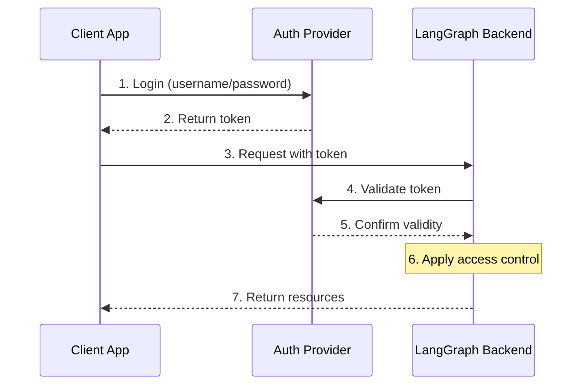

# Authentication & Access Control

LangGraph Platform provides a flexible authentication and authorization system that can integrate with most authentication schemes. This guide explains the core concepts and how they work together.

!!! note "Python only"
    
    We currently only support custom authentication and authorization in Python deployments with `langgraph-api>=0.0.11`. Support for LangGraph.JS will be added soon.

## Core Concepts

### Authentication vs Authorization

While often used interchangeably, these terms represent distinct security concepts:

- **Authentication** ("AuthN") verifies _who_ you are. This runs as middleware for every request.
- **Authorization** ("AuthZ") determines _what you can do_. This validates the user's privileges and roles on a per-resource basis.

In LangGraph Platform, authentication is handled by your [`@auth.authenticate`](../cloud/reference/sdk/python_sdk_ref.md#langgraph_sdk.auth.Auth.authenticate) handler, and authorization is handled by your [`@auth.on`](../cloud/reference/sdk/python_sdk_ref.md#langgraph_sdk.auth.Auth.on) handlers.

## System Architecture

A typical authentication setup involves three main components:

1. **Authentication Provider** (Identity Provider/IdP)
   - A dedicated service that manages user identities and credentials
   - Examples: Auth0, Supabase Auth, Okta, or your own auth server
   - Handles user registration, login, password resets, etc.
   - Issues tokens (JWT, session tokens, etc.) after successful authentication

2. **LangGraph Backend** (Resource Server)
   - Your LangGraph application that contains business logic and protected resources
   - Validates tokens with the auth provider
   - Enforces access control based on user identity and permissions
   - Never stores user credentials directly

3. **Client Application** (Frontend)
   - Web app, mobile app, or API client
   - Collects user credentials and sends to auth provider
   - Receives tokens from auth provider
   - Includes tokens in requests to LangGraph backend

Here's how these components typically interact:



Your `@auth.authenticate` handler in LangGraph handles steps 4-5, while your `@auth.on` handlers implement step 6.

## Authentication

Authentication in LangGraph runs as middleware on every request. Your `@auth.authenticate` handler receives request information and must:

1. Validate the credentials
2. Return user information if valid
3. Raise an HTTP exception if invalid (or AssertionError)

```python
from langgraph_sdk import Auth

auth = Auth()

@auth.authenticate
async def authenticate(headers: dict) -> Auth.types.MinimalUserDict:
    # Validate credentials (e.g., API key, JWT token)
    api_key = headers.get("x-api-key")
    if not api_key or not is_valid_key(api_key):
        raise Auth.exceptions.HTTPException(
            status_code=401,
            detail="Invalid API key"
        )

    # Return user info - only identity and is_authenticated are required
    # Add any additional fields you need for authorization
    return {
        "identity": "user-123",        # Required: unique user identifier
        "is_authenticated": True,      # Optional: assumed True by default
        "permissions": ["read", "write"] # Optional: for permission-based auth
        # You can add more custom fields if you want to implement other auth patterns
        "role": "admin",
        "org_id": "org-456"

    }
```

The returned user information is available:

- To your authorization handlers via `ctx.user`
- In your application via `config["configuration"]["langgraph_auth_user"]`

## Authorization

After authentication, LangGraph calls your `@auth.on` handlers to control access to specific resources (e.g., threads, assistants, crons). These handlers can:

1. Add metadata to be saved during resource creation by mutating the `value["metadata"]` dictionary directly.
2. Filter resources by metadata during search/list or read operations by returning a filter dictionary.
3. Raise an HTTP exception if access is denied.

If you want to just implement simple user-scoped access control, you can use a single `@auth.on` handler for all resources and actions.

```python
@auth.on
async def add_owner(ctx: Auth.types.AuthContext, value: dict):
    """Add owner to resource metadata and filter by owner."""
    filters = {"owner": ctx.user.identity}
    metadata = value.setdefault("metadata", {})
    metadata.update(filters)
    return filters
```

### Resource-Specific Handlers

You can register handlers for specific resources and actions using the `@auth.on` decorator.
When a request is made, the most specific handler that matches that resource and action is called.

```python
# Generic / global handler catches calls that aren't handled by more specific handlers
@auth.on
async def reject_unhandled_requests(ctx: Auth.types.AuthContext, value: Any) -> None:
    print(f"Request to {ctx.path} by {ctx.user.identity}")
    return False

# Thread creation
@auth.on.threads.create
async def on_thread_create(
    ctx: Auth.types.AuthContext,
    value: Auth.types.threads.create.value
):
    metadata = value.setdefault("metadata", {})
    metadata["owner"] = ctx.user.identity
    return {"owner": ctx.user.identity}

# Thread retrieval
@auth.on.threads.read
async def on_thread_read(
    ctx: Auth.types.AuthContext,
    value: Auth.types.threads.read.value
):
    return {"owner": ctx.user.identity}

# Run creation, streaming, updates, etc.
@auth.on.threads.create_run
async def on_run_create(
    ctx: Auth.types.AuthContext,
    value: Auth.types.threads.create_run.value
):
    # Inherit thread's access control
    return {"owner": ctx.user.identity}

# Assistant creation
@auth.on.assistants.create
async def on_assistant_create(
    ctx: Auth.types.AuthContext,
    value: Auth.types.assistants.create.value
):
    if "admin" not in ctx.user.get("role", []):
        raise Auth.exceptions.HTTPException(
            status_code=403,
            detail="Only admins can create assistants"
        )
```

Using the setup above, a request to create a `thread` would match the `on_thread_create` handler, since it is the most specific handler for that resource and action. A request to create a `cron`, on the other hand, would match the global handler, since no more specific handler is registered for that resource and action.

### Filter Operations

Authorization handlers can return a filter dictionary to filter resources during all operations (both reads and writes). The filter dictionary supports two additional operators:

- `$eq`: Exact match (e.g., `{"owner": {"$eq": user_id}}`) - this is equivalent to `{"owner": user_id}`
- `$contains`: List membership (e.g., `{"allowed_users": {"$contains": user_id}}`)

A dictionary with multiple keys is converted to a logical `AND` filter. For example, `{"owner": user_id, "org_id": org_id}` is converted to `{"$and": [{"owner": user_id}, {"org_id": org_id}]}`

## Common Access Patterns

Here are some typical authorization patterns:

### Single-Owner Resources

```python
@auth.on
async def owner_only(ctx: Auth.types.AuthContext, value: dict):
    metadata = value.setdefault("metadata", {})
    metadata["owner"] = ctx.user.identity
    return {"owner": ctx.user.identity}
```

### Permission-based Access

```python
# In your auth handler:
@auth.authenticate
async def authenticate(headers: dict) -> Auth.types.MinimalUserDict:
    ...
    return {
        "identity": "user-123",
        "is_authenticated": True,
        "permissions": ["threads:write", "threads:read"]  # Define permissions in auth
    }

def _default(ctx: Auth.types.AuthContext, value: dict):
    metadata = value.setdefault("metadata", {})
    metadata["owner"] = ctx.user.identity
    return {"owner": ctx.user.identity}

@auth.on.threads.create
async def create_thread(ctx: Auth.types.AuthContext, value: dict):
    if "threads:write" not in ctx.permissions:
        raise Auth.exceptions.HTTPException(
            status_code=403,
            detail="Unauthorized"
        )
    return _default(ctx, value)


@auth.on.threads.read
async def rbac_create(ctx: Auth.types.AuthContext, value: dict):
    if "threads:read" not in ctx.permissions and "threads:write" not in ctx.permissions:
        raise Auth.exceptions.HTTPException(
            status_code=403,
            detail="Unauthorized"
        )
    return _default(ctx, value)
```

## Supported Resources

LangGraph provides authorization handlers for the following resource types:

### Threads
- `@auth.on.threads.create` - Thread creation
- `@auth.on.threads.read` - Thread retrieval
- `@auth.on.threads.update` - Thread updates
- `@auth.on.threads.delete` - Thread deletion
- `@auth.on.threads.search` - Listing threads

**Runs:** are scoped to their parent thread for access control. This means permissions are typically inherited from the thread, reflecting the conversational nature of the data model.

- `@auth.on.threads.create_run` - Creating or updating a run

All other run operations (reading, listing) are controlled by the thread's handlers, since runs are always accessed in the context of their thread.

### Assistants
- `@auth.on.assistants.create` - Assistant creation
- `@auth.on.assistants.read` - Assistant retrieval
- `@auth.on.assistants.update` - Assistant updates
- `@auth.on.assistants.delete` - Assistant deletion
- `@auth.on.assistants.search` - Listing assistants

### Crons
- `@auth.on.crons.create` - Cron job creation
- `@auth.on.crons.read` - Cron job retrieval
- `@auth.on.crons.update` - Cron job updates
- `@auth.on.crons.delete` - Cron job deletion
- `@auth.on.crons.search` - Listing cron jobs

You can also use the global `@auth.on` handler to implement a single access control policy across all resources and actions, or resource level `@auth.on.threads`, etc. handlers to implement control over all actions of a single resource.

## Default Security Models

LangGraph Platform provides different security defaults:

### LangGraph Cloud

- Uses LangSmith API keys by default
- Requires valid API key in `x-api-key` header
- Can be customized with your auth handler

### Self-Hosted

- No default authentication
- Complete flexibility to implement your security model
- You control all aspects of authentication and authorization

## Next Steps

For implementation details:

- [Setting up authentication](../tutorials/auth/getting_started.md)
- [Custom auth handlers](../how-tos/auth/custom_auth.md)
