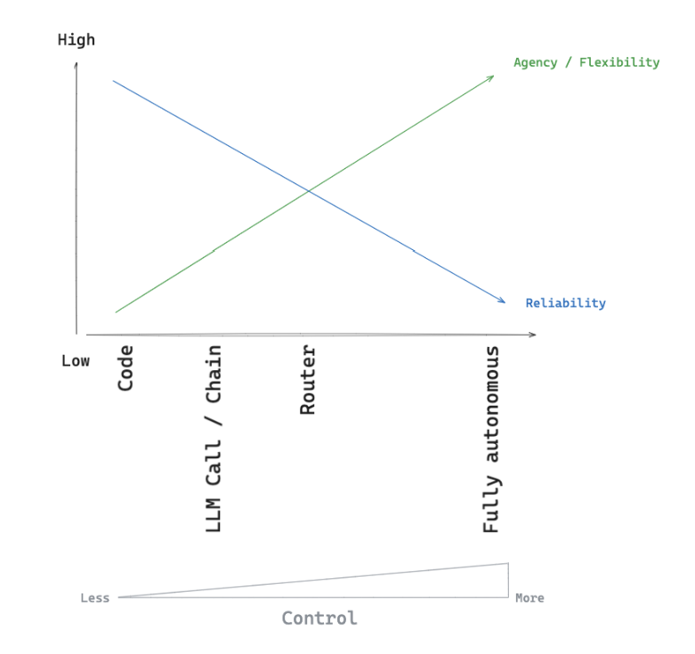
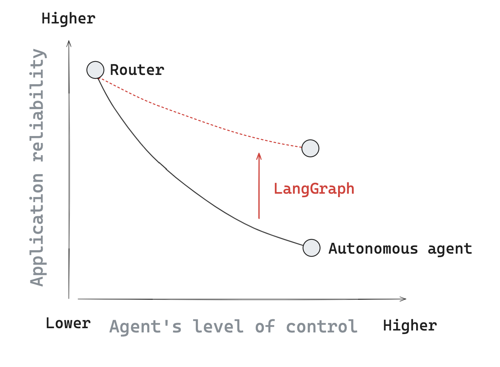

# Why LangGraph?

LLMs are extremely powerful, particularly when connected to other systems such as a retriever or APIs. This is why many LLM applications use a control flow of steps before and / or after LLM calls. As an example [RAG](https://github.com/langchain-ai/rag-from-scratch) performs retrieval of relevant documents to a question, and passes those documents to an LLM in order to ground the response. Often a control flow of steps before and / or after an LLM is called a "chain." Chains are a popular paradigm for programming with LLMs and offer a high degree of reliability; the same set of steps runs with each chain invocation.

However, we often want LLM systems that can pick their own control flow! This is one definition of an [agent](https://blog.langchain.dev/what-is-an-agent/): an agent is a system that uses an LLM to decide the control flow of an application. Unlike a chain, an agent given an LLM some degree of control over the sequence of steps in the application. Examples of using an LLM to decide the control of an application:

- Using an LLM to route between two potential paths
- Using an LLM to decide which of many tools to call
- Using an LLM to decide whether the generated answer is sufficient or more work is need

There are many different types of [agent architectures](https://blog.langchain.dev/what-is-a-cognitive-architecture/) to consider, which given an LLM varying levels of control. On one extreme, a router allows an LLM to select a single step from a specified set of options and, on the other extreme, a fully autonomous long-running agent may have complete freedom to select any sequence of steps that it wants for a given problem. 

Several concepts are utilized in many agent architectures:

- [Tool calling](agentic_concepts.md#tool-calling): this is often how LLMs make decisions
- Action taking: often times, the LLMs' outputs are used as the input to an action
- [Memory](agentic_concepts.md#memory): reliable systems need to have knowledge of things that occurred
- [Planning](agentic_concepts.md#planning): planning steps (either explicit or implicit) are useful for ensuring that the LLM, when making decisions, makes them in the highest fidelity way.

## Challenges

In practice, there is often a trade-off between control and reliability. As we give LLMs more control, the application often become less reliable. This can be due to factors such as LLM non-determinism and / or errors in selecting tools (or steps) that the agent uses (takes).

## Core Principles

The motivation of LangGraph is to help bend the curve, preserving higher reliability as we give the agent more control over the application. We'll outline a few specific pillars of LangGraph that make it well suited for building reliable agents. 

**Controllability**

LangGraph gives the developer a high degree of [control](../how-tos/index.md#controllability) by expressing the flow of the application as a set of nodes and edges. All nodes can access and modify a common state (memory). The control flow of the application can set using edges that connect nodes, either deterministically or via conditional logic. 

**Persistence**

LangGraph gives the developer many options for [persisting](../how-tos/index.md#persistence) graph state using short-term or long-term (e.g., via a database) memory. 

**Human-in-the-Loop**

The persistence layer enables several different [human-in-the-loop](../how-tos/index.md#human-in-the-loop) interaction patterns with agents; for example, it's possible to pause an agent, review its state, edit it state, and approve a follow-up step. 

**Streaming**

LangGraph comes with first class support for [streaming](../how-tos/index.md#streaming), which can expose state to the user (or developer) over the course of agent execution. LangGraph supports streaming of both events ([like a tool call being taken](../how-tos/stream-updates.ipynb)) as well as of [tokens that an LLM may emit](../how-tos/streaming-tokens.ipynb).

## Debugging

Once you've built a graph, you often want to test and debug it. [LangGraph Studio](https://github.com/langchain-ai/langgraph-studio?tab=readme-ov-file) is a specialized IDE for visualization and debugging of LangGraph applications.

## Deployment

Once you have confidence in your LangGraph application, many developers want an easy path to deployment. [LangGraph Cloud](../cloud/index.md) is an opinionated, simple way to deploy LangGraph objects from the LangChain team. Of course, you can also use services like [FastAPI](https://fastapi.tiangolo.com/) and call your graph from inside the FastAPI server as you see fit.