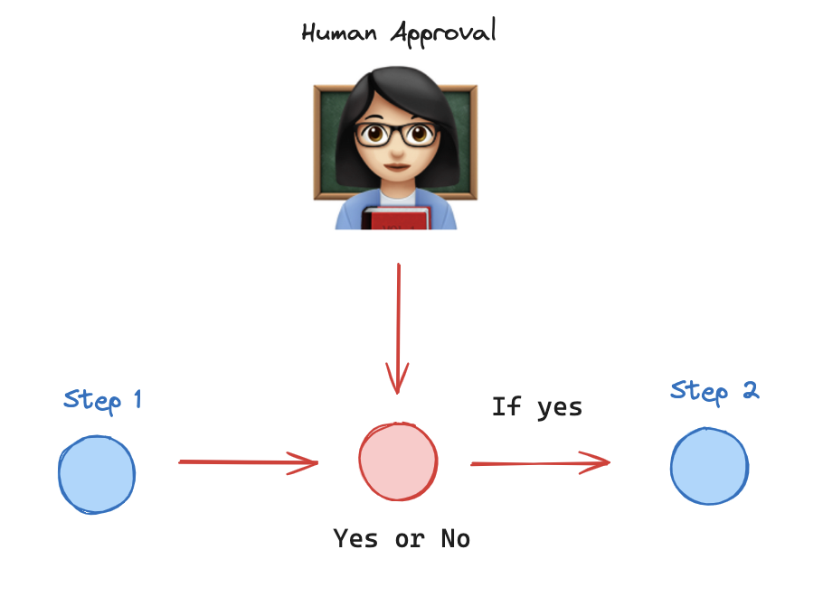
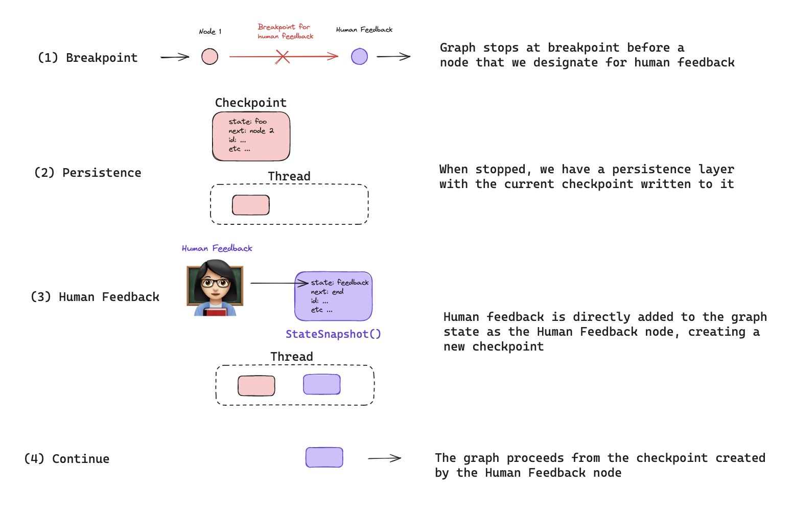
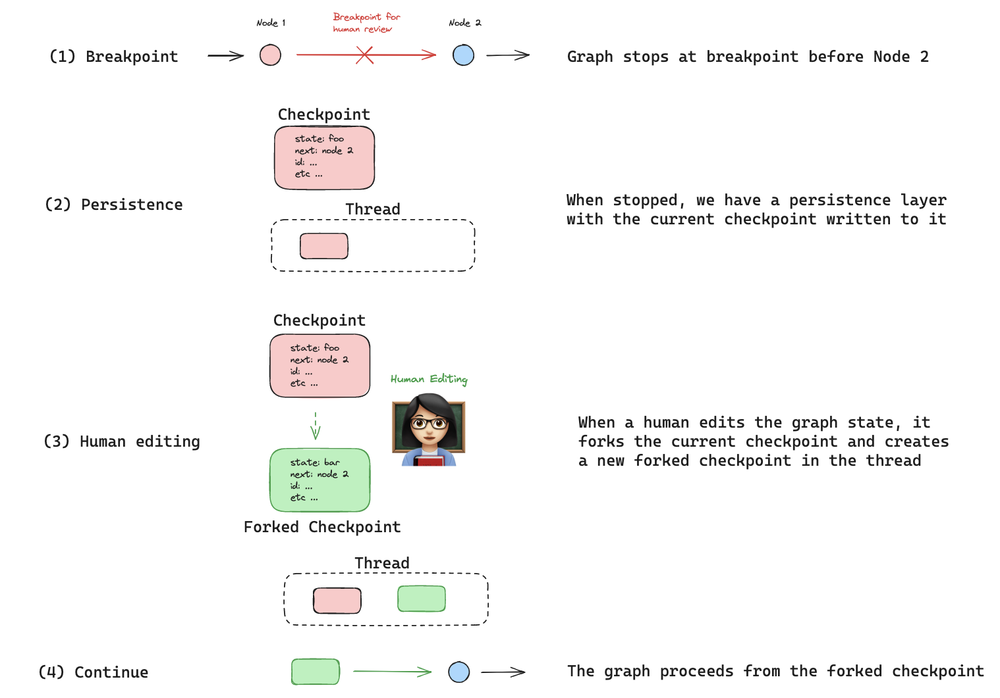

# Human-in-the-loop

Agentic systems often require some human-in-the-loop (or "on-the-loop") interaction patterns. This is because agentic systems are still not very reliable, so having a human involved is required for any sensitive tasks/actions. These are all easily enabled in LangGraph, largely due to built-in [persistence](./persistence.md), implemented via checkpointers.

The reason a checkpointer is necessary is that a lot of these interaction patterns involve running a graph up until a certain point, waiting for some sort of human feedback, and then continuing. When you want to "continue" you will need to access the state of the graph prior to the interrupt. LangGraph persistence enables this by checkpointing the state at every superstep.

There are a few common human-in-the-loop interaction patterns we see emerging.

## Approval

A basic pattern is to have the agent wait for approval before executing certain tools. This may be all tools, or just a subset of tools. This is generally recommend for more sensitive actions (like writing to a database). This can easily be done in LangGraph by setting a [breakpoint](./low_level.md#breakpoints) before specific nodes.

See [this guide](../how-tos/human_in_the_loop/breakpoints.ipynb) for how do this in LangGraph.

## Wait for input

A similar one is to have the agent wait for human input. This can be done by:

1. Create a node specifically for human input
2. Add a breakpoint before the node
3. Get user input
4. Update the state with that user input, acting as that node
5. Resume execution

See [this guide](../how-tos/human_in_the_loop/wait-user-input.ipynb) for how do this in LangGraph.

## Edit agent actions

This is a more advanced interaction pattern. In this interaction pattern the human can actually edit some of the agent's previous decisions. This can be done either during the flow (after a [breakpoint](./low_level.md#breakpoints), part of the [approval](#approval) flow) or after the fact (as part of [time-travel](#time-travel))

See [this guide](../how-tos/human_in_the_loop/edit-graph-state.ipynb) for how do this in LangGraph.

## Time travel

This is a pretty advanced interaction pattern. In this interaction pattern, the human can look back at the list of previous checkpoints, find one they like, optionally [edit it](#edit-agent-actions), and then resume execution from there.

See [this guide](../how-tos/human_in_the_loop/time-travel.ipynb) for how to do this in LangGraph.

## Review Tool Calls

This is a specific type of human-in-the-loop interaction but it's worth calling out because it is so common. A lot of agent decisions are made via tool calling, so having a clear UX for reviewing tool calls is handy.

A tool call consists of:

- The name of the tool to call
- Arguments to pass to the tool

Note that these tool calls can obviously be used for actually calling functions, but they can also be used for other purposes, like to route the agent in a specific direction.
You will want to review the tool call for both of these use cases.

When reviewing tool calls, there are few actions you may want to take.

1. Approve the tool call (and let the agent continue on its way)
2. Manually change the tool call, either the tool name or the tool arguments (and let the agent continue on its way after that)
3. Leave feedback on the tool call. This differs from (2) in that you are not changing the tool call directly, but rather leaving natural language feedback suggesting the LLM call it differently (or call a different tool). You could do this by either adding a `ToolMessage` and having the feedback be the result of the tool call, or by adding a `ToolMessage` (that simulates an error) and then a `HumanMessage` (with the feedback).

See [this guide](../how-tos/human_in_the_loop/review-tool-calls.ipynb) for how to do this in LangGraph.