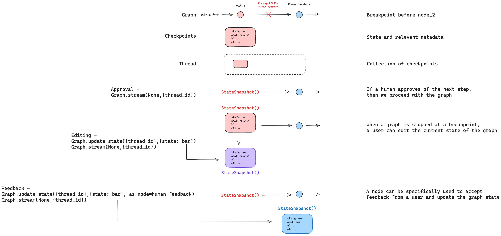

# Human-in-the-loop

Agents often benefit from human-in-the-loop (or "on-the-loop") interaction patterns. There are a few motivations for this:

(1) `Approval` - We can interrupt our agent, surface the current state to a user, and allow the user to accept an action. 

(2) `Editing` - We can interrupt our agent, surface the current state to a user, and allow the user to edit the agent state. 

(3) `Feedback` - We can explicitly create a graph node to collect human feedback and pass that feedback to the agent state.

(4) `Debugging` - We can manually re-play and / or fork past actions of an agent.

All of these interaction patterns are enabled with LangGraph's built-in [persistence](./persistence.md) layer, which will write a checkpoint of the graph state at each step: this is because they all of these interaction patterns involve running a graph up until a certain point (called a [breakpoint](./low_level.md#breakpoints)) and then stopping. Once the graph is stopped, various human-in-the-loop interaction patterns can be implemented as discussed below in detail. 

## Approval

 Sometimes we want to approve certain steps in our agent's execution. We can interrupt our agent at a [breakpoint](./low_level.md#breakpoints), surface the current state to a user, and allow the user to accept an action. This is generally recommend for sensitive actions (e.g., using external API or writing to a database). Using LangGraph's built-in [persistence](./persistence.md) layer allows us to surface the current state to a user, allow them to accept the next step (e.g., a sensitive tool call), and then resume execution of the graph from that breakpoint because the state is persisted.

See [this guide](../how-tos/human_in_the_loop/breakpoints.ipynb) for how do this in LangGraph.

## Editing

 Sometimes we want to edit the agent's state. We can interrupt our agent at a [breakpoint](./low_level.md#breakpoints), surface the current state to a user, and allow the user to edit the agent state. This can, for example, be used to correct the agent if it made a mistake or if we want to alter a tool call. We can edit the graph state by forking a checkpoint and then proceed with the graph from our forked checkpoint.

See [this guide](../how-tos/human_in_the_loop/edit-graph-state.ipynb) for how do this in LangGraph.

### Review Tool Calls

Many agents use [tool calling](https://python.langchain.com/docs/how_to/tool_calling/) to make decisions. Tool calling present a challenge because the agent must get two things right: (1) The name of the tool to call and (2) the arguments to pass to the tool. Because of this, it is sometimes useful to have a human review the tool call to ensure that the agent is calling the correct tool with the correct arguments. When reviewing tool calls, there are few actions to consider, including approval (as noted above), but also manually changing the tool call (tool name or the tool arguments) or leaving feedback on the tool call. The latter can involve leaving natural language feedback suggesting the LLM call it differently (or call a different tool).

See [this guide](../how-tos/human_in_the_loop/review-tool-calls.ipynb) for how to do this in LangGraph.

## Feedback

 Sometimes we want to explicitly collect human feedback at a particular step in the graph. We can explicitly create a graph node to collect human feedback, interrupt our agent at a [breakpoint](./low_level.md#breakpoints) prior to this node, get the user input, and then update the state with that user input, acting as if that node was executed. This is only a minor modification to editing state flow, using `as_node=...` to specify that the state update should be treated as a node.

See [this guide](../how-tos/human_in_the_loop/wait-user-input.ipynb) for how do this in LangGraph.

## Debugging

It's possible both to manually re-play and / or fork past actions of an agent. We cover these concepts [here](https://langchain-ai.github.io/langgraph/concepts/persistence/#replay) and [here](https://langchain-ai.github.io/langgraph/concepts/persistence/#update-state), but they are worth calling out specifically for their relevance to human-in-the-loop debugging.

In addition to the conceptual docs, see [this guide](../how-tos/human_in_the_loop/time-travel.ipynb) for how to do this in LangGraph.

