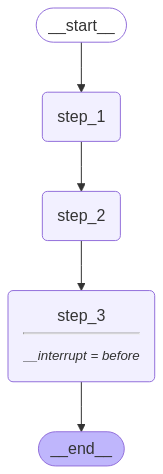

---
search:
  boost: 2
tags:
  - human-in-the-loop
  - hil
  - overview
hide:
  - tags
---

# Human-in-the-loop

To review, edit, and approve tool calls in an agent or workflow, [use LangGraph's human-in-the-loop features](../how-tos/human_in_the_loop/add-human-in-the-loop.md) to enable human intervention at any point in a workflow. This is especially useful in large language model (LLM)-driven applications where model output may require validation, correction, or additional context.

<figure markdown="1">
{: style="max-height:400px"}
</figure>

!!! tip

    For information on how to use human-in-the-loop, see [Enable human intervention](../how-tos/human_in_the_loop/add-human-in-the-loop.md) and [Human-in-the-loop using Server API](../cloud/how-tos/add-human-in-the-loop.md).

## Key capabilities

* **Persistent execution state**: Interrupts use LangGraph's [persistence](./persistence.md) layer, which saves the graph state, to indefinitely pause graph execution until you resume. This is possible because LangGraph checkpoints the graph state after each step, which allows the system to persist execution context and later resume the workflow, continuing from where it left off. This supports asynchronous human review or input without time constraints.

    There are two ways to pause a graph:

    - [Dynamic interrupts](../how-tos/human_in_the_loop/add-human-in-the-loop.md#pause-using-interrupt): Use `interrupt` to pause a graph from inside a specific node, based on the current state of the graph.
    - [Static interrupts](../how-tos/human_in_the_loop/add-human-in-the-loop.md#debug-with-interrupts): Use `interrupt_before` and `interrupt_after` to pause the graph at pre-defined points, either before or after a node executes.

    <figure markdown="1">
    {: style="max-height:400px"}
    <figcaption>An example graph consisting of 3 sequential steps with a breakpoint before step_3. </figcaption> </figure>

* **Flexible integration points**: Human-in-the-loop logic can be introduced at any point in the workflow. This allows targeted human involvement, such as approving API calls, correcting outputs, or guiding conversations.

## Patterns

There are four typical design patterns that you can implement using `interrupt` and `Command`:

- [Approve or reject](../how-tos/human_in_the_loop/add-human-in-the-loop.md#approve-or-reject): Pause the graph before a critical step, such as an API call, to review and approve the action. If the action is rejected, you can prevent the graph from executing the step, and potentially take an alternative action. This pattern often involves routing the graph based on the human's input.
- [Edit graph state](../how-tos/human_in_the_loop/add-human-in-the-loop.md#review-and-edit-state): Pause the graph to review and edit the graph state. This is useful for correcting mistakes or updating the state with additional information. This pattern often involves updating the state with the human's input.
- [Review tool calls](../how-tos/human_in_the_loop/add-human-in-the-loop.md#review-tool-calls): Pause the graph to review and edit tool calls requested by the LLM before tool execution.
- [Validate human input](../how-tos/human_in_the_loop/add-human-in-the-loop.md#validate-human-input): Pause the graph to validate human input before proceeding with the next step.