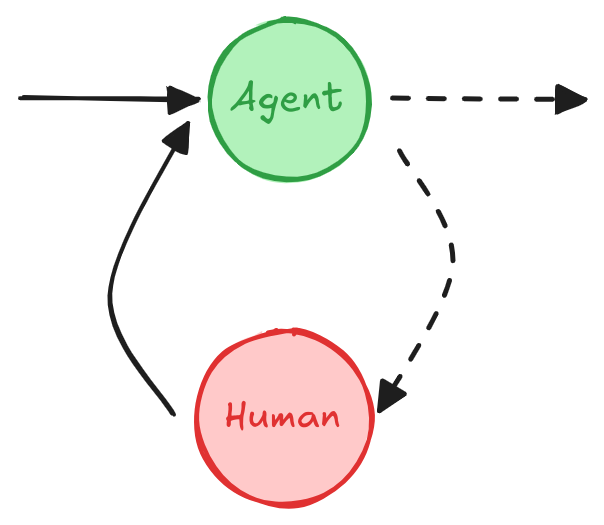

# Human-in-the-loop

!!! tip "This guide uses the new `interrupt` function."

    As of LangGraph 0.2.57, the recommended way to set breakpoints is using the [interrupt](../reference/types.md#langgraph.types.interrupt) function as it significantly simpifies **human-in-the-loop** patterns. Please see the [Breakpoints](breakpoints.md) guide for more information.

    If you're looking for the previous version of this conceptual guide, which relied on static breakpoints and `NodeInterrupt` exception, it is available [here](v0-human-in-the-loop.md). 

A **human-in-the-loop** (or "on-the-loop") workflow integrates human input into automated processes, allowing for decisions, validation, or corrections at key stages. This is especially useful in **LLM-based applications**, where the underlying model may generate occasional inaccuracies. In low-error-tolerance scenarios like compliance, decision-making, or content generation, human involvement ensures reliability by enabling review, correction, or override of model outputs.


## Use cases

Key use cases for **human-in-the-loop** workflows in LLM-based applications include:

1. **🛠️ [Reviewing tool calls](#review-and-edit)**: Humans can review, edit, or approve tool calls requested by the LLM before tool execution.
2. **✅ Validating LLM outputs**: Humans can review, edit, or approve content generated by the LLM.
3. **💡 Providing context**: Enable the LLM to explicitly request human input for clarification or additional details or to support multi-turn conversations.

## Design Patterns

1. **Approval**: Pause the graph before a critical step, such as an API call, to review and approve the action. If the action is rejected, you can prevent the graph from executing the step, and potentially take an alternative action.
2. **Editing**: Pause the graph to review and edit the agent's state. This is useful for correcting mistakes or updating the agent's state.
3. **Input**: Explicitly request human input at a particular step in the graph. This is useful for collecting additional information or context to inform the agent's decision-making process or for supporting **multi-turn conversations**.


### Approval

<figure markdown="1">
{: style="max-height:400px"}
<figcaption>Depending on the human's approval or rejection, the graph can proceed with the action or take an alternative path.</figcaption>
</figure>

Pause the graph before a critical step, such as an API call, to review and approve the action. If the action is rejected, you can prevent the graph from executing the step, and potentially take an alternative action. 

```python
from langgraph.types import interrupt

def human_approval(state: State):
    ...
    is_approved = interrupt(
        {
            "question": "Is this correct?",
            # Surface the output that should be
            # reviewed and approved by the human.
            "llm_output": state["llm_output"]
        }
    )

    if is_approved:
        # Proceed with the action
        ...
    else:
        # Do something else
        ...

# Add the node to the graph in an appropriate location
# and connect it to the relevant nodes.
graph_builder.add_node("human_approval", human_approval)
graph = graph_builder.compile(checkpointer=checkpointer)

...

# After running the graph and hitting the breakpoint, the graph will pause.
# Resume it with either an approval or rejection.
thread_config = {"configurable": {"thread_id": "some_id"}}
graph.invoke(Command(resume=True), config=thread_config)
```


### Edit

<figure markdown="1">
{: style="max-height:400px"}
<figcaption>A human can review and edit the output from the LLM before proceeding. This is particularly
critical in applications where the tool calls requested by the LLM may be sensitive or require human oversight.
</figcaption>
</figure>


```python
from langgraph.types import interrupt

def human_editing(state: State):
    ...
    result = interrupt(
        # Interrupt information to surface to the client.
        # Can be any JSON serializable value.
        {
            "task": "Review the output from the LLM and make any necessary edits.",
            "llm_output": state["llm_output"]
        }
    )

    # Update the state with the edited text
    return {
        "llm_output": result["edited_text"] 
    }

# Add the node to the graph in an appropriate location
# and connect it to the relevant nodes.
graph_builder.add_node("human_editing", human_editing)
graph = graph_builder.compile(checkpointer=checkpointer)

...

# After running the graph and hitting the breakpoint, the graph will pause.
# Resume it with the edited text.
thread_config = {"configurable": {"thread_id": "some_id"}}
graph.invoke(
    Command(resume={"edited_text": "The edited text"}), 
    config=thread_config
)
```

### Multi-turn conversation (Input)

<figure markdown="1">
{: style="max-height:400px"}
<figcaption>A <strong>multi-turn conversation</strong> architecture where an <strong>agent</strong> and <strong>human node</strong> cycle back and forth until the agent decides to hand off the conversation to another agent or another part of the system.
</figcaption>
</figure>

A **multi-turn conversation** involves multiple back-and-forth interactions between an agent and a human, which can allow the agent to gather additional information from the human in a conversational manner.

This design pattern is useful in an LLM application consisting of [multiple agents](./multi_agent.md). One or more agents may need to carry out multi-turn conversations with a human, where the human provides input or feedback at different stages of the conversation. For simplicity, the agent implementation below is illustrated as a single node, but in reality 
it may be part of a larger graph consisting of multiple nodes and include a conditional edge.

```python
from langgraph.types import interrupt

def human_input(state: State):
    human_message = interrupt("human_input")
    return {
        "messages": [
            {
                "role": "human",
                "content": human_message
            }
        ]
    }

def agent(state: State):
    # Agent logic
    ...

graph_builder.add_node("human_input", human_input)
graph_builder.add_edge("human_input", "agent")
graph = graph_builder.compile(checkpointer=checkpointer)


# After running the graph and hitting the breakpoint, the graph will pause.
# Resume it with the human's input.
graph.invoke(
    Command(resume="hello!"),
    config=thread_config
)
```

## Additional Resources 📚

- [**Conceptual Guide: Persistence**](persistence.md#replay): Read the persistence guide for more context on replaying.
- [**Conceptual Guide: Breakpoints**](breakpoints.md): Read the breakpoints guide for more context on breakpoints.
- [**How to Guides: Human-in-the-loop**](../how-tos/index.md#human-in-the-loop): Learn how to implement human-in-the-loop workflows in LangGraph.
