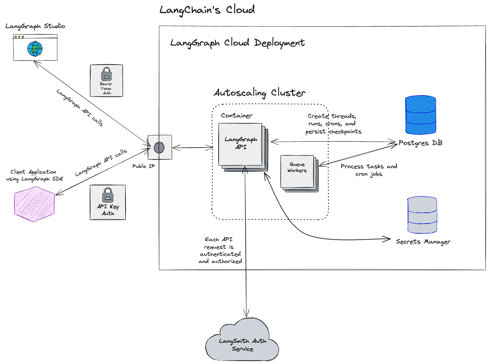

# Cloud SaaS

!!! info "Prerequisites" 
    - [LangGraph Platform](./langgraph_platform.md) 
    - [LangGraph Server](./langgraph_server.md)

## Overview

LangGraph's Cloud SaaS is a managed service for deploying LangGraph Servers, regardless of its definition or dependencies. The service offers managed implementations of checkpointers and stores, allowing you to focus on building the right cognitive architecture for your use case. By handling scalable & secure infrastructure, LangGraph Cloud SaaS offers the fastest path to getting your LangGraph Server deployed to production.

## Deployment

A **deployment** is an instance of a LangGraph Server. A single deployment can have many [revisions](#revision). When a deployment is created, all the necessary infrastructure (e.g. database, containers, secrets store) are automatically provisioned. See the [architecture diagram](#architecture) below for more details.

Resource Allocation:

| **Deployment Type** | **CPU** | **Memory** | **Scaling**         |
|---------------------|---------|------------|---------------------|
| Development         | 1 CPU   | 1 GB       | Up to 1 container   |
| Production          | 2 CPU   | 2 GB       | Up to 10 containers |

CPU and memory resources are per container.

For **Production type** deployments, resources can be manually increased on a case-by-case basis depending on use case and capacity constraints. Contact support@langchain.dev to request an increase in resources.

See the [how-to guide](../cloud/deployment/cloud.md#create-new-deployment) for creating a new deployment.

## Revision

A revision is an iteration of a [deployment](#deployment). When a new deployment is created, an initial revision is automatically created. To deploy new code changes or update environment variable configurations for a deployment, a new revision must be created. When a revision is created, a new container image is built automatically.

See the [how-to guide](../cloud/deployment/cloud.md#create-new-revision) for creating a new revision.

## Persistence

A dedicated database is automatically created for each deployment. The database serves as the [persistence layer](../concepts/persistence.md) for the deployment.

When defining a graph to be deployed to LangGraph Cloud SaaS, a [checkpointer](../concepts/persistence.md#checkpointer-libraries) should not be configured by the user. Instead, a checkpointer is automatically configured for the graph.

There is no direct access to the database. All access to the database occurs through the LangGraph Server APIs.

The database is never deleted until the deployment itself is deleted. See [Automatic Deletion](#automatic-deletion) for additional details.

## Autoscaling
`Production` type deployments automatically scale up to 10 containers. Scaling is based on the current request load for a single container. Specifically, the autoscaling implementation scales the deployment so that each container is processing about 10 concurrent requests. For example... 

- If the deployment is processing 20 concurrent requests, the deployment will scale up from 1 container to 2 containers (20 requests / 2 containers = 10 requests per container).
- If a deployment of 2 containers is processing 10 requests, the deployment will scale down from 2 containers to 1 container (10 requests / 1 container = 10 requests per container).

10 concurrent requests per container is the target threshold. However, 10 concurrent requests per container is not a hard limit. The number of concurrent requests can exceed 10 if there is a sudden burst of requests.

Scale down actions are delayed for 30 minutes before any action is taken. In other words, if the autoscaling implementation decides to scale down a deployment, it will first wait for 30 minutes before scaling down. After 30 minutes, the concurrency metric is recomputed and the deployment will scale down if the concurrency metric has met the target threshold. Otherwise, the deployment remains scaled up. This "cool down" period ensures that deployments do not scale up and down too frequently.

In the future, the autoscaling implementation may evolve to accommodate other metrics such as background run queue size.

## Asynchronous Deployment

Infrastructure for [deployments](#deployment) and [revisions](#revision) are provisioned and deployed asynchronously. They are not deployed immediately after submission. Currently, deployment can take up to several minutes.

- When a new deployment is created, a new database is created for the deployment. Database creation is a one-time step. This step contributes to a longer deployment time for the initial revision of the deployment.
- When a subsequent revision is created for a deployment, there is no database creation step. The deployment time for a subsequent revision is significantly faster compared to the deployment time of the initial revision.
- The deployment process for each revision contains a build step, which can take up to a few minutes.

## LangSmith Integration

A [LangSmith](https://docs.smith.langchain.com/) tracing project is automatically created for each deployemnt. The tracing project has the same name as the deployment. When creating a deployment, the `LANGCHAIN_TRACING` and `LANGSMITH_API_KEY`/`LANGCHAIN_API_KEY` environment variables do not need to be specified; they are set internally, automatically. Traces are created for each run and are emitted to the tracing project automatically.

When a deployment is deleted, the traces and the tracing project are not deleted.

## Automatic Deletion

Deployments are automatically deleted after 28 consecutive days of non-use (it is in an unused state). A deployment is in an unused state if there are no traces emitted to LangSmith from the deployment after 28 consecutive days. On any given day, if a deployment emits a trace to LangSmith, the counter for consecutive days of non-use is reset.

- An email notification is sent after 7 consecutive days of non-use.
- A deployment is deleted after 28 consecutive days of non-use.

!!! danger "Data Cannot Be Recovered"
    After a deployment is deleted, the data (i.e. [persistence](#persistence)) from the deployment cannot be recovered.

## Architecture

!!! warning "Subject to Change"
    The Cloud SaaS deployment architecture may change in the future.

A high-level diagram of a Cloud SaaS deployment.

## Whitelisting IP Addresses

All traffic from `LangGraph Platform` deployments created after January 6th 2025 will come through a NAT gateway.
This NAT gateway will have several static ip addresses depending on the region you are deploying in. Refer to the table below for the list of IP addresses to whitelist:

| US             | EU             |
|----------------|----------------|
| 35.197.29.146  | 34.13.192.67   |
| 34.145.102.123 | 34.147.105.64  |
| 34.169.45.153  | 34.90.22.166   |
| 34.82.222.17   | 34.147.36.213  |
| 35.227.171.135 | 34.32.137.113  | 
| 34.169.88.30   | 34.91.238.184  |
| 34.19.93.202   | 35.204.101.241 |
| 34.19.34.50    | 35.204.48.32   |

## Related

- [Deployment Options](./deployment_options.md)
