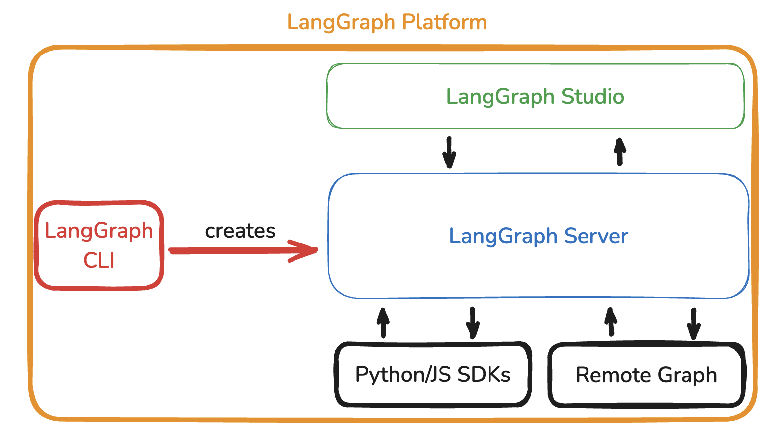

---
search:
  boost: 2
---

# LangGraph Platform

## Overview

LangGraph Platform is a commercial solution for deploying agentic applications to production, built on the open-source [LangGraph framework](./high_level.md).

The LangGraph Platform consists of several components that work together to support the development, deployment, debugging, and monitoring of LangGraph applications:

- [LangGraph Server](./langgraph_server.md): The server defines an opinionated API and architecture that incorporates best practices for deploying agentic applications, allowing you to focus on building your agent logic rather than developing server infrastructure.
- [LangGraph Studio](./langgraph_studio.md): LangGraph Studio is a specialized IDE that can connect to a LangGraph Server to enable visualization, interaction, and debugging of the application locally.
- [LangGraph CLI](./langgraph_cli.md): LangGraph CLI is a command-line interface that helps to interact with a local LangGraph
- [Python/JS SDK](./sdk.md): The Python/JS SDK provides a programmatic way to interact with deployed LangGraph Applications.
- [Remote Graph](../how-tos/use-remote-graph.md): A RemoteGraph allows you to interact with any deployed LangGraph application as though it were running locally.

The LangGraph Platform offers a few different deployment options described in the [deployment options guide](./deployment_options.md).

## Why Use LangGraph Platform?

**LangGraph Platform** handles common issues that arise when deploying LLM applications to production, allowing you to focus on agent logic instead of managing server infrastructure.

- **[Streaming Support](streaming.md)**: As agents grow more sophisticated, they often benefit from streaming both token outputs and intermediate states back to the user. Without this, users are left waiting for potentially long operations with no feedback. LangGraph Server provides [multiple streaming modes](streaming.md) optimized for various application needs.

- **Background Runs**: For agents that take longer to process (e.g., hours), maintaining an open connection can be impractical. The LangGraph Server supports launching agent runs in the background and provides both polling endpoints and webhooks to monitor run status effectively.
 
- **Support for long runs**: Vanilla server setups often encounter timeouts or disruptions when handling requests that take a long time to complete. LangGraph Server’s API provides robust support for these tasks by sending regular heartbeat signals, preventing unexpected connection closures during prolonged processes.

- **Handling Burstiness**: Certain applications, especially those with real-time user interaction, may experience "bursty" request loads where numerous requests hit the server simultaneously. LangGraph Server includes a task queue, ensuring requests are handled consistently without loss, even under heavy loads.

- **[Double Texting](double_texting.md)**: In user-driven applications, it’s common for users to send multiple messages rapidly. This “double texting” can disrupt agent flows if not handled properly. LangGraph Server offers built-in strategies to address and manage such interactions.

- **[Checkpointers and Memory Management](persistence.md#checkpoints)**: For agents needing persistence (e.g., conversation memory), deploying a robust storage solution can be complex. LangGraph Platform includes optimized [checkpointers](persistence.md#checkpoints) and a [memory store](persistence.md#memory-store), managing state across sessions without the need for custom solutions.

- **[Human-in-the-loop Support](human_in_the_loop.md)**: In many applications, users require a way to intervene in agent processes. LangGraph Server provides specialized endpoints for human-in-the-loop scenarios, simplifying the integration of manual oversight into agent workflows.

By using LangGraph Platform, you gain access to a robust, scalable deployment solution that mitigates these challenges, saving you the effort of implementing and maintaining them manually. This allows you to focus more on building effective agent behavior and less on solving deployment infrastructure issues.
