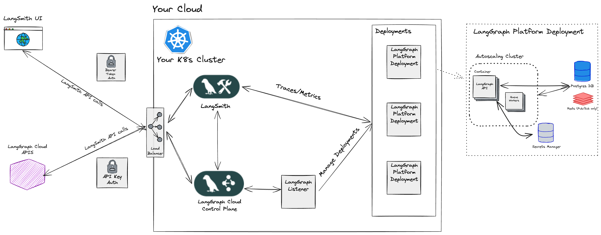

# Self-Hosted Control Plane

There are two versions of the self-hosted deployment: [Self-Hosted Data Plane](./deployment_options.md#self-hosted-data-plane) and [Self-Hosted Control Plane](./deployment_options.md#self-hosted-control-plane).

!!! info "Important"

    The Self-Hosted Control Plane deployment option requires an [Enterprise](plans.md) plan.

## Requirements

- You use the [LangGraph CLI](./langgraph_cli.md) and/or [LangGraph Studio](./langgraph_studio.md) app to test graph locally.
- You use `langgraph build` command to build image.
- You have a Self-Hosted LangSmith instance deployed.
- You are using Ingress for your LangSmith instance. All agents will be deployed as Kubernetes services behind this ingress.

## Self-Hosted Control Plane

The [Self-Hosted Control Plane](./langgraph_self_hosted_control_plane.md) deployment option is a fully self-hosted model for deployment where you manage the [control plane](./langgraph_control_plane.md) and [data plane](./langgraph_data_plane.md) in your cloud. This option gives you full control and responsibility of the control plane and data plane infrastructure.

|                                    | [Control plane](../concepts/langgraph_control_plane.md)                                                                                     | [Data plane](../concepts/langgraph_data_plane.md)                                                                                                   |
| ---------------------------------- | ------------------------------------------------------------------------------------------------------------------------------------------- | --------------------------------------------------------------------------------------------------------------------------------------------------- |
| **What is it?**                    | <ul><li>Control plane UI for creating deployments and revisions</li><li>Control plane APIs for creating deployments and revisions</li></ul> | <ul><li>Data plane "listener" for reconciling deployments with control plane state</li><li>LangGraph Servers</li><li>Postgres, Redis, etc</li></ul> |
| **Where is it hosted?**            | Your cloud                                                                                                                                  | Your cloud                                                                                                                                          |
| **Who provisions and manages it?** | You                                                                                                                                         | You                                                                                                                                                 |

### Architecture

### Compute Platforms

- **Kubernetes**: The Self-Hosted Control Plane deployment option supports deploying control plane and data plane infrastructure to any Kubernetes cluster.

!!! tip
If you would like to enable this on your LangSmith instance, please follow the [Self-Hosted Control Plane deployment guide](../cloud/deployment/self_hosted_control_plane.md).
