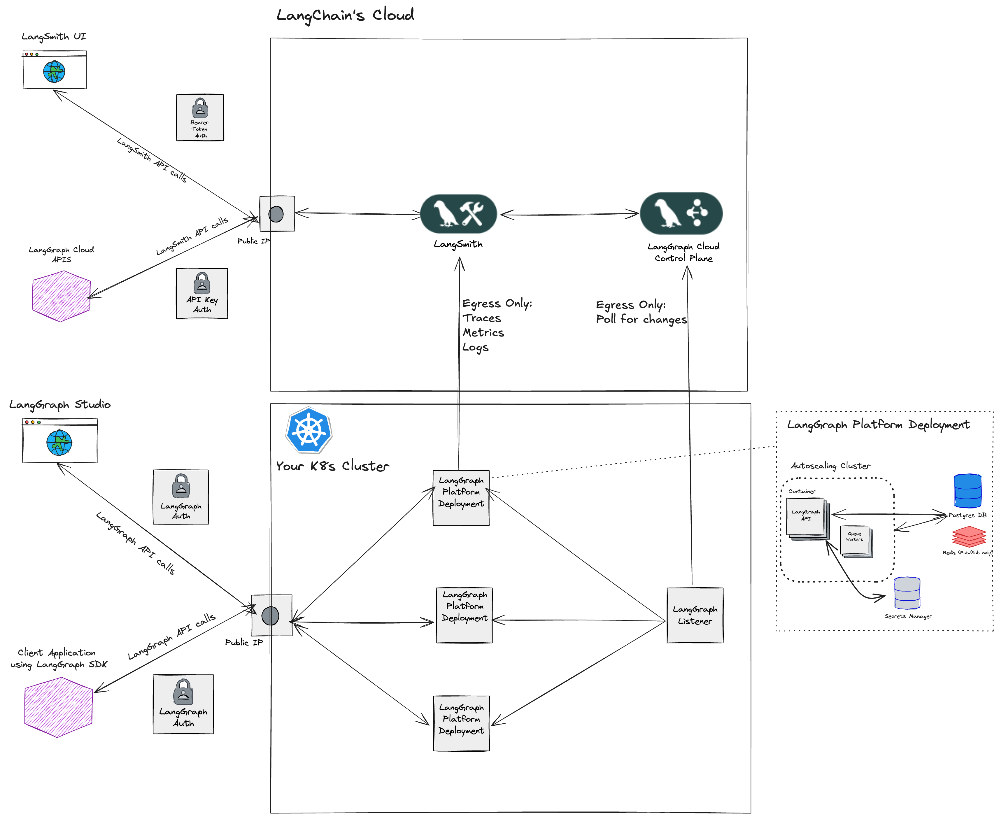

---
search:
  boost: 2
---

# Self-Hosted Data Plane

There are two versions of the self-hosted deployment: [Self-Hosted Data Plane](./deployment_options.md#self-hosted-data-plane) and [Self-Hosted Control Plane](./deployment_options.md#self-hosted-control-plane).

!!! info "Important"

    The Self-Hosted Data Plane deployment option requires an [Enterprise](plans.md) plan.

## Requirements

- You use `langgraph-cli` and/or [LangGraph Studio](./langgraph_studio.md) app to test graph locally.
- You use `langgraph build` command to build image.

## Self-Hosted Data Plane

The [Self-Hosted Data Plane](../cloud/deployment/self_hosted_data_plane.md) deployment option is a "hybrid" model for deployment where we manage the [control plane](./langgraph_control_plane.md) in our cloud and you manage the [data plane](./langgraph_data_plane.md) in your cloud. This option provides a way to securely manage your data plane infrastructure, while offloading control plane management to us. When using the Self-Hosted Data Plane version, you authenticate with a [LangSmith](https://smith.langchain.com/) API key.

|                                    | [Control plane](../concepts/langgraph_control_plane.md)                                                                                     | [Data plane](../concepts/langgraph_data_plane.md)                                                                                                   |
| ---------------------------------- | ------------------------------------------------------------------------------------------------------------------------------------------- | --------------------------------------------------------------------------------------------------------------------------------------------------- |
| **What is it?**                    | <ul><li>Control plane UI for creating deployments and revisions</li><li>Control plane APIs for creating deployments and revisions</li></ul> | <ul><li>Data plane "listener" for reconciling deployments with control plane state</li><li>LangGraph Servers</li><li>Postgres, Redis, etc</li></ul> |
| **Where is it hosted?**            | LangChain's cloud                                                                                                                           | Your cloud                                                                                                                                          |
| **Who provisions and manages it?** | LangChain                                                                                                                                   | You                                                                                                                                                 |

For information on how to deploy a [LangGraph Server](../concepts/langgraph_server.md) to Self-Hosted Data Plane, see [Deploy to Self-Hosted Data Plane](../cloud/deployment/self_hosted_data_plane.md)

### Architecture

### Compute Platforms

- **Kubernetes**: The Self-Hosted Data Plane deployment option supports deploying data plane infrastructure to any Kubernetes cluster.
- **Amazon ECS**: Coming soon!

!!! tip
If you would like to deploy to Kubernetes, you can follow the [Self-Hosted Data Plane deployment guide](../cloud/deployment/self_hosted_data_plane.md).
