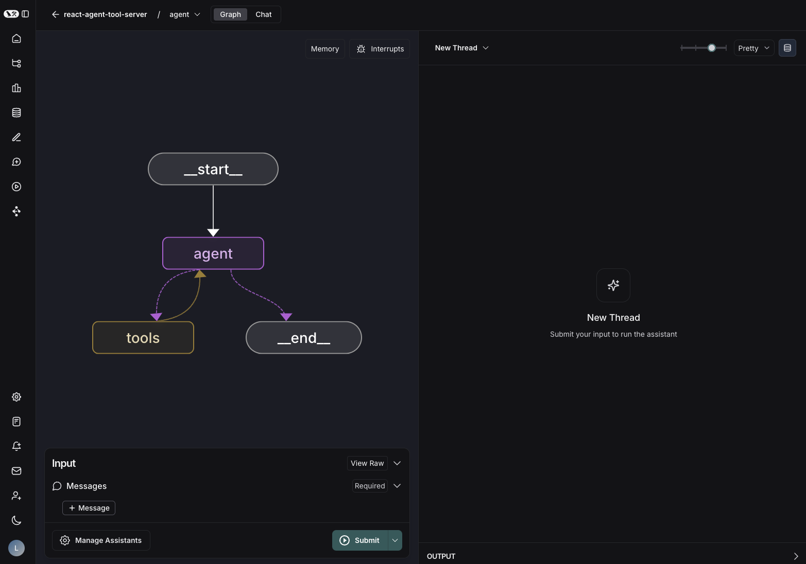

---
search:
  boost: 2
---

# LangGraph Studio

!!! info "Prerequisites"

    - [LangGraph Platform](./langgraph_platform.md)
    - [LangGraph Server](./langgraph_server.md)
    - [LangGraph CLI](./langgraph_cli.md)

LangGraph Studio is a specialized agent IDE that enables visualization, interaction, and debugging of agentic systems that implement the LangGraph Server API protocol. Studio also integrates with LangSmith to enable tracing, evaluation, and prompt engineering.

## Features

Key features of LangGraph Studio:

- Visualize your graph architecture
- [Run and interact with your agent](../cloud/how-tos/invoke_studio.md)
- [Manage assistants](../cloud/how-tos/studio/manage_assistants.md)
- [Manage threads](../cloud/how-tos/threads_studio.md)
- [Iterate on prompts](../cloud/how-tos/iterate_graph_studio.md)
- [Run experiments over a dataset](../cloud/how-tos/studio/run_evals.md)
- Manage [long term memory](memory.md)
- Debug agent state via [time travel](time-travel.md)

LangGraph Studio works for graphs that are deployed on [LangGraph Platform](../cloud/quick_start.md) or for graphs that are running locally via the [LangGraph Server](../tutorials/langgraph-platform/local-server.md).

Studio supports two modes:

### Graph mode

Graph mode exposes the full feature-set of Studio and is useful when you would like as many details about the execution of your agent, including the nodes traversed, intermediate states, and LangSmith integrations (such as adding to datasets and playground).

### Chat mode

Chat mode is a simpler UI for iterating on and testing chat-specific agents. It is useful for business users and those who want to test overall agent behavior. Chat mode is only supported for graph's whose state includes or extends [`MessagesState`](https://langchain-ai.github.io/langgraph/how-tos/graph-api/#messagesstate).

## Learn more

- See this guide on how to [get started](../cloud/how-tos/studio/quick_start.md) with LangGraph Studio.
