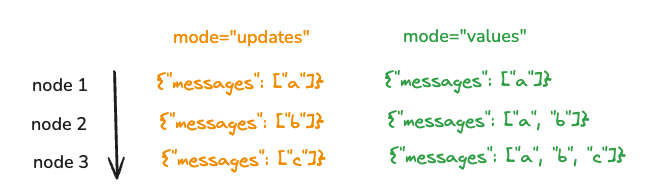

# Low Level Conceptual Guide

## Graphs

At its core, LangGraph models agent workflows as graphs. You define the behavior of your agents using three key components:

1. [`State`](#state): A shared data structure that represents the current snapshot of your application. It can be any Python type, but is typically a `TypedDict` or Pydantic `BaseModel`.

2. [`Nodes`](#nodes): Python functions that encode the logic of your agents. They receive the current `State` as input, perform some computation or side-effect, and return an updated `State`.

3. [`Edges`](#edges): Python functions that determine which `Node` to execute next based on the current `State`. They can be conditional branches or fixed transitions.

By composing `Nodes` and `Edges`, you can create complex, looping workflows that evolve the `State` over time. The real power, though, comes from how LangGraph manages that `State`. To emphasize: `Nodes` and `Edges` are nothing more than Python functions - they can contain an LLM or just good ol' Python code.

In short: _nodes do the work. edges tell what to do next_.

LangGraph's underlying graph algorithm uses [message passing](https://en.wikipedia.org/wiki/Message_passing) to define a general program. When a Node completes its operation, it sends messages along one or more edges to other node(s). These recipient nodes then execute their functions, pass the resulting messages to the next set of nodes, and the process continues. Inspired by Google's [Pregel](https://research.google/pubs/pregel-a-system-for-large-scale-graph-processing/) system, the program proceeds in discrete "super-steps."

A super-step can be considered a single iteration over the graph nodes. Nodes that run in parallel are part of the same super-step, while nodes that run sequentially belong to separate super-steps. At the start of graph execution, all nodes begin in an `inactive` state. A node becomes `active` when it receives a new message (state) on any of its incoming edges (or "channels"). The active node then runs its function and responds with updates. At the end of each super-step, nodes with no incoming messages vote to `halt` by marking themselves as `inactive`. The graph execution terminates when all nodes are `inactive` and no messages are in transit.

### StateGraph

The `StateGraph` class is the main graph class to uses. This is parameterized by a user defined `State` object.

### MessageGraph

The `MessageGraph` class is a special type of graph. The `State` of a `MessageGraph` is ONLY a list of messages. This class is rarely used except for chatbots, as most applications require the `State` to be more complex than a list of messages.

### Compiling your graph

To build your graph, you first define the [state](#state), you then add [nodes](#nodes) and [edges](#edges), and then you compile it. What exactly is compiling your graph and why is it needed?

Compiling is a pretty simple step. It provides a few basic checks on the structure of your graph (no orphaned nodes, etc). It is also where you can specify runtime args like [checkpointers](#checkpointer) and [breakpoints](#breakpoints). You compile your graph by just calling the `.compile` method:

```python
graph = graph_builder.compile(...)
```

You **MUST** compile your graph before you can use it.

## State

The first thing you do when you define a graph is define the `State` of the graph. The `State` consists of the [schema of the graph](#schema) as well as [`reducer` functions](#reducers) which specify how to apply updates to the state. The schema of the `State` will be the input schema to all `Nodes` and `Edges` in the graph, and can be either a `TypedDict` or a `Pydantic` model. All `Nodes` will emit updates to the `State` which are then applied using the specified `reducer` function.

### Schema

The main documented way to specify the schema of a graph is by using `TypedDict`. However, we also support [using a Pydantic BaseModel](../how-tos/state-model.ipynb) as your graph state to add **default values** and additional data validation.

By default, the graph will have the same input and output schemas. If you want to change this, you can also specify explicit input and output schemas directly. This is useful when you have a lot of keys, and some are explicitly for input and others for output. See the [notebook here](../how-tos/input_output_schema.ipynb) for how to use.

By default, all nodes in the graph will share the same state. This means that they will read and write to the same state channels. It is possible to have nodes write to private state channels inside the graph for internal node communication - see [this notebook](../how-tos/pass_private_state.ipynb) for how to do that.

### Reducers

Reducers are key to understanding how updates from nodes are applied to the `State`. Each key in the `State` has its own independent reducer function. If no reducer function is explicitly specified then it is assumed that all updates to that key should override it. There are a few different types of reducers, starting with the default type of reducer:

#### Default Reducer

These two examples show how to use the default reducer:

**Example A:**

```python
from typing import TypedDict

class State(TypedDict):
    foo: int
    bar: list[str]
```

In this example, no reducer functions are specified for any key. Let's assume the input to the graph is `{"foo": 1, "bar": ["hi"]}`. Let's then assume the first `Node` returns `{"foo": 2}`. This is treated as an update to the state. Notice that the `Node` does not need to return the whole `State` schema - just an update. After applying this update, the `State` would then be `{"foo": 2, "bar": ["hi"]}`. If the second node returns `{"bar": ["bye"]}` then the `State` would then be `{"foo": 2, "bar": ["bye"]}`

**Example B:**

```python
from typing import TypedDict, Annotated
from operator import add

class State(TypedDict):
    foo: int
    bar: Annotated[list[str], add]
```

In this example, we've used the `Annotated` type to specify a reducer function (`operator.add`) for the second key (`bar`). Note that the first key remains unchanged. Let's assume the input to the graph is `{"foo": 1, "bar": ["hi"]}`. Let's then assume the first `Node` returns `{"foo": 2}`. This is treated as an update to the state. Notice that the `Node` does not need to return the whole `State` schema - just an update. After applying this update, the `State` would then be `{"foo": 2, "bar": ["hi"]}`. If the second node returns `{"bar": ["bye"]}` then the `State` would then be `{"foo": 2, "bar": ["hi", "bye"]}`. Notice here that the `bar` key is updated by adding the two lists together.

#### Context Reducer

You can use `Context` channels to define shared resources (such as database connections) that are managed outside of your graph's nodes and excluded from checkpointing. The context manager provided to the Context channel is entered before the first step of the graph execution and exited after the last step, allowing you to set up and clean up resources for the duration of the graph invocation. Read this [how to](https://langchain-ai.github.io/langgraph/how-tos/state-context-key) to see an example of using the `Context` channel in your graph.

### Working with Messages in Graph State

#### Why use messages?

Most modern LLM providers have a chat model interface that accepts a list of messages as input. LangChain's [`ChatModel`](https://python.langchain.com/v0.2/docs/concepts/#chat-models) in particular accepts a list of `Message` objects as inputs. These messages come in a variety of forms such as `HumanMessage` (user input) or `AIMessage` (LLM response). To read more about what message objects are, please refer to [this](https://python.langchain.com/v0.2/docs/concepts/#messages) conceptual guide.

#### Using Messages in your Graph

In many cases, it is helpful to store prior conversation history as a list of messages in your graph state. To do so, we can add a key (channel) to the graph state that stores a list of `Message` objects and annotate it with a reducer function (see `messages` key in the example below). The reducer function is vital to telling the graph how to update the list of `Message` objects in the state with each state update (for example, when a node sends an update). If you don't specify a reducer, every state update will overwrite the list of messages with the most recently provided value. If you wanted to simply append messages to the existing list, you could use `operator.add` as a reducer.

However, you might also want to manually update messages in your graph state (e.g. human-in-the-loop). If you were to use `operator.add`, the manual state updates you send to the graph would be appended to the existing list of messages, instead of updating existing messages. To avoid that, you need a reducer that can keep track of message IDs and overwrite existing messages, if updated. To achieve this, you can use the prebuilt `add_messages` function. For brand new messages, it will simply append to existing list, but it will also handle the updates for existing messages correctly.

#### Serialization

In addition to keeping track of message IDs, the `add_messages` function will also try to deserialize messages into LangChain `Message` objects whenever a state update is received on the `messages` channel. See more information on LangChain serialization/deserialization [here](https://python.langchain.com/v0.2/docs/how_to/serialization/). This allows sending graph inputs / state updates in the following format:

```python
# this is supported
{"messages": [HumanMessage(content="message")]}

# and this is also supported
{"messages": [{"type": "human", "content": "message"}]}
```

Since the state updates are always deserialized into LangChain `Messages` when using `add_messages`, you should use dot notation to access message attributes, like `state["messages"][-1].content`. Below is an example of a graph that uses `add_messages` as it's reducer function.

```python
from langchain_core.messages import AnyMessage
from langgraph.graph.message import add_messages
from typing import Annotated, TypedDict

class GraphState(TypedDict):
    messages: Annotated[list[AnyMessage], add_messages]
```

#### MessagesState

Since having a list of messages in your state is so common, there exists a prebuilt state called `MessagesState` which makes it easy to use messages. `MessagesState` is defined with a single `messages` key which is a list of `AnyMessage` objects and uses the `add_messages` reducer. Typically, there is more state to track than just messages, so we see people subclass this state and add more fields, like:

```python
from langgraph.graph import MessagesState

class State(MessagesState):
    documents: list[str]
```

## Nodes

In LangGraph, nodes are typically python functions (sync or `async`) where the **first** positional argument is the [state](#state), and (optionally), the **second** positional argument is a "config", containing optional [configurable parameters](#configuration) (such as a `thread_id`).

Similar to `NetworkX`, you add these nodes to a graph using the [add_node][langgraph.graph.StateGraph.add_node] method:

```python
from langchain_core.runnables import RunnableConfig
from langgraph.graph import StateGraph

builder = StateGraph(dict)


def my_node(state: dict, config: RunnableConfig):
    print("In node: ", config["configurable"]["user_id"])
    return {"results": f"Hello, {state['input']}!"}


# The second argument is optional
def my_other_node(state: dict):
    return state


builder.add_node("my_node", my_node)
builder.add_node("other_node", my_other_node)
...
```

Behind the scenes, functions are converted to [RunnableLambda's](https://api.python.langchain.com/en/latest/runnables/langchain_core.runnables.base.RunnableLambda.html#langchain_core.runnables.base.RunnableLambda), which add batch and async support to your function, along with native tracing and debugging.

If you add a node to graph without specifying a name, it will be given a default name equivalent to the function name.

```python
builder.add_node(my_node)
# You can then create edges to/from this node by referencing it as `"my_node"`
```

### `START` Node

The `START` Node is a special node that represents the node sends user input to the graph. The main purpose for referencing this node is to determine which nodes should be called first.

```python
from langgraph.graph import START

graph.add_edge(START, "node_a")
```

### `END` Node

The `END` Node is a special node that represents a terminal node. This node is referenced when you want to denote which edges have no actions after they are done.

```
from langgraph.graph import END

graph.add_edge("node_a", END)
```

## Edges

Edges define how the logic is routed and how the graph decides to stop. This is a big part of how your agents work and how different nodes communicate with each other. There are a few key types of edges:

- Normal Edges: Go directly from one node to the next.
- Conditional Edges: Call a function to determine which node(s) to go to next.
- Entry Point: Which node to call first when user input arrives.
- Conditional Entry Point: Call a function to determine which node(s) to call first when user input arrives.

A node can have MULTIPLE outgoing edges. If a node has multiple out-going edges, **all** of those destination nodes will be executed in parallel as a part of the next superstep.

### Normal Edges

If you **always** want to go from node A to node B, you can use the [add_edge][langgraph.graph.StateGraph.add_edge] method directly.

```python
graph.add_edge("node_a", "node_b")
```

### Conditional Edges

If you want to **optionally** route to 1 or more edges (or optionally terminate), you can use the [add_conditional_edges][langgraph.graph.StateGraph.add_conditional_edges] method. This method accepts the name of a node and a "routing function" to call after that node is executed:

```python
graph.add_conditional_edges("node_a", routing_function)
```

Similar to nodes, the `routing_function` accept the current `state` of the graph and return a value.

By default, the return value `routing_function` is used as the name of the node (or a list of nodes) to send the state to next. All those nodes will be run in parallel as a part of the next superstep.

You can optionally provide a dictionary that maps the `routing_function`'s output to the name of the next node.

```python
graph.add_conditional_edges("node_a", routing_function, {True: "node_b", False: "node_c"})
```

### Entry Point

The entry point is the first node(s) that are run when the graph starts. You can use the [`add_edge`][langgraph.graph.StateGraph.add_edge] method from the virtual [`START`][start] node to the first node to execute to specify where to enter the graph.

```python
from langgraph.graph import START

graph.add_edge(START, "node_a")
```

### Conditional Entry Point

A conditional entry point lets you start at different nodes depending on custom logic. You can use [`add_conditional_edges`][langgraph.graph.StateGraph.add_conditional_edges] from the virtual [`START`][start] node to accomplish this.

```python
from langgraph.graph import START

graph.add_conditional_edges(START, routing_function)
```

You can optionally provide a dictionary that maps the `routing_function`'s output to the name of the next node.

```python
graph.add_conditional_edges(START, routing_function, {True: "node_b", False: "node_c"})
```

## `Send`

By default, `Nodes` and `Edges` are defined ahead of time and operate on the same shared state. However, there can be cases where the exact edges are not known ahead of time and/or you may want different versions of `State` to exist at the same time. A common of example of this is with `map-reduce` design patterns. In this design pattern, a first node may generate a list of objects, and you may want to apply some other node to all those objects. The number of objects may be unknown ahead of time (meaning the number of edges may not be known) and the input `State` to the downstream `Node` should be different (one for each generated object).

To support this design pattern, LangGraph supports returning [`Send`](../reference/graphs.md#send) objects from conditional edges. `Send` takes two arguments: first is the name of the node, and second is the state to pass to that node.

```python
def continue_to_jokes(state: OverallState):
    return [Send("generate_joke", {"subject": s}) for s in state['subjects']]

graph.add_conditional_edges("node_a", continue_to_jokes)
```

## Checkpointer

LangGraph has a built-in persistence layer, implemented through [checkpointers][basecheckpointsaver]. When you use a checkpointer with a graph, you can interact with the state of that graph. When you use a checkpointer with a graph, you can interact with and manage the graph's state. The checkpointer saves a _checkpoint_ of the graph state at every super-step, enabling several powerful capabilities:

First, checkpointers facilitate [human-in-the-loop workflows](agentic_concepts.md#human-in-the-loop) workflows by allowing humans to inspect, interrupt, and approve steps.Checkpointers are needed for these workflows as the human has to be able to view the state of a graph at any point in time, and the graph has to be to resume execution after the human has made any updates to the state.

Second, it allows for ["memory"](agentic_concepts.md#memory) between interactions. You can use checkpointers to create threads and save the state of a thread after a graph executes. In the case of repeated human interactions (like conversations) any follow up messages can be sent to that checkpoint, which will retain its memory of previous ones.

See [this guide](../how-tos/persistence.ipynb) for how to add a checkpointer to your graph.

## Threads

Threads enable the checkpointing of multiple different runs, making them essential for multi-tenant chat applications and other scenarios where maintaining separate states is necessary. A thread is a unique ID assigned to a series of checkpoints saved by a checkpointer. When using a checkpointer, you must specify a `thread_id` or `thread_ts` when running the graph.

`thread_id` is simply the ID of a thread. This is always required

`thread_ts` can optionally be passed. This identifier refers to a specific checkpoint within a thread. This can be used to kick of a run of a graph from some point halfway through a thread.

You must pass these when invoking the graph as part of the configurable part of the config.

```python
config = {"configurable": {"thread_id": "a"}}
graph.invoke(inputs, config=config)
```

See [this guide](../how-tos/persistence.ipynb) for how to use threads.

## Checkpointer state

 When interacting with the checkpointer state, you must specify a [thread identifier](#threads).Each checkpoint saved by the checkpointer has two properties:

- **values**: This is the value of the state at this point in time.
- **next**: This is a tuple of the nodes to execute next in the graph.

### Get state

You can get the state of a checkpointer by calling `graph.get_state(config)`. The config should contain `thread_id`, and the state will be fetched for that thread.

### Get state history

You can also call `graph.get_state_history(config)` to get a list of the history of the graph. The config should contain `thread_id`, and the state history will be fetched for that thread.

### Update state

You can also interact with the state directly and update it. This takes three different components:

- config
- values
- `as_node`

**config**

The config should contain `thread_id` specifying which thread to update.

**values**

These are the values that will be used to update the state. Note that this update is treated exactly as any update from a node is treated. This means that these values will be passed to the [reducer](#reducers) functions that are part of the state. So this does NOT automatically overwrite the state. Let's walk through an example.

Let's assume you have defined the state of your graph as:

```python
from typing import TypedDict, Annotated
from operator import add

class State(TypedDict):
    foo: int
    bar: Annotated[list[str], add]
```

Let's now assume the current state of the graph is

```
{"foo": 1, "bar": ["a"]}
```

If you update the state as below:

```
graph.update_state(config, {"foo": 2, "bar": ["b"]})
```

Then the new state of the graph will be:

```
{"foo": 2, "bar": ["a", "b"]}
```

The `foo` key is completely changed (because there is no reducer specified for that key, so it overwrites it). However, there is a reducer specified for the `bar` key, and so it appends `"b"` to the state of `bar`.

**`as_node`**

The final thing you specify when calling `update_state` is `as_node`. This update will be applied as if it came from node `as_node`. If `as_node` is not provided, it will be set to the last node that updated the state, if not ambiguous.

The reason this matters is that the next steps in the graph to execute depend on the last node to have given an update, so this can be used to control which node executes next.

## Graph Migrations

LangGraph can easily handle migrations of graph definitions (nodes, edges, and state) even when using a checkpointer to track state.

- For threads at the end of the graph (i.e. not interrupted) you can change the entire topology of the graph (i.e. all nodes and edges, remove, add, rename, etc)
- For threads currently interrupted, we support all topology changes other than renaming / removing nodes (as that thread could now be about to enter a node that no longer exists) -- if this is a blocker please reach out and we can prioritize a solution.
- For modifying state, we have full backwards and forwards compatibility for adding and removing keys
- State keys that are renamed lose their saved state in existing threads
- State keys whose types change in incompatible ways could currently cause issues in threads with state from before the change -- if this is a blocker please reach out and we can prioritize a solution.

## Configuration

When creating a graph, you can also mark that certain parts of the graph are configurable. This is commonly done to enable easily switching between models or system prompts. This allows you to create a single "cognitive architecture" (the graph) but have multiple different instance of it.

You can optionally specify a `config_schema` when creating a graph.

```python
class ConfigSchema(TypedDict):
    llm: str

graph = StateGraph(State, config_schema=ConfigSchema)
```

You can then pass this configuration into the graph using the `configurable` config field.

```python
config = {"configurable": {"llm": "anthropic"}}

graph.invoke(inputs, config=config)
```

You can then access and use this configuration inside a node:

```python
def node_a(state, config):
    llm_type = config.get("configurable", {}).get("llm", "openai")
    llm = get_llm(llm_type)
    ...
```

See [this guide](../how-tos/configuration.ipynb) for a full breakdown on configuration.

### Recursion Limit

The recursion limit sets the maximum number of [super-steps](#graphs) the graph can execute during a single execution. Once the limit is reached, LangGraph will raise `GraphRecursionError`. By default this value is set to 25 steps. The recursion limit can be set on any graph at runtime, and is passed to `.invoke`/`.stream` via the config dictionary. Importantly, `recursion_limit` is a standalone `config` key and should not be passed inside the `configurable` key as all other user-defined configuration. See the example below:

```python
graph.invoke(inputs, config={"recursion_limit": 5, "configurable":{"llm": "anthropic"}})
```

Read [this how-to](https://langchain-ai.github.io/langgraph/how-tos/recursion-limit/) to learn more about how the recursion limit works.

## Breakpoints

It can often be useful to set breakpoints before or after certain nodes execute. This can be used to wait for human approval before continuing. These can be set when you ["compile" a graph](#compiling-your-graph). You can set breakpoints either _before_ a node executes (using `interrupt_before`) or after a node executes (using `interrupt_after`.)

You **MUST** use a [checkpoiner](#checkpointer) when using breakpoints. This is because your graph needs to be able to resume execution.

In order to resume execution, you can just invoke your graph with `None` as the input.

```python
# Initial run of graph
graph.invoke(inputs, config=config)

# Let's assume it hit a breakpoint somewhere, you can then resume by passing in None
graph.invoke(None, config=config)
```

See [this guide](../how-tos/human_in_the_loop/breakpoints.ipynb) for a full walkthrough of how to add breakpoints.

## Visualization

It's often nice to be able to visualize graphs, especially as they get more complex. LangGraph comes with several built-in ways to visualize graphs. See [this how-to guide](../how-tos/visualization.ipynb) for more info.

## Streaming

LangGraph is built with first class support for streaming. There are several different ways to stream back results

### `.stream` and `.astream`

`.stream` and `.astream` are sync and async methods for streaming back results.
There are several different modes you can specify when calling these methods (e.g. `graph.stream(..., mode="...")):

- [`"values"`](../how-tos/stream-values.ipynb): This streams the full value of the state after each step of the graph.
- [`"updates"`](../how-tos/stream-updates.ipynb): This streams the updates to the state after each step of the graph. If multiple updates are made in the same step (e.g. multiple nodes are run) then those updates are streamed separately.
- `"debug"`: This streams as much information as possible throughout the execution of the graph.

The below visualization shows the difference between the `values` and `updates` modes:




### `.astream_events` (for streaming tokens of LLM calls)

In addition, you can use the [`astream_events`](../how-tos/streaming-events-from-within-tools.ipynb) method to stream back events that happen _inside_ nodes. This is useful for [streaming tokens of LLM calls](../how-tos/streaming-tokens.ipynb).

This is a standard method on all [LangChain objects](https://python.langchain.com/v0.2/docs/concepts/#runnable-interface). This means that as the graph is executed, certain events are emitted along the way and can be seen if you run the graph using `.astream_events`. 

All events have (among other things) `event`, `name`, and `data` fields. What do these mean?

- `event`: This is the type of event that is being emitted. You can find a detailed table of all callback events and triggers [here](https://python.langchain.com/v0.2/docs/concepts/#callback-events).
- `name`: This is the name of event.
- `data`: This is the data associated with the event.

What types of things cause events to be emitted?

* each node (runnable) emits `on_chain_start` when it starts execution, `on_chain_stream` during the node execution and `on_chain_end` when the node finishes. Node events will have the node name in the event's `name` field
* the graph will emit `on_chain_start` in the beginning of the graph execution, `on_chain_stream` after each node execution and `on_chain_end` when the graph finishes. Graph events will have the `LangGraph` in the event's `name` field
* Any writes to state channels (i.e. anytime you update the value of one of your state keys) will emit `on_chain_start` and `on_chain_end` events

Additionally, any events that are created inside your nodes (LLM events, tool events, manually emitted events, etc.) will also be visible in the output of `.astream_events`.

To make this more concrete and to see what this looks like, let's see what events are returned when we run a simple graph:

```python
from langchain_openai import ChatOpenAI
from langgraph.graph import StateGraph, MessagesState, START, END

model = ChatOpenAI(model="gpt-3.5-turbo")


def call_model(state: MessagesState):
    response = model.invoke(state['messages'])
    return {"messages": response}

workflow = StateGraph(MessagesState)
workflow.add_node(call_model)
workflow.add_edge(START, "call_model")
workflow.add_edge("call_model", END)
app = workflow.compile()

inputs = [{"role": "user", "content": "hi!"}]
async for event in app.astream_events({"messages": inputs}, version="v2"):
    kind = event["event"]
    print(f"{kind}: {event['name']}")
```
```shell
on_chain_start: LangGraph
on_chain_start: __start__
on_chain_end: __start__
on_chain_start: call_model
on_chat_model_start: ChatOpenAI
on_chat_model_stream: ChatOpenAI
on_chat_model_stream: ChatOpenAI
on_chat_model_stream: ChatOpenAI
on_chat_model_stream: ChatOpenAI
on_chat_model_stream: ChatOpenAI
on_chat_model_stream: ChatOpenAI
on_chat_model_stream: ChatOpenAI
on_chat_model_stream: ChatOpenAI
on_chat_model_stream: ChatOpenAI
on_chat_model_stream: ChatOpenAI
on_chat_model_stream: ChatOpenAI
on_chat_model_end: ChatOpenAI
on_chain_start: ChannelWrite<call_model,messages>
on_chain_end: ChannelWrite<call_model,messages>
on_chain_stream: call_model
on_chain_end: call_model
on_chain_stream: LangGraph
on_chain_end: LangGraph
```

We start with the overall graph start (`on_chain_start: LangGraph`). We then write to the `__start__` node (this is special node to handle input).
We then start the `call_model` node (`on_chain_start: call_model`). We then start the chat model invocation (`on_chat_model_start: ChatOpenAI`),
stream back token by token (`on_chat_model_stream: ChatOpenAI`) and then finish the chat model (`on_chat_model_end: ChatOpenAI`). From there, 
we write the results back to the channel (`ChannelWrite<call_model,messages>`) and then finish the `call_model` node and then the graph as a whole.

This should hopefully give you a good sense of what events are emitted in a simple graph. But what data do these events contain?
Each type of event contains data in a different format. Let's look at what `on_chat_model_stream` events look like. This is an important type of event
since it is needed for streaming tokens from an LLM response.

These events look like:

```shell
{'event': 'on_chat_model_stream',
 'name': 'ChatOpenAI',
 'run_id': '3fdbf494-acce-402e-9b50-4eab46403859',
 'tags': ['seq:step:1'],
 'metadata': {'langgraph_step': 1,
  'langgraph_node': 'call_model',
  'langgraph_triggers': ['start:call_model'],
  'langgraph_task_idx': 0,
  'checkpoint_id': '1ef657a0-0f9d-61b8-bffe-0c39e4f9ad6c',
  'checkpoint_ns': 'call_model',
  'ls_provider': 'openai',
  'ls_model_name': 'gpt-3.5-turbo',
  'ls_model_type': 'chat',
  'ls_temperature': 0.7},
 'data': {'chunk': AIMessageChunk(content='Hello', id='run-3fdbf494-acce-402e-9b50-4eab46403859')},
 'parent_ids': []}
```
We can see that we have the event type and name (which we knew from before).

We also have a bunch of stuff in metadata. Noticeably, `'langgraph_node': 'call_model',` is some really helpful information
which tells us which node this model was invoked inside of.

Finally, `data` is a really important field. This contains the actual data for this event! Which in this case
is an AIMessageChunk. This contains the `content` for the message, as well as an `id`.
This is the ID of the overall AIMessage (not just this chunk) and is super helpful - it helps
us track which chunks are part of the same message (so we can show them together in the UI).

This information contains all that is needed for creating a UI for streaming LLM tokens. You can see a 
guide for that [here](../how-tos/streaming-tokens.ipynb).


!!! warning "ASYNC IN PYTHON<=3.10"
    You may fail to see events being emitted from inside a node when using `.astream_events` in Python <= 3.10. If you're using a Langchain RunnableLambda, a RunnableGenerator, or Tool asynchronously inside your node, you will have to propagate callbacks to these objects manually. This is because LangChain cannot automatically propagate callbacks to child objects in this case. Please see examples [here](../how-tos/streaming-content.ipynb) and [here](../how-tos/streaming-events-from-within-tools.ipynb).

#### Only stream tokens from specific nodes/LLMs


There are certain cases where you have multiple nodes in your graph that make LLM calls, and you do not wish to stream the tokens from every single LLM call. For example, you may use one LLM as a planner for the next steps to take, and onther LLM somewhere else in the graph that actually responds to the user. In that case, you most likely WON'T want to stream tokens from the planner LLM but WILL want to stream them from the respond to user LLM. Below we show two different ways of doing this, one by streaming from specific nodes only and the second by streaming from specific LLMs only.

First, let's define our graph:

```python
from langchain_openai import ChatOpenAI
from langgraph.graph import StateGraph, MessagesState, START, END

model_1 = ChatOpenAI(model="gpt-3.5-turbo", name="model_1")
model_2 = ChatOpenAI(model="gpt-3.5-turbo", name="model_2")

def call_first_model(state: MessagesState):
    response = model_1.invoke(state['messages'])
    return {"messages": response}

def call_second_model(state: MessagesState):
    response = model_2.invoke(state['messages'])
    return {"messages": response}

workflow = StateGraph(MessagesState)
workflow.add_node(call_first_model)
workflow.add_node(call_second_model)
workflow.add_edge(START, "call_first_model")
workflow.add_edge("call_first_model", "call_second_model")
workflow.add_edge("call_second_model", END)
app = workflow.compile()
```

**Streaming from specific node**

In the case that we only want the output from a single node, we can use the event metadata to filter node names:

```python
inputs = [{"role": "user", "content": "hi!"}]

async for event in app.astream_events({"messages": inputs}, version="v2"):
    # Get chat model tokens from a particular node 
    if event["event"] == "on_chat_model_stream" and event['metadata'].get('langgraph_node','') == "call_second_model":
     print(event["data"]["chunk"].content, end="|", flush=True)
```

```shell
|Hello|!| How| can| I| help| you| today|?||
```

As we can see only the response from the second LLM was streamed (you can tell because we only received a single response, if we had streamed both we would have received two "Hello! How can I help you today?" messages).

**Streaming from specific LLM**

Sometimes you might want to stream from specific LLMs instead of specific nodes. This could be the case if you have multiple LLM calls inside a single node, and only want to stream the output of a specific one or if you use the same LLM in different nodes and want to stream it's output anytime it is called. We can do this by using the `name` parameter for LLMs and events:

```python
inputs = [{"role": "user", "content": "hi!"}]
async for event in app.astream_events({"messages": inputs}, version="v2"):
    # Get chat model tokens from a particular LLM inside a particular node
    if event["event"] == "on_chat_model_stream" and event['name'] == "model_2":
        print(event["data"]["chunk"].content, end="|", flush=True)
```

```shell
|Hello|!| How| can| I| assist| you| today|?||
```

As expected, we only see a single LLM response since the response from `model_1` was not streamed. 