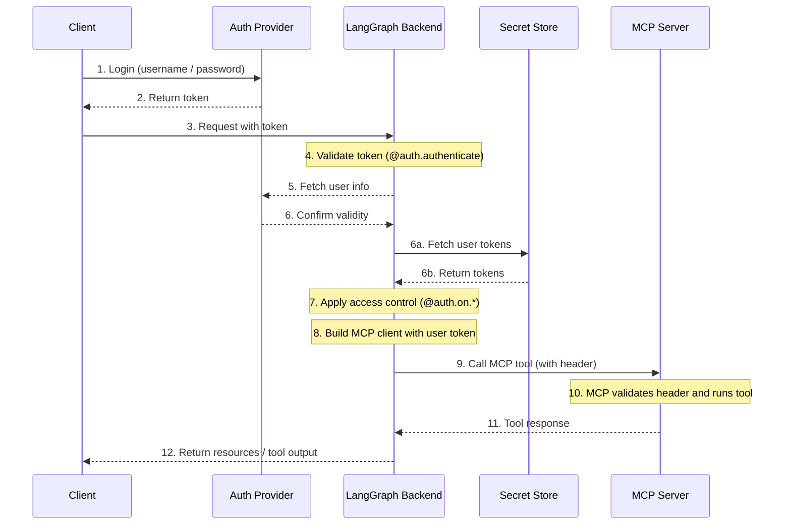

# MCP

[Model Context Protocol (MCP)](https://modelcontextprotocol.io/introduction) is an open protocol that standardizes how applications provide tools and context to language models. LangGraph agents can use tools defined on MCP servers through the `langchain-mcp-adapters` library.


Install the `langchain-mcp-adapters` library to use MCP tools in LangGraph:

```bash
pip install langchain-mcp-adapters
```

## Authenticate to an MCP server

You can set up [custom authentication middleware](../how-tos/auth/custom_auth.md) to authenticate a user with an MCP server to get access to user-scoped tools within your LangGraph Platform deployment. 

!!! note
    Custom authentication is a LangGraph Platform feature.

An example architecture for this flow:



For more information, see [MCP endpoint in LangGraph Server](../concepts/server-mcp.md#use-user-scoped-mcp-tools-in-your-deployment).

