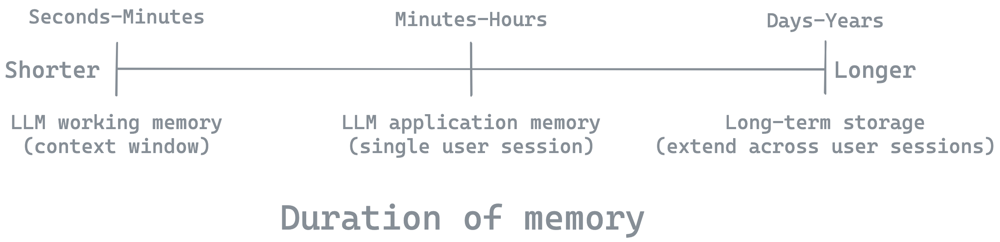

# Memory

## What is Memory?

Memory refers to the processing of data from the past to make it more useful for an application. Examples include:

- Managing what messages (e.g., from a long message history) are sent to a chat model;
- Summarizing or distilling past conversations or other information to inform chat model responses;
- Personalizing applications with structured information (e.g., about a specific user) gleaned from previous conversations to inform chat model responses.

These features are commonly used to accommodate restricted chat model context windows, manage latency and costs,
and to improve the quality or personalization of an application's output.

## Timescales of memory  



AI systems can utilize different types of memory, each operating on different timescales and serving distinct purposes:

**1. LLM Working Memory**
* Mechanism: LLM context window
* Timescale: Single LLM invocation (typically seconds to minutes)
* Purpose: Holds immediate context for processing and generating responses

**2. Short-term Application Memory**
* Mechanism: In-memory data structures (e.g., message history, session variables)
* Timescale: Duration of a user session or application runtime (minutes to hours)
* Purpose: Maintains conversation context and temporary application state

**3. Long-term Application Memory**
* Mechanism: Persistent storage (e.g., databases, file systems)
* Timescale: Extends beyond individual sessions (days to years)
* Purpose: Stores user data, learned information, and application state across multiple interactions

## LLM Working Memory

### Motivation

Chat models utilize context to inform their responses, which is why they have context windows that allow for the insertion of external information through [messages](https://python.langchain.com/docs/concepts/#messages). These messages serve as instructions and provide the model's working memory during inference time. This working memory is [analogous to RAM](https://x.com/karpathy/status/1723140519554105733) in traditional computing systems, as it represents the tokens immediately available to the LLM for processing and generating responses. Various techniques such as in-context learning, few-shot learning, and chain-of-thought reasoning, enable the model to adapt and perform tasks based on the provided information without changing its underlying parameters.

### Approaches 

**Few shot learning**

Few-shot learning is a powerful technique where LLMs can be "programmed" inside the prompt with input-output examples to perform diverse tasks. This was one of the most exciting results demonstrated in the [GPT-3 paper](https://x.com/karpathy/status/1627366413840322562).

**Reasoning prompts**

Chain of Thought (CoT) and related prompting techniques have shown that an LLM's reasoning capabilities can be significantly improved by guiding its thought process. These approaches encourage the model to break down complex problems into steps and [reason over time](https://www.youtube.com/watch?v=bZQun8Y4L2A&t=1533s), often leading to more accurate and explainable outputs.

**Conditioning generations with external information**

RAG (Retrieval Augmented Generation) is a technique that allows LLMs to condition their generations using external information. 

### Use-cases

**Few shot learning**

Few-shot prompting involves including example model inputs and desired outputs in the model prompt, which can greatly boost model performance on a wide range of tasks without the need to fine-tune. See our blog and documentation on [few-shot example selection](https://blog.langchain.dev/dynamic-few-shot-examples-langsmith-datasets/).

**Reasoning prompts**

Nearly all [LLM-powered agents](https://lilianweng.github.io/posts/2023-06-23-agent/#component-one-planning) utilize planning to decompose complex tasks into simpler steps. Promoting techniques that encourage agents to decompose tasks and reflect on past steps have become very common. See our detailed guide on agent [architectures and approaches](https://langchain-ai.github.io/langgraph/concepts/agentic_concepts/). 

**Conditioning generations with external information**

RAG is particularly useful when the LLM's working memory is limited or when the application requires access to a specific knowledge base. It can be more cost effective than fine-tuning. See our course on [RAG](https://www.youtube.com/watch?v=sVcwVQRHIc8) and [associated code examples](https://github.com/langchain-ai/rag-from-scratch).

## Short-term application memory

### Motivation

Applications that use chat models can range from RAG to agents. In most cases, the application will use some form of in-memory data structure to store the interactions with the chat model. Frequently this data structure is a list of chat [messages](https://python.langchain.com/docs/concepts/#messages), often alternating between user messages and model responses. These messages persist for the duration of a user session or [application runtime](https://github.com/langchain-ai/langgraph/discussions/352#discussioncomment-9291220) (minutes to hours). Because context windows are limited and tokens cost both time and money, applications must frequently manage memory.    

### Approaches    

**Trimming and filtering messages**

LangChain provides some useful general utilities for trimming or deleting messages from a messages list. As an example, we can use [`trim_messages`](https://python.langchain.com/v0.2/docs/how_to/trim_messages/#getting-the-last-max_tokens-tokens) to trim messages based upon a specific number of tokens. 

```python
# Get the last max_tokens in the list of Messages 
trim_messages(
            messages,
            max_tokens=100,
            strategy="last", 
            token_counter=ChatOpenAI(model="gpt-4o"),
        )
```

As a second example, [RemoveMessage](https://langchain-ai.github.io/langgraph/how-tos/memory/delete-messages/#manually-deleting-messages) can be used to remove messages from a list by message id.

```python
from langchain_core.messages import RemoveMessage

# Message list
messages = [AIMessage("Hi.", name="Bot", id="1")]
messages.append(HumanMessage("Hi.", name="Lance", id="2"))
messages.append(AIMessage("So you said you were researching ocean mammals?", name="Bot", id="3"))
messages.append(HumanMessage("Yes, I know about whales. But what others should I learn about?", name="Lance", id="4"))

# Isolate messages to delete
delete_messages = [RemoveMessage(id=m.id) for m in messages[:-2]]
print(delete_messages)
[RemoveMessage(content='', id='1'), RemoveMessage(content='', id='2')]
```

Building on these examples, LangGraph has various built-in utilities for working with messages in your application. [MessagesState](https://langchain-ai.github.io/langgraph/concepts/low_level/#working-with-messages-in-graph-state) is a built-in graph state schema that includes a `messages` key for a list of messages and a built-in `add_messages` reducer for updating that messages list. The `add_messages` reducer allows us to [append](https://github.com/langchain-ai/langchain-academy/blob/main/module-2/state-reducers.ipynb) messages and, additionally, [works with the `RemoveMessage` utility to remove messages from the list](https://langchain-ai.github.io/langgraph/how-tos/memory/delete-messages/). 

```python
from langgraph.graph.message import add_messages
# Using messages and delete_messages defined above
add_messages(messages , delete_messages)
```

**Summarizing messages**

The problem with trimming messages is that we may be too aggressive and remove important information. Instead, we can create a running summary of the chat history to reduce the number of tokens while simply compressing the prior into the running summary. In the context of a simple chain, [here](https://python.langchain.com/docs/how_to/chatbots_memory/#summary-memory) is an example of how to summarize messages. In the context of a more complex LangGraph agent, [here](https://github.com/langchain-ai/langchain-academy/blob/main/module-2/chatbot-summarization.ipynb) is an example chatbot that uses message summarization to sustain long-running conversations. In both cases, we're simply prompting the LLM to summarize the chat history into a running summary. 

### Use-cases

**Trimming, filtering, summarizing messages**

A primary application enabled by is long-running chatbots. See our LangChain Academy course [focused on building agents with LangGraph](https://github.com/langchain-ai/langchain-academy/blob/main/module-2/trim-filter-messages.ipynb) for a concrete example of a chatbot that uses trimming, filtering, and summarizing to manage memory.

## Long-term application memory

### Motivation

Short-term memory is typically limited to an individual user session or [graph execution](https://github.com/langchain-ai/langgraph/discussions/352#discussioncomment-9291220). However, applications may require long-term memory to store user data, learned information, and application state across multiple interactions. 

### Approaches

**Using prompt caching**

Several different model providers offer prompt caching. This allows particular messages, such as a system message with a large amount of context, to the cached and re-used across application executions without incurring additional token cost. See our guide [here](https://x.com/LangChainAI/status/1823756691739164840) for an example of how to use prompt caching with [Anthropic's](https://www.anthropic.com/news/prompt-caching) Claude models.

**Using LangGraph's persistence layer**

In LangGraph, long-term memory is built upon the [persistence layer](https://langchain-ai.github.io/langgraph/concepts/persistence/#persistence). LangGraph's built-in persistence layer offers checkpointers that utilize various storage systems, including an in-memory key-value store or several different databases. These checkpoints write the graph state at each execution step into a thread, which can be accessed at a later time using a thread ID. 

```python
# Compile the graph with a checkpointer
checkpointer = MemorySaver()
graph = workflow.compile(checkpointer=checkpointer)

# Invoke the graph with a thread ID
config = {"configurable": {"thread_id": "1"}}
graph.invoke(input_state, config)

# get the latest state snapshot at a later time
config = {"configurable": {"thread_id": "1"}}
graph.get_state(config)
```

**Using LangGraph's new memory API**

LangGraph's persistence layer uses threads to encapsulate graph state across specific graph executions. This is very useful for long-running user sessions with interruptions. However, some applications benefit from sharing specific information across multiple graph executions. The new memory API build on persistence, allowing for specific keys in a graph schema to be shared across multiple graph executions based upon a specific identifier (e.g., user ID). 

### Use-cases

**Using prompt caching**

RAG is a good use-case for prompt caching. < Here we may show Chat-LangGraph, for example, if we use prompt caching to store the documents. >

**Using LangGraph's persistence layer**

One of the most popular use-cases for long-term memory using LangGraph's persistence layer is multi-turn chat applications with interruptions. In short, this allows interruptions and continuation  of a particular chat session over time. See our how-to guide on [building a multi-turn chatbot with interruptions](https://langchain-ai.github.io/langgraph/how-tos/memory/manage-conversation-history/).

**Using LangGraph's new memory API**

Application personalization is one of the most important use-cases enabled by the new memory, because it's possible to store and retrieve information about a user or organization in a structured format across multiple chat sessions. < Here link to how-to guide and video. >
