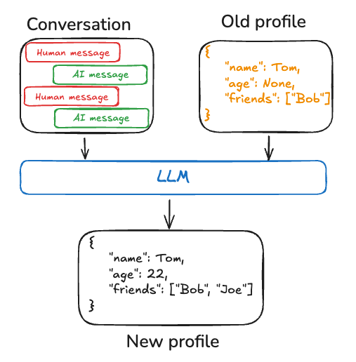

# Memory

## What is Memory?

Memory in AI applications refers to the ability to process, store, and effectively recall information from past interactions. With memory, your agents can learn from feedback and adapt to users' preferences. This guide is divided into two sections based on the scope of memory recall: short-term memory and long-term memory.

**Short-term memory**, or [thread](persistence.md#threads)-scoped memory, can be recalled at any time **from within** a single conversational thread with a user. LangGraph manages short-term memory as a part of your agent's [state](low_level.md#state). State is persisted to a database using a [checkpointer](persistence.md#checkpoints) so the thread can be resumed at any time. Short-term memory updates when the graph is invoked or a step is completed, and the State is read at the start of each step.

**Long-term memory** is shared **across** conversational threads. It can be recalled _at any time_ and **in any thread**. Memories are scoped to any custom namespace, not just within a single thread ID. LangGraph provides [stores](persistence.md#memory-store) ([reference doc](https://langchain-ai.github.io/langgraph/reference/store/#langgraph.store.base.BaseStore)) to let you save and recall long-term memories.

Both are important to understand and implement for your application.


## Short-term memory

Short-term memory lets your application remember previous interactions within a single [thread](persistence.md#threads) or conversation. A [thread](persistence.md#threads) organizes multiple interactions in a session, similar to the way email groups messages in a single conversation.

LangGraph manages short-term memory as part of the agent's state, persisted via thread-scoped checkpoints. This state can normally include the conversation history along with other stateful data, such as uploaded files, retrieved documents, or generated artifacts. By storing these in the graph's state, the bot can access the full context for a given conversation while maintaining separation between different threads.

Since conversation history is the most common form of representing short-term memory, in the next section, we will cover techniques for managing conversation history when the list of messages becomes **long**. If you want to stick to the high-level concepts, continue on to the [long-term memory](#long-term-memory) section.

### Managing long conversation history

Long conversations pose a challenge to today's LLMs. The full history may not even fit inside an LLM's context window, resulting in an irrecoverable error. Even _if_ your LLM technically supports the full context length, most LLMs still perform poorly over long contexts. They get "distracted" by stale or off-topic content, all while suffering from slower response times and higher costs.

Managing short-term memory is an exercise of balancing [precision & recall](https://en.wikipedia.org/wiki/Precision_and_recall#:~:text=Precision%20can%20be%20seen%20as,irrelevant%20ones%20are%20also%20returned) with your application's other performance requirements (latency & cost). As always, it's important to think critically about how you represent information for your LLM and to look at your data. We cover a few common techniques for managing message lists below and hope to provide sufficient context for you to pick the best tradeoffs for your application:

- [Editing message lists](#editing-message-lists): How to think about trimming and filtering a list of messages before passing to language model.
- [Summarizing past conversations](#summarizing-past-conversations): A common technique to use when you don't just want to filter the list of messages.

### Editing message lists

Chat models accept context using [messages](https://python.langchain.com/docs/concepts/#messages), which include developer provided instructions (a system message) and user inputs (human messages). In chat applications, messages alternate between human inputs and model responses, resulting in a list of messages that grows longer over time. Because context windows are limited and token-rich message lists can be costly, many applications can benefit from using techniques to manually remove or forget stale information.


The most direct approach is to remove old messages from a list (similar to a [least-recently used cache](https://en.wikipedia.org/wiki/Page_replacement_algorithm#Least_recently_used)).

The typical technique for deleting content from a list in LangGraph is to return an update from a node telling the system to delete some portion of the list. You get to define what this update looks like, but a common approach would be to let you return an object or dictionary specifying which values to retain.

```python
def manage_list(existing: list, updates: Union[list, dict]):
    if isinstance(updates, list):
        # Normal case, add to the history
        return existing + updates
    elif isinstance(updates, dict) and updates["type"] == "keep":
        # You get to decide what this looks like.
        # For example, you could simplify and just accept a string "DELETE"
        # and clear the entire list.
        return existing[updates["from"]:updates["to"]]
    # etc. We define how to interpret updates

class State(TypedDict):
    my_list: Annotated[list, manage_list]

def my_node(state: State):
    return {
        # We return an update for the field "my_list" saying to
        # keep only values from index -5 to the end (deleting the rest)
        "my_list": {"type": "keep", "from": -5, "to": None}
    }
```

LangGraph will call the `manage_list` "[reducer](low_level.md#reducers)" function any time an update is returned under the key "my_list". Within that function, we define what types of updates to accept. Typically, messages will be added to the existing list (the conversation will grow); however, we've also added support to accept a dictionary that lets you "keep" certain parts of the state. This lets you programmatically drop old message context.

Another common approach is to let you return a list of "remove" objects that specify the IDs of all messages to delete. If you're using the LangChain messages and the [`add_messages`](https://langchain-ai.github.io/langgraph/reference/graphs/#langgraph.graph.message.add_messages) reducer (or `MessagesState`, which uses the same underlying functionality) in LangGraph, you can do this using a `RemoveMessage`.

```python
from langchain_core.messages import RemoveMessage, AIMessage
from langgraph.graph import add_messages
# ... other imports

class State(TypedDict):
    # add_messages will default to upserting messages by ID to the existing list
    # if a RemoveMessage is returned, it will delete the message in the list by ID
    messages: Annotated[list, add_messages]

def my_node_1(state: State):
    # Add an AI message to the `messages` list in the state
    return {"messages": [AIMessage(content="Hi")]}

def my_node_2(state: State):
    # Delete all but the last 2 messages from the `messages` list in the state
    delete_messages = [RemoveMessage(id=m.id) for m in state['messages'][:-2]]
    return {"messages": delete_messages}

```

In the example above, the `add_messages` reducer allows us to [append](https://langchain-ai.github.io/langgraph/concepts/low_level/#serialization) new messages to the `messages` state key as shown in `my_node_1`. When it sees a `RemoveMessage`, it will delete the message with that ID from the list (and the RemoveMessage will then be discarded). For more information on LangChain-specific message handling, check out [this how-to on using `RemoveMessage` ](https://langchain-ai.github.io/langgraph/how-tos/memory/delete-messages/).

See this how-to [guide](https://langchain-ai.github.io/langgraph/how-tos/memory/manage-conversation-history/) and module 2 from our [LangChain Academy](https://github.com/langchain-ai/langchain-academy/tree/main/module-2) course for example usage.

### Summarizing past conversations

The problem with trimming or removing messages, as shown above, is that we may lose information from culling of the message queue. Because of this, some applications benefit from a more sophisticated approach of summarizing the message history using a chat model.


Simple prompting and orchestration logic can be used to achieve this. As an example, in LangGraph we can extend the [MessagesState](https://langchain-ai.github.io/langgraph/concepts/low_level/#working-with-messages-in-graph-state) to include a `summary` key.

```python
from langgraph.graph import MessagesState
class State(MessagesState):
    summary: str
```

Then, we can generate a summary of the chat history, using any existing summary as context for the next summary. This `summarize_conversation` node can be called after some number of messages have accumulated in the `messages` state key.

```python
def summarize_conversation(state: State):

    # First, we get any existing summary
    summary = state.get("summary", "")

    # Create our summarization prompt
    if summary:

        # A summary already exists
        summary_message = (
            f"This is a summary of the conversation to date: {summary}\n\n"
            "Extend the summary by taking into account the new messages above:"
        )

    else:
        summary_message = "Create a summary of the conversation above:"

    # Add prompt to our history
    messages = state["messages"] + [HumanMessage(content=summary_message)]
    response = model.invoke(messages)

    # Delete all but the 2 most recent messages
    delete_messages = [RemoveMessage(id=m.id) for m in state["messages"][:-2]]
    return {"summary": response.content, "messages": delete_messages}
```

See this how-to [here](https://langchain-ai.github.io/langgraph/how-tos/memory/add-summary-conversation-history/) and module 2 from our [LangChain Academy](https://github.com/langchain-ai/langchain-academy/tree/main/module-2) course for example usage.

### Knowing **when** to remove messages

Most LLMs have a maximum supported context window (denominated in tokens). A simple way to decide when to truncate messages is to count the tokens in the message history and truncate whenever it approaches that limit. Naive truncation is straightforward to implement on your own, though there are a few "gotchas". Some model APIs further restrict the sequence of message types (must start with human message, cannot have consecutive messages of the same type, etc.). If you're using LangChain, you can use the [`trim_messages`](https://python.langchain.com/docs/how_to/trim_messages/#trimming-based-on-token-count) utility and specify the number of tokens to keep from the list, as well as the `strategy` (e.g., keep the last `max_tokens`) to use for handling the boundary.

Below is an example.

```python
from langchain_core.messages import trim_messages
trim_messages(
    messages,
    # Keep the last <= n_count tokens of the messages.
    strategy="last",
    # Remember to adjust based on your model
    # or else pass a custom token_encoder
    token_counter=ChatOpenAI(model="gpt-4"),
    # Remember to adjust based on the desired conversation
    # length
    max_tokens=45,
    # Most chat models expect that chat history starts with either:
    # (1) a HumanMessage or
    # (2) a SystemMessage followed by a HumanMessage
    start_on="human",
    # Most chat models expect that chat history ends with either:
    # (1) a HumanMessage or
    # (2) a ToolMessage
    end_on=("human", "tool"),
    # Usually, we want to keep the SystemMessage
    # if it's present in the original history.
    # The SystemMessage has special instructions for the model.
    include_system=True,
)
```

## Long-term memory

Long-term memory in LangGraph allows systems to retain information across different conversations or sessions. Unlike short-term memory, which is thread-scoped, long-term memory is saved within custom "namespaces."

LangGraph stores long-term memories as JSON documents in a [store](persistence.md#memory-store) ([reference doc](https://langchain-ai.github.io/langgraph/reference/store/#langgraph.store.base.BaseStore)). Each memory is organized under a custom `namespace` (similar to a folder) and a distinct `key` (like a filename). Namespaces often include user or org IDs or other labels that makes it easier to organize information. This structure enables hierarchical organization of memories. Cross-namespace searching is then supported through content filters. See the example below for an example.

```python
from langgraph.store.memory import InMemoryStore

# InMemoryStore saves data to an in-memory dictionary. Use a DB-backed store in production use.
store = InMemoryStore()
user_id = "my-user"
application_context = "chitchat"
namespace = (user_id, application_context)
store.put(namespace, key="a-memory", {"rules": ["User likes short, direct language", "User only speaks English & python"], "my-key": "my-value"})
# get the "memory" by ID
item = store.get(namespace)
# list "memories" within this namespace, filtering on content equivalence
items = store.search(namespace, filter={"my-key": "my-value"})
```

When adding long-term memory to your agent, it's important to think about how to **write memories**, how to **store and manage memory updates**, and how to **recall & represent memories** for the LLM in your application. These questions are all interdependent: how you want to recall & format memories for the LLM dictates what you should store and how to manage it. Furthermore, each technique has tradeoffs. The right approach for you largely depends on your application's needs.
LangGraph aims to give you the low-level primitives to directly control the long-term memory of your application, based on memory [Store](persistence.md#memory-store)'s.

Long-term memory is far from a solved problem. While it is hard to provide generic advice, we have provided a few reliable patterns below for your consideration as you implement long-term memory.

**Do you want to write memories "on the hot path" or "in the background"**

Memory can be updated either as part of your primary application logic (e.g. "on the hot path" of the application) or as a background task (as a separate function that generates memories based on the primary application's state). We document some tradeoffs for each approach in [the writing memories section below](#writing-memories).

**Do you want to manage memories as a single profile or as a collection of documents?**

We provide two main approaches to managing long-term memory: a single, continuously updated document (referred to as a "profile" or "schema") or a collection of documents. Each method offers its own benefits, depending on the type of information you need to store and how you intend to access it.

Managing memories as a single, continuously updated "profile" or "schema" is useful when there is well-scoped, specific information you want to remember about a user, organization, or other entity (including the agent itself). You can define the schema of the profile ahead of time, and then use an LLM to update this based on interactions. Querying the "memory" is easy since it's a simple GET operation on a JSON document. We explain this in more detail in [remember a profile](#manage-individual-profiles). This technique can provide higher precision (on known information use cases) at the expense of lower recall (since you have to anticipate and model your domain, and updates to the doc tend to delete or rewrite away old information at a greater frequency).

Managing long-term memory as a collection of documents, on the other hand, lets you store an unbounded amount of information. This technique is useful when you want to repeatedly extract & remember items over a long time horizon but can be more complicated to query and manage over time.
Similar to the "profile" memory, you still define schema(s) for each memory. Rather than overwriting a single document, you instead will insert new ones (and potentially update or re-contextualize existing ones in the process). We explain this approach in more detail in ["managing a collection of memories"](#manage-a-collection-of-memories).

**Do you want to present memories to your agent as updated instructions or as few-shot examples?**

Memories are typically provided to the LLM as a part of the system prompt. Some common ways to "frame" memories for the LLM include providing raw information as "memories from previous interactions with user A", as system instructions or rules, or as few-shot examples.

Framing memories as "learning rules or instructions" typically means dedicating a portion of the system prompt to instructions the LLM can manage itself. After each conversation, you can prompt the LLM to evaluate its performance and update the instructions to better handle this type of task in the future. We explain this approach in more detail in [this section](#update-own-instructions).

Storing memories as few-shot examples lets you store and manage instructions as cause and effect. Each memory stores an input or context and expected response. Including a reasoning trajectory (a chain-of-thought) can also help provide sufficient context so that the memory is less likely to be mis-used in the future. We elaborate on this concept more in [this section](#few-shot-examples).

We will expand on techniques for writing, managing, and recalling & formatting memories in the following section.

### Writing memories

Humans form long-term memories when we sleep, but when and how should our agents create new memories? The two most common ways we see agents write memories are "on the hot path" and "in the background".


#### Writing memories in the hot path

This involves creating memories while the application is running. To provide a popular production example, ChatGPT manages memories using a "save_memories" tool to upsert memories as content strings. It decides whether (and how) to use this tool every time it receives a user message and multi-tasks memory management with the rest of the user instructions.

This has a few benefits. First of all, it happens "in real time". If the user starts a new thread right away that memory will be present. The user also transparently sees when memories are stored, since the bot has to explicitly decide to store information and can relate that to the user.

This also has several downsides. It complicates the decisions the agent must make (what to commit to memory). This complication can degrade its tool-calling performance and reduce task completion rates. It will slow down the final response since it needs to decide what to commit to memory. It also typically leads to fewer things being saved to memory (since the assistant is multi-tasking), which will cause **lower recall** in later conversations.

#### Writing memories in the background

This involves updating memory as a conceptually separate task, typically as a completely separate graph or function. Since it happens in the background, it incurs no latency. It also splits up the application logic from the memory logic, making it more modular and easy to manage. It also lets you separate the timing of memory creation, letting you avoid redundant work. Your agent can focus on accomplishing its immediate task without having to consciously think about what it needs to remember.

This approach is not without its downsides, however. You have to think about how often to write memories. If it doesn't run in realtime, the user's interactions on other threads won't benefit from the new context. You also have to think about when to trigger this job. We typically recommend scheduling memories after some point of time, cancelling and re-scheduling for the future if new events occur on a given thread. Other popular choices are to form memories on some cron schedule or to let the user or application logic manually trigger memory formation.

### Managing memories

Once you've sorted out memory scheduling, it's important to think about **how to update memory with new information**.

There are two main approaches: you can either continuously update a single document (memory profile) or insert new documents each time you receive new information.

We will outline some tradeoffs between these two approaches below, understanding that most people will find it most appropriate to combine approaches and to settle somewhere in the middle.

#### Manage individual profiles

A profile is generally just a JSON document with various key-value pairs you've selected to represent your domain. When remembering a profile, you will want to make sure that you are **updating** the profile each time. As a result, you will want to pass in the previous profile and ask the LLM to generate a new profile (or some JSON patch to apply to the old profile).

The larger the document, the more error-prone this can become. If your document becomes **too** large, you may want to consider splitting up the profiles into separate sections. You will likely need to use generation with retries and/or **strict** decoding when generating documents to ensure the memory schemas remains valid.



#### Manage a collection of memories

Saving memories as a collection of documents simplifies some things. Each individual memory can be more narrowly scoped and easier to generate. It also means you're less likely to **lose** information over time, since it's easier for an LLM to generate _new_ objects for new information than it is for it to reconcile that new information with information in a dense profile. This tends to lead to higher recall downstream.

This approach shifts some complexity to how you prompt the LLM to apply memory updates. You now have to enable the LLM to _delete_ or _update_ existing items in the list. This can be tricky to prompt the LLM to do. Some LLMs may default to over-inserting; others may default to over-updating. Tuning the behavior here is best done through evals, something you can do with a tool like [LangSmith](https://docs.smith.langchain.com/tutorials/Developers/evaluation).

This also shifts complexity to memory **search** (recall). You have to think about what relevant items to use. Right now we support filtering by metadata. We will be adding semantic search shortly.

Finally, this shifts some complexity to how you represent the memories for the LLM (and by extension, the schemas you use to save each memories). It's very easy to write memories that can easily be mistaken out-of-context. It's important to prompt the LLM to include all necessary contextual information in the given memory so that when you use it in later conversations it doesn't mistakenly mis-apply that information.


### Representing memories

Once you have saved memories, the way you then retrieve and present the memory content for the LLM can play a large role in how well your LLM incorporates that information in its responses.
The following sections present a couple of common approaches. Note that these sections also will largely inform how you write and manage memories. Everything in memory is connected!

#### Update own instructions

While instructions are often static text written by the developer, many AI applications benefit from letting the users personalize the rules and instructions the agent should follow whenever it interacts with that user. This ideally can be inferred by its interactions with the user (so the user doesn't have to explicitly change settings in yoru app). In this sense, instructions are a form of long-form memory!

One way to apply this is using "reflection" or "Meta-prompting" steps. Prompt the LLM with the current instruction set (from the system prompt) and a conversation with the user, and instruct the LLM to refine its instructions. This approach allows the system to dynamically update and improve its own behavior, potentially leading to better performance on various tasks. This is particularly useful for tasks where the instructions are challenging to specify a priori.

Meta-prompting uses past information to refine prompts. For instance, a [Tweet generator](https://www.youtube.com/watch?v=Vn8A3BxfplE) employs meta-prompting to enhance its paper summarization prompt for Twitter. You could implement this using LangGraph's memory store to save updated instructions in a shared namespace. In this case, we will namespace the memories as "agent_instructions" and key the memory based on the agent.

```python
# Node that *uses* the instructions
def call_model(state: State, store: BaseStore):
    namespace = ("agent_instructions", )
    instructions = store.get(namespace, key="agent_a")[0]
    # Application logic
    prompt = prompt_template.format(instructions=instructions.value["instructions"])
    ...


# Node that updates instructions
def update_instructions(state: State, store: BaseStore):
    namespace = ("instructions",)
    current_instructions = store.search(namespace)[0]
    # Memory logic
    prompt = prompt_template.format(instructions=instructions.value["instructions"], conversation=state["messages"])
    output = llm.invoke(prompt)
    new_instructions = output['new_instructions']
    store.put(("agent_instructions",), "agent_a", {"instructions": new_instructions})
    ...
```


#### Few-shot examples

Sometimes it's easier to "show" than "tell." LLMs learn well from examples. Few-shot learning lets you ["program"](https://x.com/karpathy/status/1627366413840322562) your LLM by updating the prompt with input-output examples to illustrate the intended behavior. While various [best-practices](https://python.langchain.com/docs/concepts/#1-generating-examples) can be used to generate few-shot examples, often the challenge lies in selecting the most relevant examples based on user input.

Note that the memory store is just one way to store data as few-shot examples. If you want to have more developer involvement, or tie few-shots more closely to your evaluation harness, you can also use a [LangSmith Dataset](https://docs.smith.langchain.com/how_to_guides/datasets) to store your data. Then dynamic few-shot example selectors can be used out-of-the box to achieve this same goal. LangSmith will index the dataset for you and enable retrieval of few shot examples that are most relevant to the user input based upon keyword similarity ([using a BM25-like algorithm](https://docs.smith.langchain.com/how_to_guides/datasets/index_datasets_for_dynamic_few_shot_example_selection) for keyword based similarity). See this how-to [video](https://www.youtube.com/watch?v=37VaU7e7t5o) for example usage of dynamic few-shot example selection in LangSmith. Also, see this [blog post](https://blog.langchain.dev/few-shot-prompting-to-improve-tool-calling-performance/) showcasing few-shot prompting to improve tool calling performance and this [blog post](https://blog.langchain.dev/aligning-llm-as-a-judge-with-human-preferences/) using few-shot example to align an LLMs to human preferences.
