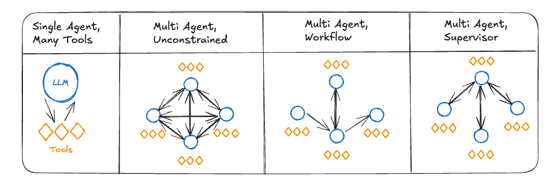
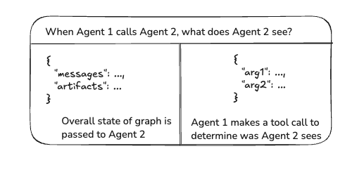
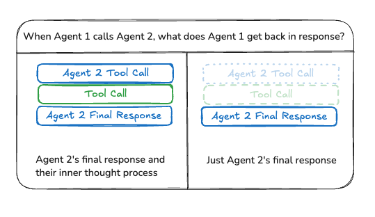

# Multi-agent systems

An [agent](./agentic_concepts.md#agent-architectures) is _a system that uses an LLM to decide the control flow of an application_. As you develop these systems, they might grow more complex over time, making them harder to manage and scale. For example, you might run into the following problems:

- agent has too many tools at its disposal and makes poor decisions about which tool to call next
- context grows too complex for a single agent to keep track of
- there is a need for multiple specialization areas in the system (e.g. planner, researcher, math expert, etc.)

To tackle these, you might consider breaking your application into multiple smaller, independent agents and composing them into a **multi-agent system**. These independent agents can be as simple as a prompt and an LLM call, or as complex as a [ReAct](./agentic_concepts.md#tool-calling-agent) agent (and more!).

The primary benefits of using multi-agent systems are:

- **Modularity**: Separate agents make it easier to develop, test, and maintain agentic systems.
- **Specialization**: You can create expert agents focused on specific domains, which helps with the overall system performance.
- **Control**: You can explicitly control how agents communicate (as opposed to relying on function calling).

## Multi-agent architectures



There are several ways to connect agents in a multi-agent system:

- **Network**: each agent can communicate with [every other agent](../tutorials/multi_agent/multi-agent-collaboration.ipynb/). Any agent can decide which other agent to call next.
- **Supervisor**: each agent communicates with a single [supervisor](../tutorials/multi_agent/agent_supervisor.md/) agent. Supervisor agent makes decisions on which agent should be called next.
- **Supervisor (tool-calling)**: this is a special case of supervisor architecture. Individual agents can be represented as tools. In this case, a supervisor agent uses a tool-calling LLM to decide which of the agent tools to call, as well as the arguments to pass to those agents.
- **Hierarchical**: you can define a multi-agent system with [a supervisor of supervisors](../tutorials/multi_agent/hierarchical_agent_teams.ipynb/). This is a generalization of the supervisor architecture and allows for more complex control flows.
- **Custom multi-agent workflow**: each agent communicates with only a subset of agents. Parts of the flow are deterministic, and only some agents can decide which other agents to call next.

### Handoffs

In multi-agent architectures, agents can be represented as graph nodes. Each agent node executes its step(s) and decides whether to finish execution or route to another agent, including potentially routing to itself (e.g., running in a loop). A common pattern in multi-agent interactions is **handoffs**, where one agent _hands off_ control to another. Handoffs allow you to specify:

- **destination**: target agent to navigate to (e.g., name of the node to go to)
- **payload**: [information to pass to that agent](#communication-and-state-management) (e.g., state update)

To implement handoffs in LangGraph, agent nodes can return [`Command`](./low_level.md#command) object that allows you to combine both control flow and state updates:

:::python

```python
def agent(state) -> Command[Literal["agent", "another_agent"]]:
    # the condition for routing/halting can be anything, e.g. LLM tool call / structured output, etc.
    goto = get_next_agent(...)  # 'agent' / 'another_agent'
    return Command(
        # Specify which agent to call next
        goto=goto,
        # Update the graph state
        update={"my_state_key": "my_state_value"}
    )
```

:::

:::js

```typescript
graph.addNode((state) => {
    // the condition for routing/halting can be anything, e.g. LLM tool call / structured output, etc.
    const goto = getNextAgent(...); // 'agent' / 'another_agent'
    return new Command({
      // Specify which agent to call next
      goto,
      // Update the graph state
      update: { myStateKey: "myStateValue" }
    });
})
```

:::

:::python
In a more complex scenario where each agent node is itself a graph (i.e., a [subgraph](./subgraphs.md)), a node in one of the agent subgraphs might want to navigate to a different agent. For example, if you have two agents, `alice` and `bob` (subgraph nodes in a parent graph), and `alice` needs to navigate to `bob`, you can set `graph=Command.PARENT` in the `Command` object:

```python
def some_node_inside_alice(state):
    return Command(
        goto="bob",
        update={"my_state_key": "my_state_value"},
        # specify which graph to navigate to (defaults to the current graph)
        graph=Command.PARENT,
    )
```

:::

:::js
In a more complex scenario where each agent node is itself a graph (i.e., a [subgraph](./subgraphs.md)), a node in one of the agent subgraphs might want to navigate to a different agent. For example, if you have two agents, `alice` and `bob` (subgraph nodes in a parent graph), and `alice` needs to navigate to `bob`, you can set `graph: Command.PARNT` in the `Command` object:

```typescript
alice.addNode((state) => {
  return new Command({
    goto: "bob",
    update: { myStateKey: "myStateValue" },
    // specify which graph to navigate to (defaults to the current graph)
    graph: Command.PARENT,
  });
});
```

:::

!!! note

    :::python

    If you need to support visualization for subgraphs communicating using `Command(graph=Command.PARENT)` you would need to wrap them in a node function with `Command` annotation:
    Instead of this:

    ```python
    builder.add_node(alice)
    ```

    you would need to do this:

    ```python
    def call_alice(state) -> Command[Literal["bob"]]:
        return alice.invoke(state)

    builder.add_node("alice", call_alice)
    ```

    :::

    :::js
    If you need to support visualization for subgraphs communicating using/ `Command({ graph: Command.PARENT })` you would need to wrap them in a node function with `Command` annotation:

    Instead of this:

    ```typescript
    builder.addNode("alice", alice);
    ```

    you would need to do this:

    ```typescript
    builder.addNode("alice", (state) => alice.invoke(state), { ends: ["bob"] });
    ```

    :::

#### Handoffs as tools

One of the most common agent types is a [tool-calling agent](../agents/overview.md). For those types of agents, a common pattern is wrapping a handoff in a tool call:

:::python

```python
from langchain_core.tools import tool

@tool
def transfer_to_bob():
    """Transfer to bob."""
    return Command(
        # name of the agent (node) to go to
        goto="bob",
        # data to send to the agent
        update={"my_state_key": "my_state_value"},
        # indicate to LangGraph that we need to navigate to
        # agent node in a parent graph
        graph=Command.PARENT,
    )
```

:::

:::js

```typescript
import { tool } from "@langchain/core/tools";
import { Command } from "@langchain/langgraph";
import { z } from "zod";

const transferToBob = tool(
  async () => {
    return new Command({
      // name of the agent (node) to go to
      goto: "bob",
      // data to send to the agent
      update: { myStateKey: "myStateValue" },
      // indicate to LangGraph that we need to navigate to
      // agent node in a parent graph
      graph: Command.PARENT,
    });
  },
  {
    name: "transfer_to_bob",
    description: "Transfer to bob.",
    schema: z.object({}),
  }
);
```

:::

This is a special case of updating the graph state from tools where, in addition to the state update, the control flow is included as well.

!!! important

      :::python
      If you want to use tools that return `Command`, you can use the prebuilt @[`create_react_agent`][create_react_agent] / @[`ToolNode`][ToolNode] components, or else implement your own logic:

      ```python
      def call_tools(state):
          ...
          commands = [tools_by_name[tool_call["name"]].invoke(tool_call) for tool_call in tool_calls]
          return commands
      ```
      :::

      :::js
      If you want to use tools that return `Command`, you can use the prebuilt @[`createReactAgent`][create_react_agent] / @[ToolNode] components, or else implement your own logic:

      ```typescript
      graph.addNode("call_tools", async (state) => {
        // ... tool execution logic
        const commands = toolCalls.map((toolCall) =>
          toolsByName[toolCall.name].invoke(toolCall)
        );
        return commands;
      });
      ```
      :::

Let's now take a closer look at the different multi-agent architectures.

### Network

In this architecture, agents are defined as graph nodes. Each agent can communicate with every other agent (many-to-many connections) and can decide which agent to call next. This architecture is good for problems that do not have a clear hierarchy of agents or a specific sequence in which agents should be called.

:::python

```python
from typing import Literal
from langchain_openai import ChatOpenAI
from langgraph.types import Command
from langgraph.graph import StateGraph, MessagesState, START, END

model = ChatOpenAI()

def agent_1(state: MessagesState) -> Command[Literal["agent_2", "agent_3", END]]:
    # you can pass relevant parts of the state to the LLM (e.g., state["messages"])
    # to determine which agent to call next. a common pattern is to call the model
    # with a structured output (e.g. force it to return an output with a "next_agent" field)
    response = model.invoke(...)
    # route to one of the agents or exit based on the LLM's decision
    # if the LLM returns "__end__", the graph will finish execution
    return Command(
        goto=response["next_agent"],
        update={"messages": [response["content"]]},
    )

def agent_2(state: MessagesState) -> Command[Literal["agent_1", "agent_3", END]]:
    response = model.invoke(...)
    return Command(
        goto=response["next_agent"],
        update={"messages": [response["content"]]},
    )

def agent_3(state: MessagesState) -> Command[Literal["agent_1", "agent_2", END]]:
    ...
    return Command(
        goto=response["next_agent"],
        update={"messages": [response["content"]]},
    )

builder = StateGraph(MessagesState)
builder.add_node(agent_1)
builder.add_node(agent_2)
builder.add_node(agent_3)

builder.add_edge(START, "agent_1")
network = builder.compile()
```

:::

:::js

```typescript
import { StateGraph, MessagesZodState, START, END } from "@langchain/langgraph";
import { ChatOpenAI } from "@langchain/openai";
import { Command } from "@langchain/langgraph";
import { z } from "zod";

const model = new ChatOpenAI();

const agent1 = async (state: z.infer<typeof MessagesZodState>) => {
  // you can pass relevant parts of the state to the LLM (e.g., state.messages)
  // to determine which agent to call next. a common pattern is to call the model
  // with a structured output (e.g. force it to return an output with a "next_agent" field)
  const response = await model.invoke(...);
  // route to one of the agents or exit based on the LLM's decision
  // if the LLM returns "__end__", the graph will finish execution
  return new Command({
    goto: response.nextAgent,
    update: { messages: [response.content] },
  });
};

const agent2 = async (state: z.infer<typeof MessagesZodState>) => {
  const response = await model.invoke(...);
  return new Command({
    goto: response.nextAgent,
    update: { messages: [response.content] },
  });
};

const agent3 = async (state: z.infer<typeof MessagesZodState>) => {
  // ...
  return new Command({
    goto: response.nextAgent,
    update: { messages: [response.content] },
  });
};

const builder = new StateGraph(MessagesZodState)
  .addNode("agent1", agent1, {
    ends: ["agent2", "agent3", END]
  })
  .addNode("agent2", agent2, {
    ends: ["agent1", "agent3", END]
  })
  .addNode("agent3", agent3, {
    ends: ["agent1", "agent2", END]
  })
  .addEdge(START, "agent1");

const network = builder.compile();
```

:::

### Supervisor

In this architecture, we define agents as nodes and add a supervisor node (LLM) that decides which agent nodes should be called next. We use [`Command`](./low_level.md#command) to route execution to the appropriate agent node based on supervisor's decision. This architecture also lends itself well to running multiple agents in parallel or using [map-reduce](../how-tos/graph-api.md#map-reduce-and-the-send-api) pattern.

:::python

```python
from typing import Literal
from langchain_openai import ChatOpenAI
from langgraph.types import Command
from langgraph.graph import StateGraph, MessagesState, START, END

model = ChatOpenAI()

def supervisor(state: MessagesState) -> Command[Literal["agent_1", "agent_2", END]]:
    # you can pass relevant parts of the state to the LLM (e.g., state["messages"])
    # to determine which agent to call next. a common pattern is to call the model
    # with a structured output (e.g. force it to return an output with a "next_agent" field)
    response = model.invoke(...)
    # route to one of the agents or exit based on the supervisor's decision
    # if the supervisor returns "__end__", the graph will finish execution
    return Command(goto=response["next_agent"])

def agent_1(state: MessagesState) -> Command[Literal["supervisor"]]:
    # you can pass relevant parts of the state to the LLM (e.g., state["messages"])
    # and add any additional logic (different models, custom prompts, structured output, etc.)
    response = model.invoke(...)
    return Command(
        goto="supervisor",
        update={"messages": [response]},
    )

def agent_2(state: MessagesState) -> Command[Literal["supervisor"]]:
    response = model.invoke(...)
    return Command(
        goto="supervisor",
        update={"messages": [response]},
    )

builder = StateGraph(MessagesState)
builder.add_node(supervisor)
builder.add_node(agent_1)
builder.add_node(agent_2)

builder.add_edge(START, "supervisor")

supervisor = builder.compile()
```

:::

:::js

```typescript
import { StateGraph, MessagesZodState, Command, START, END } from "@langchain/langgraph";
import { ChatOpenAI } from "@langchain/openai";
import { z } from "zod";

const model = new ChatOpenAI();

const supervisor = async (state: z.infer<typeof MessagesZodState>) => {
  // you can pass relevant parts of the state to the LLM (e.g., state.messages)
  // to determine which agent to call next. a common pattern is to call the model
  // with a structured output (e.g. force it to return an output with a "next_agent" field)
  const response = await model.invoke(...);
  // route to one of the agents or exit based on the supervisor's decision
  // if the supervisor returns "__end__", the graph will finish execution
  return new Command({ goto: response.nextAgent });
};

const agent1 = async (state: z.infer<typeof MessagesZodState>) => {
  // you can pass relevant parts of the state to the LLM (e.g., state.messages)
  // and add any additional logic (different models, custom prompts, structured output, etc.)
  const response = await model.invoke(...);
  return new Command({
    goto: "supervisor",
    update: { messages: [response] },
  });
};

const agent2 = async (state: z.infer<typeof MessagesZodState>) => {
  const response = await model.invoke(...);
  return new Command({
    goto: "supervisor",
    update: { messages: [response] },
  });
};

const builder = new StateGraph(MessagesZodState)
  .addNode("supervisor", supervisor, {
    ends: ["agent1", "agent2", END]
  })
  .addNode("agent1", agent1, {
    ends: ["supervisor"]
  })
  .addNode("agent2", agent2, {
    ends: ["supervisor"]
  })
  .addEdge(START, "supervisor");

const supervisorGraph = builder.compile();
```

:::

:::js

```typescript
import { StateGraph, MessagesZodState, Command, START, END } from "@langchain/langgraph";
import { ChatOpenAI } from "@langchain/openai";
import { z } from "zod";

const model = new ChatOpenAI();

const supervisor = async (state: z.infer<typeof MessagesZodState>) => {
  // you can pass relevant parts of the state to the LLM (e.g., state.messages)
  // to determine which agent to call next. a common pattern is to call the model
  // with a structured output (e.g. force it to return an output with a "next_agent" field)
  const response = await model.invoke(...);
  // route to one of the agents or exit based on the supervisor's decision
  // if the supervisor returns "__end__", the graph will finish execution
  return new Command({ goto: response.nextAgent });
};

const agent1 = async (state: z.infer<typeof MessagesZodState>) => {
  // you can pass relevant parts of the state to the LLM (e.g., state.messages)
  // and add any additional logic (different models, custom prompts, structured output, etc.)
  const response = await model.invoke(...);
  return new Command({
    goto: "supervisor",
    update: { messages: [response] },
  });
};

const agent2 = async (state: z.infer<typeof MessagesZodState>) => {
  const response = await model.invoke(...);
  return new Command({
    goto: "supervisor",
    update: { messages: [response] },
  });
};

const builder = new StateGraph(MessagesZodState)
  .addNode("supervisor", supervisor, {
    ends: ["agent1", "agent2", END]
  })
  .addNode("agent1", agent1, {
    ends: ["supervisor"]
  })
  .addNode("agent2", agent2, {
    ends: ["supervisor"]
  })
  .addEdge(START, "supervisor");

const supervisorGraph = builder.compile();
```

:::

Check out this [tutorial](../tutorials/multi_agent/agent_supervisor.md) for an example of supervisor multi-agent architecture.

### Supervisor (tool-calling)

In this variant of the [supervisor](#supervisor) architecture, we define a supervisor [agent](./agentic_concepts.md#agent-architectures) which is responsible for calling sub-agents. The sub-agents are exposed to the supervisor as tools, and the supervisor agent decides which tool to call next. The supervisor agent follows a [standard implementation](./agentic_concepts.md#tool-calling-agent) as an LLM running in a while loop calling tools until it decides to stop.

:::python

```python
from typing import Annotated
from langchain_openai import ChatOpenAI
from langgraph.prebuilt import InjectedState, create_react_agent

model = ChatOpenAI()

# this is the agent function that will be called as tool
# notice that you can pass the state to the tool via InjectedState annotation
def agent_1(state: Annotated[dict, InjectedState]):
    # you can pass relevant parts of the state to the LLM (e.g., state["messages"])
    # and add any additional logic (different models, custom prompts, structured output, etc.)
    response = model.invoke(...)
    # return the LLM response as a string (expected tool response format)
    # this will be automatically turned to ToolMessage
    # by the prebuilt create_react_agent (supervisor)
    return response.content

def agent_2(state: Annotated[dict, InjectedState]):
    response = model.invoke(...)
    return response.content

tools = [agent_1, agent_2]
# the simplest way to build a supervisor w/ tool-calling is to use prebuilt ReAct agent graph
# that consists of a tool-calling LLM node (i.e. supervisor) and a tool-executing node
supervisor = create_react_agent(model, tools)
```

:::

:::js

```typescript
import { ChatOpenAI } from "@langchain/openai";
import { createReactAgent } from "@langchain/langgraph/prebuilt";
import { tool } from "@langchain/core/tools";
import { z } from "zod";

const model = new ChatOpenAI();

// this is the agent function that will be called as tool
// notice that you can pass the state to the tool via config parameter
const agent1 = tool(
  async (_, config) => {
    const state = config.configurable?.state;
    // you can pass relevant parts of the state to the LLM (e.g., state.messages)
    // and add any additional logic (different models, custom prompts, structured output, etc.)
    const response = await model.invoke(...);
    // return the LLM response as a string (expected tool response format)
    // this will be automatically turned to ToolMessage
    // by the prebuilt createReactAgent (supervisor)
    return response.content;
  },
  {
    name: "agent1",
    description: "Agent 1 description",
    schema: z.object({}),
  }
);

const agent2 = tool(
  async (_, config) => {
    const state = config.configurable?.state;
    const response = await model.invoke(...);
    return response.content;
  },
  {
    name: "agent2",
    description: "Agent 2 description",
    schema: z.object({}),
  }
);

const tools = [agent1, agent2];
// the simplest way to build a supervisor w/ tool-calling is to use prebuilt ReAct agent graph
// that consists of a tool-calling LLM node (i.e. supervisor) and a tool-executing node
const supervisor = createReactAgent({ llm: model, tools });
```

:::

### Hierarchical

As you add more agents to your system, it might become too hard for the supervisor to manage all of them. The supervisor might start making poor decisions about which agent to call next, or the context might become too complex for a single supervisor to keep track of. In other words, you end up with the same problems that motivated the multi-agent architecture in the first place.

To address this, you can design your system _hierarchically_. For example, you can create separate, specialized teams of agents managed by individual supervisors, and a top-level supervisor to manage the teams.

:::python

```python
from typing import Literal
from langchain_openai import ChatOpenAI
from langgraph.graph import StateGraph, MessagesState, START, END
from langgraph.types import Command
model = ChatOpenAI()

# define team 1 (same as the single supervisor example above)

def team_1_supervisor(state: MessagesState) -> Command[Literal["team_1_agent_1", "team_1_agent_2", END]]:
    response = model.invoke(...)
    return Command(goto=response["next_agent"])

def team_1_agent_1(state: MessagesState) -> Command[Literal["team_1_supervisor"]]:
    response = model.invoke(...)
    return Command(goto="team_1_supervisor", update={"messages": [response]})

def team_1_agent_2(state: MessagesState) -> Command[Literal["team_1_supervisor"]]:
    response = model.invoke(...)
    return Command(goto="team_1_supervisor", update={"messages": [response]})

team_1_builder = StateGraph(Team1State)
team_1_builder.add_node(team_1_supervisor)
team_1_builder.add_node(team_1_agent_1)
team_1_builder.add_node(team_1_agent_2)
team_1_builder.add_edge(START, "team_1_supervisor")
team_1_graph = team_1_builder.compile()

# define team 2 (same as the single supervisor example above)
class Team2State(MessagesState):
    next: Literal["team_2_agent_1", "team_2_agent_2", "__end__"]

def team_2_supervisor(state: Team2State):
    ...

def team_2_agent_1(state: Team2State):
    ...

def team_2_agent_2(state: Team2State):
    ...

team_2_builder = StateGraph(Team2State)
...
team_2_graph = team_2_builder.compile()


# define top-level supervisor

builder = StateGraph(MessagesState)
def top_level_supervisor(state: MessagesState) -> Command[Literal["team_1_graph", "team_2_graph", END]]:
    # you can pass relevant parts of the state to the LLM (e.g., state["messages"])
    # to determine which team to call next. a common pattern is to call the model
    # with a structured output (e.g. force it to return an output with a "next_team" field)
    response = model.invoke(...)
    # route to one of the teams or exit based on the supervisor's decision
    # if the supervisor returns "__end__", the graph will finish execution
    return Command(goto=response["next_team"])

builder = StateGraph(MessagesState)
builder.add_node(top_level_supervisor)
builder.add_node("team_1_graph", team_1_graph)
builder.add_node("team_2_graph", team_2_graph)
builder.add_edge(START, "top_level_supervisor")
builder.add_edge("team_1_graph", "top_level_supervisor")
builder.add_edge("team_2_graph", "top_level_supervisor")
graph = builder.compile()
```

:::

:::js

```typescript
import { StateGraph, MessagesZodState, Command, START, END } from "@langchain/langgraph";
import { ChatOpenAI } from "@langchain/openai";
import { z } from "zod";

const model = new ChatOpenAI();

// define team 1 (same as the single supervisor example above)

const team1Supervisor = async (state: z.infer<typeof MessagesZodState>) => {
  const response = await model.invoke(...);
  return new Command({ goto: response.nextAgent });
};

const team1Agent1 = async (state: z.infer<typeof MessagesZodState>) => {
  const response = await model.invoke(...);
  return new Command({
    goto: "team1Supervisor",
    update: { messages: [response] }
  });
};

const team1Agent2 = async (state: z.infer<typeof MessagesZodState>) => {
  const response = await model.invoke(...);
  return new Command({
    goto: "team1Supervisor",
    update: { messages: [response] }
  });
};

const team1Builder = new StateGraph(MessagesZodState)
  .addNode("team1Supervisor", team1Supervisor, {
    ends: ["team1Agent1", "team1Agent2", END]
  })
  .addNode("team1Agent1", team1Agent1, {
    ends: ["team1Supervisor"]
  })
  .addNode("team1Agent2", team1Agent2, {
    ends: ["team1Supervisor"]
  })
  .addEdge(START, "team1Supervisor");
const team1Graph = team1Builder.compile();

// define team 2 (same as the single supervisor example above)
const team2Supervisor = async (state: z.infer<typeof MessagesZodState>) => {
  // ...
};

const team2Agent1 = async (state: z.infer<typeof MessagesZodState>) => {
  // ...
};

const team2Agent2 = async (state: z.infer<typeof MessagesZodState>) => {
  // ...
};

const team2Builder = new StateGraph(MessagesZodState);
// ... build team2Graph
const team2Graph = team2Builder.compile();

// define top-level supervisor

const topLevelSupervisor = async (state: z.infer<typeof MessagesZodState>) => {
  // you can pass relevant parts of the state to the LLM (e.g., state.messages)
  // to determine which team to call next. a common pattern is to call the model
  // with a structured output (e.g. force it to return an output with a "next_team" field)
  const response = await model.invoke(...);
  // route to one of the teams or exit based on the supervisor's decision
  // if the supervisor returns "__end__", the graph will finish execution
  return new Command({ goto: response.nextTeam });
};

const builder = new StateGraph(MessagesZodState)
  .addNode("topLevelSupervisor", topLevelSupervisor, {
    ends: ["team1Graph", "team2Graph", END]
  })
  .addNode("team1Graph", team1Graph)
  .addNode("team2Graph", team2Graph)
  .addEdge(START, "topLevelSupervisor")
  .addEdge("team1Graph", "topLevelSupervisor")
  .addEdge("team2Graph", "topLevelSupervisor");

const graph = builder.compile();
```

:::

### Custom multi-agent workflow

In this architecture we add individual agents as graph nodes and define the order in which agents are called ahead of time, in a custom workflow. In LangGraph the workflow can be defined in two ways:

- **Explicit control flow (normal edges)**: LangGraph allows you to explicitly define the control flow of your application (i.e. the sequence of how agents communicate) explicitly, via [normal graph edges](./low_level.md#normal-edges). This is the most deterministic variant of this architecture above — we always know which agent will be called next ahead of time.

- **Dynamic control flow (Command)**: in LangGraph you can allow LLMs to decide parts of your application control flow. This can be achieved by using [`Command`](./low_level.md#command). A special case of this is a [supervisor tool-calling](#supervisor-tool-calling) architecture. In that case, the tool-calling LLM powering the supervisor agent will make decisions about the order in which the tools (agents) are being called.

:::python

```python
from langchain_openai import ChatOpenAI
from langgraph.graph import StateGraph, MessagesState, START

model = ChatOpenAI()

def agent_1(state: MessagesState):
    response = model.invoke(...)
    return {"messages": [response]}

def agent_2(state: MessagesState):
    response = model.invoke(...)
    return {"messages": [response]}

builder = StateGraph(MessagesState)
builder.add_node(agent_1)
builder.add_node(agent_2)
# define the flow explicitly
builder.add_edge(START, "agent_1")
builder.add_edge("agent_1", "agent_2")
```

:::

:::js

```typescript
import { StateGraph, MessagesZodState, START } from "@langchain/langgraph";
import { ChatOpenAI } from "@langchain/openai";
import { z } from "zod";

const model = new ChatOpenAI();

const agent1 = async (state: z.infer<typeof MessagesZodState>) => {
  const response = await model.invoke(...);
  return { messages: [response] };
};

const agent2 = async (state: z.infer<typeof MessagesZodState>) => {
  const response = await model.invoke(...);
  return { messages: [response] };
};

const builder = new StateGraph(MessagesZodState)
  .addNode("agent1", agent1)
  .addNode("agent2", agent2)
  // define the flow explicitly
  .addEdge(START, "agent1")
  .addEdge("agent1", "agent2");
```

:::

## Communication and state management

The most important thing when building multi-agent systems is figuring out how the agents communicate.

A common, generic way for agents to communicate is via a list of messages. This opens up the following questions:

- Do agents communicate [**via handoffs or via tool calls**](#handoffs-vs-tool-calls)?
- What messages are [**passed from one agent to the next**](#message-passing-between-agents)?
- How are [**handoffs represented in the list of messages**](#representing-handoffs-in-message-history)?
- How do you [**manage state for subagents**](#state-management-for-subagents)?

Additionally, if you are dealing with more complex agents or wish to keep individual agent state separate from the multi-agent system state, you may need to use [**different state schemas**](#using-different-state-schemas).

### Handoffs vs tool calls

What is the "payload" that is being passed around between agents? In most of the architectures discussed above, the agents communicate via [handoffs](#handoffs) and pass the [graph state](./low_level.md#state) as part of the handoff payload. Specifically, agents pass around lists of messages as part of the graph state. In the case of the [supervisor with tool-calling](#supervisor-tool-calling), the payloads are tool call arguments.



### Message passing between agents

The most common way for agents to communicate is via a shared state channel, typically a list of messages. This assumes that there is always at least a single channel (key) in the state that is shared by the agents (e.g., `messages`). When communicating via a shared message list, there is an additional consideration: should the agents [share the full history](#sharing-full-thought-process) of their thought process or only [the final result](#sharing-only-final-results)?



#### Sharing full thought process

Agents can **share the full history** of their thought process (i.e., "scratchpad") with all other agents. This "scratchpad" would typically look like a [list of messages](./low_level.md#why-use-messages). The benefit of sharing the full thought process is that it might help other agents make better decisions and improve reasoning ability for the system as a whole. The downside is that as the number of agents and their complexity grows, the "scratchpad" will grow quickly and might require additional strategies for [memory management](../how-tos/memory/add-memory.md).

#### Sharing only final results

Agents can have their own private "scratchpad" and only **share the final result** with the rest of the agents. This approach might work better for systems with many agents or agents that are more complex. In this case, you would need to define agents with [different state schemas](#using-different-state-schemas).

For agents called as tools, the supervisor determines the inputs based on the tool schema. Additionally, LangGraph allows [passing state](../how-tos/tool-calling.md#short-term-memory) to individual tools at runtime, so subordinate agents can access parent state, if needed.

#### Indicating agent name in messages

It can be helpful to indicate which agent a particular AI message is from, especially for long message histories. Some LLM providers (like OpenAI) support adding a `name` parameter to messages — you can use that to attach the agent name to the message. If that is not supported, you can consider manually injecting the agent name into the message content, e.g., `<agent>alice</agent><message>message from alice</message>`.

### Representing handoffs in message history

:::python
Handoffs are typically done via the LLM calling a dedicated [handoff tool](#handoffs-as-tools). This is represented as an [AI message](https://python.langchain.com/docs/concepts/messages/#aimessage) with tool calls that is passed to the next agent (LLM). Most LLM providers don't support receiving AI messages with tool calls **without** corresponding tool messages.
:::

:::js
Handoffs are typically done via the LLM calling a dedicated [handoff tool](#handoffs-as-tools). This is represented as an [AI message](https://js.langchain.com/docs/concepts/messages/#aimessage) with tool calls that is passed to the next agent (LLM). Most LLM providers don't support receiving AI messages with tool calls **without** corresponding tool messages.
:::

You therefore have two options:

:::python

1. Add an extra [tool message](https://python.langchain.com/docs/concepts/messages/#toolmessage) to the message list, e.g., "Successfully transferred to agent X"
2. Remove the AI message with the tool calls
   :::

:::js

1. Add an extra [tool message](https://js.langchain.com/docs/concepts/messages/#toolmessage) to the message list, e.g., "Successfully transferred to agent X"
2. Remove the AI message with the tool calls
:::

In practice, we see that most developers opt for option (1).

### State management for subagents

A common practice is to have multiple agents communicating on a shared message list, but only [adding their final messages to the list](#sharing-only-final-results). This means that any intermediate messages (e.g., tool calls) are not saved in this list.

What if you **do** want to save these messages so that if this particular subagent is invoked in the future you can pass those back in?

There are two high-level approaches to achieve that:

:::python

1. Store these messages in the shared message list, but filter the list before passing it to the subagent LLM. For example, you can choose to filter out all tool calls from **other** agents.
2. Store a separate message list for each agent (e.g., `alice_messages`) in the subagent's graph state. This would be their "view" of what the message history looks like.
:::

:::js

1. Store these messages in the shared message list, but filter the list before passing it to the subagent LLM. For example, you can choose to filter out all tool calls from **other** agents.
2. Store a separate message list for each agent (e.g., `aliceMessages`) in the subagent's graph state. This would be their "view" of what the message history looks like.
:::

### Using different state schemas

An agent might need to have a different state schema from the rest of the agents. For example, a search agent might only need to keep track of queries and retrieved documents. There are two ways to achieve this in LangGraph:

- Define [subgraph](./subgraphs.md) agents with a separate state schema. If there are no shared state keys (channels) between the subgraph and the parent graph, it's important to [add input / output transformations](../how-tos/subgraph.md#different-state-schemas) so that the parent graph knows how to communicate with the subgraphs.
- Define agent node functions with a [private input state schema](../how-tos/graph-api.md#pass-private-state-between-nodes) that is distinct from the overall graph state schema. This allows passing information that is only needed for executing that particular agent.
