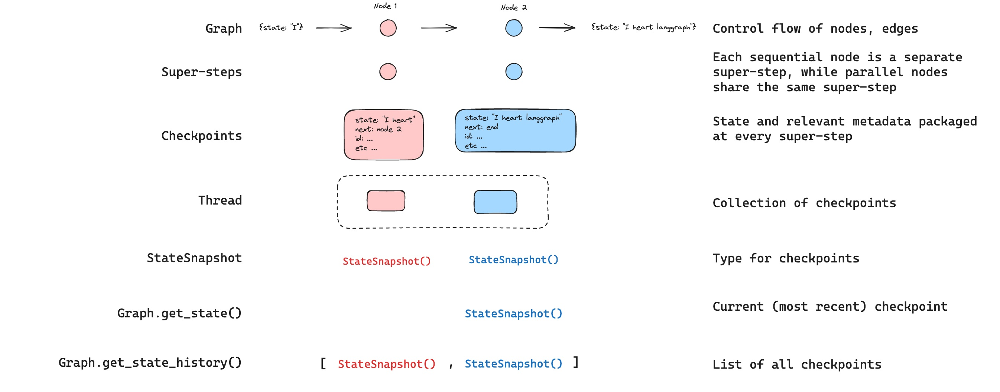
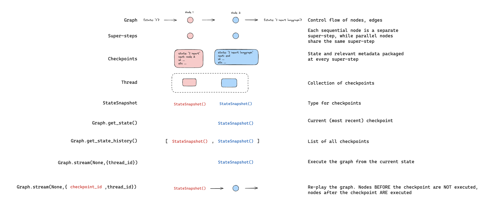
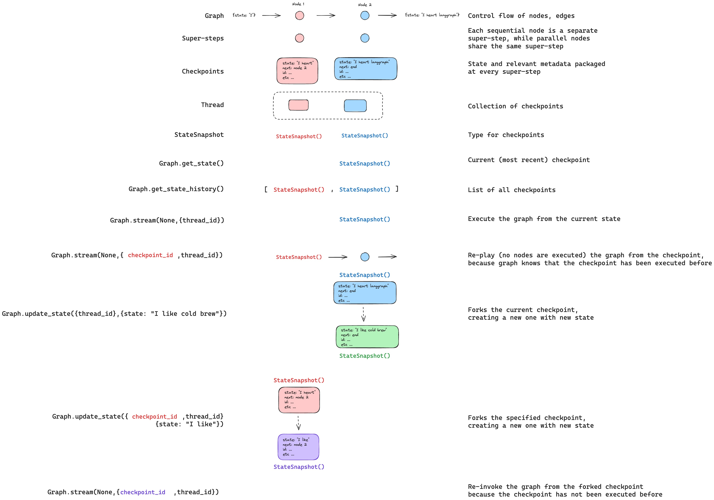
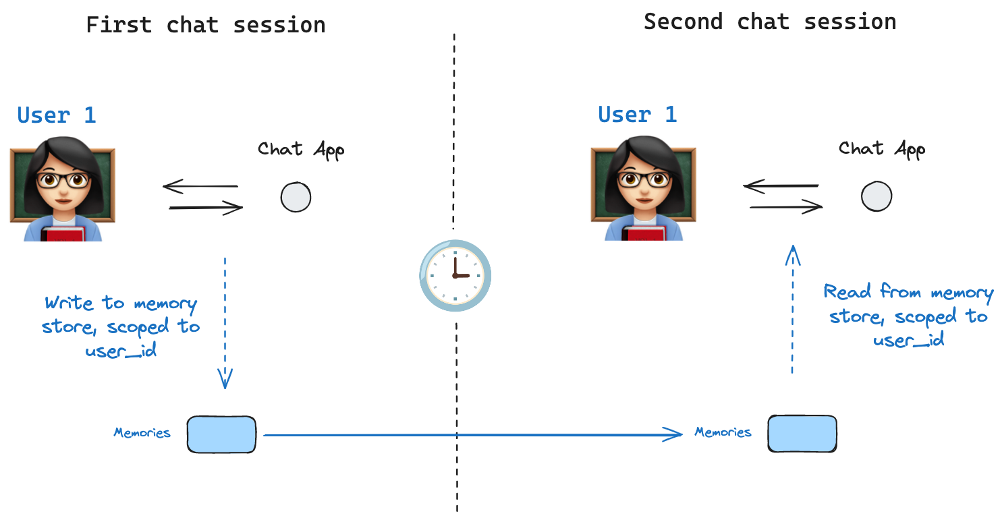

---
search:
  boost: 2
---

# Persistence

LangGraph has a built-in persistence layer, implemented through checkpointers. When you compile a graph with a checkpointer, the checkpointer saves a `checkpoint` of the graph state at every super-step. Those checkpoints are saved to a `thread`, which can be accessed after graph execution. Because `threads` allow access to graph's state after execution, several powerful capabilities including human-in-the-loop, memory, time travel, and fault-tolerance are all possible. Below, we'll discuss each of these concepts in more detail.


!!! info "LangGraph API handles checkpointing automatically"

    When using the LangGraph API, you don't need to implement or configure checkpointers manually. The API handles all persistence infrastructure for you behind the scenes.

## Threads

A thread is a unique ID or thread identifier assigned to each checkpoint saved by a checkpointer. It contains the accumulated state of a sequence of [runs](./assistants.md#execution). When a run is executed, the [state](../concepts/low_level.md#state) of the underlying graph of the assistant will be persisted to the thread.

When invoking a graph with a checkpointer, you **must** specify a `thread_id` as part of the `configurable` portion of the config:

:::python

```python
{"configurable": {"thread_id": "1"}}
```

:::

:::js

```typescript
{
  configurable: {
    thread_id: "1";
  }
}
```

:::

A thread's current and historical state can be retrieved. To persist state, a thread must be created prior to executing a run. The LangGraph Platform API provides several endpoints for creating and managing threads and thread state. See the [API reference](../cloud/reference/api/api_ref.html#tag/threads) for more details.

## Checkpoints

The state of a thread at a particular point in time is called a checkpoint. Checkpoint is a snapshot of the graph state saved at each super-step and is represented by `StateSnapshot` object with the following key properties:

- `config`: Config associated with this checkpoint.
- `metadata`: Metadata associated with this checkpoint.
- `values`: Values of the state channels at this point in time.
- `next` A tuple of the node names to execute next in the graph.
- `tasks`: A tuple of `PregelTask` objects that contain information about next tasks to be executed. If the step was previously attempted, it will include error information. If a graph was interrupted [dynamically](../how-tos/human_in_the_loop/add-human-in-the-loop.md#pause-using-interrupt) from within a node, tasks will contain additional data associated with interrupts.

Checkpoints are persisted and can be used to restore the state of a thread at a later time.

Let's see what checkpoints are saved when a simple graph is invoked as follows:

:::python

```python
from langgraph.graph import StateGraph, START, END
from langgraph.checkpoint.memory import InMemorySaver
from typing import Annotated
from typing_extensions import TypedDict
from operator import add

class State(TypedDict):
    foo: str
    bar: Annotated[list[str], add]

def node_a(state: State):
    return {"foo": "a", "bar": ["a"]}

def node_b(state: State):
    return {"foo": "b", "bar": ["b"]}


workflow = StateGraph(State)
workflow.add_node(node_a)
workflow.add_node(node_b)
workflow.add_edge(START, "node_a")
workflow.add_edge("node_a", "node_b")
workflow.add_edge("node_b", END)

checkpointer = InMemorySaver()
graph = workflow.compile(checkpointer=checkpointer)

config = {"configurable": {"thread_id": "1"}}
graph.invoke({"foo": ""}, config)
```

:::

:::js

```typescript
import { StateGraph, START, END, MemoryServer } from "@langchain/langgraph";
import { withLangGraph } from "@langchain/langgraph/zod";
import { z } from "zod";

const State = z.object({
  foo: z.string(),
  bar: withLangGraph(z.array(z.string()), {
    reducer: {
      fn: (x, y) => x.concat(y),
    },
    default: () => [],
  }),
});

const workflow = new StateGraph(State)
  .addNode("nodeA", (state) => {
    return { foo: "a", bar: ["a"] };
  })
  .addNode("nodeB", (state) => {
    return { foo: "b", bar: ["b"] };
  })
  .addEdge(START, "nodeA")
  .addEdge("nodeA", "nodeB")
  .addEdge("nodeB", END);

const checkpointer = new MemorySaver();
const graph = workflow.compile({ checkpointer });

const config = { configurable: { thread_id: "1" } };
await graph.invoke({ foo: "" }, config);
```

:::

:::js

```typescript
import { StateGraph, START, END, MemoryServer } from "@langchain/langgraph";
import { withLangGraph } from "@langchain/langgraph/zod";
import { z } from "zod";

const State = z.object({
  foo: z.string(),
  bar: withLangGraph(z.array(z.string()), {
    reducer: {
      fn: (x, y) => x.concat(y),
    },
    default: () => [],
  }),
});

const workflow = new StateGraph(State)
  .addNode("nodeA", (state) => {
    return { foo: "a", bar: ["a"] };
  })
  .addNode("nodeB", (state) => {
    return { foo: "b", bar: ["b"] };
  })
  .addEdge(START, "nodeA")
  .addEdge("nodeA", "nodeB")
  .addEdge("nodeB", END);

const checkpointer = new MemorySaver();
const graph = workflow.compile({ checkpointer });

const config = { configurable: { thread_id: "1" } };
await graph.invoke({ foo: "" }, config);
```

:::

:::python

After we run the graph, we expect to see exactly 4 checkpoints:

- empty checkpoint with `START` as the next node to be executed
- checkpoint with the user input `{'foo': '', 'bar': []}` and `node_a` as the next node to be executed
- checkpoint with the outputs of `node_a` `{'foo': 'a', 'bar': ['a']}` and `node_b` as the next node to be executed
- checkpoint with the outputs of `node_b` `{'foo': 'b', 'bar': ['a', 'b']}` and no next nodes to be executed

Note that we `bar` channel values contain outputs from both nodes as we have a reducer for `bar` channel.

:::

:::js

After we run the graph, we expect to see exactly 4 checkpoints:

- empty checkpoint with `START` as the next node to be executed
- checkpoint with the user input `{'foo': '', 'bar': []}` and `nodeA` as the next node to be executed
- checkpoint with the outputs of `nodeA` `{'foo': 'a', 'bar': ['a']}` and `nodeB` as the next node to be executed
- checkpoint with the outputs of `nodeB` `{'foo': 'b', 'bar': ['a', 'b']}` and no next nodes to be executed

Note that the `bar` channel values contain outputs from both nodes as we have a reducer for the `bar` channel.
:::

### Get state

:::python
When interacting with the saved graph state, you **must** specify a [thread identifier](#threads). You can view the _latest_ state of the graph by calling `graph.get_state(config)`. This will return a `StateSnapshot` object that corresponds to the latest checkpoint associated with the thread ID provided in the config or a checkpoint associated with a checkpoint ID for the thread, if provided.

```python
# get the latest state snapshot
config = {"configurable": {"thread_id": "1"}}
graph.get_state(config)

# get a state snapshot for a specific checkpoint_id
config = {"configurable": {"thread_id": "1", "checkpoint_id": "1ef663ba-28fe-6528-8002-5a559208592c"}}
graph.get_state(config)
```

:::

:::js
When interacting with the saved graph state, you **must** specify a [thread identifier](#threads). You can view the _latest_ state of the graph by calling `graph.getState(config)`. This will return a `StateSnapshot` object that corresponds to the latest checkpoint associated with the thread ID provided in the config or a checkpoint associated with a checkpoint ID for the thread, if provided.

```typescript
// get the latest state snapshot
const config = { configurable: { thread_id: "1" } };
await graph.getState(config);

// get a state snapshot for a specific checkpoint_id
const config = {
  configurable: {
    thread_id: "1",
    checkpoint_id: "1ef663ba-28fe-6528-8002-5a559208592c",
  },
};
await graph.getState(config);
```

:::

:::python
In our example, the output of `get_state` will look like this:

```
StateSnapshot(
    values={'foo': 'b', 'bar': ['a', 'b']},
    next=(),
    config={'configurable': {'thread_id': '1', 'checkpoint_ns': '', 'checkpoint_id': '1ef663ba-28fe-6528-8002-5a559208592c'}},
    metadata={'source': 'loop', 'writes': {'node_b': {'foo': 'b', 'bar': ['b']}}, 'step': 2},
    created_at='2024-08-29T19:19:38.821749+00:00',
    parent_config={'configurable': {'thread_id': '1', 'checkpoint_ns': '', 'checkpoint_id': '1ef663ba-28f9-6ec4-8001-31981c2c39f8'}}, tasks=()
)
```

:::

:::js
In our example, the output of `getState` will look like this:

```
StateSnapshot {
  values: { foo: 'b', bar: ['a', 'b'] },
  next: [],
  config: {
    configurable: {
      thread_id: '1',
      checkpoint_ns: '',
      checkpoint_id: '1ef663ba-28fe-6528-8002-5a559208592c'
    }
  },
  metadata: {
    source: 'loop',
    writes: { nodeB: { foo: 'b', bar: ['b'] } },
    step: 2
  },
  createdAt: '2024-08-29T19:19:38.821749+00:00',
  parentConfig: {
    configurable: {
      thread_id: '1',
      checkpoint_ns: '',
      checkpoint_id: '1ef663ba-28f9-6ec4-8001-31981c2c39f8'
    }
  },
  tasks: []
}
```

:::

### Get state history

:::python
You can get the full history of the graph execution for a given thread by calling `graph.get_state_history(config)`. This will return a list of `StateSnapshot` objects associated with the thread ID provided in the config. Importantly, the checkpoints will be ordered chronologically with the most recent checkpoint / `StateSnapshot` being the first in the list.

```python
config = {"configurable": {"thread_id": "1"}}
list(graph.get_state_history(config))
```

:::

:::js
You can get the full history of the graph execution for a given thread by calling `graph.getStateHistory(config)`. This will return a list of `StateSnapshot` objects associated with the thread ID provided in the config. Importantly, the checkpoints will be ordered chronologically with the most recent checkpoint / `StateSnapshot` being the first in the list.

```typescript
const config = { configurable: { thread_id: "1" } };
for await (const state of graph.getStateHistory(config)) {
  console.log(state);
}
```

:::

:::python
In our example, the output of `get_state_history` will look like this:

```
[
    StateSnapshot(
        values={'foo': 'b', 'bar': ['a', 'b']},
        next=(),
        config={'configurable': {'thread_id': '1', 'checkpoint_ns': '', 'checkpoint_id': '1ef663ba-28fe-6528-8002-5a559208592c'}},
        metadata={'source': 'loop', 'writes': {'node_b': {'foo': 'b', 'bar': ['b']}}, 'step': 2},
        created_at='2024-08-29T19:19:38.821749+00:00',
        parent_config={'configurable': {'thread_id': '1', 'checkpoint_ns': '', 'checkpoint_id': '1ef663ba-28f9-6ec4-8001-31981c2c39f8'}},
        tasks=(),
    ),
    StateSnapshot(
        values={'foo': 'a', 'bar': ['a']},
        next=('node_b',),
        config={'configurable': {'thread_id': '1', 'checkpoint_ns': '', 'checkpoint_id': '1ef663ba-28f9-6ec4-8001-31981c2c39f8'}},
        metadata={'source': 'loop', 'writes': {'node_a': {'foo': 'a', 'bar': ['a']}}, 'step': 1},
        created_at='2024-08-29T19:19:38.819946+00:00',
        parent_config={'configurable': {'thread_id': '1', 'checkpoint_ns': '', 'checkpoint_id': '1ef663ba-28f4-6b4a-8000-ca575a13d36a'}},
        tasks=(PregelTask(id='6fb7314f-f114-5413-a1f3-d37dfe98ff44', name='node_b', error=None, interrupts=()),),
    ),
    StateSnapshot(
        values={'foo': '', 'bar': []},
        next=('node_a',),
        config={'configurable': {'thread_id': '1', 'checkpoint_ns': '', 'checkpoint_id': '1ef663ba-28f4-6b4a-8000-ca575a13d36a'}},
        metadata={'source': 'loop', 'writes': None, 'step': 0},
        created_at='2024-08-29T19:19:38.817813+00:00',
        parent_config={'configurable': {'thread_id': '1', 'checkpoint_ns': '', 'checkpoint_id': '1ef663ba-28f0-6c66-bfff-6723431e8481'}},
        tasks=(PregelTask(id='f1b14528-5ee5-579c-949b-23ef9bfbed58', name='node_a', error=None, interrupts=()),),
    ),
    StateSnapshot(
        values={'bar': []},
        next=('__start__',),
        config={'configurable': {'thread_id': '1', 'checkpoint_ns': '', 'checkpoint_id': '1ef663ba-28f0-6c66-bfff-6723431e8481'}},
        metadata={'source': 'input', 'writes': {'foo': ''}, 'step': -1},
        created_at='2024-08-29T19:19:38.816205+00:00',
        parent_config=None,
        tasks=(PregelTask(id='6d27aa2e-d72b-5504-a36f-8620e54a76dd', name='__start__', error=None, interrupts=()),),
    )
]
```

:::

:::js
In our example, the output of `getStateHistory` will look like this:

```
[
  StateSnapshot {
    values: { foo: 'b', bar: ['a', 'b'] },
    next: [],
    config: {
      configurable: {
        thread_id: '1',
        checkpoint_ns: '',
        checkpoint_id: '1ef663ba-28fe-6528-8002-5a559208592c'
      }
    },
    metadata: {
      source: 'loop',
      writes: { nodeB: { foo: 'b', bar: ['b'] } },
      step: 2
    },
    createdAt: '2024-08-29T19:19:38.821749+00:00',
    parentConfig: {
      configurable: {
        thread_id: '1',
        checkpoint_ns: '',
        checkpoint_id: '1ef663ba-28f9-6ec4-8001-31981c2c39f8'
      }
    },
    tasks: []
  },
  StateSnapshot {
    values: { foo: 'a', bar: ['a'] },
    next: ['nodeB'],
    config: {
      configurable: {
        thread_id: '1',
        checkpoint_ns: '',
        checkpoint_id: '1ef663ba-28f9-6ec4-8001-31981c2c39f8'
      }
    },
    metadata: {
      source: 'loop',
      writes: { nodeA: { foo: 'a', bar: ['a'] } },
      step: 1
    },
    createdAt: '2024-08-29T19:19:38.819946+00:00',
    parentConfig: {
      configurable: {
        thread_id: '1',
        checkpoint_ns: '',
        checkpoint_id: '1ef663ba-28f4-6b4a-8000-ca575a13d36a'
      }
    },
    tasks: [
      PregelTask {
        id: '6fb7314f-f114-5413-a1f3-d37dfe98ff44',
        name: 'nodeB',
        error: null,
        interrupts: []
      }
    ]
  },
  StateSnapshot {
    values: { foo: '', bar: [] },
    next: ['node_a'],
    config: {
      configurable: {
        thread_id: '1',
        checkpoint_ns: '',
        checkpoint_id: '1ef663ba-28f4-6b4a-8000-ca575a13d36a'
      }
    },
    metadata: {
      source: 'loop',
      writes: null,
      step: 0
    },
    createdAt: '2024-08-29T19:19:38.817813+00:00',
    parentConfig: {
      configurable: {
        thread_id: '1',
        checkpoint_ns: '',
        checkpoint_id: '1ef663ba-28f0-6c66-bfff-6723431e8481'
      }
    },
    tasks: [
      PregelTask {
        id: 'f1b14528-5ee5-579c-949b-23ef9bfbed58',
        name: 'node_a',
        error: null,
        interrupts: []
      }
    ]
  },
  StateSnapshot {
    values: { bar: [] },
    next: ['__start__'],
    config: {
      configurable: {
        thread_id: '1',
        checkpoint_ns: '',
        checkpoint_id: '1ef663ba-28f0-6c66-bfff-6723431e8481'
      }
    },
    metadata: {
      source: 'input',
      writes: { foo: '' },
      step: -1
    },
    createdAt: '2024-08-29T19:19:38.816205+00:00',
    parentConfig: null,
    tasks: [
      PregelTask {
        id: '6d27aa2e-d72b-5504-a36f-8620e54a76dd',
        name: '__start__',
        error: null,
        interrupts: []
      }
    ]
  }
]
```

:::



### Replay

It's also possible to play-back a prior graph execution. If we `invoke` a graph with a `thread_id` and a `checkpoint_id`, then we will _re-play_ the previously executed steps _before_ a checkpoint that corresponds to the `checkpoint_id`, and only execute the steps _after_ the checkpoint.

- `thread_id` is the ID of a thread.
- `checkpoint_id` is an identifier that refers to a specific checkpoint within a thread.

You must pass these when invoking the graph as part of the `configurable` portion of the config:

:::python

```python
config = {"configurable": {"thread_id": "1", "checkpoint_id": "0c62ca34-ac19-445d-bbb0-5b4984975b2a"}}
graph.invoke(None, config=config)
```

:::

:::js

```typescript
const config = {
  configurable: {
    thread_id: "1",
    checkpoint_id: "0c62ca34-ac19-445d-bbb0-5b4984975b2a",
  },
};
await graph.invoke(null, config);
```

:::

Importantly, LangGraph knows whether a particular step has been executed previously. If it has, LangGraph simply _re-plays_ that particular step in the graph and does not re-execute the step, but only for the steps _before_ the provided `checkpoint_id`. All of the steps _after_ `checkpoint_id` will be executed (i.e., a new fork), even if they have been executed previously. See this [how to guide on time-travel to learn more about replaying](../how-tos/human_in_the_loop/time-travel.md).



### Update state

:::python

In addition to re-playing the graph from specific `checkpoints`, we can also _edit_ the graph state. We do this using `graph.update_state()`. This method accepts three different arguments:

:::

:::js

In addition to re-playing the graph from specific `checkpoints`, we can also _edit_ the graph state. We do this using `graph.updateState()`. This method accepts three different arguments:

:::

#### `config`

The config should contain `thread_id` specifying which thread to update. When only the `thread_id` is passed, we update (or fork) the current state. Optionally, if we include `checkpoint_id` field, then we fork that selected checkpoint.

#### `values`

These are the values that will be used to update the state. Note that this update is treated exactly as any update from a node is treated. This means that these values will be passed to the [reducer](./low_level.md#reducers) functions, if they are defined for some of the channels in the graph state. This means that `update_state` does NOT automatically overwrite the channel values for every channel, but only for the channels without reducers. Let's walk through an example.

Let's assume you have defined the state of your graph with the following schema (see full example above):

:::python

```python
from typing import Annotated
from typing_extensions import TypedDict
from operator import add

class State(TypedDict):
    foo: int
    bar: Annotated[list[str], add]
```

:::

:::js

```typescript
import { withLangGraph } from "@langchain/langgraph/zod";
import { z } from "zod";

const State = z.object({
  foo: z.number(),
  bar: withLangGraph(z.array(z.string()), {
    reducer: {
      fn: (x, y) => x.concat(y),
    },
    default: () => [],
  }),
});
```

:::

Let's now assume the current state of the graph is

:::python

```
{"foo": 1, "bar": ["a"]}
```

:::

:::js

```typescript
{ foo: 1, bar: ["a"] }
```

:::

If you update the state as below:

:::python

```python
graph.update_state(config, {"foo": 2, "bar": ["b"]})
```

:::

:::js

```typescript
await graph.updateState(config, { foo: 2, bar: ["b"] });
```

:::

Then the new state of the graph will be:

:::python

```
{"foo": 2, "bar": ["a", "b"]}
```

The `foo` key (channel) is completely changed (because there is no reducer specified for that channel, so `update_state` overwrites it). However, there is a reducer specified for the `bar` key, and so it appends `"b"` to the state of `bar`.
:::

:::js

```typescript
{ foo: 2, bar: ["a", "b"] }
```

The `foo` key (channel) is completely changed (because there is no reducer specified for that channel, so `updateState` overwrites it). However, there is a reducer specified for the `bar` key, and so it appends `"b"` to the state of `bar`.
:::

#### `as_node`

:::python
The final thing you can optionally specify when calling `update_state` is `as_node`. If you provided it, the update will be applied as if it came from node `as_node`. If `as_node` is not provided, it will be set to the last node that updated the state, if not ambiguous. The reason this matters is that the next steps to execute depend on the last node to have given an update, so this can be used to control which node executes next. See this [how to guide on time-travel to learn more about forking state](../how-tos/human_in_the_loop/time-travel.md).
:::

:::js
The final thing you can optionally specify when calling `updateState` is `asNode`. If you provide it, the update will be applied as if it came from node `asNode`. If `asNode` is not provided, it will be set to the last node that updated the state, if not ambiguous. The reason this matters is that the next steps to execute depend on the last node to have given an update, so this can be used to control which node executes next. See this [how to guide on time-travel to learn more about forking state](../how-tos/human_in_the_loop/time-travel.md).
:::



## Memory Store



A [state schema](low_level.md#schema) specifies a set of keys that are populated as a graph is executed. As discussed above, state can be written by a checkpointer to a thread at each graph step, enabling state persistence.

But, what if we want to retain some information _across threads_? Consider the case of a chatbot where we want to retain specific information about the user across _all_ chat conversations (e.g., threads) with that user!

With checkpointers alone, we cannot share information across threads. This motivates the need for the [`Store`](../reference/store.md#langgraph.store.base.BaseStore) interface. As an illustration, we can define an `InMemoryStore` to store information about a user across threads. We simply compile our graph with a checkpointer, as before, and with our new `in_memory_store` variable.

!!! info "LangGraph API handles stores automatically"

    When using the LangGraph API, you don't need to implement or configure stores manually. The API handles all storage infrastructure for you behind the scenes.

### Basic Usage

First, let's showcase this in isolation without using LangGraph.

:::python

```python
from langgraph.store.memory import InMemoryStore
in_memory_store = InMemoryStore()
```

:::

:::js

```typescript
import { MemoryStore } from "@langchain/langgraph";

const memoryStore = new MemoryStore();
```

:::

Memories are namespaced by a `tuple`, which in this specific example will be `(<user_id>, "memories")`. The namespace can be any length and represent anything, does not have to be user specific.

:::python

```python
user_id = "1"
namespace_for_memory = (user_id, "memories")
```

:::

:::js

```typescript
const userId = "1";
const namespaceForMemory = [userId, "memories"];
```

:::

We use the `store.put` method to save memories to our namespace in the store. When we do this, we specify the namespace, as defined above, and a key-value pair for the memory: the key is simply a unique identifier for the memory (`memory_id`) and the value (a dictionary) is the memory itself.

:::python

```python
memory_id = str(uuid.uuid4())
memory = {"food_preference" : "I like pizza"}
in_memory_store.put(namespace_for_memory, memory_id, memory)
```

:::

:::js

```typescript
import { v4 as uuidv4 } from "uuid";

const memoryId = uuidv4();
const memory = { food_preference: "I like pizza" };
await memoryStore.put(namespaceForMemory, memoryId, memory);
```

:::

We can read out memories in our namespace using the `store.search` method, which will return all memories for a given user as a list. The most recent memory is the last in the list.

:::python

```python
memories = in_memory_store.search(namespace_for_memory)
memories[-1].dict()
{'value': {'food_preference': 'I like pizza'},
 'key': '07e0caf4-1631-47b7-b15f-65515d4c1843',
 'namespace': ['1', 'memories'],
 'created_at': '2024-10-02T17:22:31.590602+00:00',
 'updated_at': '2024-10-02T17:22:31.590605+00:00'}
```

Each memory type is a Python class ([`Item`](https://langchain-ai.github.io/langgraph/reference/store/#langgraph.store.base.Item)) with certain attributes. We can access it as a dictionary by converting via `.dict` as above.

The attributes it has are:

- `value`: The value (itself a dictionary) of this memory
- `key`: A unique key for this memory in this namespace
- `namespace`: A list of strings, the namespace of this memory type
- `created_at`: Timestamp for when this memory was created
- `updated_at`: Timestamp for when this memory was updated

:::

:::js

```typescript
const memories = await memoryStore.search(namespaceForMemory);
memories[memories.length - 1];

// {
//   value: { food_preference: 'I like pizza' },
//   key: '07e0caf4-1631-47b7-b15f-65515d4c1843',
//   namespace: ['1', 'memories'],
//   createdAt: '2024-10-02T17:22:31.590602+00:00',
//   updatedAt: '2024-10-02T17:22:31.590605+00:00'
// }
```

The attributes it has are:

- `value`: The value of this memory
- `key`: A unique key for this memory in this namespace
- `namespace`: A list of strings, the namespace of this memory type
- `createdAt`: Timestamp for when this memory was created
- `updatedAt`: Timestamp for when this memory was updated

:::

### Semantic Search

Beyond simple retrieval, the store also supports semantic search, allowing you to find memories based on meaning rather than exact matches. To enable this, configure the store with an embedding model:

:::python

```python
from langchain.embeddings import init_embeddings

store = InMemoryStore(
    index={
        "embed": init_embeddings("openai:text-embedding-3-small"),  # Embedding provider
        "dims": 1536,                              # Embedding dimensions
        "fields": ["food_preference", "$"]              # Fields to embed
    }
)
```

:::

:::js

```typescript
import { OpenAIEmbeddings } from "@langchain/openai";

const store = new InMemoryStore({
  index: {
    embeddings: new OpenAIEmbeddings({ model: "text-embedding-3-small" }),
    dims: 1536,
    fields: ["food_preference", "$"], // Fields to embed
  },
});
```

:::

Now when searching, you can use natural language queries to find relevant memories:

:::python

```python
# Find memories about food preferences
# (This can be done after putting memories into the store)
memories = store.search(
    namespace_for_memory,
    query="What does the user like to eat?",
    limit=3  # Return top 3 matches
)
```

:::

:::js

```typescript
// Find memories about food preferences
// (This can be done after putting memories into the store)
const memories = await store.search(namespaceForMemory, {
  query: "What does the user like to eat?",
  limit: 3, // Return top 3 matches
});
```

:::

You can control which parts of your memories get embedded by configuring the `fields` parameter or by specifying the `index` parameter when storing memories:

:::python

```python
# Store with specific fields to embed
store.put(
    namespace_for_memory,
    str(uuid.uuid4()),
    {
        "food_preference": "I love Italian cuisine",
        "context": "Discussing dinner plans"
    },
    index=["food_preference"]  # Only embed "food_preferences" field
)

# Store without embedding (still retrievable, but not searchable)
store.put(
    namespace_for_memory,
    str(uuid.uuid4()),
    {"system_info": "Last updated: 2024-01-01"},
    index=False
)
```

:::

:::js

```typescript
// Store with specific fields to embed
await store.put(
  namespaceForMemory,
  uuidv4(),
  {
    food_preference: "I love Italian cuisine",
    context: "Discussing dinner plans",
  },
  { index: ["food_preference"] } // Only embed "food_preferences" field
);

// Store without embedding (still retrievable, but not searchable)
await store.put(
  namespaceForMemory,
  uuidv4(),
  { system_info: "Last updated: 2024-01-01" },
  { index: false }
);
```

:::

### Using in LangGraph

:::python
With this all in place, we use the `in_memory_store` in LangGraph. The `in_memory_store` works hand-in-hand with the checkpointer: the checkpointer saves state to threads, as discussed above, and the `in_memory_store` allows us to store arbitrary information for access _across_ threads. We compile the graph with both the checkpointer and the `in_memory_store` as follows.

```python
from langgraph.checkpoint.memory import InMemorySaver

# We need this because we want to enable threads (conversations)
checkpointer = InMemorySaver()

# ... Define the graph ...

# Compile the graph with the checkpointer and store
graph = graph.compile(checkpointer=checkpointer, store=in_memory_store)
```

:::

:::js
With this all in place, we use the `memoryStore` in LangGraph. The `memoryStore` works hand-in-hand with the checkpointer: the checkpointer saves state to threads, as discussed above, and the `memoryStore` allows us to store arbitrary information for access _across_ threads. We compile the graph with both the checkpointer and the `memoryStore` as follows.

```typescript
import { MemorySaver } from "@langchain/langgraph";

// We need this because we want to enable threads (conversations)
const checkpointer = new MemorySaver();

// ... Define the graph ...

// Compile the graph with the checkpointer and store
const graph = workflow.compile({ checkpointer, store: memoryStore });
```

:::

We invoke the graph with a `thread_id`, as before, and also with a `user_id`, which we'll use to namespace our memories to this particular user as we showed above.

:::python

```python
# Invoke the graph
user_id = "1"
config = {"configurable": {"thread_id": "1", "user_id": user_id}}

# First let's just say hi to the AI
for update in graph.stream(
    {"messages": [{"role": "user", "content": "hi"}]}, config, stream_mode="updates"
):
    print(update)
```

:::

:::js

```typescript
// Invoke the graph
const userId = "1";
const config = { configurable: { thread_id: "1", user_id: userId } };

// First let's just say hi to the AI
for await (const update of await graph.stream(
  { messages: [{ role: "user", content: "hi" }] },
  { ...config, streamMode: "updates" }
)) {
  console.log(update);
}
```

:::

:::python
We can access the `in_memory_store` and the `user_id` in _any node_ by passing `store: BaseStore` and `config: RunnableConfig` as node arguments. Here's how we might use semantic search in a node to find relevant memories:

```python
def update_memory(state: MessagesState, config: RunnableConfig, *, store: BaseStore):

    # Get the user id from the config
    user_id = config["configurable"]["user_id"]

    # Namespace the memory
    namespace = (user_id, "memories")

    # ... Analyze conversation and create a new memory

    # Create a new memory ID
    memory_id = str(uuid.uuid4())

    # We create a new memory
    store.put(namespace, memory_id, {"memory": memory})

```

:::

:::js
We can access the `memoryStore` and the `user_id` in _any node_ by accessing `config` and `store` as node arguments. Here's how we might use semantic search in a node to find relevant memories:

```typescript
import {
  LangGraphRunnableConfig,
  BaseStore,
  MessagesZodState,
} from "@langchain/langgraph";
import { z } from "zod";

const updateMemory = async (
  state: z.infer<typeof MessagesZodState>,
  config: LangGraphRunnableConfig,
  store: BaseStore
) => {
  // Get the user id from the config
  const userId = config.configurable?.user_id;

  // Namespace the memory
  const namespace = [userId, "memories"];

  // ... Analyze conversation and create a new memory

  // Create a new memory ID
  const memoryId = uuidv4();

  // We create a new memory
  await store.put(namespace, memoryId, { memory });
};
```

:::

As we showed above, we can also access the store in any node and use the `store.search` method to get memories. Recall the memories are returned as a list of objects that can be converted to a dictionary.

:::python

```python
memories[-1].dict()
{'value': {'food_preference': 'I like pizza'},
 'key': '07e0caf4-1631-47b7-b15f-65515d4c1843',
 'namespace': ['1', 'memories'],
 'created_at': '2024-10-02T17:22:31.590602+00:00',
 'updated_at': '2024-10-02T17:22:31.590605+00:00'}
```

:::

:::js

```typescript
memories[memories.length - 1];
// {
//   value: { food_preference: 'I like pizza' },
//   key: '07e0caf4-1631-47b7-b15f-65515d4c1843',
//   namespace: ['1', 'memories'],
//   createdAt: '2024-10-02T17:22:31.590602+00:00',
//   updatedAt: '2024-10-02T17:22:31.590605+00:00'
// }
```

:::

We can access the memories and use them in our model call.

:::python

```python
def call_model(state: MessagesState, config: RunnableConfig, *, store: BaseStore):
    # Get the user id from the config
    user_id = config["configurable"]["user_id"]

    # Namespace the memory
    namespace = (user_id, "memories")

    # Search based on the most recent message
    memories = store.search(
        namespace,
        query=state["messages"][-1].content,
        limit=3
    )
    info = "\n".join([d.value["memory"] for d in memories])

    # ... Use memories in the model call
```

:::

:::js

```typescript
const callModel = async (
  state: z.infer<typeof MessagesZodState>,
  config: LangGraphRunnableConfig,
  store: BaseStore
) => {
  // Get the user id from the config
  const userId = config.configurable?.user_id;

  // Namespace the memory
  const namespace = [userId, "memories"];

  // Search based on the most recent message
  const memories = await store.search(namespace, {
    query: state.messages[state.messages.length - 1].content,
    limit: 3,
  });
  const info = memories.map((d) => d.value.memory).join("\n");

  // ... Use memories in the model call
};
```

:::

If we create a new thread, we can still access the same memories so long as the `user_id` is the same.

:::python

```python
# Invoke the graph
config = {"configurable": {"thread_id": "2", "user_id": "1"}}

# Let's say hi again
for update in graph.stream(
    {"messages": [{"role": "user", "content": "hi, tell me about my memories"}]}, config, stream_mode="updates"
):
    print(update)
```

:::

:::js

```typescript
// Invoke the graph
const config = { configurable: { thread_id: "2", user_id: "1" } };

// Let's say hi again
for await (const update of await graph.stream(
  { messages: [{ role: "user", content: "hi, tell me about my memories" }] },
  { ...config, streamMode: "updates" }
)) {
  console.log(update);
}
```

:::

When we use the LangGraph Platform, either locally (e.g., in LangGraph Studio) or with LangGraph Platform, the base store is available to use by default and does not need to be specified during graph compilation. To enable semantic search, however, you **do** need to configure the indexing settings in your `langgraph.json` file. For example:

```json
{
    ...
    "store": {
        "index": {
            "embed": "openai:text-embeddings-3-small",
            "dims": 1536,
            "fields": ["$"]
        }
    }
}
```

See the [deployment guide](../cloud/deployment/semantic_search.md) for more details and configuration options.

## Checkpointer libraries

Under the hood, checkpointing is powered by checkpointer objects that conform to @[BaseCheckpointSaver] interface. LangGraph provides several checkpointer implementations, all implemented via standalone, installable libraries:

:::python

- `langgraph-checkpoint`: The base interface for checkpointer savers (@[BaseCheckpointSaver]) and serialization/deserialization interface (@[SerializerProtocol][SerializerProtocol]). Includes in-memory checkpointer implementation (@[InMemorySaver][InMemorySaver]) for experimentation. LangGraph comes with `langgraph-checkpoint` included.
- `langgraph-checkpoint-sqlite`: An implementation of LangGraph checkpointer that uses SQLite database (@[SqliteSaver][SqliteSaver] / @[AsyncSqliteSaver]). Ideal for experimentation and local workflows. Needs to be installed separately.
- `langgraph-checkpoint-postgres`: An advanced checkpointer that uses Postgres database (@[PostgresSaver][PostgresSaver] / @[AsyncPostgresSaver]), used in LangGraph Platform. Ideal for using in production. Needs to be installed separately.

:::

:::js

- `@langchain/langgraph-checkpoint`: The base interface for checkpointer savers (@[BaseCheckpointSaver][BaseCheckpointSaver]) and serialization/deserialization interface (@[SerializerProtocol][SerializerProtocol]). Includes in-memory checkpointer implementation (@[MemorySaver]) for experimentation. LangGraph comes with `@langchain/langgraph-checkpoint` included.
- `@langchain/langgraph-checkpoint-sqlite`: An implementation of LangGraph checkpointer that uses SQLite database (@[SqliteSaver]). Ideal for experimentation and local workflows. Needs to be installed separately.
- `@langchain/langgraph-checkpoint-postgres`: An advanced checkpointer that uses Postgres database (@[PostgresSaver]), used in LangGraph Platform. Ideal for using in production. Needs to be installed separately.

:::

### Checkpointer interface

:::python
Each checkpointer conforms to @[BaseCheckpointSaver] interface and implements the following methods:

- `.put` - Store a checkpoint with its configuration and metadata.
- `.put_writes` - Store intermediate writes linked to a checkpoint (i.e. [pending writes](#pending-writes)).
- `.get_tuple` - Fetch a checkpoint tuple using for a given configuration (`thread_id` and `checkpoint_id`). This is used to populate `StateSnapshot` in `graph.get_state()`.
- `.list` - List checkpoints that match a given configuration and filter criteria. This is used to populate state history in `graph.get_state_history()`

If the checkpointer is used with asynchronous graph execution (i.e. executing the graph via `.ainvoke`, `.astream`, `.abatch`), asynchronous versions of the above methods will be used (`.aput`, `.aput_writes`, `.aget_tuple`, `.alist`).

!!! note

    For running your graph asynchronously, you can use `InMemorySaver`, or async versions of Sqlite/Postgres checkpointers -- `AsyncSqliteSaver` / `AsyncPostgresSaver` checkpointers.

:::

:::js
Each checkpointer conforms to the @[BaseCheckpointSaver][BaseCheckpointSaver] interface and implements the following methods:

- `.put` - Store a checkpoint with its configuration and metadata.
- `.putWrites` - Store intermediate writes linked to a checkpoint (i.e. [pending writes](#pending-writes)).
- `.getTuple` - Fetch a checkpoint tuple using for a given configuration (`thread_id` and `checkpoint_id`). This is used to populate `StateSnapshot` in `graph.getState()`.
- `.list` - List checkpoints that match a given configuration and filter criteria. This is used to populate state history in `graph.getStateHistory()`
  :::

### Serializer

When checkpointers save the graph state, they need to serialize the channel values in the state. This is done using serializer objects.

:::python
`langgraph_checkpoint` defines @[protocol][SerializerProtocol] for implementing serializers provides a default implementation (@[JsonPlusSerializer][JsonPlusSerializer]) that handles a wide variety of types, including LangChain and LangGraph primitives, datetimes, enums and more.

#### Serialization with `pickle`

The default serializer, @[`JsonPlusSerializer`][JsonPlusSerializer], uses ormsgpack and JSON under the hood, which is not suitable for all types of objects.

If you want to fallback to pickle for objects not currently supported by our msgpack encoder (such as Pandas dataframes),
you can use the `pickle_fallback` argument of the `JsonPlusSerializer`:

```python
from langgraph.checkpoint.memory import InMemorySaver
from langgraph.checkpoint.serde.jsonplus import JsonPlusSerializer

# ... Define the graph ...
graph.compile(
    checkpointer=InMemorySaver(serde=JsonPlusSerializer(pickle_fallback=True))
)
```

#### Encryption

Checkpointers can optionally encrypt all persisted state. To enable this, pass an instance of @[`EncryptedSerializer`][EncryptedSerializer] to the `serde` argument of any `BaseCheckpointSaver` implementation. The easiest way to create an encrypted serializer is via @[`from_pycryptodome_aes`][from_pycryptodome_aes], which reads the AES key from the `LANGGRAPH_AES_KEY` environment variable (or accepts a `key` argument):

```python
import sqlite3

from langgraph.checkpoint.serde.encrypted import EncryptedSerializer
from langgraph.checkpoint.sqlite import SqliteSaver

serde = EncryptedSerializer.from_pycryptodome_aes()  # reads LANGGRAPH_AES_KEY
checkpointer = SqliteSaver(sqlite3.connect("checkpoint.db"), serde=serde)
```

```python
from langgraph.checkpoint.serde.encrypted import EncryptedSerializer
from langgraph.checkpoint.postgres import PostgresSaver

serde = EncryptedSerializer.from_pycryptodome_aes()
checkpointer = PostgresSaver.from_conn_string("postgresql://...", serde=serde)
checkpointer.setup()
```

When running on LangGraph Platform, encryption is automatically enabled whenever `LANGGRAPH_AES_KEY` is present, so you only need to provide the environment variable. Other encryption schemes can be used by implementing @[`CipherProtocol`][CipherProtocol] and supplying it to `EncryptedSerializer`.
:::

:::js
`@langchain/langgraph-checkpoint` defines protocol for implementing serializers and provides a default implementation that handles a wide variety of types, including LangChain and LangGraph primitives, datetimes, enums and more.
:::

## Capabilities

### Human-in-the-loop

First, checkpointers facilitate [human-in-the-loop workflows](agentic_concepts.md#human-in-the-loop) workflows by allowing humans to inspect, interrupt, and approve graph steps. Checkpointers are needed for these workflows as the human has to be able to view the state of a graph at any point in time, and the graph has to be to resume execution after the human has made any updates to the state. See [the how-to guides](../how-tos/human_in_the_loop/add-human-in-the-loop.md) for examples.

### Memory

Second, checkpointers allow for ["memory"](../concepts/memory.md) between interactions. In the case of repeated human interactions (like conversations) any follow up messages can be sent to that thread, which will retain its memory of previous ones. See [Add memory](../how-tos/memory/add-memory.md) for information on how to add and manage conversation memory using checkpointers.

### Time Travel

Third, checkpointers allow for ["time travel"](time-travel.md), allowing users to replay prior graph executions to review and / or debug specific graph steps. In addition, checkpointers make it possible to fork the graph state at arbitrary checkpoints to explore alternative trajectories.

### Fault-tolerance

Lastly, checkpointing also provides fault-tolerance and error recovery: if one or more nodes fail at a given superstep, you can restart your graph from the last successful step. Additionally, when a graph node fails mid-execution at a given superstep, LangGraph stores pending checkpoint writes from any other nodes that completed successfully at that superstep, so that whenever we resume graph execution from that superstep we don't re-run the successful nodes.

#### Pending writes

Additionally, when a graph node fails mid-execution at a given superstep, LangGraph stores pending checkpoint writes from any other nodes that completed successfully at that superstep, so that whenever we resume graph execution from that superstep we don't re-run the successful nodes.
