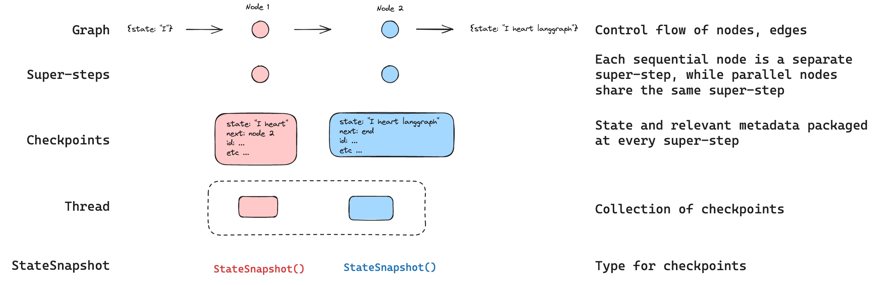

# Persistence

LangGraph has a built-in persistence layer, implemented through checkpointers. When you compile graph with a checkpointer, the checkpointer saves a `checkpoint` of the graph state at every super-step. Those checkpoints are saved to a `thread`, which can be accessed after graph execution. Because `threads` allow access to graph's state after execution, several powerful capabilities including human-in-the-loop, memory, time travel, and fault-tolerance are all possible. See [this how-to guide](../how-tos/persistence.ipynb) for an end-to-end example on how to add and use checkpointers with your graph. Below, we'll discuss each of these concepts in more detail. 



## Threads

 A thread is a unique ID or [thread identifier](#threads) assigned to a series of checkpoints saved by a checkpointer. Each checkpoint saved by the checkpointer is a `StateSnapshot` object. `StateSnapshots` have the following key properties:

- `config`: Config associated with this checkpoint. 
- `metadata`: Metadata associated with this checkpoint.
- `values`: Values of the state channels at this point in time.
- `next` A tuple of the node names to execute next in the graph.
- `tasks`: A tuple of `PregelTask` objects that contain information about next tasks to be executed. If the step was previously attempted, it will include error information. If a graph was interrupted [dynamically](../how-tos/human_in_the_loop/dynamic_breakpoints.ipynb) from within a node, tasks will contain additional data associated with interrupts.

### Checkpoints 

Let's see what checkpoints are saved when a simple graph is invoked as follows:

```python
from langgraph.graph import StateGraph, START, END
from langgraph.checkpoint.memory import MemorySaver
from typing import TypedDict, Annotated
from operator import add

class State(TypedDict):
    foo: int
    bar: Annotated[list[str], add]

def node_a(state: State):
    return {"foo": "a", "bar": ["a"]}

def node_b(state: State):
    return {"foo": "b", "bar": ["b"]}


workflow = StateGraph(State)
workflow.add_node(node_a)
workflow.add_node(node_b)
workflow.add_edge(START, "node_a")
workflow.add_edge("node_a", "node_b")
workflow.add_edge("node_b", END)

checkpointer = MemorySaver()
graph = workflow.compile(checkpointer=checkpointer)

config = {"configurable": {"thread_id": "1"}}
graph.invoke({"foo": ""}, config)
```

After we run the graph, we expect to see exactly 4 checkpoints:

* empty checkpoint with `START` as the next node to be executed
* checkpoint with the user input `{'foo': '', 'bar': []}` and `node_a` as the next node to be executed
* checkpoint with the outputs of `node_a` `{'foo': 'a', 'bar': ['a']}` and `node_b` as the next node to be executed
* checkpoint with the outputs of `node_b` `{'foo': 'b', 'bar': ['a', 'b']}` and no next nodes to be executed

Note that we `bar` channel values contain outputs from both nodes as we have a reducer for `bar` channel.

### Get state

When interacting with the saved graph state, you **must** specify a [thread identifier](#threads). You can view the *latest* state of the graph by calling `graph.get_state(config)`. This will return a `StateSnapshot` object that corresponds to the latest checkpoint associated with the thread ID provided in the config or a checkpoint associated with a checkpoint ID for the thread, if provided.

```python
# get the latest state snapshot
config = {"configurable": {"thread_id": "1"}}
graph.get_state(config)

# get a state snapshot for a specific checkpoint_id
config = {"configurable": {"thread_id": "1", "checkpoint_id": "1ef663ba-28fe-6528-8002-5a559208592c"}}
graph.get_state(config)
```

In our example, the output of `get_state` will look like this:

```
StateSnapshot(
    values={'foo': 'b', 'bar': ['a', 'b']},
    next=(),
    config={'configurable': {'thread_id': '1', 'checkpoint_ns': '', 'checkpoint_id': '1ef663ba-28fe-6528-8002-5a559208592c'}},
    metadata={'source': 'loop', 'writes': {'node_b': {'foo': 'b', 'bar': ['b']}}, 'step': 2},
    created_at='2024-08-29T19:19:38.821749+00:00',
    parent_config={'configurable': {'thread_id': '1', 'checkpoint_ns': '', 'checkpoint_id': '1ef663ba-28f9-6ec4-8001-31981c2c39f8'}}, tasks=()
)
```

### Get state history

You can get the full history of the graph execution for a given thread by calling `graph.get_state_history(config)`. This will return a list of `StateSnapshot` objects associated with the thread ID provided in the config. Importantly, the checkpoints will be ordered chronologically with the most recent checkpoint / `StateSnapshot` being the first in the list.

```python
config = {"configurable": {"thread_id": "1"}}
list(graph.get_state_history(config))
```

In our example, the output of `get_state_history` will look like this:

```
[
    StateSnapshot(
        values={'foo': 'b', 'bar': ['a', 'b']},
        next=(),
        config={'configurable': {'thread_id': '1', 'checkpoint_ns': '', 'checkpoint_id': '1ef663ba-28fe-6528-8002-5a559208592c'}},
        metadata={'source': 'loop', 'writes': {'node_b': {'foo': 'b', 'bar': ['b']}}, 'step': 2},
        created_at='2024-08-29T19:19:38.821749+00:00',
        parent_config={'configurable': {'thread_id': '1', 'checkpoint_ns': '', 'checkpoint_id': '1ef663ba-28f9-6ec4-8001-31981c2c39f8'}},
        tasks=(),
    ),
    StateSnapshot(
        values={'foo': 'a', 'bar': ['a']}, next=('node_b',),
        config={'configurable': {'thread_id': '1', 'checkpoint_ns': '', 'checkpoint_id': '1ef663ba-28f9-6ec4-8001-31981c2c39f8'}},
        metadata={'source': 'loop', 'writes': {'node_a': {'foo': 'a', 'bar': ['a']}}, 'step': 1},
        created_at='2024-08-29T19:19:38.819946+00:00',
        parent_config={'configurable': {'thread_id': '1', 'checkpoint_ns': '', 'checkpoint_id': '1ef663ba-28f4-6b4a-8000-ca575a13d36a'}},
        tasks=(PregelTask(id='6fb7314f-f114-5413-a1f3-d37dfe98ff44', name='node_b', error=None, interrupts=()),),
    ),
    StateSnapshot(
        values={'foo': '', 'bar': []},
        next=('node_a',),
        config={'configurable': {'thread_id': '1', 'checkpoint_ns': '', 'checkpoint_id': '1ef663ba-28f4-6b4a-8000-ca575a13d36a'}},
        metadata={'source': 'loop', 'writes': None, 'step': 0},
        created_at='2024-08-29T19:19:38.817813+00:00',
        parent_config={'configurable': {'thread_id': '1', 'checkpoint_ns': '', 'checkpoint_id': '1ef663ba-28f0-6c66-bfff-6723431e8481'}},
        tasks=(PregelTask(id='f1b14528-5ee5-579c-949b-23ef9bfbed58', name='node_a', error=None, interrupts=()),),
    ),
    StateSnapshot(
        values={'bar': []},
        next=('__start__',),
        config={'configurable': {'thread_id': '1', 'checkpoint_ns': '', 'checkpoint_id': '1ef663ba-28f0-6c66-bfff-6723431e8481'}},
        metadata={'source': 'input', 'writes': {'foo': ''}, 'step': -1},
        created_at='2024-08-29T19:19:38.816205+00:00',
        parent_config=None,
        tasks=(PregelTask(id='6d27aa2e-d72b-5504-a36f-8620e54a76dd', name='__start__', error=None, interrupts=()),),
    )
]
```


### Replay

With access to state, it's possible to play-back a prior graph execution. When invoking graph with a checkpointer, you **must** specify a `thread_id` and optionally a `checkpoint_id`.

* `thread_id` is simply the ID of a thread. This is always required.
* `checkpoint_id` can optionally be passed. This identifier refers to a specific checkpoint within a thread. This can be used to start of a run of a graph from some point halfway through a thread.

You must pass these when invoking the graph as part of the `configurable` portion of the config:

```python
# {"configurable": {"thread_id": "1"}}  # valid config
# {"configurable": {"thread_id": "1", "checkpoint_id": "0c62ca34-ac19-445d-bbb0-5b4984975b2a"}}  # also valid config

config = {"configurable": {"thread_id": "1"}}
graph.invoke(inputs, config=config)
```

If we `invoke` or `stream` a graph with a `thread_id` specified, the graph will execute from the current (most recent) checkpoint. Alternatively, if we supply a `checkpoint_id`, then we will re-play the graph from that checkpoint.

Importantly, LangGraph knows whether a particular checkpoint has been executed previously. If it has, LangGraph simply *re-plays* that particular step in the graph and does not re-execute the step. See this [how to guide on time-travel to learn more about replaying](../how-tos/human_in_the_loop/time-travel.ipynb).


### Update state

In addition to re-playing the graph from specific `checkpoints`, we can also *edit* the graph state. We do this using `graph.update_state()`. This method three different arguments:

#### `config`

The config should contain `thread_id` specifying which thread to update. When only the `thread_id` is passed, we update (or fork) the current state. Optionally, if we include `checkpoint_id` field, then we fork that selected checkpoint.

#### `values`

These are the values that will be used to update the state. Note that this update is treated exactly as any update from a node is treated. This means that these values will be passed to the [reducer](./low_level.md#reducers) functions, if they are defined for some of the channels in the graph state. This means that `update_state` does NOT automatically overwrite the channel values for every channel, but only for the channels without reducers. Let's walk through an example.

Let's assume you have defined the state of your graph with the following schema (see full example above):

```python
from typing import TypedDict, Annotated
from operator import add

class State(TypedDict):
    foo: int
    bar: Annotated[list[str], add]
```

Let's now assume the current state of the graph is

```
{"foo": 1, "bar": ["a"]}
```

If you update the state as below:

```
graph.update_state(config, {"foo": 2, "bar": ["b"]})
```

Then the new state of the graph will be:

```
{"foo": 2, "bar": ["a", "b"]}
```

The `foo` key (channel) is completely changed (because there is no reducer specified for that channel, so `update_state` overwrites it). However, there is a reducer specified for the `bar` key, and so it appends `"b"` to the state of `bar`.

#### `as_node`

The final thing you can optionally specify when calling `update_state` is `as_node`. If you provided it, the update will be applied as if it came from node `as_node`. If `as_node` is not provided, it will be set to the last node that updated the state, if not ambiguous. The reason this matters is that the next steps to execute depend on the last node to have given an update, so this can be used to control which node executes next. See this [how to guide on time-travel to learn more about forking state](../how-tos/human_in_the_loop/time-travel.ipynb).


## Checkpointer libraries

Under the hood, checkpointing is powered by checkpointer objects that conform to [BaseCheckpointSaver][basecheckpointsaver] interface. LangGraph provides several checkpointer implementations, all implemented via standalone, installable libraries:

* `langgraph-checkpoint`: The base interface for checkpointer savers ([BaseCheckpointSaver][basecheckpointsaver]) and serialization/deserialization interface ([SerializerProtocol][serializerprotocol]). Includes in-memory checkpointer implementation ([MemorySaver][memorysaver]) for experimentation. LangGraph comes with `langgraph-checkpoint` included.
* `langgraph-checkpoint-sqlite`: An implementation of LangGraph checkpointer that uses SQLite database ([SqliteSaver][sqlitesaver] / [AsyncSqliteSaver][asyncsqlitesaver]). Ideal for experimentation and local workflows. Needs to be installed separately.
* `langgraph-checkpoint-postgres`: An advanced checkpointer that uses Postgres database ([PostgresSaver][postgressaver] / [AsyncPostgresSaver][asyncpostgressaver]), used in LangGraph Cloud. Ideal for using in production. Needs to be installed separately.

### Checkpointer interface

Each checkpointer conforms to [BaseCheckpointSaver][basecheckpointsaver] interface and implements the following methods:

* `.put` - Store a checkpoint with its configuration and metadata.  
* `.put_writes` - Store intermediate writes linked to a checkpoint (i.e. [pending writes](#pending-writes)).  
* `.get_tuple` - Fetch a checkpoint tuple using for a given configuration (`thread_id` and `checkpoint_id`). This is used to populate `StateSnapshot` in `graph.get_state()`.  
* `.list` - List checkpoints that match a given configuration and filter criteria. This is used to populate state history in `graph.get_state_history()`

If the checkpointer is used with asynchronous graph execution (i.e. executing the graph via `.ainvoke`, `.astream`, `.abatch`), asynchronous versions of the above methods will be used (`.aput`, `.aput_writes`, `.aget_tuple`, `.alist`).

!!! note Note
    For running your graph asynchronously, you can use `MemorySaver`, or async versions of Sqlite/Postgres checkpointers -- `AsyncSqliteSaver` / `AsyncPostgresSaver` checkpointers.

### Serializer

When checkpointers save the graph state, they need to serialize the channel values in the state. This is done using serializer objects. 
`langgraph_checkpoint` defines [protocol][serializerprotocol] for implementing serializers provides a default implementation ([JsonPlusSerializer][jsonplusserializer]) that handles a wide variety of types, including LangChain and LangGraph primitives, datetimes, enums and more.

## Capabilities

### Human-in-the-loop

First, checkpointers facilitate [human-in-the-loop workflows](agentic_concepts.md#human-in-the-loop) workflows by allowing humans to inspect, interrupt, and approve graph steps. Checkpointers are needed for these workflows as the human has to be able to view the state of a graph at any point in time, and the graph has to be to resume execution after the human has made any updates to the state. See [these how-to guides](../how-tos/human_in_the_loop/breakpoints.ipynb) for concrete examples.

### Memory

Second, checkpointers allow for ["memory"](agentic_concepts.md#memory) between interactions.  In the case of repeated human interactions (like conversations) any follow up messages can be sent to that thread, which will retain its memory of previous ones. See [this how-to guide](../how-tos/memory/manage-conversation-history.ipynb) for an end-to-end example on how to add and manage conversation memory using checkpointers.

### Time Travel

Third, checkpointers allow for ["time travel"](../how-tos/human_in_the_loop/time-travel.ipynb), allowing users to replay prior graph executions to review and / or debug specific graph steps. In addition, checkpointers make it possible to fork the graph state at arbitrary checkpoints to explore alternative trajectories.

### Fault-tolerance

Lastly, checkpointing also provides fault-tolerance and error recovery: if one or more nodes fail at a given superstep, you can restart your graph from the last successful step. Additionally, when a graph node fails mid-execution at a given superstep, LangGraph stores pending checkpoint writes from any other nodes that completed successfully at that superstep, so that whenever we resume graph execution from that superstep we don't re-run the successful nodes.