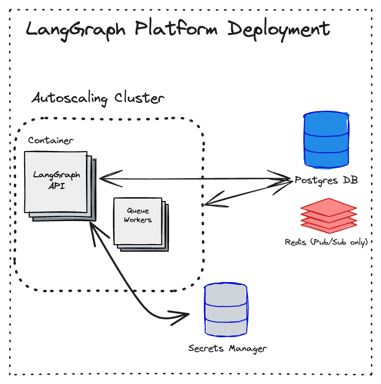

# LangGraph Platform Architecture

## How we use Postgres

Postgres is the persistence layer for all user and run data in LGP. This stores both checkpoints (see more info [here](./persistence.md)) as well as the server resources (threads, runs, assistants and crons).

## How we use Redis

Redis is used in each LGP deployment as a way for server and queue workers to communicate, and to store ephemeral metadata, more details on both below. No user/run data is stored in Redis.

### Communication

All runs in LGP are executed by the pool of background workers that are part of each deployment. In order to enable some features for those runs (such as cancellation and output streaming) we need a channel for two-way communication between the server and the worker handling a particular run. We use Redis to organize that communication.

1. A Redis list is used as a mechanism to wake up a worker as soon as a new run is created. Only a sentinel value is stored in this list, no actual run info. The run information is then retrieved from Postgres by the worker.
2. A combination of a Redis string and Redis PubSub channel is used for the server to communicate a run cancellation request to the appropriate worker.
3. A Redis PubSub channel is used by the worker to broadcast streaming output from an agent while the run is being handled. Any open `/stream` request in the server will subscribe to that channel and forward any events to the response as they arrive. No events are stored in Redis at any time.

### Ephemeral metadata

Runs in an LGP deployment may be retried for specific failures (currently only for transient Postgres errors encountered during the run). In order to limit the number of retries (currently limited to 3 attempts per run) we record the attempt number in a Redis string when is picked up. This contains no run-specific info other than its ID, and expires after a short delay.
