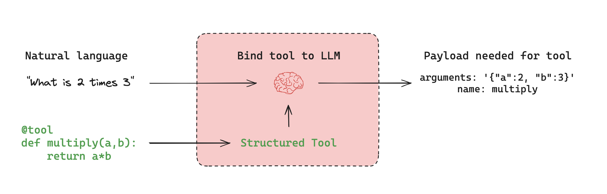

# Tools

Many AI applications interact with users via natural language. However, some use cases require models to interface directly with external systems—such as APIs, databases, or file systems—using structured input. In these scenarios, [tool calling](../how-tos/tool-calling.md) enables models to generate requests that conform to a specified input schema.

:::python
**Tools** encapsulate a callable function and its input schema. These can be passed to compatible [chat models](https://python.langchain.com/docs/concepts/chat_models), allowing the model to decide whether to invoke a tool and with what arguments.
:::

:::js
**Tools** encapsulate a callable function and its input schema. These can be passed to compatible [chat models](https://js.langchain.com/docs/concepts/chat_models), allowing the model to decide whether to invoke a tool and with what arguments.
:::

## Tool calling



Tool calling is typically **conditional**. Based on the user input and available tools, the model may choose to issue a tool call request. This request is returned in an `AIMessage` object, which includes a `tool_calls` field that specifies the tool name and input arguments:

:::python

```python
llm_with_tools.invoke("What is 2 multiplied by 3?")
# -> AIMessage(tool_calls=[{'name': 'multiply', 'args': {'a': 2, 'b': 3}, ...}])
```

```
AIMessage(
  tool_calls=[
    ToolCall(name="multiply", args={"a": 2, "b": 3}),
    ...
  ]
)
```

:::

:::js

```typescript
await llmWithTools.invoke("What is 2 multiplied by 3?");
```

```
AIMessage {
  tool_calls: [
    ToolCall {
      name: "multiply",
      args: { a: 2, b: 3 },
      ...
    },
    ...
  ]
}
```

:::

If the input is unrelated to any tool, the model returns only a natural language message:

:::python

```python
llm_with_tools.invoke("Hello world!")  # -> AIMessage(content="Hello!")
```

:::

:::js

```typescript
await llmWithTools.invoke("Hello world!"); // { content: "Hello!" }
```

:::

Importantly, the model does not execute the tool—it only generates a request. A separate executor (such as a runtime or agent) is responsible for handling the tool call and returning the result.

See the [tool calling guide](../how-tos/tool-calling.md) for more details.

## Prebuilt tools

LangChain provides prebuilt tool integrations for common external systems including APIs, databases, file systems, and web data.

:::python
Browse the [integrations directory](https://python.langchain.com/docs/integrations/tools/) for available tools.
:::

:::js
Browse the [integrations directory](https://js.langchain.com/docs/integrations/tools/) for available tools.
:::

Common categories:

- **Search**: Bing, SerpAPI, Tavily
- **Code execution**: Python REPL, Node.js REPL
- **Databases**: SQL, MongoDB, Redis
- **Web data**: Scraping and browsing
- **APIs**: OpenWeatherMap, NewsAPI, etc.

## Custom tools

:::python
You can define custom tools using the `@tool` decorator or plain Python functions. For example:

```python
from langchain_core.tools import tool

@tool
def multiply(a: int, b: int) -> int:
    """Multiply two numbers."""
    return a * b
```

:::

:::js
You can define custom tools using the `tool` function. For example:

```typescript
import { tool } from "@langchain/core/tools";
import { z } from "zod";

const multiply = tool(
  (input) => {
    return input.a * input.b;
  },
  {
    name: "multiply",
    description: "Multiply two numbers.",
    schema: z.object({
      a: z.number(),
      b: z.number(),
    }),
  }
);
```

:::

See the [tool calling guide](../how-tos/tool-calling.md) for more details.

## Tool execution

While the model determines when to call a tool, execution of the tool call must be handled by a runtime component.

LangGraph provides prebuilt components for this:

:::python

- @[`ToolNode`][ToolNode]: A prebuilt node that executes tools.
- @[`create_react_agent`][create_react_agent]: Constructs a full agent that manages tool calling automatically.
:::

:::js

- @[ToolNode]: A prebuilt node that executes tools.
- @[`createReactAgent`][create_react_agent]: Constructs a full agent that manages tool calling automatically.
:::
