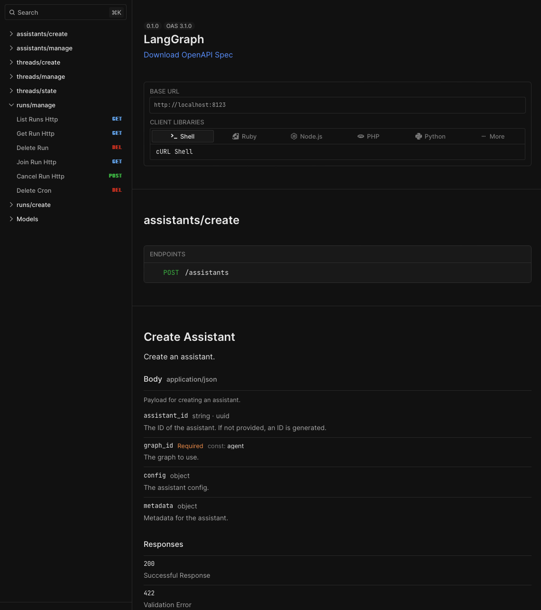

# Deploy custom LangGraph code with Hosted LangGraph API (Python)

## Set up your application code

### Install required tools

```bash
pip install -U langgraph langchain_openai

: 'these instructions are for mac, but use an equivalent for linux/pc'
brew install gh
```

### Create a new application

To create a new app called <my-app> create a directory with the following structure

```
<my-app>/
|-- agent.py            # code for your LangGraph agent
|-- requirements.txt    # python packages required for your graph
|-- langgraph.json      # configuration file for langgraph
|-- .env                # environment files with API keys
```

### Agent File

In your agent file, you can define as many graphs (agents) as you would like. For our example we are going to create the simplest graph possible: a one node graph. You can read about adding more complexity to your graphs in the [docs](https://langchain-ai.github.io/langgraph/tutorials/introduction/).

Here is what our `agent.py` file looks like for this example:

```python
from langchain_openai import ChatOpenAI
from langgraph.graph import END, MessageGraph

model = ChatOpenAI(temperature=0)

graph_workflow = MessageGraph()

graph_workflow.add_node("oracle", model)
graph_workflow.add_edge("oracle", END)

graph_workflow.set_entry_point("oracle")
graph = graph_workflow.compile()
```

### Configuration file

- `langgraph.json` is a configuration file with three parts:
    - `graphs`
        - Pass in the graphs you want to host on your deployment, using the graph_id as the key and the path to the agent (a CompiledGraph) as the value. In our example we only use one graph, so the json looks like so:
            
            ```json
            "graphs": {
                "agent": "./agent.py:graph"
              }, 
            ```
            
    - `dependencies`
        - Pass in a list of the dependencies you would like to be installed in order to host your app. In our case, we don’t need any additional dependencies besides our `requirements.txt` file, but if we did we could append them to the dependencies list using the names of the additional packages we want installed.
            
            ```json
            "dependencies": ["."],
            ```
            
    - `env`
        - This is simply a path to our environment file containing all variables/files to load.
            
            ```json
            "env": ".env"
            ```
            

Putting it all together, our `langgraph.json` file should look like this:

```json
{
  "dependencies": ["."],
  "graphs": {
    "agent": "./agent.py:agent"
  },
  "env": ".env"
}
```

### Environment and Package Requirement files

- The `.env` contains any environment variables that are needed to run your code. In our example the file looks like follows:

```python
OPENAI_API_KEY= ...
LANGCHAIN_API_KEY= ...
LANGCHAIN_TRACING_V2=true
```

- The `requirements.txt` file lists python package dependencies for your project (along with the associated versions if neccesary). In our example the file looks like this:
    
    ```
    langgraph
    langchain_openai
    ```

### Push your code to GitHub

Create a git repo in the `<my-app>` directory, and verify it’s existence. You can use the Github CLI if you like, or just create a repo manually.

## Host your code on Hosted LangGraph

### Deploy from GitHub with Hosted LangGraph

Head to LangSmith and click on the 🚀 emoji on the left navbar to create a new deployment. Click the `+ New Deployment` button. 

***If you have not deployed to Hosted LangGraph before:*** there will be a button that shows up saying Import from GitHub. You’ll need to follow that flow to connect hosted LangGraph to GitHub.

***Once you have set up your GitHub connection:*** the new deployment page will look as follows


To deploy your application, you should do the following:

1. Select your github username or organization from the selector
2. Search for your repo to deploy in the search bar and select it
3. Choose any name
4. In the `LangGraph API config file` field, enter the path to your `langgraph.json` file (if left blank langsmith will automatically search for it on deployment)
5. For Git Reference, you can select either the git branch for the code you want to deploy, or the exact commit SHA. 
6. If your chain relies on environment variables (for example, an OPENAI_API_KEY), add those in. They will be propagated to the underlying server so your code can access them.

Putting this all together, you should have something as follows for your deployment details:


Hit `Submit` and your application will start deploying!

## Inspect Traces + Monitor Service

### Deployments View

After your deployment is complete, your deployments page should look as follows:


You can see that by default, you get access to the `Trace Count` monitoring chart and `Recent Traces` run view. These are powered by LangSmith. 

You can click on `All Charts` to view all monitoring info for your server, or click on `See tracing project` to get more information on an individual trace.

### Access the Docs

You can access the docs by clicking on the API DOCS link, which should send you to a page that looks like this:



You won’t actually be able to test any of the API endpoints without authorizing first. To do so, click on the Authorize button in the top right corner, input your `LANGCHAIN_API_KEY`  in the `API Key` box, and then click `Authorize`  to finish the process. You should now be able to select any of the API endpoints, click `Try it out` , enter the parameters you would like to pass, and then click `Execute` to view the results of the API call.

## Interact with your deployment via LangGraph Studio

### Access Studio

If you click on your deployment you should see a blue button in the top right that says `LangGraph Studio` . Clicking on this button will take you to a page that looks like this:


On this page you can test out your graph by passing in starting states and clicking `Start Run`  (this should behave identically to calling `.invoke` ). You will then be able to look into the execution thread for each run and explore the steps your graph is taking to produce its output.

## Deploy new code

To deploy new code that you push to GIthub, simply navigate to the deployments page, and hit `+ New Revision` . Hosted LangGraph releases what it calls a new “revision” every time you deploy code. Therefore, your first deployment automatically showed revisions. A Revision always corresponds to a new piece of code being deployed. A modal will pop up to enter new revision info. This can be thought of as a partial update on the last revision, so you do not need to enter any fields that didn’t change (*note: environment variables are not saved between revisions, you must re-enter them for each new revision)*.