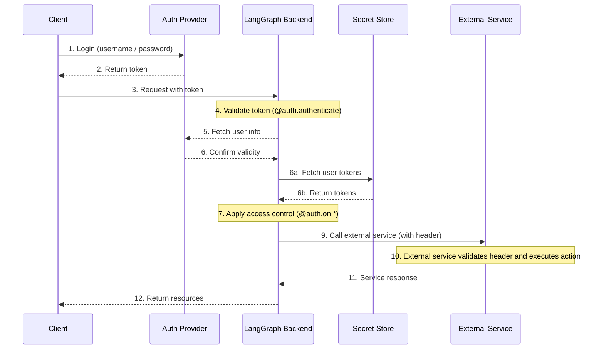
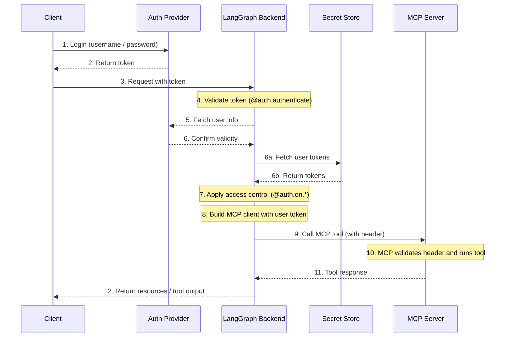

# Agent Authentication On User Behalf

!!! tip Prerequisites
    This document assumes you're familair with adding [custom authentication](https://langchain-ai.github.io/langgraph/how-tos/auth/custom_auth/) to your LangGraph Platform Deployments
    Once you've added custom auth, you can access the object that your custom auth handler returns in your graph with the `langgraph_auth_user` key like so:

    ```python
        def get_user_config_node(state, config):
            user_config = config["configurable"].get("langgraph_auth_user")
            # token was resolved during the @auth.authenticate function
            token = user_config.get("github_token","") 
            ...
    ```

## Overview

When you run an agent on LangGraph Platform (cloud or self-hosted), the platform handles authentication for every request through authentication middleware.

After authentication, the platform creates a special configuration object that is passed to your graph and and all nodes via the configurable context.
This object contains information about the current user, including any custom fields you return from your [`@auth.authenticate`](../cloud/reference/sdk/python_sdk_ref.md#langgraph_sdk.auth.Auth.authenticate) handler.

User-based authentication to allow an agent to act on behalf of the user to interact with external systems - ie. MCP servers, external databases and even other agents - should be enabled by leveraging [custom authentication middleware](https://langchain-ai.github.io/langgraph/how-tos/auth/custom_auth/).


!!! note Custom Authentication
    **Without a custom** `@auth.authenticate` **handler**, LangGraph sees only the API-key owner (usually the developer), so requests aren’t scoped to individual end-users.
    To propagate custom tokens, you **must** implement your own handler as discussed below.


## Architecture




## Leveraging Custom Auth In Your Deployments

To leverage custom authentication and access user-level metadata in our deployments, you need to **populate the** `config["configurable"]["langgraph_auth_user"]` **object through a custom authentication handler**.

- This handler receives the request (headers, etc.), validates the user, and returns a dictionary with at least an identity field.
- You can add any custom fields you want (e.g., OAuth tokens, roles, org IDs, etc.).


```python
from langgraph_sdk import Auth
import requests

auth = Auth()

def is_valid_key(api_key: str) -> bool:
    is_valid = # your API key validation logic
    return is_valid

@auth.authenticate
async def authenticate(headers: dict) -> Auth.types.MinimalUserDict:
    api_key = headers.get("x-api-key")
    if not api_key or not is_valid_key(api_key):
        raise Auth.exceptions.HTTPException(status_code=401, detail="Invalid API key")
    
    # Fetch user-specific tokens from your secret store  
    user_tokens = await fetch_user_tokens(api_key)

    return {
        "identity": api_key,  #  fetch user ID from LangSmith 
        "github_token" : user_tokens.github_token
        "jira_token" : user_tokens.jira_token
        # ... custom fields/secrets here
    }
```

This user-scoped object is now automatically available in the `config` passed to your LangGraph Platform deployment. Accessing it to allow the agent to perform authenticated actions on behalf of the user is made possible by leveraging this object:

```python
    def get_user_config_node(state, config):
        user_config = config["configurable"].get("langgraph_auth_user")
        # token was resolved during the @auth.authenticate function above
        token = user_config.get("github_token","") 
        
        ...
```

### Authenticating to an MCP server & accessing tools

An example of how you can leverage this custom authentication middleware is by authenticating a user with an MCP server to get access to user-scoped tools within your LangGraph Platform deployment. 

An archictecture for this flow that inherits from the more generic case above could be as follows:


<br>

To get user-scoped tools available to our LangGraph platform deployments, you would start with implementing a snippet like below: 

```python
from langchain_mcp_adapters.client import MultiServerMCPClient

def get_mcp_tools_node(state, config):
    user = config["configurable"].get("langgraph_auth_user")
		 # e.g., user["github_token"], user["email"], etc.
		
    client = MultiServerMCPClient({
        "github": {
            "transport": "streamable_http",
            "url": "https://my-github-mcp-server/mcp", # Your MCP server URL
            "headers": {
                "Authorization": f"Bearer {user['github_token']}" 
            }
        }
    })
    tools = await client.get_tools() # Get available tools from our MCP server
    return {"tools": tools}
	
```


!!! note Supported Transport Types
    MCP only supports adding headers to requests made to **streamable HTTP** and **sse** `transport` servers.


### Updating your `langgraph.json` file

After implementing a custom authentication handler, you must tell LangGraph platform where to find the new middleware logic. Update your `langgraph.json` file to include the following `auth` field:

```json
    {
      "dependencies": ["."],
      "graphs": {
        "agent": "./my_agent/agent.py:graph"
      },
      "env": ".env",
      "auth": {
        "path": "./auth.py:my_auth"
      }
```

## Security 


!!! note Note
    Connecting to your own secret store that implements these best practices like key rotation and encryption is highly recommended.

    Storing tokens in graph state is not recommended


## Next Steps

For additional documentation and implementation details, check out the links below

[LangGraph Platform Auth Overview](https://langchain-ai.github.io/langgraph/concepts/auth/)

[Adding custom authentication](https://langchain-ai.github.io/langgraph/how-tos/auth/custom_auth/)

[Use MCP in your LangGraph Deployments](https://langchain-ai.github.io/langgraph/agents/mcp/)


