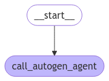

# How to integrate LangGraph with AutoGen, CrewAI, and other frameworks

This guide shows how to integrate AutoGen agents with LangGraph to leverage features like persistence, streaming, and memory, and then deploy the integrated solution to LangGraph Platform for scalable production use. In this guide we show how to build a LangGraph chatbot that integrates with AutoGen, but you can follow the same approach with other frameworks.

Integrating AutoGen with LangGraph provides several benefits:

- Enhanced features: Add [persistence](../concepts/persistence.md), [streaming](../concepts/streaming.md), [short and long-term memory](../concepts/memory.md) and more to your AutoGen agents.
- Multi-agent systems: Build [multi-agent systems](../concepts/multi_agent.md) where individual agents are built with different frameworks.
- Production deployment: Deploy your integrated solution to [LangGraph Platform](../concepts/langgraph_platform.md) for scalable production use.

## Prerequisites

- Python 3.9+
- Autogen: `pip install autogen`
- LangGraph: `pip install langgraph`
- OpenAI API key

## Setup

Set your your environment:

```python
import getpass
import os


def _set_env(var: str):
    if not os.environ.get(var):
        os.environ[var] = getpass.getpass(f"{var}: ")


_set_env("OPENAI_API_KEY")
```

## 1. Define AutoGen agent

Create an AutoGen agent that can execute code. This example is adapted from AutoGen's [official tutorials](https://github.com/microsoft/autogen/blob/0.2/notebook/agentchat_web_info.ipynb):

```python
import autogen
import os

config_list = [{"model": "gpt-4o", "api_key": os.environ["OPENAI_API_KEY"]}]

llm_config = {
    "timeout": 600,
    "cache_seed": 42,
    "config_list": config_list,
    "temperature": 0,
}

autogen_agent = autogen.AssistantAgent(
    name="assistant",
    llm_config=llm_config,
)

user_proxy = autogen.UserProxyAgent(
    name="user_proxy",
    human_input_mode="NEVER",
    max_consecutive_auto_reply=10,
    is_termination_msg=lambda x: x.get("content", "").rstrip().endswith("TERMINATE"),
    code_execution_config={
        "work_dir": "web",
        "use_docker": False,
    },  # Please set use_docker=True if docker is available to run the generated code. Using docker is safer than running the generated code directly.
    llm_config=llm_config,
    system_message="Reply TERMINATE if the task has been solved at full satisfaction. Otherwise, reply CONTINUE, or the reason why the task is not solved yet.",
)
```

## 2. Create the graph

We will now create a LangGraph chatbot graph that calls AutoGen agent.

```python
from langchain_core.messages import convert_to_openai_messages
from langgraph.graph import StateGraph, MessagesState, START
from langgraph.checkpoint.memory import InMemorySaver

def call_autogen_agent(state: MessagesState):
    # Convert LangGraph messages to OpenAI format for AutoGen
    messages = convert_to_openai_messages(state["messages"])
    
    # Get the last user message
    last_message = messages[-1]
    
    # Pass previous message history as context (excluding the last message)
    carryover = messages[:-1] if len(messages) > 1 else []
    
    # Initiate chat with AutoGen
    response = user_proxy.initiate_chat(
        autogen_agent,
        message=last_message,
        carryover=carryover
    )
    
    # Extract the final response from the agent
    final_content = response.chat_history[-1]["content"]
    
    # Return the response in LangGraph format
    return {"messages": {"role": "assistant", "content": final_content}}

# Create the graph with memory for persistence
checkpointer = InMemorySaver()

# Build the graph
builder = StateGraph(MessagesState)
builder.add_node("autogen", call_autogen_agent)
builder.add_edge(START, "autogen")

# Compile with checkpointer for persistence
graph = builder.compile(checkpointer=checkpointer)
```

```python
from IPython.display import display, Image

display(Image(graph.get_graph().draw_mermaid_png()))
```



## 3. Test the graph locally

Before deploying to LangGraph Platform, you can test the graph locally:

```python
# pass the thread ID to persist agent outputs for future interactions
# highlight-next-line
config = {"configurable": {"thread_id": "1"}}

for chunk in graph.stream(
    {
        "messages": [
            {
                "role": "user",
                "content": "Find numbers between 10 and 30 in fibonacci sequence",
            }
        ]
    },
    # highlight-next-line
    config,
):
    print(chunk)
```

**Output:**
```
user_proxy (to assistant):

Find numbers between 10 and 30 in fibonacci sequence

--------------------------------------------------------------------------------
assistant (to user_proxy):

To find numbers between 10 and 30 in the Fibonacci sequence, we can generate the Fibonacci sequence and check which numbers fall within this range. Here's a plan:

1. Generate Fibonacci numbers starting from 0.
2. Continue generating until the numbers exceed 30.
3. Collect and print the numbers that are between 10 and 30.

...
```

Since we're leveraging LangGraph's [persistence](https://langchain-ai.github.io/langgraph/concepts/persistence/) features we can now continue the conversation using the same thread ID -- LangGraph will automatically pass previous history to the AutoGen agent:

```python
for chunk in graph.stream(
    {
        "messages": [
            {
                "role": "user",
                "content": "Multiply the last number by 3",
            }
        ]
    },
    # highlight-next-line
    config,
):
    print(chunk)
```

**Output:**
```
user_proxy (to assistant):

Multiply the last number by 3
Context: 
Find numbers between 10 and 30 in fibonacci sequence
The Fibonacci numbers between 10 and 30 are 13 and 21. 

These numbers are part of the Fibonacci sequence, which is generated by adding the two preceding numbers to get the next number, starting from 0 and 1. 

The sequence goes: 0, 1, 1, 2, 3, 5, 8, 13, 21, 34, ...

As you can see, 13 and 21 are the only numbers in this sequence that fall between 10 and 30.

TERMINATE

--------------------------------------------------------------------------------
assistant (to user_proxy):

The last number in the Fibonacci sequence between 10 and 30 is 21. Multiplying 21 by 3 gives:

21 * 3 = 63

TERMINATE

--------------------------------------------------------------------------------
{'call_autogen_agent': {'messages': {'role': 'assistant', 'content': 'The last number in the Fibonacci sequence between 10 and 30 is 21. Multiplying 21 by 3 gives:\n\n21 * 3 = 63\n\nTERMINATE'}}}
``` 

## 4. Prepare for deployment

To deploy to LangGraph Platform, create a file structure like the following:

```
my-autogen-agent/
├── agent.py          # Your main agent code
├── requirements.txt  # Python dependencies
└── langgraph.json   # LangGraph configuration
```

=== "agent.py"

    ```python
    import os
    import autogen
    from langchain_core.messages import convert_to_openai_messages
    from langgraph.graph import StateGraph, MessagesState, START
    from langgraph.checkpoint.memory import InMemorySaver

    # AutoGen configuration
    config_list = [{"model": "gpt-4o", "api_key": os.environ["OPENAI_API_KEY"]}]

    llm_config = {
        "timeout": 600,
        "cache_seed": 42,
        "config_list": config_list,
        "temperature": 0,
    }

    # Create AutoGen agents
    autogen_agent = autogen.AssistantAgent(
        name="assistant",
        llm_config=llm_config,
    )

    user_proxy = autogen.UserProxyAgent(
        name="user_proxy",
        human_input_mode="NEVER",
        max_consecutive_auto_reply=10,
        is_termination_msg=lambda x: x.get("content", "").rstrip().endswith("TERMINATE"),
        code_execution_config={
            "work_dir": "/tmp/autogen_work",
            "use_docker": False,
        },
        llm_config=llm_config,
        system_message="Reply TERMINATE if the task has been solved at full satisfaction.",
    )

    def call_autogen_agent(state: MessagesState):
        """Node function that calls the AutoGen agent"""
        messages = convert_to_openai_messages(state["messages"])
        last_message = messages[-1]
        carryover = messages[:-1] if len(messages) > 1 else []
        
        response = user_proxy.initiate_chat(
            autogen_agent,
            message=last_message,
            carryover=carryover
        )
        
        final_content = response.chat_history[-1]["content"]
        return {"messages": {"role": "assistant", "content": final_content}}

    # Create and compile the graph
    def create_graph():
        checkpointer = InMemorySaver()
        builder = StateGraph(MessagesState)
        builder.add_node("autogen", call_autogen_agent)
        builder.add_edge(START, "autogen")
        return builder.compile(checkpointer=checkpointer)

    # Export the graph for LangGraph Platform
    graph = create_graph()
    ```

=== "requirements.txt"

    ```
    langgraph>=0.1.0
    ag2>=0.2.0
    langchain-core>=0.1.0
    langchain-openai>=0.0.5
    ```

=== "langgraph.json"

    ```json
    {
    "dependencies": ["."],
    "graphs": {
        "autogen_agent": "./agent.py:graph"
    },
    "env": ".env"
    }
    ```


## 5. Deploy to LangGraph Platform

Deploy the graph with the LangGraph Platform CLI:

```
pip install -U langgraph-cli
```

```
langgraph deploy --config langgraph.json 
```
