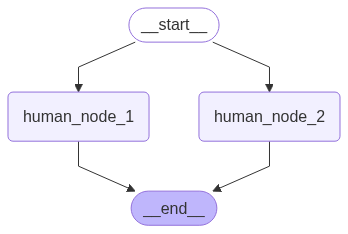
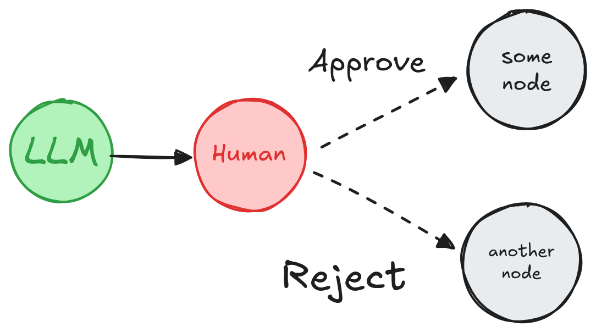
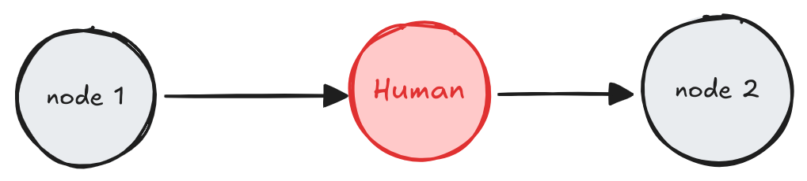
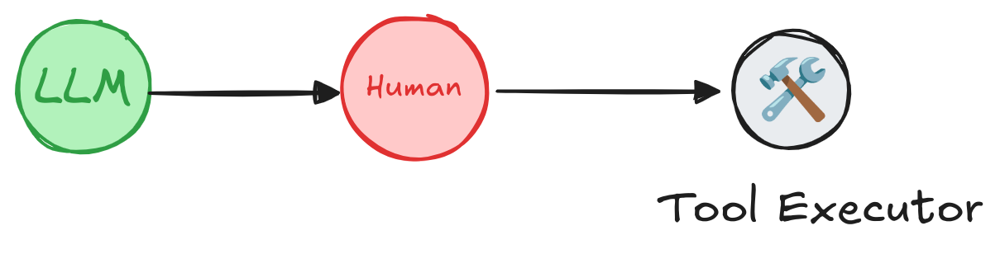
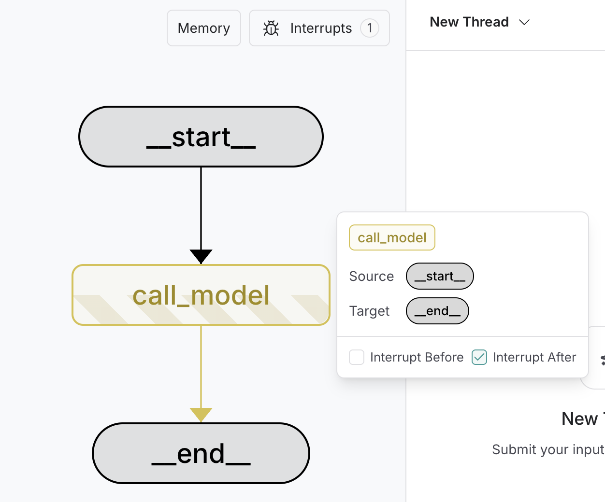

---
search:
  boost: 2
tags:
  - human-in-the-loop
  - hil
  - interrupt
hide:
  - tags
---

# Enable human intervention

To review, edit, and approve tool calls in an agent or workflow, use interrupts to pause a graph and wait for human input. Interrupts use LangGraph's [persistence](../../concepts/persistence.md) layer, which saves the graph state, to indefinitely pause graph execution until you resume.

!!! info

    For more information about human-in-the-loop workflows, see the [Human-in-the-Loop](../../concepts/human_in_the_loop.md) conceptual guide.

## Pause using `interrupt`

:::python
[Dynamic interrupts](../../concepts/human_in_the_loop.md#key-capabilities) (also known as dynamic breakpoints) are triggered based on the current state of the graph. You can set dynamic interrupts by calling @[`interrupt` function][interrupt] in the appropriate place. The graph will pause, which allows for human intervention, and then resumes the graph with their input. It's useful for tasks like approvals, edits, or gathering additional context.

!!! note

    As of v1.0, `interrupt` is the recommended way to pause a graph. `NodeInterrupt` is deprecated and will be removed in v2.0.

:::

:::js
[Dynamic interrupts](../../concepts/human_in_the_loop.md#key-capabilities) (also known as dynamic breakpoints) are triggered based on the current state of the graph. You can set dynamic interrupts by calling @[`interrupt` function][interrupt] in the appropriate place. The graph will pause, which allows for human intervention, and then resumes the graph with their input. It's useful for tasks like approvals, edits, or gathering additional context.
:::

To use `interrupt` in your graph, you need to:

1. [**Specify a checkpointer**](../../concepts/persistence.md#checkpoints) to save the graph state after each step.
2. **Call `interrupt()`** in the appropriate place. See the [Common Patterns](#common-patterns) section for examples.
3. **Run the graph** with a [**thread ID**](../../concepts/persistence.md#threads) until the `interrupt` is hit.
4. **Resume execution** using `invoke`/`stream` (see [**The `Command` primitive**](#resume-using-the-command-primitive)).

:::python

```python
# highlight-next-line
from langgraph.types import interrupt, Command

def human_node(state: State):
    # highlight-next-line
    value = interrupt( # (1)!
        {
            "text_to_revise": state["some_text"] # (2)!
        }
    )
    return {
        "some_text": value # (3)!
    }


graph = graph_builder.compile(checkpointer=checkpointer) # (4)!

# Run the graph until the interrupt is hit.
config = {"configurable": {"thread_id": "some_id"}}
result = graph.invoke({"some_text": "original text"}, config=config) # (5)!
print(result['__interrupt__']) # (6)!
# > [
# >    Interrupt(
# >       value={'text_to_revise': 'original text'},
# >       resumable=True,
# >       ns=['human_node:6ce9e64f-edef-fe5d-f7dc-511fa9526960']
# >    )
# > ]

# highlight-next-line
print(graph.invoke(Command(resume="Edited text"), config=config)) # (7)!
# > {'some_text': 'Edited text'}
```

1. `interrupt(...)` pauses execution at `human_node`, surfacing the given payload to a human.
2. Any JSON serializable value can be passed to the `interrupt` function. Here, a dict containing the text to revise.
3. Once resumed, the return value of `interrupt(...)` is the human-provided input, which is used to update the state.
4. A checkpointer is required to persist graph state. In production, this should be durable (e.g., backed by a database).
5. The graph is invoked with some initial state.
6. When the graph hits the interrupt, it returns an `Interrupt` object with the payload and metadata.
7. The graph is resumed with a `Command(resume=...)`, injecting the human's input and continuing execution.
   :::

:::js

```typescript
// highlight-next-line
import { interrupt, Command } from "@langchain/langgraph";

const graph = graphBuilder
  .addNode("humanNode", (state) => {
    // highlight-next-line
    const value = interrupt(
      // (1)!
      {
        textToRevise: state.someText, // (2)!
      }
    );
    return {
      someText: value, // (3)!
    };
  })
  .addEdge(START, "humanNode")
  .compile({ checkpointer }); // (4)!

// Run the graph until the interrupt is hit.
const config = { configurable: { thread_id: "some_id" } };
const result = await graph.invoke({ someText: "original text" }, config); // (5)!
console.log(result.__interrupt__); // (6)!
// > [
// >   {
// >     value: { textToRevise: 'original text' },
// >     resumable: true,
// >     ns: ['humanNode:6ce9e64f-edef-fe5d-f7dc-511fa9526960'],
// >     when: 'during'
// >   }
// > ]

// highlight-next-line
console.log(await graph.invoke(new Command({ resume: "Edited text" }), config)); // (7)!
// > { someText: 'Edited text' }
```

1. `interrupt(...)` pauses execution at `humanNode`, surfacing the given payload to a human.
2. Any JSON serializable value can be passed to the `interrupt` function. Here, an object containing the text to revise.
3. Once resumed, the return value of `interrupt(...)` is the human-provided input, which is used to update the state.
4. A checkpointer is required to persist graph state. In production, this should be durable (e.g., backed by a database).
5. The graph is invoked with some initial state.
6. When the graph hits the interrupt, it returns an object with `__interrupt__` containing the payload and metadata.
7. The graph is resumed with a `Command({ resume: ... })`, injecting the human's input and continuing execution.
   :::

??? example "Extended example: using `interrupt`"

    :::python
    ```python
    from typing import TypedDict
    import uuid
    from langgraph.checkpoint.memory import InMemorySaver
    from langgraph.constants import START
    from langgraph.graph import StateGraph

    # highlight-next-line
    from langgraph.types import interrupt, Command


    class State(TypedDict):
        some_text: str


    def human_node(state: State):
        # highlight-next-line
        value = interrupt(  # (1)!
            {
                "text_to_revise": state["some_text"]  # (2)!
            }
        )
        return {
            "some_text": value  # (3)!
        }


    # Build the graph
    graph_builder = StateGraph(State)
    graph_builder.add_node("human_node", human_node)
    graph_builder.add_edge(START, "human_node")
    checkpointer = InMemorySaver()  # (4)!
    graph = graph_builder.compile(checkpointer=checkpointer)
    # Pass a thread ID to the graph to run it.
    config = {"configurable": {"thread_id": uuid.uuid4()}}
    # Run the graph until the interrupt is hit.
    result = graph.invoke({"some_text": "original text"}, config=config)  # (5)!

    print(result['__interrupt__']) # (6)!
    # > [
    # >    Interrupt(
    # >       value={'text_to_revise': 'original text'},
    # >       resumable=True,
    # >       ns=['human_node:6ce9e64f-edef-fe5d-f7dc-511fa9526960']
    # >    )
    # > ]
    print(result["__interrupt__"])  # (6)!
    # > [Interrupt(value={'text_to_revise': 'original text'}, id='6d7c4048049254c83195429a3659661d')]

    # highlight-next-line
    print(graph.invoke(Command(resume="Edited text"), config=config)) # (7)!
    # > {'some_text': 'Edited text'}
    ```

    1. `interrupt(...)` pauses execution at `human_node`, surfacing the given payload to a human.
    2. Any JSON serializable value can be passed to the `interrupt` function. Here, a dict containing the text to revise.
    3. Once resumed, the return value of `interrupt(...)` is the human-provided input, which is used to update the state.
    4. A checkpointer is required to persist graph state. In production, this should be durable (e.g., backed by a database).
    5. The graph is invoked with some initial state.
    6. When the graph hits the interrupt, it returns an `Interrupt` object with the payload and metadata.
    7. The graph is resumed with a `Command(resume=...)`, injecting the human's input and continuing execution.
    :::

    :::js
    ```typescript
    import { z } from "zod";
    import { v4 as uuidv4 } from "uuid";
    import { MemorySaver, StateGraph, START, interrupt, Command } from "@langchain/langgraph";

    const StateAnnotation = z.object({
      someText: z.string(),
    });

    // Build the graph
    const graphBuilder = new StateGraph(StateAnnotation)
      .addNode("humanNode", (state) => {
        // highlight-next-line
        const value = interrupt( // (1)!
          {
            textToRevise: state.someText // (2)!
          }
        );
        return {
          someText: value // (3)!
        };
      })
      .addEdge(START, "humanNode");

    const checkpointer = new MemorySaver(); // (4)!

    const graph = graphBuilder.compile({ checkpointer });

    // Pass a thread ID to the graph to run it.
    const config = { configurable: { thread_id: uuidv4() } };

    // Run the graph until the interrupt is hit.
    const result = await graph.invoke({ someText: "original text" }, config); // (5)!

    console.log(result.__interrupt__); // (6)!
    // > [
    // >   {
    // >     value: { textToRevise: 'original text' },
    // >     resumable: true,
    // >     ns: ['humanNode:6ce9e64f-edef-fe5d-f7dc-511fa9526960'],
    // >     when: 'during'
    // >   }
    // > ]

    // highlight-next-line
    console.log(await graph.invoke(new Command({ resume: "Edited text" }), config)); // (7)!
    // > { someText: 'Edited text' }
    ```

    1. `interrupt(...)` pauses execution at `humanNode`, surfacing the given payload to a human.
    2. Any JSON serializable value can be passed to the `interrupt` function. Here, an object containing the text to revise.
    3. Once resumed, the return value of `interrupt(...)` is the human-provided input, which is used to update the state.
    4. A checkpointer is required to persist graph state. In production, this should be durable (e.g., backed by a database).
    5. The graph is invoked with some initial state.
    6. When the graph hits the interrupt, it returns an object with `__interrupt__` containing the payload and metadata.
    7. The graph is resumed with a `Command({ resume: ... })`, injecting the human's input and continuing execution.
    :::

!!! tip "New in 0.4.0"

    :::python
    `__interrupt__` is a special key that will be returned when running the graph if the graph is interrupted. Support for `__interrupt__` in `invoke` and `ainvoke` has been added in version 0.4.0. If you're on an older version, you will only see `__interrupt__` in the result if you use `stream` or `astream`. You can also use `graph.get_state(thread_id)` to get the interrupt value(s).
    :::

    :::js
    `__interrupt__` is a special key that will be returned when running the graph if the graph is interrupted. Support for `__interrupt__` in `invoke` has been added in version 0.4.0. If you're on an older version, you will only see `__interrupt__` in the result if you use `stream`. You can also use `graph.getState(config)` to get the interrupt value(s).
    :::

!!! warning

    :::python
    Interrupts resemble Python's input() function in terms of developer experience, but they do not automatically resume execution from the interruption point. Instead, they rerun the entire node where the interrupt was used. For this reason, interrupts are typically best placed at the start of a node or in a dedicated node.
    :::

    :::js
    Interrupts are both powerful and ergonomic, but it's important to note that they do not automatically resume execution from the interrupt point. Instead, they rerun the entire where the interrupt was used. For this reason, interrupts are typically best placed at the state of a node or in a dedicated node.
    :::

## Resume using the `Command` primitive

:::python
!!! warning

    Resuming from an `interrupt` is different from Python's `input()` function, where execution resumes from the exact point where the `input()` function was called.

:::

When the `interrupt` function is used within a graph, execution pauses at that point and awaits user input.

:::python
To resume execution, use the @[`Command`][Command] primitive, which can be supplied via the `invoke` or `stream` methods. The graph resumes execution from the beginning of the node where `interrupt(...)` was initially called. This time, the `interrupt` function will return the value provided in `Command(resume=value)` rather than pausing again. All code from the beginning of the node to the `interrupt` will be re-executed.

```python
# Resume graph execution by providing the user's input.
graph.invoke(Command(resume={"age": "25"}), thread_config)
```

:::

:::js
To resume execution, use the @[`Command`][Command] primitive, which can be supplied via the `invoke` or `stream` methods. The graph resumes execution from the beginning of the node where `interrupt(...)` was initially called. This time, the `interrupt` function will return the value provided in `Command(resume=value)` rather than pausing again. All code from the beginning of the node to the `interrupt` will be re-executed.

```typescript
// Resume graph execution by providing the user's input.
await graph.invoke(new Command({ resume: { age: "25" } }), threadConfig);
```

:::

### Resume multiple interrupts with one invocation

When nodes with interrupt conditions are run in parallel, it's possible to have multiple interrupts in the task queue.
For example, the following graph has two nodes run in parallel that require human input:

<figure markdown="1">
{: style="max-height:400px"}
</figure>

:::python
Once your graph has been interrupted and is stalled, you can resume all the interrupts at once with `Command.resume`, passing a dictionary mapping of interrupt ids to resume values.

```python
from typing import TypedDict
import uuid
from langchain_core.runnables import RunnableConfig
from langgraph.checkpoint.memory import InMemorySaver
from langgraph.constants import START
from langgraph.graph import StateGraph
from langgraph.types import interrupt, Command


class State(TypedDict):
    text_1: str
    text_2: str


def human_node_1(state: State):
    value = interrupt({"text_to_revise": state["text_1"]})
    return {"text_1": value}


def human_node_2(state: State):
    value = interrupt({"text_to_revise": state["text_2"]})
    return {"text_2": value}


graph_builder = StateGraph(State)
graph_builder.add_node("human_node_1", human_node_1)
graph_builder.add_node("human_node_2", human_node_2)

# Add both nodes in parallel from START
graph_builder.add_edge(START, "human_node_1")
graph_builder.add_edge(START, "human_node_2")

checkpointer = InMemorySaver()
graph = graph_builder.compile(checkpointer=checkpointer)

thread_id = str(uuid.uuid4())
config: RunnableConfig = {"configurable": {"thread_id": thread_id}}
result = graph.invoke(
    {"text_1": "original text 1", "text_2": "original text 2"}, config=config
)

# Resume with mapping of interrupt IDs to values
resume_map = {
    i.id: f"edited text for {i.value['text_to_revise']}"
    for i in graph.get_state(config).interrupts
}
print(graph.invoke(Command(resume=resume_map), config=config))
# > {'text_1': 'edited text for original text 1', 'text_2': 'edited text for original text 2'}
```

:::

:::js

```typescript
const state = await parentGraph.getState(threadConfig);
const resumeMap = Object.fromEntries(
  state.interrupts.map((i) => [
    i.interruptId,
    `human input for prompt ${i.value}`,
  ])
);

await parentGraph.invoke(new Command({ resume: resumeMap }), threadConfig);
```

:::

## Common patterns

Below we show different design patterns that can be implemented using `interrupt` and `Command`.

### Approve or reject

<figure markdown="1">
{: style="max-height:400px"}
<figcaption>Depending on the human's approval or rejection, the graph can proceed with the action or take an alternative path.</figcaption>
</figure>

Pause the graph before a critical step, such as an API call, to review and approve the action. If the action is rejected, you can prevent the graph from executing the step, and potentially take an alternative action.

:::python

```python
from typing import Literal
from langgraph.types import interrupt, Command

def human_approval(state: State) -> Command[Literal["some_node", "another_node"]]:
    is_approved = interrupt(
        {
            "question": "Is this correct?",
            # Surface the output that should be
            # reviewed and approved by the human.
            "llm_output": state["llm_output"]
        }
    )

    if is_approved:
        return Command(goto="some_node")
    else:
        return Command(goto="another_node")

# Add the node to the graph in an appropriate location
# and connect it to the relevant nodes.
graph_builder.add_node("human_approval", human_approval)
graph = graph_builder.compile(checkpointer=checkpointer)

# After running the graph and hitting the interrupt, the graph will pause.
# Resume it with either an approval or rejection.
thread_config = {"configurable": {"thread_id": "some_id"}}
graph.invoke(Command(resume=True), config=thread_config)
```

:::

:::js

```typescript
import { interrupt, Command } from "@langchain/langgraph";

// Add the node to the graph in an appropriate location
// and connect it to the relevant nodes.
graphBuilder.addNode("humanApproval", (state) => {
  const isApproved = interrupt({
    question: "Is this correct?",
    // Surface the output that should be
    // reviewed and approved by the human.
    llmOutput: state.llmOutput,
  });

  if (isApproved) {
    return new Command({ goto: "someNode" });
  } else {
    return new Command({ goto: "anotherNode" });
  }
});
const graph = graphBuilder.compile({ checkpointer });

// After running the graph and hitting the interrupt, the graph will pause.
// Resume it with either an approval or rejection.
const threadConfig = { configurable: { thread_id: "some_id" } };
await graph.invoke(new Command({ resume: true }), threadConfig);
```

:::

??? example "Extended example: approve or reject with interrupt"

    :::python
    ```python
    from typing import Literal, TypedDict
    import uuid

    from langgraph.constants import START, END
    from langgraph.graph import StateGraph
    from langgraph.types import interrupt, Command
    from langgraph.checkpoint.memory import InMemorySaver

    # Define the shared graph state
    class State(TypedDict):
        llm_output: str
        decision: str

    # Simulate an LLM output node
    def generate_llm_output(state: State) -> State:
        return {"llm_output": "This is the generated output."}

    # Human approval node
    def human_approval(state: State) -> Command[Literal["approved_path", "rejected_path"]]:
        decision = interrupt({
            "question": "Do you approve the following output?",
            "llm_output": state["llm_output"]
        })

        if decision == "approve":
            return Command(goto="approved_path", update={"decision": "approved"})
        else:
            return Command(goto="rejected_path", update={"decision": "rejected"})

    # Next steps after approval
    def approved_node(state: State) -> State:
        print("✅ Approved path taken.")
        return state

    # Alternative path after rejection
    def rejected_node(state: State) -> State:
        print("❌ Rejected path taken.")
        return state

    # Build the graph
    builder = StateGraph(State)
    builder.add_node("generate_llm_output", generate_llm_output)
    builder.add_node("human_approval", human_approval)
    builder.add_node("approved_path", approved_node)
    builder.add_node("rejected_path", rejected_node)

    builder.set_entry_point("generate_llm_output")
    builder.add_edge("generate_llm_output", "human_approval")
    builder.add_edge("approved_path", END)
    builder.add_edge("rejected_path", END)

    checkpointer = InMemorySaver()
    graph = builder.compile(checkpointer=checkpointer)

    # Run until interrupt
    config = {"configurable": {"thread_id": uuid.uuid4()}}
    result = graph.invoke({}, config=config)
    print(result["__interrupt__"])
    # Output:
    # Interrupt(value={'question': 'Do you approve the following output?', 'llm_output': 'This is the generated output.'}, ...)

    # Simulate resuming with human input
    # To test rejection, replace resume="approve" with resume="reject"
    final_result = graph.invoke(Command(resume="approve"), config=config)
    print(final_result)
    ```
    :::

    :::js
    ```typescript
    import { z } from "zod";
    import { v4 as uuidv4 } from "uuid";
    import {
      StateGraph,
      START,
      END,
      interrupt,
      Command,
      MemorySaver
    } from "@langchain/langgraph";

    // Define the shared graph state
    const StateAnnotation = z.object({
      llmOutput: z.string(),
      decision: z.string(),
    });

    // Simulate an LLM output node
    function generateLlmOutput(state: z.infer<typeof StateAnnotation>) {
      return { llmOutput: "This is the generated output." };
    }

    // Human approval node
    function humanApproval(state: z.infer<typeof StateAnnotation>): Command {
      const decision = interrupt({
        question: "Do you approve the following output?",
        llmOutput: state.llmOutput
      });

      if (decision === "approve") {
        return new Command({
          goto: "approvedPath",
          update: { decision: "approved" }
        });
      } else {
        return new Command({
          goto: "rejectedPath",
          update: { decision: "rejected" }
        });
      }
    }

    // Next steps after approval
    function approvedNode(state: z.infer<typeof StateAnnotation>) {
      console.log("✅ Approved path taken.");
      return state;
    }

    // Alternative path after rejection
    function rejectedNode(state: z.infer<typeof StateAnnotation>) {
      console.log("❌ Rejected path taken.");
      return state;
    }

    // Build the graph
    const builder = new StateGraph(StateAnnotation)
      .addNode("generateLlmOutput", generateLlmOutput)
      .addNode("humanApproval", humanApproval, {
        ends: ["approvedPath", "rejectedPath"]
      })
      .addNode("approvedPath", approvedNode)
      .addNode("rejectedPath", rejectedNode)
      .addEdge(START, "generateLlmOutput")
      .addEdge("generateLlmOutput", "humanApproval")
      .addEdge("approvedPath", END)
      .addEdge("rejectedPath", END);

    const checkpointer = new MemorySaver();
    const graph = builder.compile({ checkpointer });

    // Run until interrupt
    const config = { configurable: { thread_id: uuidv4() } };
    const result = await graph.invoke({}, config);
    console.log(result.__interrupt__);
    // Output:
    // [{
    //   value: {
    //     question: 'Do you approve the following output?',
    //     llmOutput: 'This is the generated output.'
    //   },
    //   ...
    // }]

    // Simulate resuming with human input
    // To test rejection, replace resume: "approve" with resume: "reject"
    const finalResult = await graph.invoke(
      new Command({ resume: "approve" }),
      config
    );
    console.log(finalResult);
    ```
    :::

### Review and edit state

<figure markdown="1">
{: style="max-height:400px"}
<figcaption>A human can review and edit the state of the graph. This is useful for correcting mistakes or updating the state with additional information.
</figcaption>
</figure>

:::python

```python
from langgraph.types import interrupt

def human_editing(state: State):
    ...
    result = interrupt(
        # Interrupt information to surface to the client.
        # Can be any JSON serializable value.
        {
            "task": "Review the output from the LLM and make any necessary edits.",
            "llm_generated_summary": state["llm_generated_summary"]
        }
    )

    # Update the state with the edited text
    return {
        "llm_generated_summary": result["edited_text"]
    }

# Add the node to the graph in an appropriate location
# and connect it to the relevant nodes.
graph_builder.add_node("human_editing", human_editing)
graph = graph_builder.compile(checkpointer=checkpointer)

...

# After running the graph and hitting the interrupt, the graph will pause.
# Resume it with the edited text.
thread_config = {"configurable": {"thread_id": "some_id"}}
graph.invoke(
    Command(resume={"edited_text": "The edited text"}),
    config=thread_config
)
```

:::

:::js

```typescript
import { interrupt } from "@langchain/langgraph";

function humanEditing(state: z.infer<typeof StateAnnotation>) {
  const result = interrupt({
    // Interrupt information to surface to the client.
    // Can be any JSON serializable value.
    task: "Review the output from the LLM and make any necessary edits.",
    llmGeneratedSummary: state.llmGeneratedSummary,
  });

  // Update the state with the edited text
  return {
    llmGeneratedSummary: result.editedText,
  };
}

// Add the node to the graph in an appropriate location
// and connect it to the relevant nodes.
graphBuilder.addNode("humanEditing", humanEditing);
const graph = graphBuilder.compile({ checkpointer });

// After running the graph and hitting the interrupt, the graph will pause.
// Resume it with the edited text.
const threadConfig = { configurable: { thread_id: "some_id" } };
await graph.invoke(
  new Command({ resume: { editedText: "The edited text" } }),
  threadConfig
);
```

:::

??? example "Extended example: edit state with interrupt"

    :::python
    ```python
    from typing import TypedDict
    import uuid

    from langgraph.constants import START, END
    from langgraph.graph import StateGraph
    from langgraph.types import interrupt, Command
    from langgraph.checkpoint.memory import InMemorySaver

    # Define the graph state
    class State(TypedDict):
        summary: str

    # Simulate an LLM summary generation
    def generate_summary(state: State) -> State:
        return {
            "summary": "The cat sat on the mat and looked at the stars."
        }

    # Human editing node
    def human_review_edit(state: State) -> State:
        result = interrupt({
            "task": "Please review and edit the generated summary if necessary.",
            "generated_summary": state["summary"]
        })
        return {
            "summary": result["edited_summary"]
        }

    # Simulate downstream use of the edited summary
    def downstream_use(state: State) -> State:
        print(f"✅ Using edited summary: {state['summary']}")
        return state

    # Build the graph
    builder = StateGraph(State)
    builder.add_node("generate_summary", generate_summary)
    builder.add_node("human_review_edit", human_review_edit)
    builder.add_node("downstream_use", downstream_use)

    builder.set_entry_point("generate_summary")
    builder.add_edge("generate_summary", "human_review_edit")
    builder.add_edge("human_review_edit", "downstream_use")
    builder.add_edge("downstream_use", END)

    # Set up in-memory checkpointing for interrupt support
    checkpointer = InMemorySaver()
    graph = builder.compile(checkpointer=checkpointer)

    # Invoke the graph until it hits the interrupt
    config = {"configurable": {"thread_id": uuid.uuid4()}}
    result = graph.invoke({}, config=config)

    # Output interrupt payload
    print(result["__interrupt__"])
    # Example output:
    # > [
    # >     Interrupt(
    # >         value={
    # >             'task': 'Please review and edit the generated summary if necessary.',
    # >             'generated_summary': 'The cat sat on the mat and looked at the stars.'
    # >         },
    # >         id='...'
    # >     )
    # > ]

    # Resume the graph with human-edited input
    edited_summary = "The cat lay on the rug, gazing peacefully at the night sky."
    resumed_result = graph.invoke(
        Command(resume={"edited_summary": edited_summary}),
        config=config
    )
    print(resumed_result)
    ```
    :::

    :::js
    ```typescript
    import { z } from "zod";
    import { v4 as uuidv4 } from "uuid";
    import {
      StateGraph,
      START,
      END,
      interrupt,
      Command,
      MemorySaver
    } from "@langchain/langgraph";

    // Define the graph state
    const StateAnnotation = z.object({
      summary: z.string(),
    });

    // Simulate an LLM summary generation
    function generateSummary(state: z.infer<typeof StateAnnotation>) {
      return {
        summary: "The cat sat on the mat and looked at the stars."
      };
    }

    // Human editing node
    function humanReviewEdit(state: z.infer<typeof StateAnnotation>) {
      const result = interrupt({
        task: "Please review and edit the generated summary if necessary.",
        generatedSummary: state.summary
      });
      return {
        summary: result.editedSummary
      };
    }

    // Simulate downstream use of the edited summary
    function downstreamUse(state: z.infer<typeof StateAnnotation>) {
      console.log(`✅ Using edited summary: ${state.summary}`);
      return state;
    }

    // Build the graph
    const builder = new StateGraph(StateAnnotation)
      .addNode("generateSummary", generateSummary)
      .addNode("humanReviewEdit", humanReviewEdit)
      .addNode("downstreamUse", downstreamUse)
      .addEdge(START, "generateSummary")
      .addEdge("generateSummary", "humanReviewEdit")
      .addEdge("humanReviewEdit", "downstreamUse")
      .addEdge("downstreamUse", END);

    // Set up in-memory checkpointing for interrupt support
    const checkpointer = new MemorySaver();
    const graph = builder.compile({ checkpointer });

    // Invoke the graph until it hits the interrupt
    const config = { configurable: { thread_id: uuidv4() } };
    const result = await graph.invoke({}, config);

    // Output interrupt payload
    console.log(result.__interrupt__);
    // Example output:
    // [{
    //   value: {
    //     task: 'Please review and edit the generated summary if necessary.',
    //     generatedSummary: 'The cat sat on the mat and looked at the stars.'
    //   },
    //   resumable: true,
    //   ...
    // }]

    // Resume the graph with human-edited input
    const editedSummary = "The cat lay on the rug, gazing peacefully at the night sky.";
    const resumedResult = await graph.invoke(
      new Command({ resume: { editedSummary } }),
      config
    );
    console.log(resumedResult);
    ```
    :::

### Review tool calls

<figure markdown="1">
{: style="max-height:400px"}
<figcaption>A human can review and edit the output from the LLM before proceeding. This is particularly
critical in applications where the tool calls requested by the LLM may be sensitive or require human oversight.
</figcaption>
</figure>

To add a human approval step to a tool:

1. Use `interrupt()` in the tool to pause execution.
2. Resume with a `Command` to continue based on human input.

:::python

```python
from langgraph.checkpoint.memory import InMemorySaver
from langgraph.types import interrupt
from langgraph.prebuilt import create_react_agent

# An example of a sensitive tool that requires human review / approval
def book_hotel(hotel_name: str):
    """Book a hotel"""
    # highlight-next-line
    response = interrupt(  # (1)!
        f"Trying to call `book_hotel` with args {{'hotel_name': {hotel_name}}}. "
        "Please approve or suggest edits."
    )
    if response["type"] == "accept":
        pass
    elif response["type"] == "edit":
        hotel_name = response["args"]["hotel_name"]
    else:
        raise ValueError(f"Unknown response type: {response['type']}")
    return f"Successfully booked a stay at {hotel_name}."

# highlight-next-line
checkpointer = InMemorySaver() # (2)!

agent = create_react_agent(
    model="anthropic:claude-3-5-sonnet-latest",
    tools=[book_hotel],
    # highlight-next-line
    checkpointer=checkpointer, # (3)!
)
```

1. The @[`interrupt` function][interrupt] pauses the agent graph at a specific node. In this case, we call `interrupt()` at the beginning of the tool function, which pauses the graph at the node that executes the tool. The information inside `interrupt()` (e.g., tool calls) can be presented to a human, and the graph can be resumed with the user input (tool call approval, edit or feedback).
2. The `InMemorySaver` is used to store the agent state at every step in the tool calling loop. This enables [short-term memory](../memory/add-memory.md#add-short-term-memory) and [human-in-the-loop](../../concepts/human_in_the_loop.md) capabilities. In this example, we use `InMemorySaver` to store the agent state in memory. In a production application, the agent state will be stored in a database.
3. Initialize the agent with the `checkpointer`.
   :::

:::js

```typescript
import { MemorySaver } from "@langchain/langgraph";
import { interrupt } from "@langchain/langgraph";
import { createReactAgent } from "@langchain/langgraph/prebuilt";
import { tool } from "@langchain/core/tools";
import { z } from "zod";

// An example of a sensitive tool that requires human review / approval
const bookHotel = tool(
  async ({ hotelName }) => {
    // highlight-next-line
    const response = interrupt(
      // (1)!
      `Trying to call \`bookHotel\` with args {"hotelName": "${hotelName}"}. ` +
        "Please approve or suggest edits."
    );
    if (response.type === "accept") {
      // Continue with original args
    } else if (response.type === "edit") {
      hotelName = response.args.hotelName;
    } else {
      throw new Error(`Unknown response type: ${response.type}`);
    }
    return `Successfully booked a stay at ${hotelName}.`;
  },
  {
    name: "bookHotel",
    description: "Book a hotel",
    schema: z.object({
      hotelName: z.string(),
    }),
  }
);

// highlight-next-line
const checkpointer = new MemorySaver(); // (2)!

const agent = createReactAgent({
  llm: model,
  tools: [bookHotel],
  // highlight-next-line
  checkpointSaver: checkpointer, // (3)!
});
```

1. The @[`interrupt` function][interrupt] pauses the agent graph at a specific node. In this case, we call `interrupt()` at the beginning of the tool function, which pauses the graph at the node that executes the tool. The information inside `interrupt()` (e.g., tool calls) can be presented to a human, and the graph can be resumed with the user input (tool call approval, edit or feedback).
2. The `MemorySaver` is used to store the agent state at every step in the tool calling loop. This enables [short-term memory](../memory/add-memory.md#add-short-term-memory) and [human-in-the-loop](../../concepts/human_in_the_loop.md) capabilities. In this example, we use `MemorySaver` to store the agent state in memory. In a production application, the agent state will be stored in a database.
3. Initialize the agent with the `checkpointSaver`.
   :::

Run the agent with the `stream()` method, passing the `config` object to specify the thread ID. This allows the agent to resume the same conversation on future invocations.

:::python

```python
config = {
   "configurable": {
      # highlight-next-line
      "thread_id": "1"
   }
}

for chunk in agent.stream(
    {"messages": [{"role": "user", "content": "book a stay at McKittrick hotel"}]},
    # highlight-next-line
    config
):
    print(chunk)
    print("\n")
```

:::

:::js

```typescript
const config = {
  configurable: {
    // highlight-next-line
    thread_id: "1",
  },
};

const stream = await agent.stream(
  { messages: [{ role: "user", content: "book a stay at McKittrick hotel" }] },
  // highlight-next-line
  config
);

for await (const chunk of stream) {
  console.log(chunk);
  console.log("\n");
}
```

:::

> You should see that the agent runs until it reaches the `interrupt()` call, at which point it pauses and waits for human input.

Resume the agent with a `Command` to continue based on human input.

:::python

```python
from langgraph.types import Command

for chunk in agent.stream(
    # highlight-next-line
    Command(resume={"type": "accept"}),  # (1)!
    # Command(resume={"type": "edit", "args": {"hotel_name": "McKittrick Hotel"}}),
    config
):
    print(chunk)
    print("\n")
```

1. The @[`interrupt` function][interrupt] is used in conjunction with the @[`Command`][Command] object to resume the graph with a value provided by the human.
   :::

:::js

```typescript
import { Command } from "@langchain/langgraph";

const resumeStream = await agent.stream(
  // highlight-next-line
  new Command({ resume: { type: "accept" } }), // (1)!
  // new Command({ resume: { type: "edit", args: { hotelName: "McKittrick Hotel" } } }),
  config
);

for await (const chunk of resumeStream) {
  console.log(chunk);
  console.log("\n");
}
```

1. The @[`interrupt` function][interrupt] is used in conjunction with the @[`Command`][Command] object to resume the graph with a value provided by the human.
   :::

### Add interrupts to any tool

You can create a wrapper to add interrupts to _any_ tool. The example below provides a reference implementation compatible with [Agent Inbox UI](https://github.com/langchain-ai/agent-inbox) and [Agent Chat UI](https://github.com/langchain-ai/agent-chat-ui).

:::python

```python title="Wrapper that adds human-in-the-loop to any tool"
from typing import Callable
from langchain_core.tools import BaseTool, tool as create_tool
from langchain_core.runnables import RunnableConfig
from langgraph.types import interrupt
from langgraph.prebuilt.interrupt import HumanInterruptConfig, HumanInterrupt

def add_human_in_the_loop(
    tool: Callable | BaseTool,
    *,
    interrupt_config: HumanInterruptConfig = None,
) -> BaseTool:
    """Wrap a tool to support human-in-the-loop review."""
    if not isinstance(tool, BaseTool):
        tool = create_tool(tool)

    if interrupt_config is None:
        interrupt_config = {
            "allow_accept": True,
            "allow_edit": True,
            "allow_respond": True,
        }

    @create_tool(  # (1)!
        tool.name,
        description=tool.description,
        args_schema=tool.args_schema
    )
    def call_tool_with_interrupt(config: RunnableConfig, **tool_input):
        request: HumanInterrupt = {
            "action_request": {
                "action": tool.name,
                "args": tool_input
            },
            "config": interrupt_config,
            "description": "Please review the tool call"
        }
        # highlight-next-line
        response = interrupt([request])[0]  # (2)!
        # approve the tool call
        if response["type"] == "accept":
            tool_response = tool.invoke(tool_input, config)
        # update tool call args
        elif response["type"] == "edit":
            tool_input = response["args"]["args"]
            tool_response = tool.invoke(tool_input, config)
        # respond to the LLM with user feedback
        elif response["type"] == "response":
            user_feedback = response["args"]
            tool_response = user_feedback
        else:
            raise ValueError(f"Unsupported interrupt response type: {response['type']}")

        return tool_response

    return call_tool_with_interrupt
```

1. This wrapper creates a new tool that calls `interrupt()` **before** executing the wrapped tool.
2. `interrupt()` is using special input and output format that's expected by [Agent Inbox UI](https://github.com/langchain-ai/agent-inbox): - a list of @[`HumanInterrupt`][HumanInterrupt] objects is sent to `AgentInbox` render interrupt information to the end user - resume value is provided by `AgentInbox` as a list (i.e., `Command(resume=[...])`)
   :::

:::js

```typescript title="Wrapper that adds human-in-the-loop to any tool"
import { StructuredTool, tool } from "@langchain/core/tools";
import { RunnableConfig } from "@langchain/core/runnables";
import { interrupt } from "@langchain/langgraph";

interface HumanInterruptConfig {
  allowAccept?: boolean;
  allowEdit?: boolean;
  allowRespond?: boolean;
}

interface HumanInterrupt {
  actionRequest: {
    action: string;
    args: Record<string, any>;
  };
  config: HumanInterruptConfig;
  description: string;
}

function addHumanInTheLoop(
  originalTool: StructuredTool,
  interruptConfig: HumanInterruptConfig = {
    allowAccept: true,
    allowEdit: true,
    allowRespond: true,
  }
): StructuredTool {
  // Wrap the original tool to support human-in-the-loop review
  return tool(
    // (1)!
    async (toolInput: Record<string, any>, config?: RunnableConfig) => {
      const request: HumanInterrupt = {
        actionRequest: {
          action: originalTool.name,
          args: toolInput,
        },
        config: interruptConfig,
        description: "Please review the tool call",
      };

      // highlight-next-line
      const response = interrupt([request])[0]; // (2)!

      // approve the tool call
      if (response.type === "accept") {
        return await originalTool.invoke(toolInput, config);
      }
      // update tool call args
      else if (response.type === "edit") {
        const updatedArgs = response.args.args;
        return await originalTool.invoke(updatedArgs, config);
      }
      // respond to the LLM with user feedback
      else if (response.type === "response") {
        return response.args;
      } else {
        throw new Error(
          `Unsupported interrupt response type: ${response.type}`
        );
      }
    },
    {
      name: originalTool.name,
      description: originalTool.description,
      schema: originalTool.schema,
    }
  );
}
```

1. This wrapper creates a new tool that calls `interrupt()` **before** executing the wrapped tool.
2. `interrupt()` is using special input and output format that's expected by [Agent Inbox UI](https://github.com/langchain-ai/agent-inbox): - a list of [`HumanInterrupt`] objects is sent to `AgentInbox` render interrupt information to the end user - resume value is provided by `AgentInbox` as a list (i.e., `Command({ resume: [...] })`)
   :::

You can use the wrapper to add `interrupt()` to any tool without having to add it _inside_ the tool:

:::python

```python
from langgraph.checkpoint.memory import InMemorySaver
from langgraph.prebuilt import create_react_agent

# highlight-next-line
checkpointer = InMemorySaver()

def book_hotel(hotel_name: str):
   """Book a hotel"""
   return f"Successfully booked a stay at {hotel_name}."


agent = create_react_agent(
    model="anthropic:claude-3-5-sonnet-latest",
    tools=[
        # highlight-next-line
        add_human_in_the_loop(book_hotel), # (1)!
    ],
    # highlight-next-line
    checkpointer=checkpointer,
)

config = {"configurable": {"thread_id": "1"}}

# Run the agent
for chunk in agent.stream(
    {"messages": [{"role": "user", "content": "book a stay at McKittrick hotel"}]},
    # highlight-next-line
    config
):
    print(chunk)
    print("\n")
```

1. The `add_human_in_the_loop` wrapper is used to add `interrupt()` to the tool. This allows the agent to pause execution and wait for human input before proceeding with the tool call.
   :::

:::js

```typescript
import { MemorySaver } from "@langchain/langgraph";
import { createReactAgent } from "@langchain/langgraph/prebuilt";
import { tool } from "@langchain/core/tools";
import { z } from "zod";

// highlight-next-line
const checkpointer = new MemorySaver();

const bookHotel = tool(
  async ({ hotelName }) => {
    return `Successfully booked a stay at ${hotelName}.`;
  },
  {
    name: "bookHotel",
    description: "Book a hotel",
    schema: z.object({
      hotelName: z.string(),
    }),
  }
);

const agent = createReactAgent({
  llm: model,
  tools: [
    // highlight-next-line
    addHumanInTheLoop(bookHotel), // (1)!
  ],
  // highlight-next-line
  checkpointSaver: checkpointer,
});

const config = { configurable: { thread_id: "1" } };

// Run the agent
const stream = await agent.stream(
  { messages: [{ role: "user", content: "book a stay at McKittrick hotel" }] },
  // highlight-next-line
  config
);

for await (const chunk of stream) {
  console.log(chunk);
  console.log("\n");
}
```

1. The `addHumanInTheLoop` wrapper is used to add `interrupt()` to the tool. This allows the agent to pause execution and wait for human input before proceeding with the tool call.
   :::

> You should see that the agent runs until it reaches the `interrupt()` call,
> at which point it pauses and waits for human input.

Resume the agent with a `Command` to continue based on human input.

:::python

```python
from langgraph.types import Command

for chunk in agent.stream(
    # highlight-next-line
    Command(resume=[{"type": "accept"}]),
    # Command(resume=[{"type": "edit", "args": {"args": {"hotel_name": "McKittrick Hotel"}}}]),
    config
):
    print(chunk)
    print("\n")
```

:::

:::js

```typescript
import { Command } from "@langchain/langgraph";

const resumeStream = await agent.stream(
  // highlight-next-line
  new Command({ resume: [{ type: "accept" }] }),
  // new Command({ resume: [{ type: "edit", args: { args: { hotelName: "McKittrick Hotel" } } }] }),
  config
);

for await (const chunk of resumeStream) {
  console.log(chunk);
  console.log("\n");
}
```

:::

### Validate human input

If you need to validate the input provided by the human within the graph itself (rather than on the client side), you can achieve this by using multiple interrupt calls within a single node.

:::python

```python
from langgraph.types import interrupt

def human_node(state: State):
    """Human node with validation."""
    question = "What is your age?"

    while True:
        answer = interrupt(question)

        # Validate answer, if the answer isn't valid ask for input again.
        if not isinstance(answer, int) or answer < 0:
            question = f"'{answer} is not a valid age. What is your age?"
            answer = None
            continue
        else:
            # If the answer is valid, we can proceed.
            break

    print(f"The human in the loop is {answer} years old.")
    return {
        "age": answer
    }
```

:::

:::js

```typescript
import { interrupt } from "@langchain/langgraph";

graphBuilder.addNode("humanNode", (state) => {
  // Human node with validation.
  let question = "What is your age?";

  while (true) {
    const answer = interrupt(question);

    // Validate answer, if the answer isn't valid ask for input again.
    if (typeof answer !== "number" || answer < 0) {
      question = `'${answer}' is not a valid age. What is your age?`;
      continue;
    } else {
      // If the answer is valid, we can proceed.
      break;
    }
  }

  console.log(`The human in the loop is ${answer} years old.`);
  return {
    age: answer,
  };
});
```

:::

??? example "Extended example: validating user input"

    :::python
    ```python
    from typing import TypedDict
    import uuid

    from langgraph.constants import START, END
    from langgraph.graph import StateGraph
    from langgraph.types import interrupt, Command
    from langgraph.checkpoint.memory import InMemorySaver

    # Define graph state
    class State(TypedDict):
        age: int

    # Node that asks for human input and validates it
    def get_valid_age(state: State) -> State:
        prompt = "Please enter your age (must be a non-negative integer)."

        while True:
            user_input = interrupt(prompt)

            # Validate the input
            try:
                age = int(user_input)
                if age < 0:
                    raise ValueError("Age must be non-negative.")
                break  # Valid input received
            except (ValueError, TypeError):
                prompt = f"'{user_input}' is not valid. Please enter a non-negative integer for age."

        return {"age": age}

    # Node that uses the valid input
    def report_age(state: State) -> State:
        print(f"✅ Human is {state['age']} years old.")
        return state

    # Build the graph
    builder = StateGraph(State)
    builder.add_node("get_valid_age", get_valid_age)
    builder.add_node("report_age", report_age)

    builder.set_entry_point("get_valid_age")
    builder.add_edge("get_valid_age", "report_age")
    builder.add_edge("report_age", END)

    # Create the graph with a memory checkpointer
    checkpointer = InMemorySaver()
    graph = builder.compile(checkpointer=checkpointer)

    # Run the graph until the first interrupt
    config = {"configurable": {"thread_id": uuid.uuid4()}}
    result = graph.invoke({}, config=config)
    print(result["__interrupt__"])  # First prompt: "Please enter your age..."

    # Simulate an invalid input (e.g., string instead of integer)
    result = graph.invoke(Command(resume="not a number"), config=config)
    print(result["__interrupt__"])  # Follow-up prompt with validation message

    # Simulate a second invalid input (e.g., negative number)
    result = graph.invoke(Command(resume="-10"), config=config)
    print(result["__interrupt__"])  # Another retry

    # Provide valid input
    final_result = graph.invoke(Command(resume="25"), config=config)
    print(final_result)  # Should include the valid age
    ```
    :::

    :::js
    ```typescript
    import { z } from "zod";
    import { v4 as uuidv4 } from "uuid";
    import {
      StateGraph,
      START,
      END,
      interrupt,
      Command,
      MemorySaver
    } from "@langchain/langgraph";

    // Define graph state
    const StateAnnotation = z.object({
      age: z.number(),
    });

    // Node that asks for human input and validates it
    function getValidAge(state: z.infer<typeof StateAnnotation>) {
      let prompt = "Please enter your age (must be a non-negative integer).";

      while (true) {
        const userInput = interrupt(prompt);

        // Validate the input
        try {
          const age = parseInt(userInput as string);
          if (isNaN(age) || age < 0) {
            throw new Error("Age must be non-negative.");
          }
          return { age };
        } catch (error) {
          prompt = `'${userInput}' is not valid. Please enter a non-negative integer for age.`;
        }
      }
    }

    // Node that uses the valid input
    function reportAge(state: z.infer<typeof StateAnnotation>) {
      console.log(`✅ Human is ${state.age} years old.`);
      return state;
    }

    // Build the graph
    const builder = new StateGraph(StateAnnotation)
      .addNode("getValidAge", getValidAge)
      .addNode("reportAge", reportAge)
      .addEdge(START, "getValidAge")
      .addEdge("getValidAge", "reportAge")
      .addEdge("reportAge", END);

    // Create the graph with a memory checkpointer
    const checkpointer = new MemorySaver();
    const graph = builder.compile({ checkpointer });

    // Run the graph until the first interrupt
    const config = { configurable: { thread_id: uuidv4() } };
    let result = await graph.invoke({}, config);
    console.log(result.__interrupt__);  // First prompt: "Please enter your age..."

    // Simulate an invalid input (e.g., string instead of integer)
    result = await graph.invoke(new Command({ resume: "not a number" }), config);
    console.log(result.__interrupt__);  // Follow-up prompt with validation message

    // Simulate a second invalid input (e.g., negative number)
    result = await graph.invoke(new Command({ resume: "-10" }), config);
    console.log(result.__interrupt__);  // Another retry

    // Provide valid input
    const finalResult = await graph.invoke(new Command({ resume: "25" }), config);
    console.log(finalResult);  // Should include the valid age
    ```
    :::

:::python

## Debug with interrupts

To debug and test a graph, use [static interrupts](../../concepts/human_in_the_loop.md#key-capabilities) (also known as static breakpoints) to step through the graph execution one node at a time or to pause the graph execution at specific nodes. Static interrupts are triggered at defined points either before or after a node executes. You can set static interrupts by specifying `interrupt_before` and `interrupt_after` at compile time or run time.

!!! warning

    Static interrupts are **not** recommended for human-in-the-loop workflows. Use [dynamic interrupts](#pause-using-interrupt) instead.

=== "Compile time"

    ```python
    # highlight-next-line
    graph = graph_builder.compile( # (1)!
        # highlight-next-line
        interrupt_before=["node_a"], # (2)!
        # highlight-next-line
        interrupt_after=["node_b", "node_c"], # (3)!
        checkpointer=checkpointer, # (4)!
    )

    config = {
        "configurable": {
            "thread_id": "some_thread"
        }
    }

    # Run the graph until the breakpoint
    graph.invoke(inputs, config=thread_config) # (5)!

    # Resume the graph
    graph.invoke(None, config=thread_config) # (6)!
    ```

    1. The breakpoints are set during `compile` time.
    2. `interrupt_before` specifies the nodes where execution should pause before the node is executed.
    3. `interrupt_after` specifies the nodes where execution should pause after the node is executed.
    4. A checkpointer is required to enable breakpoints.
    5. The graph is run until the first breakpoint is hit.
    6. The graph is resumed by passing in `None` for the input. This will run the graph until the next breakpoint is hit.

=== "Run time"

    ```python
    # highlight-next-line
    graph.invoke( # (1)!
        inputs,
        # highlight-next-line
        interrupt_before=["node_a"], # (2)!
        # highlight-next-line
        interrupt_after=["node_b", "node_c"] # (3)!
        config={
            "configurable": {"thread_id": "some_thread"}
        },
    )

    config = {
        "configurable": {
            "thread_id": "some_thread"
        }
    }

    # Run the graph until the breakpoint
    graph.invoke(inputs, config=config) # (4)!

    # Resume the graph
    graph.invoke(None, config=config) # (5)!
    ```

    1. `graph.invoke` is called with the `interrupt_before` and `interrupt_after` parameters. This is a run-time configuration and can be changed for every invocation.
    2. `interrupt_before` specifies the nodes where execution should pause before the node is executed.
    3. `interrupt_after` specifies the nodes where execution should pause after the node is executed.
    4. The graph is run until the first breakpoint is hit.
    5. The graph is resumed by passing in `None` for the input. This will run the graph until the next breakpoint is hit.

    !!! note

        You cannot set static breakpoints at runtime for **sub-graphs**.
        If you have a sub-graph, you must set the breakpoints at compilation time.

??? example "Setting static breakpoints"

    ```python
    from IPython.display import Image, display
    from typing_extensions import TypedDict

    from langgraph.checkpoint.memory import InMemorySaver
    from langgraph.graph import StateGraph, START, END


    class State(TypedDict):
        input: str


    def step_1(state):
        print("---Step 1---")
        pass


    def step_2(state):
        print("---Step 2---")
        pass


    def step_3(state):
        print("---Step 3---")
        pass


    builder = StateGraph(State)
    builder.add_node("step_1", step_1)
    builder.add_node("step_2", step_2)
    builder.add_node("step_3", step_3)
    builder.add_edge(START, "step_1")
    builder.add_edge("step_1", "step_2")
    builder.add_edge("step_2", "step_3")
    builder.add_edge("step_3", END)

    # Set up a checkpointer
    checkpointer = InMemorySaver() # (1)!

    graph = builder.compile(
        checkpointer=checkpointer, # (2)!
        interrupt_before=["step_3"] # (3)!
    )

    # View
    display(Image(graph.get_graph().draw_mermaid_png()))


    # Input
    initial_input = {"input": "hello world"}

    # Thread
    thread = {"configurable": {"thread_id": "1"}}

    # Run the graph until the first interruption
    for event in graph.stream(initial_input, thread, stream_mode="values"):
        print(event)

    # This will run until the breakpoint
    # You can get the state of the graph at this point
    print(graph.get_state(config))

    # You can continue the graph execution by passing in `None` for the input
    for event in graph.stream(None, thread, stream_mode="values"):
        print(event)
    ```

### Use static interrupts in LangGraph Studio

You can use [LangGraph Studio](../../concepts/langgraph_studio.md) to debug your graph. You can set static breakpoints in the UI and then run the graph. You can also use the UI to inspect the graph state at any point in the execution.

{: style="max-height:400px"}

LangGraph Studio is free with [locally deployed applications](../../tutorials/langgraph-platform/local-server.md) using `langgraph dev`.

:::

## Debug with interrupts

To debug and test a graph, use [static interrupts](../../concepts/human_in_the_loop.md#key-capabilities) (also known as static breakpoints) to step through the graph execution one node at a time or to pause the graph execution at specific nodes. Static interrupts are triggered at defined points either before or after a node executes. You can set static interrupts by specifying `interrupt_before` and `interrupt_after` at compile time or run time.

!!! warning

    Static interrupts are **not** recommended for human-in-the-loop workflows. Use [dynamic interrupts](#pause-using-interrupt) instead.

=== "Compile time"

    ```python
    # highlight-next-line
    graph = graph_builder.compile( # (1)!
        # highlight-next-line
        interrupt_before=["node_a"], # (2)!
        # highlight-next-line
        interrupt_after=["node_b", "node_c"], # (3)!
        checkpointer=checkpointer, # (4)!
    )

    config = {
        "configurable": {
            "thread_id": "some_thread"
        }
    }

    # Run the graph until the breakpoint
    graph.invoke(inputs, config=thread_config) # (5)!

    # Resume the graph
    graph.invoke(None, config=thread_config) # (6)!
    ```

    1. The breakpoints are set during `compile` time.
    2. `interrupt_before` specifies the nodes where execution should pause before the node is executed.
    3. `interrupt_after` specifies the nodes where execution should pause after the node is executed.
    4. A checkpointer is required to enable breakpoints.
    5. The graph is run until the first breakpoint is hit.
    6. The graph is resumed by passing in `None` for the input. This will run the graph until the next breakpoint is hit.

=== "Run time"

    ```python
    # highlight-next-line
    graph.invoke( # (1)!
        inputs,
        # highlight-next-line
        interrupt_before=["node_a"], # (2)!
        # highlight-next-line
        interrupt_after=["node_b", "node_c"] # (3)!
        config={
            "configurable": {"thread_id": "some_thread"}
        },
    )

    config = {
        "configurable": {
            "thread_id": "some_thread"
        }
    }

    # Run the graph until the breakpoint
    graph.invoke(inputs, config=config) # (4)!

    # Resume the graph
    graph.invoke(None, config=config) # (5)!
    ```

    1. `graph.invoke` is called with the `interrupt_before` and `interrupt_after` parameters. This is a run-time configuration and can be changed for every invocation.
    2. `interrupt_before` specifies the nodes where execution should pause before the node is executed.
    3. `interrupt_after` specifies the nodes where execution should pause after the node is executed.
    4. The graph is run until the first breakpoint is hit.
    5. The graph is resumed by passing in `None` for the input. This will run the graph until the next breakpoint is hit.

    !!! note

        You cannot set static breakpoints at runtime for **sub-graphs**.
        If you have a sub-graph, you must set the breakpoints at compilation time.

??? example "Setting static breakpoints"

    ```python
    from IPython.display import Image, display
    from typing_extensions import TypedDict

    from langgraph.checkpoint.memory import InMemorySaver
    from langgraph.graph import StateGraph, START, END


    class State(TypedDict):
        input: str


    def step_1(state):
        print("---Step 1---")
        pass


    def step_2(state):
        print("---Step 2---")
        pass


    def step_3(state):
        print("---Step 3---")
        pass


    builder = StateGraph(State)
    builder.add_node("step_1", step_1)
    builder.add_node("step_2", step_2)
    builder.add_node("step_3", step_3)
    builder.add_edge(START, "step_1")
    builder.add_edge("step_1", "step_2")
    builder.add_edge("step_2", "step_3")
    builder.add_edge("step_3", END)

    # Set up a checkpointer
    checkpointer = InMemorySaver() # (1)!

    graph = builder.compile(
        checkpointer=checkpointer, # (2)!
        interrupt_before=["step_3"] # (3)!
    )

    # View
    display(Image(graph.get_graph().draw_mermaid_png()))


    # Input
    initial_input = {"input": "hello world"}

    # Thread
    thread = {"configurable": {"thread_id": "1"}}

    # Run the graph until the first interruption
    for event in graph.stream(initial_input, thread, stream_mode="values"):
        print(event)

    # This will run until the breakpoint
    # You can get the state of the graph at this point
    print(graph.get_state(config))

    # You can continue the graph execution by passing in `None` for the input
    for event in graph.stream(None, thread, stream_mode="values"):
        print(event)
    ```

### Use static interrupts in LangGraph Studio

You can use [LangGraph Studio](../../concepts/langgraph_studio.md) to debug your graph. You can set static breakpoints in the UI and then run the graph. You can also use the UI to inspect the graph state at any point in the execution.

{: style="max-height:400px"}

LangGraph Studio is free with [locally deployed applications](../../tutorials/langgraph-platform/local-server.md) using `langgraph dev`.

## Considerations

When using human-in-the-loop, there are some considerations to keep in mind.

### Using with code with side-effects

Place code with side effects, such as API calls, after the `interrupt` or in a separate node to avoid duplication, as these are re-triggered every time the node is resumed.

=== "Side effects after interrupt"

    :::python
    ```python
    from langgraph.types import interrupt

    def human_node(state: State):
        """Human node with validation."""

        answer = interrupt(question)

        api_call(answer) # OK as it's after the interrupt
    ```
    :::

    :::js
    ```typescript
    import { interrupt } from "@langchain/langgraph";

    function humanNode(state: z.infer<typeof StateAnnotation>) {
      // Human node with validation.

      const answer = interrupt(question);

      apiCall(answer); // OK as it's after the interrupt
    }
    ```
    :::

=== "Side effects in a separate node"

    :::python
    ```python
    from langgraph.types import interrupt

    def human_node(state: State):
        """Human node with validation."""

        answer = interrupt(question)

        return {
            "answer": answer
        }

    def api_call_node(state: State):
        api_call(...) # OK as it's in a separate node
    ```
    :::

    :::js
    ```typescript
    import { interrupt } from "@langchain/langgraph";

    function humanNode(state: z.infer<typeof StateAnnotation>) {
      // Human node with validation.

      const answer = interrupt(question);

      return {
        answer
      };
    }

    function apiCallNode(state: z.infer<typeof StateAnnotation>) {
      apiCall(state.answer); // OK as it's in a separate node
    }
    ```
    :::

### Using with subgraphs called as functions

When invoking a subgraph as a function, the parent graph will resume execution from the **beginning of the node** where the subgraph was invoked where the `interrupt` was triggered. Similarly, the **subgraph** will resume from the **beginning of the node** where the `interrupt()` function was called.

:::python

```python
def node_in_parent_graph(state: State):
    some_code()  # <-- This will re-execute when the subgraph is resumed.
    # Invoke a subgraph as a function.
    # The subgraph contains an `interrupt` call.
    subgraph_result = subgraph.invoke(some_input)
    ...
```

:::

:::js

```typescript
async function nodeInParentGraph(state: z.infer<typeof StateAnnotation>) {
  someCode(); // <-- This will re-execute when the subgraph is resumed.
  // Invoke a subgraph as a function.
  // The subgraph contains an `interrupt` call.
  const subgraphResult = await subgraph.invoke(someInput);
  // ...
}
```

:::

??? example "Extended example: parent and subgraph execution flow"

    Say we have a parent graph with 3 nodes:

    **Parent Graph**: `node_1` → `node_2` (subgraph call) → `node_3`

    And the subgraph has 3 nodes, where the second node contains an `interrupt`:

    **Subgraph**: `sub_node_1` → `sub_node_2` (`interrupt`) → `sub_node_3`

    When resuming the graph, the execution will proceed as follows:

    1. **Skip `node_1`** in the parent graph (already executed, graph state was saved in snapshot).
    2. **Re-execute `node_2`** in the parent graph from the start.
    3. **Skip `sub_node_1`** in the subgraph (already executed, graph state was saved in snapshot).
    4. **Re-execute `sub_node_2`** in the subgraph from the beginning.
    5. Continue with `sub_node_3` and subsequent nodes.

    Here is abbreviated example code that you can use to understand how subgraphs work with interrupts.
    It counts the number of times each node is entered and prints the count.

    :::python
    ```python
    import uuid
    from typing import TypedDict

    from langgraph.graph import StateGraph
    from langgraph.constants import START
    from langgraph.types import interrupt, Command
    from langgraph.checkpoint.memory import InMemorySaver


    class State(TypedDict):
        """The graph state."""
        state_counter: int


    counter_node_in_subgraph = 0

    def node_in_subgraph(state: State):
        """A node in the sub-graph."""
        global counter_node_in_subgraph
        counter_node_in_subgraph += 1  # This code will **NOT** run again!
        print(f"Entered `node_in_subgraph` a total of {counter_node_in_subgraph} times")

    counter_human_node = 0

    def human_node(state: State):
        global counter_human_node
        counter_human_node += 1 # This code will run again!
        print(f"Entered human_node in sub-graph a total of {counter_human_node} times")
        answer = interrupt("what is your name?")
        print(f"Got an answer of {answer}")


    checkpointer = InMemorySaver()

    subgraph_builder = StateGraph(State)
    subgraph_builder.add_node("some_node", node_in_subgraph)
    subgraph_builder.add_node("human_node", human_node)
    subgraph_builder.add_edge(START, "some_node")
    subgraph_builder.add_edge("some_node", "human_node")
    subgraph = subgraph_builder.compile(checkpointer=checkpointer)


    counter_parent_node = 0

    def parent_node(state: State):
        """This parent node will invoke the subgraph."""
        global counter_parent_node

        counter_parent_node += 1 # This code will run again on resuming!
        print(f"Entered `parent_node` a total of {counter_parent_node} times")

        # Please note that we're intentionally incrementing the state counter
        # in the graph state as well to demonstrate that the subgraph update
        # of the same key will not conflict with the parent graph (until
        subgraph_state = subgraph.invoke(state)
        return subgraph_state


    builder = StateGraph(State)
    builder.add_node("parent_node", parent_node)
    builder.add_edge(START, "parent_node")

    # A checkpointer must be enabled for interrupts to work!
    checkpointer = InMemorySaver()
    graph = builder.compile(checkpointer=checkpointer)

    config = {
        "configurable": {
          "thread_id": uuid.uuid4(),
        }
    }

    for chunk in graph.stream({"state_counter": 1}, config):
        print(chunk)

    print('--- Resuming ---')

    for chunk in graph.stream(Command(resume="35"), config):
        print(chunk)
    ```

    This will print out

    ```pycon
    Entered `parent_node` a total of 1 times
    Entered `node_in_subgraph` a total of 1 times
    Entered human_node in sub-graph a total of 1 times
    {'__interrupt__': (Interrupt(value='what is your name?', id='...'),)}
    --- Resuming ---
    Entered `parent_node` a total of 2 times
    Entered human_node in sub-graph a total of 2 times
    Got an answer of 35
    {'parent_node': {'state_counter': 1}}
    ```
    :::

    :::js
    ```typescript
    import { v4 as uuidv4 } from "uuid";
    import {
      StateGraph,
      START,
      interrupt,
      Command,
      MemorySaver
    } from "@langchain/langgraph";
    import { z } from "zod";

    const StateAnnotation = z.object({
      stateCounter: z.number(),
    });

    // Global variable to track the number of attempts
    let counterNodeInSubgraph = 0;

    function nodeInSubgraph(state: z.infer<typeof StateAnnotation>) {
      // A node in the sub-graph.
      counterNodeInSubgraph += 1; // This code will **NOT** run again!
      console.log(`Entered 'nodeInSubgraph' a total of ${counterNodeInSubgraph} times`);
      return {};
    }

    let counterHumanNode = 0;

    function humanNode(state: z.infer<typeof StateAnnotation>) {
      counterHumanNode += 1; // This code will run again!
      console.log(`Entered humanNode in sub-graph a total of ${counterHumanNode} times`);
      const answer = interrupt("what is your name?");
      console.log(`Got an answer of ${answer}`);
      return {};
    }

    const checkpointer = new MemorySaver();

    const subgraphBuilder = new StateGraph(StateAnnotation)
      .addNode("someNode", nodeInSubgraph)
      .addNode("humanNode", humanNode)
      .addEdge(START, "someNode")
      .addEdge("someNode", "humanNode");
    const subgraph = subgraphBuilder.compile({ checkpointer });

    let counterParentNode = 0;

    async function parentNode(state: z.infer<typeof StateAnnotation>) {
      // This parent node will invoke the subgraph.
      counterParentNode += 1; // This code will run again on resuming!
      console.log(`Entered 'parentNode' a total of ${counterParentNode} times`);

      // Please note that we're intentionally incrementing the state counter
      // in the graph state as well to demonstrate that the subgraph update
      // of the same key will not conflict with the parent graph (until
      const subgraphState = await subgraph.invoke(state);
      return subgraphState;
    }

    const builder = new StateGraph(StateAnnotation)
      .addNode("parentNode", parentNode)
      .addEdge(START, "parentNode");

    // A checkpointer must be enabled for interrupts to work!
    const graph = builder.compile({ checkpointer });

    const config = {
      configurable: {
        thread_id: uuidv4(),
      }
    };

    const stream = await graph.stream({ stateCounter: 1 }, config);
    for await (const chunk of stream) {
      console.log(chunk);
    }

    console.log('--- Resuming ---');

    const resumeStream = await graph.stream(new Command({ resume: "35" }), config);
    for await (const chunk of resumeStream) {
      console.log(chunk);
    }
    ```

    This will print out

    ```
    Entered 'parentNode' a total of 1 times
    Entered 'nodeInSubgraph' a total of 1 times
    Entered humanNode in sub-graph a total of 1 times
    { __interrupt__: [{ value: 'what is your name?', resumable: true, ns: ['parentNode:4c3a0248-21f0-1287-eacf-3002bc304db4', 'humanNode:2fe86d52-6f70-2a3f-6b2f-b1eededd6348'], when: 'during' }] }
    --- Resuming ---
    Entered 'parentNode' a total of 2 times
    Entered humanNode in sub-graph a total of 2 times
    Got an answer of 35
    { parentNode: null }
    ```
    :::

### Using multiple interrupts in a single node

Using multiple interrupts within a **single** node can be helpful for patterns like [validating human input](#validate-human-input). However, using multiple interrupts in the same node can lead to unexpected behavior if not handled carefully.

When a node contains multiple interrupt calls, LangGraph keeps a list of resume values specific to the task executing the node. Whenever execution resumes, it starts at the beginning of the node. For each interrupt encountered, LangGraph checks if a matching value exists in the task's resume list. Matching is **strictly index-based**, so the order of interrupt calls within the node is critical.

To avoid issues, refrain from dynamically changing the node's structure between executions. This includes adding, removing, or reordering interrupt calls, as such changes can result in mismatched indices. These problems often arise from unconventional patterns, such as mutating state via `Command(resume=..., update=SOME_STATE_MUTATION)` or relying on global variables to modify the node's structure dynamically.

:::python
??? example "Extended example: incorrect code that introduces non-determinism"

    ```python
    import uuid
    from typing import TypedDict, Optional

    from langgraph.graph import StateGraph
    from langgraph.constants import START
    from langgraph.types import interrupt, Command
    from langgraph.checkpoint.memory import InMemorySaver


    class State(TypedDict):
        """The graph state."""

        age: Optional[str]
        name: Optional[str]


    def human_node(state: State):
        if not state.get('name'):
            name = interrupt("what is your name?")
        else:
            name = "N/A"

        if not state.get('age'):
            age = interrupt("what is your age?")
        else:
            age = "N/A"

        print(f"Name: {name}. Age: {age}")

        return {
            "age": age,
            "name": name,
        }


    builder = StateGraph(State)
    builder.add_node("human_node", human_node)
    builder.add_edge(START, "human_node")

    # A checkpointer must be enabled for interrupts to work!
    checkpointer = InMemorySaver()
    graph = builder.compile(checkpointer=checkpointer)

    config = {
        "configurable": {
            "thread_id": uuid.uuid4(),
        }
    }

    for chunk in graph.stream({"age": None, "name": None}, config):
        print(chunk)

    for chunk in graph.stream(Command(resume="John", update={"name": "foo"}), config):
        print(chunk)
    ```

    ```pycon
    {'__interrupt__': (Interrupt(value='what is your name?', id='...'),)}
    Name: N/A. Age: John
    {'human_node': {'age': 'John', 'name': 'N/A'}}
    ```

:::
