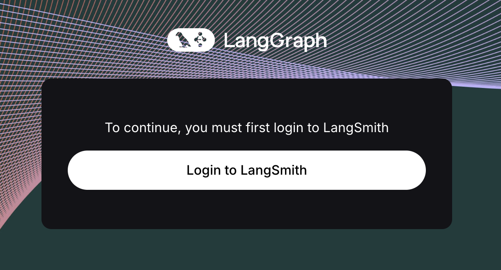
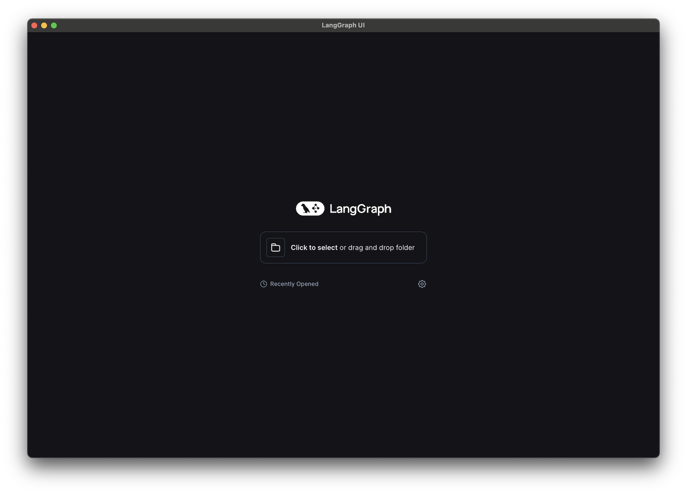

---
hide:
  - navigation
---

# LangGraph Studio

## Overview

LangGraph Studio is a desktop app for prototyping and debugging LangGraph Cloud applications locally. LangGraph Studio allows you to run API server for your LangGraph app and interact with it via a UI, all in one place. Agent trajectories are visually laid out, making it easier to understand agent workflows and to debug failure modes. LangGraph Studio leverages full power of LangGraph and LangGraph Cloud features, including adding breakpoints for easy interruption, state editing, resumption, and time travel.

## Setup

To use LangGraph Studio, make sure you have a [project with a LangGraph app](https://langchain-ai.github.io/langgraph/cloud/deployment/setup/) set up.

You can get started with an existing example project [here](https://github.com/langchain-ai/langgraph-example):

```shell
git clone https://github.com/langchain-ai/langgraph-example.git
```

Once you've set up the project, you can use it in LangGraph Studio. Let's dive in!

## Open a project

When you open LangGraph Studio desktop app for the first time, you need to login via LangSmith.



Once you have successfully authenticated, you can choose the LangGraph application folder to use — you can either drag and drop or manually select it in the file picker. If you are using the example project, the folder would be `langgraph-example`.

!!! note Note
    The application directory you select needs to contain correctly configured `langgraph.json` file. See more information on how to configure it [here](https://langchain-ai.github.io/langgraph/cloud/reference/cli/#configuration-file) and how to set up a LangGraph app [here](https://langchain-ai.github.io/langgraph/cloud/deployment/setup/).



Once you select a valid project, LangGraph Studio will start a LangGraph API server and you should see a UI with your graph rendered.


## Invoke graph

Now we can run the graph! LangGraph Studio lets you run your graph with different inputs and configurations.

### Start a new run

To start a new run:

1. In the dropdown menu (top-left corner of the left-hand pane), select a graph. In our example the graph is called `agent`. The list of graphs corresponds to the `graphs` keys in your `langgraph.json` configuration.
1. In the bottom of the left-hand pane, edit the `Input` section.
1. Click `Submit` to invoke the selected graph.
1. View output of the invocation in the right-hand pane.

The following video shows how to start a new run:

<video controls allowfullscreen="true" poster="./img/graph_video_poster.png">
    <source src="./img/graph_invoke.mp4" type="video/mp4">
</video>

### Configure graph run

To change configuration for a given graph run, press `Configurable` button in the `Input` section. Then click `Submit` to invoke the graph.

!!! note Note
    In order for the `Configurable` menu to be visible, make sure to specify `config_schema` when creating `StateGraph`. You can read more about how to add config schema to your graph [here](https://langchain-ai.github.io/langgraph/cloud/how-tos/cloud_examples/configuration_cloud/).
   
The following video shows how to edit configuration and start a new run:

<video controls allowfullscreen="true" poster="./img/graph_video_poster.png">
    <source src="./img/graph_config.mp4" type="video/mp4">
</video>

## Create and edit threads

### Create a thread

When you open LangGraph Studio, you will automatically be in a new thread window. If you have an existing thread open, follow these steps to create a new thread:

1. In the top-right corner of the right-hand pane, press `+` to open a new thread menu.
1. Choose between `Empty thread` or `Clone thread`. If you choose `Clone thread`, the state from the currently selected (existing) thread will be copied into a new thread. The original and copied thread are completely independent.

The following video shows how to create a thread:

<video controls="true" allowfullscreen="true" poster="./img/graph_video_poster.png">
    <source src="./img/create_thread.mp4" type="video/mp4">
</video>

### Select a thread

To select a thread:

1. Click on `New Thread` / `Thread <thread-id>` label at the top of the right-hand pane to open a thread list dropdown.
1. Select a thread that you wish to view / edit.

The following video shows how to select a thread:

<video controls="true" allowfullscreen="true" poster="./img/graph_video_poster.png">
    <source src="./img/select_thread.mp4" type="video/mp4">
</video>

### Edit thread state

LangGraph Studio allows you to edit the thread state and fork the threads to create alternative graph execution with the updated state. To do it:

1. Select a thread you wish to edit.
1. In the right-hand pane hover over the step you wish to edit and click on "pencil" icon to edit.
1. Make your edits.
1. Click `Fork` to update the state and create a new graph execution with the updated state.

The following video shows how to edit a thread in the studio:

<video controls allowfullscreen="true" poster="./img/graph_video_poster.png">
    <source src="./img/fork_thread.mp4" type="video/mp4">
</video>

## How to add interrupts to your graph

You might want to execute your graph step by step, or stop graph execution before/after a specific node executes. You can do so by adding interrupts. Interrupts can be set for all nodes (i.e. walk through the agent execution step by step) or for specific nodes. An interrupt in LangGraph Studio means that the graph execution will be interrupted both before and after a given node runs.

### Add interrupts to a list of nodes

To walk through the agent execution step by step, you can add interrupts to a all or a subset of nodes in the graph:

1. In the dropdown menu (top-right corner of the left-hand pane), click `Interrupt`.
2. Select a subset of nodes to interrupt on, or click `Interrupt on all`.

The following video shows how to add interrupts to all nodes:

<video controls allowfullscreen="true" poster="./img/graph_video_poster.png">
    <source src="./img/graph_interrupts_all.mp4" type="video/mp4">
</video>

### Add interrupt to a specific node

1. Navigate to the left-hand pane with the graph visualization.
1. Hover over a node you want to add an interrupt to. You should see a `+` button show up on the left side of the node.
1. Click `+` to invoke the selected graph.
1. Run the graph by adding `Input` / configuration and clicking `Submit`

The following video shows how to add interrupts to a specific node:

<video controls allowfullscreen="true" poster="./img/graph_video_poster.png">
    <source src="./img/graph_interrupts.mp4" type="video/mp4">
</video>

To remove the interrupt, simply follow the same step and press `x` button on the left side of the node.

## Edit project config

LangGraph Studio allows you to modify your project config (`langgraph.json`) interactively.

To modify the config from the studio, follow these steps:

1. Click `Configure` on the bottom right. This will open an interactive config menu with the values that correspond to the existing `langgraph.json`.
1. Make your edits.
1. Click `Save and Restart` to reload the LangGraph API server with the updated config.

The following video shows how to edit project config from the studio:

<video controls allowfullscreen="true" poster="./img/graph_video_poster.png">
    <source src="./img/graph_edit_json.mp4" type="video/mp4">
</video>

## Edit graph code

With LangGraph Studio you can modify your graph code and sync the changes live to the interactive graph.

To modify your graph from the studio, follow these steps:

1. Click `Open in VS Code` on the bottom right. This will open the project that is currently opened in LangGraph studio.
1. Make changes to the `.py` files where the compiled graph is defined or associated dependencies.
1. LangGraph studio will automatically reload once the changes are saved in the project directory.

The following video shows how to open code editor from the studio:

<video controls allowfullscreen="true" poster="./img/graph_video_poster.png">
    <source src="./img/graph_edit_code.mp4" type="video/mp4">
</video>
