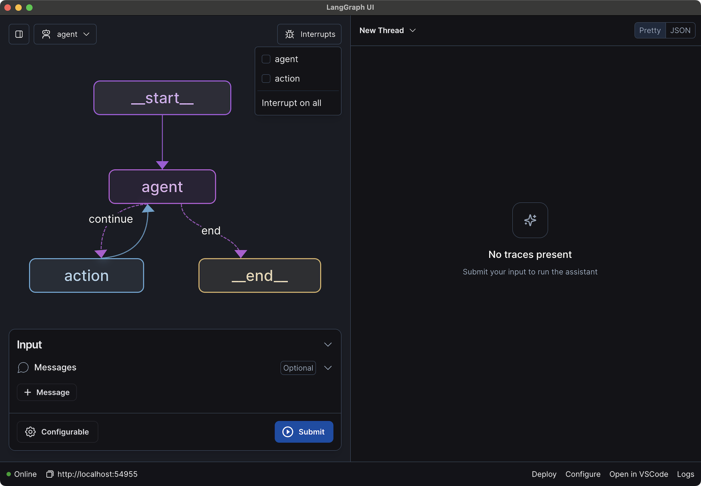

# How to add interrupts to your graph

The LangGraph Studio lets you add interrupts for specific nodes to your graph. An interrupt in LangGraph means that the graph execution will be interrupted both before and after a given node runs.

## Add interrupt to a specific node

1. Navigate to the left-hand pane with the graph visualization.
1. Hover over a node you want to add an interrupt to. You should see a `+` button show up on the left side of the node.
1. Click `+` to invoke the selected graph.
1. Run the graph by adding `Input` / configuration and clicking `Submit`

The following video shows how to add interrupts:

<video controls allowfullscreen="true" poster="../img/graph_video_poster.png">
    <source src="../img/graph_interrupts.mp4" type="video/mp4">
</video>

To remove the interrupt, simply follow the same step and press `x` button on the left side of the node.

## Add interrupts to a list of nodes

You can also add interrupts to a all or a subset of nodes in the graph:

1. In the dropdown menu (top-right corner of the left-hand pane), click `Interrupt`.
2. Select a subset of nodes to interrupt on, or click `Interrupt on all`.

