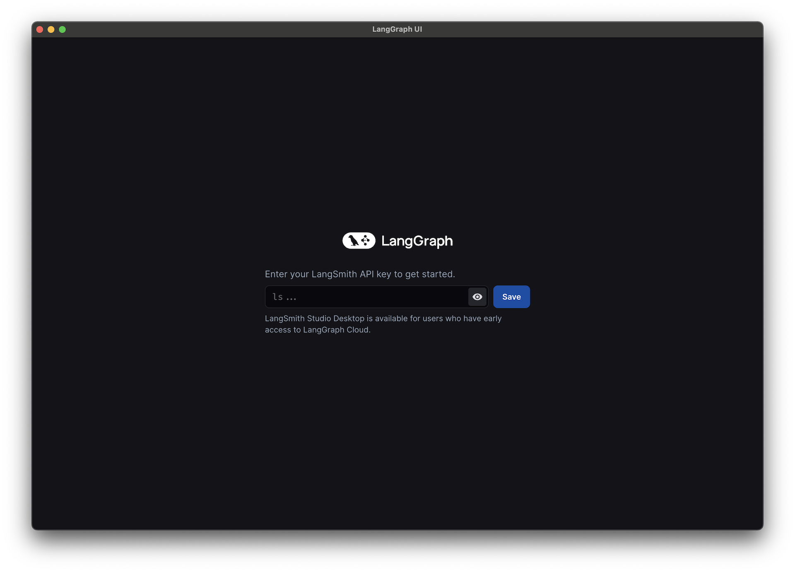

# How to open a project in LangGraph Studio

When you open LangGraph Studio desktop app for the first time, you need to provide LangSmith API key. See how you can obtain it [here](https://docs.smith.langchain.com/#2-create-an-api-key).

Once you have the API key, you can choose the LangGraph application folder to use — you can either drag and drop or manually select it in the file picker. The application directory you select needs to contain correctly configured `langgraph.json` file. See more information on how to configure it [here](https://langchain-ai.github.io/langgraph/cloud/reference/cli/#configuration-file) and how to set up a LangGraph app [here](https://langchain-ai.github.io/langgraph/cloud/deployment/setup/).

Once you select a valid project, LangGraph Studio will start a LangGraph API server and you should see a UI with your graph rendered.

