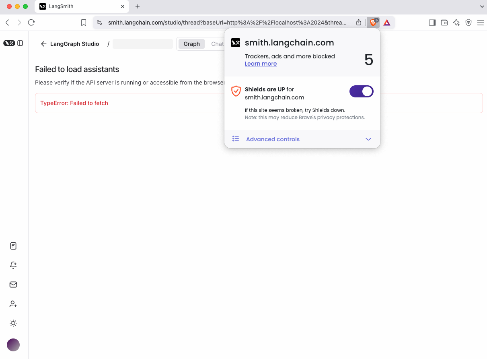

# LangGraph Studio Troubleshooting

## :fontawesome-brands-safari:{ .safari } Safari Connection Issues

Safari blocks plain-HTTP traffic on localhost. When running Studio with `langgraph dev`, you may see "Failed to load assistants" errors.

### Solution 1: Use Cloudflare Tunnel

:::python

```shell
pip install -U langgraph-cli>=0.2.6
langgraph dev --tunnel
```

:::

:::js

```shell
npx @langchain/langgraph-cli dev
```

:::

The command outputs a URL in this format:

```shell
https://smith.langchain.com/studio/?baseUrl=https://hamilton-praise-heart-costumes.trycloudflare.com
```

Use this URL in Safari to load Studio. Here, the `baseUrl` parameter specifies your agent server endpoint.

### Solution 2: Use Chromium Browser

Chrome and other Chromium browsers allow HTTP on localhost. Use `langgraph dev` without additional configuration.

## :fontawesome-brands-brave:{ .brave } Brave Connection Issues

Brave blocks plain-HTTP traffic on localhost when Brave Shields are enabled. When running Studio with `langgraph dev`, you may see "Failed to load assistants" errors.

### Solution 1: Disable Brave Shields

Disable Brave Shields for LangSmith using the Brave icon in the URL bar.



### Solution 2: Use Cloudflare Tunnel

:::python

```shell
pip install -U langgraph-cli>=0.2.6
langgraph dev --tunnel
```

:::

:::js

```shell
npx @langchain/langgraph-cli dev
```

:::

The command outputs a URL in this format:

```shell
https://smith.langchain.com/studio/?baseUrl=https://hamilton-praise-heart-costumes.trycloudflare.com
```

Use this URL in Brave to load Studio. Here, the `baseUrl` parameter specifies your agent server endpoint.

## Graph Edge Issues

:::python
Undefined conditional edges may show unexpected connections in your graph. This is
because without proper definition, LangGraph Studio assumes the conditional edge could access all other nodes. To address this, explicitly define the routing paths using one of these methods:

### Solution 1: Path Map

Define a mapping between router outputs and target nodes:

```python
graph.add_conditional_edges("node_a", routing_function, {True: "node_b", False: "node_c"})
```

### Solution 2: Router Type Definition (Python)

Specify possible routing destinations using Python's `Literal` type:

```python
def routing_function(state: GraphState) -> Literal["node_b","node_c"]:
    if state['some_condition'] == True:
        return "node_b"
    else:
        return "node_c"
```

:::

:::js
Undefined conditional edges may show unexpected connections in your graph. This is because without proper definition, LangGraph Studio assumes the conditional edge could access all other nodes.
To address this, explicitly define a mapping between router outputs and target nodes:

```typescript
graph.addConditionalEdges("node_a", routingFunction, {
  true: "node_b",
  false: "node_c",
});
```

:::
