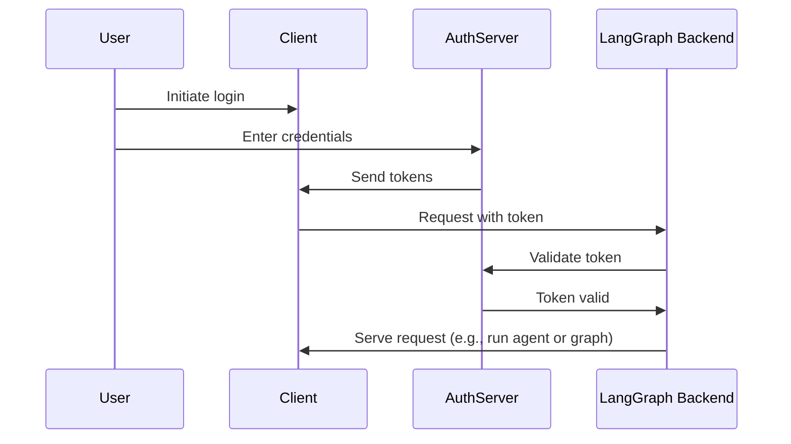

# Connect an authentication provider

In [the last tutorial](resource_auth.md), you added [resource authorization](../../tutorials/auth/resource_auth.md) to give users private conversations. However, you are still using hard-coded tokens for authentication, which is not secure. Now you'll replace those tokens with real user accounts using [OAuth2](../auth/getting_started.md).

You'll keep the same [`Auth`](../../cloud/reference/sdk/python_sdk_ref.md#langgraph_sdk.auth.Auth) object and [resource-level access control](../../concepts/auth.md#single-owner-resources), but upgrade authentication to use Supabase as your identity provider. While Supabase is used in this tutorial, the concepts apply to any OAuth2 provider. You'll learn how to:

1. Replace test tokens with real JWT tokens
2. Integrate with OAuth2 providers for secure user authentication
3. Handle user sessions and metadata while maintaining our existing authorization logic

## Background

OAuth2 involves three main roles:

1. **Authorization server**: The identity provider (e.g., Supabase, Auth0, Google) that handles user authentication and issues tokens
2. **Application backend**: Your LangGraph application. This validates tokens and serves protected resources (conversation data)
3. **Client application**: The web or mobile app where users interact with your service

A standard OAuth2 flow works something like this:




## Prerequisites

Before you start this tutorial, ensure you have:

- The [bot from the second tutorial](resource_auth.md) running without errors.
- A [Supabase project](https://supabase.com/dashboard) to use its authentication server.


## 1. Install dependencies

Install the required dependencies. Start in your `custom-auth` directory and ensure you have the `langgraph-cli` installed:

```bash
cd custom-auth
pip install -U "langgraph-cli[inmem]"
```

## 2. Set up the authentication provider {#setup-auth-provider}

Next, fetch the URL of your auth server and the private key for authentication.
Since you're using Supabase for this, you can do this in the Supabase dashboard:

1. In the left sidebar, click on t️⚙ Project Settings" and then click "API"
1. Copy your project URL and add it to your `.env` file

    ```shell
    echo "SUPABASE_URL=your-project-url" >> .env
    ```
1. Copy your service role secret key and add it to your `.env` file:

    ```shell
    echo "SUPABASE_SERVICE_KEY=your-service-role-key" >> .env
    ```
1. Copy your "anon public" key and note it down. This will be used later when you set up our client code.

    ```bash
    SUPABASE_URL=your-project-url
    SUPABASE_SERVICE_KEY=your-service-role-key
    ```

## 3. Implement token validation

In the previous tutorials, you used the [`Auth`](../../cloud/reference/sdk/python_sdk_ref.md#langgraph_sdk.auth.Auth) object to [validate hard-coded tokens](getting_started.md) and [add resource ownership](resource_auth.md).

Now you'll upgrade your authentication to validate real JWT tokens from Supabase. The main changes will all be in the [`@auth.authenticate`](../../cloud/reference/sdk/python_sdk_ref.md#langgraph_sdk.auth.Auth.authenticate) decorated function:

- Instead of checking against a hard-coded list of tokens, you'll make an HTTP request to Supabase to validate the token.
- You'll extract real user information (ID, email) from the validated token.
- The existing resource authorization logic remains unchanged.

Update `src/security/auth.py` to implement this:

```python hl_lines="8-9 20-30" title="src/security/auth.py"
import os
import httpx
from langgraph_sdk import Auth

auth = Auth()

# This is loaded from the `.env` file you created above
SUPABASE_URL = os.environ["SUPABASE_URL"]
SUPABASE_SERVICE_KEY = os.environ["SUPABASE_SERVICE_KEY"]


@auth.authenticate
async def get_current_user(authorization: str | None):
    """Validate JWT tokens and extract user information."""
    assert authorization
    scheme, token = authorization.split()
    assert scheme.lower() == "bearer"

    try:
        # Verify token with auth provider
        async with httpx.AsyncClient() as client:
            response = await client.get(
                f"{SUPABASE_URL}/auth/v1/user",
                headers={
                    "Authorization": authorization,
                    "apiKey": SUPABASE_SERVICE_KEY,
                },
            )
            assert response.status_code == 200
            user = response.json()
            return {
                "identity": user["id"],  # Unique user identifier
                "email": user["email"],
                "is_authenticated": True,
            }
    except Exception as e:
        raise Auth.exceptions.HTTPException(status_code=401, detail=str(e))

# ... the rest is the same as before

# Keep our resource authorization from the previous tutorial
@auth.on
async def add_owner(ctx, value):
    """Make resources private to their creator using resource metadata."""
    filters = {"owner": ctx.user.identity}
    metadata = value.setdefault("metadata", {})
    metadata.update(filters)
    return filters
```

The most important change is that we're now validating tokens with a real authentication server. Our authentication handler has the private key for our Supabase project, which we can use to validate the user's token and extract their information.

## 4. Test authentication flow

Let's test out the new authentication flow. You can run the following code in a file or notebook. You will need to provide:

- A valid email address
- A Supabase project URL (from [above](#setup-auth-provider))
- A Supabase anon **public key** (also from [above](#setup-auth-provider))

```python
import os
import httpx
from getpass import getpass
from langgraph_sdk import get_client


# Get email from command line
email = getpass("Enter your email: ")
base_email = email.split("@")
password = "secure-password"  # CHANGEME
email1 = f"{base_email[0]}+1@{base_email[1]}"
email2 = f"{base_email[0]}+2@{base_email[1]}"

SUPABASE_URL = os.environ.get("SUPABASE_URL")
if not SUPABASE_URL:
    SUPABASE_URL = getpass("Enter your Supabase project URL: ")

# This is your PUBLIC anon key (which is safe to use client-side)
# Do NOT mistake this for the secret service role key
SUPABASE_ANON_KEY = os.environ.get("SUPABASE_ANON_KEY")
if not SUPABASE_ANON_KEY:
    SUPABASE_ANON_KEY = getpass("Enter your public Supabase anon  key: ")


async def sign_up(email: str, password: str):
    """Create a new user account."""
    async with httpx.AsyncClient() as client:
        response = await client.post(
            f"{SUPABASE_URL}/auth/v1/signup",
            json={"email": email, "password": password},
            headers={"apiKey": SUPABASE_ANON_KEY},
        )
        assert response.status_code == 200
        return response.json()

# Create two test users
print(f"Creating test users: {email1} and {email2}")
await sign_up(email1, password)
await sign_up(email2, password)
```

⚠️ Before continuing: Check your email and click both confirmation links. Supabase will reject `/login` requests until after you have confirmed your users' email.

Now test that users can only see their own data. Make sure the server is running (run `langgraph dev`) before proceeding. The following snippet requires the "anon public" key that you copied from the Supabase dashboard while [setting up the auth provider](#setup-auth-provider) previously. 

```python
async def login(email: str, password: str):
    """Get an access token for an existing user."""
    async with httpx.AsyncClient() as client:
        response = await client.post(
            f"{SUPABASE_URL}/auth/v1/token?grant_type=password",
            json={
                "email": email,
                "password": password
            },
            headers={
                "apikey": SUPABASE_ANON_KEY,
                "Content-Type": "application/json"
            },
        )
        assert response.status_code == 200
        return response.json()["access_token"]


# Log in as user 1
user1_token = await login(email1, password)
user1_client = get_client(
    url="http://localhost:2024", headers={"Authorization": f"Bearer {user1_token}"}
)

# Create a thread as user 1
thread = await user1_client.threads.create()
print(f"✅ User 1 created thread: {thread['thread_id']}")

# Try to access without a token
unauthenticated_client = get_client(url="http://localhost:2024")
try:
    await unauthenticated_client.threads.create()
    print("❌ Unauthenticated access should fail!")
except Exception as e:
    print("✅ Unauthenticated access blocked:", e)

# Try to access user 1's thread as user 2
user2_token = await login(email2, password)
user2_client = get_client(
    url="http://localhost:2024", headers={"Authorization": f"Bearer {user2_token}"}
)

try:
    await user2_client.threads.get(thread["thread_id"])
    print("❌ User 2 shouldn't see User 1's thread!")
except Exception as e:
    print("✅ User 2 blocked from User 1's thread:", e)
```
The output should look like this:

```shell
✅ User 1 created thread: d6af3754-95df-4176-aa10-dbd8dca40f1a
✅ Unauthenticated access blocked: Client error '403 Forbidden' for url 'http://localhost:2024/threads'
✅ User 2 blocked from User 1's thread: Client error '404 Not Found' for url 'http://localhost:2024/threads/d6af3754-95df-4176-aa10-dbd8dca40f1a'
```

Your authentication and authorization are working together:

1. Users must log in to access the bot
2. Each user can only see their own threads

All users are managed by the Supabase auth provider, so you don't need to implement any additional user management logic.

## Next steps

You've successfully built a production-ready authentication system for your LangGraph application! Let's review what you've accomplished:

1. Set up an authentication provider (Supabase in this case)
2. Added real user accounts with email/password authentication
3. Integrated JWT token validation into your LangGraph server
4. Implemented proper authorization to ensure users can only access their own data
5. Created a foundation that's ready to handle your next authentication challenge 🚀

Now that you have production authentication, consider:

1. Building a web UI with your preferred framework (see the [Custom Auth](https://github.com/langchain-ai/custom-auth) template for an example)
2. Learn more about the other aspects of authentication and authorization in the [conceptual guide on authentication](../../concepts/auth.md).
3. Customize your handlers and setup further after reading the [reference docs](../../cloud/reference/sdk/python_sdk_ref.md#langgraph_sdk.auth.Auth).