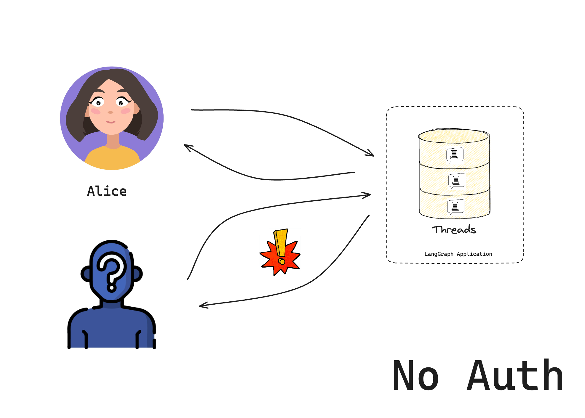

# Set up custom authentication

In this tutorial, we will build a chatbot that only lets specific users access it. We'll start with the LangGraph template and add token-based security step by step. By the end, you'll have a working chatbot that checks for valid tokens before allowing access.

This is part 1 of our authentication series:

1. Set up custom authentication (you are here) - Control who can access your bot
2. [Make conversations private](resource_auth.md) - Let users have private conversations
3. [Connect an authentication provider](add_auth_server.md) - Add real user accounts and validate using OAuth2 for production

This guide assumes basic familiarity with the following concepts:

- [**Authentication & Access Control**](../../concepts/auth.md)
- [**LangGraph Platform**](../../concepts/langgraph_platform.md)

!!! note

    Custom auth is only available for LangGraph Platform SaaS deployments or Enterprise Self-Hosted deployments.

## 1. Create your app

Create a new chatbot using the LangGraph starter template:

:::python

```bash
pip install -U "langgraph-cli[inmem]"
langgraph new --template=new-langgraph-project-python custom-auth
cd custom-auth
```

:::

:::js

```bash
npx @langchain/langgraph-cli new --template=new-langgraph-project-typescript custom-auth
cd custom-auth
```

:::

The template gives us a placeholder LangGraph app. Try it out by installing the local dependencies and running the development server:

:::python

```shell
pip install -e .
langgraph dev
```

:::

:::js

```shell
npm install
npm run langgraph dev
```

:::

The server will start and open the studio in your browser:

```
> - 🚀 API: http://127.0.0.1:2024
> - 🎨 Studio UI: https://smith.langchain.com/studio/?baseUrl=http://127.0.0.1:2024
> - 📚 API Docs: http://127.0.0.1:2024/docs
>
> This in-memory server is designed for development and testing.
> For production use, please use LangSmith Deployment.
```

If you were to self-host this on the public internet, anyone could access it!



## 2. Add authentication

Now that you have a base LangGraph app, add authentication to it.

!!! note

    In this tutorial, you will start with a hard-coded token for example purposes. You will get to a "production-ready" authentication scheme in the third tutorial.

:::python
The [`Auth`](../../cloud/reference/sdk/python_sdk_ref.md#langgraph_sdk.auth.Auth) object lets you register an authentication function that the LangGraph platform will run on every request. This function receives each request and decides whether to accept or reject.

Create a new file `src/security/auth.py`. This is where your code will live to check if users are allowed to access your bot:

```python hl_lines="10 15-16" title="src/security/auth.py"
from langgraph_sdk import Auth

# This is our toy user database. Do not do this in production
VALID_TOKENS = {
    "user1-token": {"id": "user1", "name": "Alice"},
    "user2-token": {"id": "user2", "name": "Bob"},
}

# The "Auth" object is a container that LangGraph will use to mark our authentication function
auth = Auth()


# The `authenticate` decorator tells LangGraph to call this function as middleware
# for every request. This will determine whether the request is allowed or not
@auth.authenticate
async def get_current_user(authorization: str | None) -> Auth.types.MinimalUserDict:
    """Check if the user's token is valid."""
    assert authorization
    scheme, token = authorization.split()
    assert scheme.lower() == "bearer"
    # Check if token is valid
    if token not in VALID_TOKENS:
        raise Auth.exceptions.HTTPException(status_code=401, detail="Invalid token")

    # Return user info if valid
    user_data = VALID_TOKENS[token]
    return {
        "identity": user_data["id"],
    }
```

Notice that your [authentication](../../cloud/reference/sdk/python_sdk_ref.md#langgraph_sdk.auth.Auth.authenticate) handler does two important things:

1. Checks if a valid token is provided in the request's [Authorization header](https://developer.mozilla.org/en-US/docs/Web/HTTP/Headers/Authorization)
2. Returns the user's [identity](../../cloud/reference/sdk/python_sdk_ref.md#langgraph_sdk.auth.types.MinimalUserDict)
   :::

:::js
The [`Auth`](../../cloud/reference/sdk/js_sdk_ref.md#Auth) object lets you register an authentication function that the LangGraph platform will run on every request. This function receives each request and decides whether to accept or reject.

Create a new file `src/security/auth.ts`. This is where your code will live to check if users are allowed to access your bot:

```typescript title="src/security/auth.ts"
import { Auth } from "@langchain/langgraph-sdk";

// This is our toy user database. Do not do this in production
const VALID_TOKENS: Record<string, { id: string; name: string }> = {
  "user1-token": { id: "user1", name: "Alice" },
  "user2-token": { id: "user2", name: "Bob" },
};

// The "Auth" object is a container that LangGraph will use to mark our authentication function
const auth = new Auth();
  // The `authenticate` method tells LangGraph to call this function as middleware
  // for every request. This will determine whether the request is allowed or not
  .authenticate((request) => {
    // Our authentication handler from the previous tutorial.
    const apiKey = request.headers.get("x-api-key");
    if (!apiKey || !isValidKey(apiKey)) {
      throw new HTTPException(401, "Invalid API key");
    }

    const [scheme, token] = apiKey.split(" ");
    if (scheme.toLowerCase() !== "bearer") {
      throw new Error("Bearer token required");
    }

    if (!VALID_TOKENS[token]) {
      throw new HTTPException(401, "Invalid token");
    }

    const userData = VALID_TOKENS[token];
    return {
      identity: userData.id,
    };
  });

export { auth };
```

Notice that your [authentication](../../cloud/reference/sdk/js_sdk_ref.md#Auth) handler does two important things:

1. Checks if a valid token is provided in the request's [Authorization header](https://developer.mozilla.org/en-US/docs/Web/HTTP/Headers/Authorization)
2. Returns the user's [identity](../../cloud/reference/sdk/js_sdk_ref.md#Auth.types.MinimalUserDict)
   :::

Now tell LangGraph to use authentication by adding the following to the [`langgraph.json`](../../cloud/reference/cli.md#configuration-file) configuration:

:::python

```json hl_lines="7-9" title="langgraph.json"
{
  "dependencies": ["."],
  "graphs": {
    "agent": "./src/agent/graph.py:graph"
  },
  "env": ".env",
  "auth": {
    "path": "src/security/auth.py:auth"
  }
}
```

:::

:::js

```json hl_lines="7-9" title="langgraph.json"
{
  "dependencies": ["."],
  "graphs": {
    "agent": "./src/agent/graph.ts:graph"
  },
  "env": ".env",
  "auth": {
    "path": "src/security/auth.ts:auth"
  }
}
```

:::

## 3. Test your bot

Start the server again to test everything out:

```bash
langgraph dev --no-browser
```

If you didn't add the `--no-browser`, the studio UI will open in the browser. You may wonder, how is the studio able to still connect to our server? By default, we also permit access from the LangGraph studio, even when using custom auth. This makes it easier to develop and test your bot in the studio. You can remove this alternative authentication option by setting `disable_studio_auth: "true"` in your auth configuration:

:::python

```json
{
  "auth": {
    "path": "src/security/auth.py:auth",
    "disable_studio_auth": "true"
  }
}
```

:::

:::js

```json
{
  "auth": {
    "path": "src/security/auth.ts:auth",
    "disable_studio_auth": "true"
  }
}
```

:::

## 4. Chat with your bot

You should now only be able to access the bot if you provide a valid token in the request header. Users will still, however, be able to access each other's resources until you add [resource authorization handlers](../../concepts/auth.md#resource-specific-handlers) in the next section of the tutorial.


:::python
Run the following code in a file or notebook:

```python
from langgraph_sdk import get_client

# Try without a token (should fail)
client = get_client(url="http://localhost:2024")
try:
    thread = await client.threads.create()
    print("❌ Should have failed without token!")
except Exception as e:
    print("✅ Correctly blocked access:", e)

# Try with a valid token
client = get_client(
    url="http://localhost:2024", headers={"Authorization": "Bearer user1-token"}
)

# Create a thread and chat
thread = await client.threads.create()
print(f"✅ Created thread as Alice: {thread['thread_id']}")

response = await client.runs.create(
    thread_id=thread["thread_id"],
    assistant_id="agent",
    input={"messages": [{"role": "user", "content": "Hello!"}]},
)
print("✅ Bot responded:")
print(response)
```

:::

:::js
Run the following code in a TypeScript file:

```typescript
import { Client } from "@langchain/langgraph-sdk";

async function testAuth() {
  // Try without a token (should fail)
  const clientWithoutToken = new Client({ apiUrl: "http://localhost:2024" });
  try {
    const thread = await clientWithoutToken.threads.create();
    console.log("❌ Should have failed without token!");
  } catch (e) {
    console.log("✅ Correctly blocked access:", e);
  }

  // Try with a valid token
  const client = new Client({
    apiUrl: "http://localhost:2024",
    headers: { Authorization: "Bearer user1-token" },
  });

  // Create a thread and chat
  const thread = await client.threads.create();
  console.log(`✅ Created thread as Alice: ${thread.thread_id}`);

  const response = await client.runs.create(thread.thread_id, "agent", {
    input: { messages: [{ role: "user", content: "Hello!" }] },
  });
  console.log("✅ Bot responded:");
  console.log(response);
}

testAuth().catch(console.error);
```

:::

You should see that:

1. Without a valid token, we can't access the bot
2. With a valid token, we can create threads and chat

Congratulations! You've built a chatbot that only lets "authenticated" users access it. While this system doesn't (yet) implement a production-ready security scheme, we've learned the basic mechanics of how to control access to our bot. In the next tutorial, we'll learn how to give each user their own private conversations.

## Next steps

Now that you can control who accesses your bot, you might want to:

1. Continue the tutorial by going to [Make conversations private](resource_auth.md) to learn about resource authorization.
2. Read more about [authentication concepts](../../concepts/auth.md).

:::python
3. Check out the [API reference](../../cloud/reference/sdk/python_sdk_ref.md) for more authentication details.
:::

:::js
3. Check out the [API reference](../../cloud/reference/sdk/js_sdk_ref.md) for more authentication details.
:::
