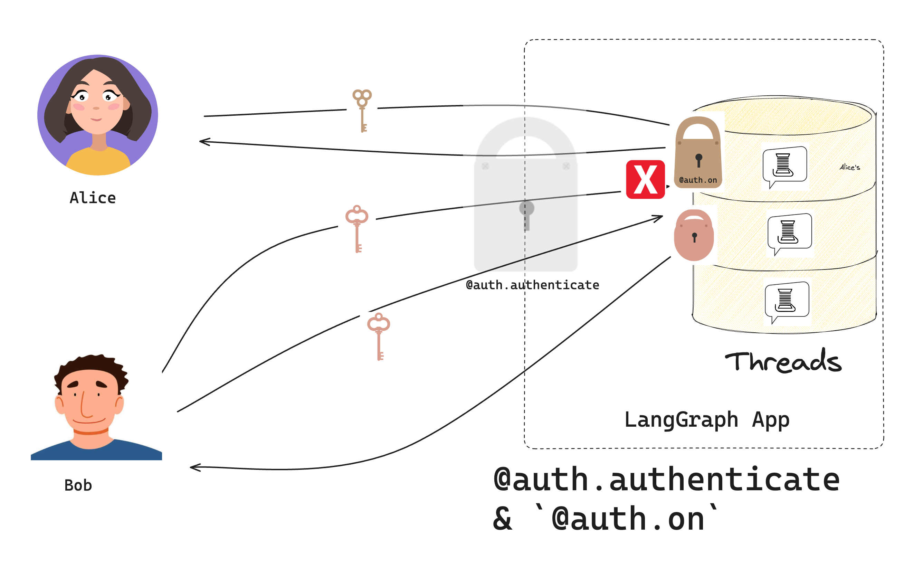

# Make conversations private

In this tutorial, you will extend [the chatbot created in the last tutorial](getting_started.md) to give each user their own private conversations. You'll add [resource-level access control](../../concepts/auth.md#single-owner-resources) so users can only see their own threads.



## Prerequisites

Before you start this tutorial, ensure you have the [bot from the first tutorial](getting_started.md) running without errors.

## 1. Add resource authorization

:::python
Recall that in the last tutorial, the [`Auth`](../../cloud/reference/sdk/python_sdk_ref.md#langgraph_sdk.auth.Auth) object lets you register an [authentication function](../../concepts/auth.md#authentication), which LangGraph Platform uses to validate the bearer tokens in incoming requests. Now you'll use it to register an **authorization** handler.
:::

:::js
Recall that in the last tutorial, the @[`Auth`][Auth] object lets you register an [authentication function](../../concepts/auth.md#authentication), which LangGraph Platform uses to validate the bearer tokens in incoming requests. Now you'll use it to register an **authorization** handler.
:::

Authorization handlers are functions that run **after** authentication succeeds. These handlers can add [metadata](../../concepts/auth.md#filter-operations) to resources (like who owns them) and filter what each user can see.

:::python
Update your `src/security/auth.py` and add one authorization handler to run on every request:

```python hl_lines="29-39" title="src/security/auth.py"
from langgraph_sdk import Auth

# Keep our test users from the previous tutorial
VALID_TOKENS = {
    "user1-token": {"id": "user1", "name": "Alice"},
    "user2-token": {"id": "user2", "name": "Bob"},
}

auth = Auth()


@auth.authenticate
async def get_current_user(authorization: str | None) -> Auth.types.MinimalUserDict:
    """Our authentication handler from the previous tutorial."""
    assert authorization
    scheme, token = authorization.split()
    assert scheme.lower() == "bearer"

    if token not in VALID_TOKENS:
        raise Auth.exceptions.HTTPException(status_code=401, detail="Invalid token")

    user_data = VALID_TOKENS[token]
    return {
        "identity": user_data["id"],
    }


@auth.on
async def add_owner(
    ctx: Auth.types.AuthContext,  # Contains info about the current user
    value: dict,  # The resource being created/accessed
):
    """Make resources private to their creator."""
    # Examples:
    # ctx: AuthContext(
    #     permissions=[],
    #     user=ProxyUser(
    #         identity='user1',
    #         is_authenticated=True,
    #         display_name='user1'
    #     ),
    #     resource='threads',
    #     action='create_run'
    # )
    # value:
    # {
    #     'thread_id': UUID('1e1b2733-303f-4dcd-9620-02d370287d72'),
    #     'assistant_id': UUID('fe096781-5601-53d2-b2f6-0d3403f7e9ca'),
    #     'run_id': UUID('1efbe268-1627-66d4-aa8d-b956b0f02a41'),
    #     'status': 'pending',
    #     'metadata': {},
    #     'prevent_insert_if_inflight': True,
    #     'multitask_strategy': 'reject',
    #     'if_not_exists': 'reject',
    #     'after_seconds': 0,
    #     'kwargs': {
    #         'input': {'messages': [{'role': 'user', 'content': 'Hello!'}]},
    #         'command': None,
    #         'config': {
    #             'configurable': {
    #                 'langgraph_auth_user': ... Your user object...
    #                 'langgraph_auth_user_id': 'user1'
    #             }
    #         },
    #         'stream_mode': ['values'],
    #         'interrupt_before': None,
    #         'interrupt_after': None,
    #         'webhook': None,
    #         'feedback_keys': None,
    #         'temporary': False,
    #         'subgraphs': False
    #     }
    # }

    # Does 2 things:
    # 1. Add the user's ID to the resource's metadata. Each LangGraph resource has a `metadata` dict that persists with the resource.
    # this metadata is useful for filtering in read and update operations
    # 2. Return a filter that lets users only see their own resources
    filters = {"owner": ctx.user.identity}
    metadata = value.setdefault("metadata", {})
    metadata.update(filters)

    # Only let users see their own resources
    return filters
```

:::

:::js
Update your `src/security/auth.ts` and add one authorization handler to run on every request:

```typescript hl_lines="29-39" title="src/security/auth.ts"
import { Auth, HTTPException } from "@langchain/langgraph-sdk";

// Keep our test users from the previous tutorial
const VALID_TOKENS: Record<string, { id: string; name: string }> = {
  "user1-token": { id: "user1", name: "Alice" },
  "user2-token": { id: "user2", name: "Bob" },
};

const auth = new Auth()
  .authenticate(async (request) => {
    // Our authentication handler from the previous tutorial.
    const apiKey = request.headers.get("x-api-key");
    if (!apiKey || !isValidKey(apiKey)) {
      throw new HTTPException(401, "Invalid API key");
    }

    const [scheme, token] = apiKey.split(" ");
    if (scheme.toLowerCase() !== "bearer") {
      throw new Error("Bearer token required");
    }

    if (!VALID_TOKENS[token]) {
      throw new HTTPException(401, "Invalid token");
    }

    const userData = VALID_TOKENS[token];
    return {
      identity: userData.id,
    };
  })
  .on("*", ({ value, user }) => {
    // This handler makes resources private to their creator by doing 2 things:
    // 1. Add the user's ID to the resource's metadata. Each LangGraph resource has a `metadata` object that persists with the resource.
    // this metadata is useful for filtering in read and update operations
    // 2. Return a filter that lets users only see their own resources
    // Examples:
    // {
    //   user: ProxyUser {
    //     identity: 'user1',
    //     is_authenticated: true,
    //     display_name: 'user1'
    //   },
    //   value: {
    //     'thread_id': UUID('1e1b2733-303f-4dcd-9620-02d370287d72'),
    //     'assistant_id': UUID('fe096781-5601-53d2-b2f6-0d3403f7e9ca'),
    //     'run_id': UUID('1efbe268-1627-66d4-aa8d-b956b0f02a41'),
    //     'status': 'pending',
    //     'metadata': {},
    //     'prevent_insert_if_inflight': true,
    //     'multitask_strategy': 'reject',
    //     'if_not_exists': 'reject',
    //     'after_seconds': 0,
    //     'kwargs': {
    //         'input': {'messages': [{'role': 'user', 'content': 'Hello!'}]},
    //         'command': null,
    //         'config': {
    //             'configurable': {
    //                 'langgraph_auth_user': ... Your user object...
    //                 'langgraph_auth_user_id': 'user1'
    //             }
    //         },
    //         'stream_mode': ['values'],
    //         'interrupt_before': null,
    //         'interrupt_after': null,
    //         'webhook': null,
    //         'feedback_keys': null,
    //         'temporary': false,
    //         'subgraphs': false
    //     }
    //   }
    // }

    const filters = { owner: user.identity };
    const metadata = value.metadata || {};
    Object.assign(metadata, filters);
    value.metadata = metadata;

    // Only let users see their own resources
    return filters;
  });

export { auth };
```

:::

:::python
The handler receives two parameters:

1. `ctx` ([AuthContext](../../cloud/reference/sdk/python_sdk_ref.md#langgraph_sdk.auth.types.AuthContext)): contains info about the current `user`, the user's `permissions`, the `resource` ("threads", "crons", "assistants"), and the `action` being taken ("create", "read", "update", "delete", "search", "create_run")
2. `value` (`dict`): data that is being created or accessed. The contents of this dict depend on the resource and action being accessed. See [adding scoped authorization handlers](#scoped-authorization) below for information on how to get more tightly scoped access control.
   :::

:::js
The handler receives an object with the following properties:

1. `user` contains info about the current `user`, the user's `permissions`, the `resource` ("threads", "crons", "assistants")
2. `action` contains information about the action being taken ("create", "read", "update", "delete", "search", "create_run")
3. `value` (`Record<string, any>`): data that is being created or accessed. The contents of this object depend on the resource and action being accessed. See [adding scoped authorization handlers](#scoped-authorization) below for information on how to get more tightly scoped access control.
   :::

Notice that the simple handler does two things:

1. Adds the user's ID to the resource's metadata.
2. Returns a metadata filter so users only see resources they own.

## 2. Test private conversations

Test your authorization. If you have set things up correctly, you will see all ✅ messages. Be sure to have your development server running (run `langgraph dev`):

:::python

```python
from langgraph_sdk import get_client

# Create clients for both users
alice = get_client(
    url="http://localhost:2024",
    headers={"Authorization": "Bearer user1-token"}
)

bob = get_client(
    url="http://localhost:2024",
    headers={"Authorization": "Bearer user2-token"}
)

# Alice creates an assistant
alice_assistant = await alice.assistants.create()
print(f"✅ Alice created assistant: {alice_assistant['assistant_id']}")

# Alice creates a thread and chats
alice_thread = await alice.threads.create()
print(f"✅ Alice created thread: {alice_thread['thread_id']}")

await alice.runs.create(
    thread_id=alice_thread["thread_id"],
    assistant_id="agent",
    input={"messages": [{"role": "user", "content": "Hi, this is Alice's private chat"}]}
)

# Bob tries to access Alice's thread
try:
    await bob.threads.get(alice_thread["thread_id"])
    print("❌ Bob shouldn't see Alice's thread!")
except Exception as e:
    print("✅ Bob correctly denied access:", e)

# Bob creates his own thread
bob_thread = await bob.threads.create()
await bob.runs.create(
    thread_id=bob_thread["thread_id"],
    assistant_id="agent",
    input={"messages": [{"role": "user", "content": "Hi, this is Bob's private chat"}]}
)
print(f"✅ Bob created his own thread: {bob_thread['thread_id']}")

# List threads - each user only sees their own
alice_threads = await alice.threads.search()
bob_threads = await bob.threads.search()
print(f"✅ Alice sees {len(alice_threads)} thread")
print(f"✅ Bob sees {len(bob_threads)} thread")
```

:::

:::js

```typescript
import { getClient } from "@langgraph/sdk";

// Create clients for both users
const alice = getClient({
  url: "http://localhost:2024",
  headers: { Authorization: "Bearer user1-token" },
});

const bob = getClient({
  url: "http://localhost:2024",
  headers: { Authorization: "Bearer user2-token" },
});

// Alice creates an assistant
const aliceAssistant = await alice.assistants.create();
console.log(`✅ Alice created assistant: ${aliceAssistant.assistant_id}`);

// Alice creates a thread and chats
const aliceThread = await alice.threads.create();
console.log(`✅ Alice created thread: ${aliceThread.thread_id}`);

await alice.runs.create(aliceThread.thread_id, "agent", {
  input: {
    messages: [{ role: "user", content: "Hi, this is Alice's private chat" }],
  },
});

// Bob tries to access Alice's thread
try {
  await bob.threads.get(aliceThread.thread_id);
  console.log("❌ Bob shouldn't see Alice's thread!");
} catch (error) {
  console.log("✅ Bob correctly denied access:", error);
}

// Bob creates his own thread
const bobThread = await bob.threads.create();
await bob.runs.create(bobThread.thread_id, "agent", {
  input: {
    messages: [{ role: "user", content: "Hi, this is Bob's private chat" }],
  },
});
console.log(`✅ Bob created his own thread: ${bobThread.thread_id}`);

// List threads - each user only sees their own
const aliceThreads = await alice.threads.search();
const bobThreads = await bob.threads.search();
console.log(`✅ Alice sees ${aliceThreads.length} thread`);
console.log(`✅ Bob sees ${bobThreads.length} thread`);
```

:::

Output:

```bash
✅ Alice created assistant: fc50fb08-78da-45a9-93cc-1d3928a3fc37
✅ Alice created thread: 533179b7-05bc-4d48-b47a-a83cbdb5781d
✅ Bob correctly denied access: Client error '404 Not Found' for url 'http://localhost:2024/threads/533179b7-05bc-4d48-b47a-a83cbdb5781d'
For more information check: https://developer.mozilla.org/en-US/docs/Web/HTTP/Status/404
✅ Bob created his own thread: 437c36ed-dd45-4a1e-b484-28ba6eca8819
✅ Alice sees 1 thread
✅ Bob sees 1 thread
```

This means:

1. Each user can create and chat in their own threads
2. Users can't see each other's threads
3. Listing threads only shows your own

## 3. Add scoped authorization handlers {#scoped-authorization}

:::python
The broad `@auth.on` handler matches on all [authorization events](../../concepts/auth.md#supported-resources). This is concise, but it means the contents of the `value` dict are not well-scoped, and the same user-level access control is applied to every resource. If you want to be more fine-grained, you can also control specific actions on resources.

Update `src/security/auth.py` to add handlers for specific resource types:

```python
# Keep our previous handlers...

from langgraph_sdk import Auth

@auth.on.threads.create
async def on_thread_create(
    ctx: Auth.types.AuthContext,
    value: Auth.types.on.threads.create.value,
):
    """Add owner when creating threads.

    This handler runs when creating new threads and does two things:
    1. Sets metadata on the thread being created to track ownership
    2. Returns a filter that ensures only the creator can access it
    """
    # Example value:
    #  {'thread_id': UUID('99b045bc-b90b-41a8-b882-dabc541cf740'), 'metadata': {}, 'if_exists': 'raise'}

    # Add owner metadata to the thread being created
    # This metadata is stored with the thread and persists
    metadata = value.setdefault("metadata", {})
    metadata["owner"] = ctx.user.identity

    # Return filter to restrict access to just the creator
    return {"owner": ctx.user.identity}

@auth.on.threads.read
async def on_thread_read(
    ctx: Auth.types.AuthContext,
    value: Auth.types.on.threads.read.value,
):
    """Only let users read their own threads.

    This handler runs on read operations. We don't need to set
    metadata since the thread already exists - we just need to
    return a filter to ensure users can only see their own threads.
    """
    return {"owner": ctx.user.identity}

@auth.on.assistants
async def on_assistants(
    ctx: Auth.types.AuthContext,
    value: Auth.types.on.assistants.value,
):
    # For illustration purposes, we will deny all requests
    # that touch the assistants resource
    # Example value:
    # {
    #     'assistant_id': UUID('63ba56c3-b074-4212-96e2-cc333bbc4eb4'),
    #     'graph_id': 'agent',
    #     'config': {},
    #     'metadata': {},
    #     'name': 'Untitled'
    # }
    raise Auth.exceptions.HTTPException(
        status_code=403,
        detail="User lacks the required permissions.",
    )

# Assumes you organize information in store like (user_id, resource_type, resource_id)
@auth.on.store()
async def authorize_store(ctx: Auth.types.AuthContext, value: dict):
    # The "namespace" field for each store item is a tuple you can think of as the directory of an item.
    namespace: tuple = value["namespace"]
    assert namespace[0] == ctx.user.identity, "Not authorized"
```

:::

:::js
The broad `auth.on("*")` handler matches on all [authorization events](../../concepts/auth.md#supported-resources). This is concise, but it means the contents of the `value` object are not well-scoped, and the same user-level access control is applied to every resource. If you want to be more fine-grained, you can also control specific actions on resources.

Update `src/security/auth.ts` to add handlers for specific resource types:

```typescript
// Keep our previous handlers...

import { Auth, HTTPException } from "@langchain/langgraph-sdk";

auth.on("threads:create", async ({ user, value }) => {
  // Add owner when creating threads.
  // This handler runs when creating new threads and does two things:
  // 1. Sets metadata on the thread being created to track ownership
  // 2. Returns a filter that ensures only the creator can access it

  // Example value:
  //  {thread_id: UUID('99b045bc-b90b-41a8-b882-dabc541cf740'), metadata: {}, if_exists: 'raise'}

  // Add owner metadata to the thread being created
  // This metadata is stored with the thread and persists
  const metadata = value.metadata || {};
  metadata.owner = user.identity;
  value.metadata = metadata;

  // Return filter to restrict access to just the creator
  return { owner: user.identity };
});

auth.on("threads:read", async ({ user, value }) => {
  // Only let users read their own threads.
  // This handler runs on read operations. We don't need to set
  // metadata since the thread already exists - we just need to
  // return a filter to ensure users can only see their own threads.
  return { owner: user.identity };
});

auth.on("assistants", async ({ user, value }) => {
  // For illustration purposes, we will deny all requests
  // that touch the assistants resource
  // Example value:
  // {
  //     'assistant_id': UUID('63ba56c3-b074-4212-96e2-cc333bbc4eb4'),
  //     'graph_id': 'agent',
  //     'config': {},
  //     'metadata': {},
  //     'name': 'Untitled'
  // }
  throw new HTTPException(403, "User lacks the required permissions.");
});

auth.on("store", async ({ user, value }) => {
  // The "namespace" field for each store item is a tuple you can think of as the directory of an item.
  const namespace: string[] = value.namespace;
  if (namespace[0] !== user.identity) {
    throw new Error("Not authorized");
  }
});
```

:::

Notice that instead of one global handler, you now have specific handlers for:

1. Creating threads
2. Reading threads
3. Accessing assistants

:::python
The first three of these match specific **actions** on each resource (see [resource actions](../../concepts/auth.md#resource-specific-handlers)), while the last one (`@auth.on.assistants`) matches _any_ action on the `assistants` resource. For each request, LangGraph will run the most specific handler that matches the resource and action being accessed. This means that the four handlers above will run rather than the broadly scoped "`@auth.on`" handler.
:::

:::js
The first three of these match specific **actions** on each resource (see [resource actions](../../concepts/auth.md#resource-specific-handlers)), while the last one (`auth.on.assistants`) matches _any_ action on the `assistants` resource. For each request, LangGraph will run the most specific handler that matches the resource and action being accessed. This means that the four handlers above will run rather than the broadly scoped "`auth.on`" handler.
:::

Try adding the following test code to your test file:

:::python

```python
# ... Same as before
# Try creating an assistant. This should fail
try:
    await alice.assistants.create("agent")
    print("❌ Alice shouldn't be able to create assistants!")
except Exception as e:
    print("✅ Alice correctly denied access:", e)

# Try searching for assistants. This also should fail
try:
    await alice.assistants.search()
    print("❌ Alice shouldn't be able to search assistants!")
except Exception as e:
    print("✅ Alice correctly denied access to searching assistants:", e)

# Alice can still create threads
alice_thread = await alice.threads.create()
print(f"✅ Alice created thread: {alice_thread['thread_id']}")
```

:::

:::js

```typescript
// ... Same as before
// Try creating an assistant. This should fail
try {
  await alice.assistants.create("agent");
  console.log("❌ Alice shouldn't be able to create assistants!");
} catch (error) {
  console.log("✅ Alice correctly denied access:", error);
}

// Try searching for assistants. This also should fail
try {
  await alice.assistants.search();
  console.log("❌ Alice shouldn't be able to search assistants!");
} catch (error) {
  console.log(
    "✅ Alice correctly denied access to searching assistants:",
    error
  );
}

// Alice can still create threads
const aliceThread = await alice.threads.create();
console.log(`✅ Alice created thread: ${aliceThread.thread_id}`);
```

:::

Output:

```bash
✅ Alice created thread: dcea5cd8-eb70-4a01-a4b6-643b14e8f754
✅ Bob correctly denied access: Client error '404 Not Found' for url 'http://localhost:2024/threads/dcea5cd8-eb70-4a01-a4b6-643b14e8f754'
For more information check: https://developer.mozilla.org/en-US/docs/Web/HTTP/Status/404
✅ Bob created his own thread: 400f8d41-e946-429f-8f93-4fe395bc3eed
✅ Alice sees 1 thread
✅ Bob sees 1 thread
✅ Alice correctly denied access:
For more information check: https://developer.mozilla.org/en-US/docs/Web/HTTP/Status/50j0
✅ Alice correctly denied access to searching assistants:
```

Congratulations! You've built a chatbot where each user has their own private conversations. While this system uses simple token-based authentication, these authorization patterns will work with implementing any real authentication system. In the next tutorial, you'll replace your test users with real user accounts using OAuth2.

## What's Next?

Now that you can control access to resources, you might want to:

1. Move on to [Connect an authentication provider](add_auth_server.md) to add real user accounts.
2. Read more about [authorization patterns](../../concepts/auth.md#authorization).

:::python

3. Check out the [API reference](../../cloud/reference/sdk/python_sdk_ref.md#langgraph_sdk.auth.Auth) for details about the interfaces and methods used in this tutorial.

:::

:::js

3. Check out the [API reference](../../cloud/reference/sdk/js_sdk_ref.md#langgraph_sdk.auth.Auth) for details about the interfaces and methods used in this tutorial.

:::
