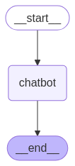

# Build a basic chatbot

In this tutorial, you will build a basic chatbot. This chatbot is the basis for the following series of tutorials where you will progressively add more sophisticated capabilities, and be introduced to key LangGraph concepts along the way. Let's dive in! 🌟

## Prerequisites

Before you start this tutorial, ensure you have access to a LLM that supports
tool-calling features, such as [OpenAI](https://platform.openai.com/api-keys),
[Anthropic](https://console.anthropic.com/settings/keys), or
[Google Gemini](https://ai.google.dev/gemini-api/docs/api-key).

## 1. Install packages

Install the required packages:

:::python

```bash
pip install -U langgraph langsmith
```

:::

:::js
=== "npm"

    ```bash
    npm install @langchain/langgraph @langchain/core zod
    ```

=== "yarn"

    ```bash
    yarn add @langchain/langgraph @langchain/core zod
    ```

=== "pnpm"

    ```bash
    pnpm add @langchain/langgraph @langchain/core zod
    ```

=== "bun"

    ```bash
    bun add @langchain/langgraph @langchain/core zod
    ```

:::

!!! tip

    Sign up for LangSmith to quickly spot issues and improve the performance of your LangGraph projects. LangSmith lets you use trace data to debug, test, and monitor your LLM apps built with LangGraph. For more information on how to get started, see [LangSmith docs](https://docs.smith.langchain.com).

## 2. Create a `StateGraph`

Now you can create a basic chatbot using LangGraph. This chatbot will respond directly to user messages.

Start by creating a `StateGraph`. A `StateGraph` object defines the structure of our chatbot as a "state machine". We'll add `nodes` to represent the llm and functions our chatbot can call and `edges` to specify how the bot should transition between these functions.

:::python

```python
from typing import Annotated

from typing_extensions import TypedDict

from langgraph.graph import StateGraph, START, END
from langgraph.graph.message import add_messages


class State(TypedDict):
    # Messages have the type "list". The `add_messages` function
    # in the annotation defines how this state key should be updated
    # (in this case, it appends messages to the list, rather than overwriting them)
    messages: Annotated[list, add_messages]


graph_builder = StateGraph(State)
```

:::

:::js

```typescript
import { StateGraph, MessagesZodState, START } from "@langchain/langgraph";
import { z } from "zod";

const State = z.object({ messages: MessagesZodState.shape.messages });

const graph = new StateGraph(State).compile();
```

:::

Our graph can now handle two key tasks:

1. Each `node` can receive the current `State` as input and output an update to the state.
2. Updates to `messages` will be appended to the existing list rather than overwriting it, thanks to the prebuilt reducer function.

!!! tip "Concept"

    When defining a graph, the first step is to define its `State`. The `State` includes the graph's schema and [reducer functions](https://langchain-ai.github.io/langgraph/concepts/low_level/#reducers) that handle state updates. In our example, `State` is a schema with one key: `messages`. The reducer function is used to append new messages to the list instead of overwriting it. Keys without a reducer annotation will overwrite previous values.

    To learn more about state, reducers, and related concepts, see [LangGraph reference docs](https://langchain-ai.github.io/langgraph/reference/graphs/#langgraph.graph.message.add_messages).

## 3. Add a node

Next, add a "`chatbot`" node. **Nodes** represent units of work and are typically regular functions.

Let's first select a chat model:

:::python



<!---
```python
from langchain.chat_models import init_chat_model

llm = init_chat_model("anthropic:claude-3-5-sonnet-latest")
```
-->

:::

:::js

```typescript
import { ChatOpenAI } from "@langchain/openai";
// or import { ChatAnthropic } from "@langchain/anthropic";

const llm = new ChatOpenAI({
  model: "gpt-4o",
  temperature: 0,
});
```

:::

We can now incorporate the chat model into a simple node:

:::python

```python

def chatbot(state: State):
    return {"messages": [llm.invoke(state["messages"])]}


# The first argument is the unique node name
# The second argument is the function or object that will be called whenever
# the node is used.
graph_builder.add_node("chatbot", chatbot)
```

:::

:::js

```typescript hl_lines="7-9"
import { StateGraph, MessagesZodState, START } from "@langchain/langgraph";
import { z } from "zod";

const State = z.object({ messages: MessagesZodState.shape.messages });

const graph = new StateGraph(State)
  .addNode("chatbot", async (state: z.infer<typeof State>) => {
    return { messages: [await llm.invoke(state.messages)] };
  })
  .compile();
```

:::

**Notice** how the `chatbot` node function takes the current `State` as input and returns a dictionary containing an updated `messages` list under the key "messages". This is the basic pattern for all LangGraph node functions.

:::python
The `add_messages` function in our `State` will append the LLM's response messages to whatever messages are already in the state.
:::

:::js
The `addMessages` function used within `MessagesZodState` will append the LLM's response messages to whatever messages are already in the state.
:::

## 4. Add an `entry` point

Add an `entry` point to tell the graph **where to start its work** each time it is run:

:::python

```python
graph_builder.add_edge(START, "chatbot")
```

:::

:::js

```typescript hl_lines="10"
import { StateGraph, MessagesZodState, START } from "@langchain/langgraph";
import { z } from "zod";

const State = z.object({ messages: MessagesZodState.shape.messages });

const graph = new StateGraph(State)
  .addNode("chatbot", async (state: z.infer<typeof State>) => {
    return { messages: [await llm.invoke(state.messages)] };
  })
  .addEdge(START, "chatbot")
  .compile();
```

:::

## 5. Add an `exit` point

Add an `exit` point to indicate **where the graph should finish execution**. This is helpful for more complex flows, but even in a simple graph like this, adding an end node improves clarity.

:::python

```python
graph_builder.add_edge("chatbot", END)
```

:::

:::js

```typescript hl_lines="11"
import { StateGraph, MessagesZodState, START, END } from "@langchain/langgraph";
import { z } from "zod";

const State = z.object({ messages: MessagesZodState.shape.messages });

const graph = new StateGraph(State)
  .addNode("chatbot", async (state: z.infer<typeof State>) => {
    return { messages: [await llm.invoke(state.messages)] };
  })
  .addEdge(START, "chatbot")
  .addEdge("chatbot", END)
  .compile();
```

:::

This tells the graph to terminate after running the chatbot node.

## 6. Compile the graph

Before running the graph, we'll need to compile it. We can do so by calling `compile()`
on the graph builder. This creates a `CompiledGraph` we can invoke on our state.

:::python

```python
graph = graph_builder.compile()
```

:::

:::js

```typescript hl_lines="12"
import { StateGraph, MessagesZodState, START, END } from "@langchain/langgraph";
import { z } from "zod";

const State = z.object({ messages: MessagesZodState.shape.messages });

const graph = new StateGraph(State)
  .addNode("chatbot", async (state: z.infer<typeof State>) => {
    return { messages: [await llm.invoke(state.messages)] };
  })
  .addEdge(START, "chatbot")
  .addEdge("chatbot", END)
  .compile();
```

:::

## 7. Visualize the graph (optional)

:::python
You can visualize the graph using the `get_graph` method and one of the "draw" methods, like `draw_ascii` or `draw_png`. The `draw` methods each require additional dependencies.

```python
from IPython.display import Image, display

try:
    display(Image(graph.get_graph().draw_mermaid_png()))
except Exception:
    # This requires some extra dependencies and is optional
    pass
```

:::

:::js
You can visualize the graph using the `getGraph` method and render the graph with the `drawMermaidPng` method.

```typescript
import * as fs from "node:fs/promises";

const drawableGraph = await graph.getGraphAsync();
const image = await drawableGraph.drawMermaidPng();
const imageBuffer = new Uint8Array(await image.arrayBuffer());

await fs.writeFile("basic-chatbot.png", imageBuffer);
```

:::



## 8. Run the chatbot

Now run the chatbot!

!!! tip

    You can exit the chat loop at any time by typing `quit`, `exit`, or `q`.

:::python

```python
def stream_graph_updates(user_input: str):
    for event in graph.stream({"messages": [{"role": "user", "content": user_input}]}):
        for value in event.values():
            print("Assistant:", value["messages"][-1].content)


while True:
    try:
        user_input = input("User: ")
        if user_input.lower() in ["quit", "exit", "q"]:
            print("Goodbye!")
            break
        stream_graph_updates(user_input)
    except:
        # fallback if input() is not available
        user_input = "What do you know about LangGraph?"
        print("User: " + user_input)
        stream_graph_updates(user_input)
        break
```

:::

:::js

```typescript
import { HumanMessage } from "@langchain/core/messages";

async function streamGraphUpdates(userInput: string) {
  const stream = await graph.stream({
    messages: [new HumanMessage(userInput)],
  });

import * as readline from "node:readline/promises";
import { StateGraph, MessagesZodState, START, END } from "@langchain/langgraph";
import { ChatOpenAI } from "@langchain/openai";
import { z } from "zod";

const llm = new ChatOpenAI({ model: "gpt-4o-mini" });

const State = z.object({ messages: MessagesZodState.shape.messages });

const graph = new StateGraph(State)
  .addNode("chatbot", async (state: z.infer<typeof State>) => {
    return { messages: [await llm.invoke(state.messages)] };
  })
  .addEdge(START, "chatbot")
  .addEdge("chatbot", END)
  .compile();

async function generateText(content: string) {
  const stream = await graph.stream(
    { messages: [{ type: "human", content }] },
    { streamMode: "values" }
  );

  for await (const event of stream) {
    for (const value of Object.values(event)) {
      console.log(
        "Assistant:",
        value.messages[value.messages.length - 1].content
      );
    const lastMessage = event.messages.at(-1);
    if (lastMessage?.getType() === "ai") {
      console.log(`Assistant: ${lastMessage.text}`);
    }
  }
}

const prompt = readline.createInterface({
  input: process.stdin,
  output: process.stdout,
});

while (true) {
  const human = await prompt.question("User: ");
  if (["quit", "exit", "q"].includes(human.trim())) break;
  await generateText(human || "What do you know about LangGraph?");
}

prompt.close();
```

:::

```
Assistant: LangGraph is a library designed to help build stateful multi-agent applications using language models. It provides tools for creating workflows and state machines to coordinate multiple AI agents or language model interactions. LangGraph is built on top of LangChain, leveraging its components while adding graph-based coordination capabilities. It's particularly useful for developing more complex, stateful AI applications that go beyond simple query-response interactions.
```

:::python

```
Goodbye!
```

:::

**Congratulations!** You've built your first chatbot using LangGraph. This bot can engage in basic conversation by taking user input and generating responses using an LLM. You can inspect a [LangSmith Trace](https://smith.langchain.com/public/7527e308-9502-4894-b347-f34385740d5a/r) for the call above.

:::python

Below is the full code for this tutorial:

```python
from typing import Annotated

from langchain.chat_models import init_chat_model
from typing_extensions import TypedDict

from langgraph.graph import StateGraph, START, END
from langgraph.graph.message import add_messages


class State(TypedDict):
    messages: Annotated[list, add_messages]


graph_builder = StateGraph(State)


llm = init_chat_model("anthropic:claude-3-5-sonnet-latest")


def chatbot(state: State):
    return {"messages": [llm.invoke(state["messages"])]}


# The first argument is the unique node name
# The second argument is the function or object that will be called whenever
# the node is used.
graph_builder.add_node("chatbot", chatbot)
graph_builder.add_edge(START, "chatbot")
graph_builder.add_edge("chatbot", END)
graph = graph_builder.compile()
```

:::

:::js

```typescript
import { StateGraph, START, END, MessagesZodState } from "@langchain/langgraph";
import { z } from "zod";
import { ChatOpenAI } from "@langchain/openai";

const llm = new ChatOpenAI({
  model: "gpt-4o",
  temperature: 0,
});

const State = z.object({ messages: MessagesZodState.shape.messages });

const graph = new StateGraph(State);
  // The first argument is the unique node name
  // The second argument is the function or object that will be called whenever
  // the node is used.
  .addNode("chatbot", async (state) => {
    return { messages: [await llm.invoke(state.messages)] };
  });
  .addEdge(START, "chatbot");
  .addEdge("chatbot", END)
  .compile();
```

:::

## Next steps

You may have noticed that the bot's knowledge is limited to what's in its training data. In the next part, we'll [add a web search tool](./2-add-tools.md) to expand the bot's knowledge and make it more capable.
