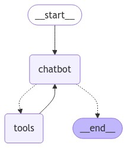

# Add human-in-the-loop controls

Agents can be unreliable and may need human input to successfully accomplish tasks. Similarly, for some actions, you may want to require human approval before running to ensure that everything is running as intended.

LangGraph's [persistence](../../concepts/persistence.md) layer supports **human-in-the-loop** workflows, allowing execution to pause and resume based on user feedback. The primary interface to this functionality is the [`interrupt`](../../how-tos/human_in_the_loop/add-human-in-the-loop.md) function. Calling `interrupt` inside a node will pause execution. Execution can be resumed, together with new input from a human, by passing in a [Command](../../concepts/low_level.md#command).

:::python
`interrupt` is ergonomically similar to Python's built-in `input()`, [with some caveats](../../how-tos/human_in_the_loop/add-human-in-the-loop.md).
:::

:::js
`interrupt` is ergonomically similar to Node.js's built-in `readline.question()` function, [with some caveats](../../how-tos/human_in_the_loop/add-human-in-the-loop.md).
`interrupt` is ergonomically similar to Node.js's built-in `readline.question()` function, [with some caveats](../../how-tos/human_in_the_loop/add-human-in-the-loop.md).
:::

!!! note

    This tutorial builds on [Add memory](./3-add-memory.md).

## 1. Add the `human_assistance` tool

Starting with the existing code from the [Add memory to the chatbot](./3-add-memory.md) tutorial, add the `human_assistance` tool to the chatbot. This tool uses `interrupt` to receive information from a human.

Let's first select a chat model:

:::python


<!---
```python
from langchain.chat_models import init_chat_model

llm = init_chat_model("anthropic:claude-3-5-sonnet-latest")
```
-->

:::

:::js

```typescript
// Add your API key here
process.env.ANTHROPIC_API_KEY = "YOUR_API_KEY";
```

:::

We can now incorporate it into our `StateGraph` with an additional tool:

:::python

```python hl_lines="12 19 20 21 22 23"
from typing import Annotated

from langchain_tavily import TavilySearch
from langchain_core.tools import tool
from typing_extensions import TypedDict

from langgraph.checkpoint.memory import InMemorySaver
from langgraph.graph import StateGraph, START, END
from langgraph.graph.message import add_messages
from langgraph.prebuilt import ToolNode, tools_condition

from langgraph.types import Command, interrupt

class State(TypedDict):
    messages: Annotated[list, add_messages]

graph_builder = StateGraph(State)

@tool
def human_assistance(query: str) -> str:
    """Request assistance from a human."""
    human_response = interrupt({"query": query})
    return human_response["data"]

tool = TavilySearch(max_results=2)
tools = [tool, human_assistance]
llm_with_tools = llm.bind_tools(tools)

def chatbot(state: State):
    message = llm_with_tools.invoke(state["messages"])
    # Because we will be interrupting during tool execution,
    # we disable parallel tool calling to avoid repeating any
    # tool invocations when we resume.
    assert len(message.tool_calls) <= 1
    return {"messages": [message]}

graph_builder.add_node("chatbot", chatbot)

tool_node = ToolNode(tools=tools)
graph_builder.add_node("tools", tool_node)

graph_builder.add_conditional_edges(
    "chatbot",
    tools_condition,
)
graph_builder.add_edge("tools", "chatbot")
graph_builder.add_edge(START, "chatbot")
```

:::

:::js

```typescript hl_lines="1 7-19"
import { interrupt, MessagesZodState } from "@langchain/langgraph";
import { ChatAnthropic } from "@langchain/anthropic";
import { TavilySearch } from "@langchain/tavily";
import { tool } from "@langchain/core/tools";
import { z } from "zod";

const humanAssistance = tool(
  async ({ query }) => {
    const humanResponse = interrupt({ query });
    return humanResponse.data;
  },
  {
    name: "humanAssistance",
    description: "Request assistance from a human.",
    schema: z.object({
      query: z.string().describe("Human readable question for the human"),
    }),
  }
);

const searchTool = new TavilySearch({ maxResults: 2 });
const searchTool = new TavilySearch({ maxResults: 2 });
const tools = [searchTool, humanAssistance];

const llmWithTools = new ChatAnthropic({
  model: "claude-3-5-sonnet-latest",
}).bindTools(tools);
const llmWithTools = new ChatAnthropic({
  model: "claude-3-5-sonnet-latest",
}).bindTools(tools);

async function chatbot(state: z.infer<typeof MessagesZodState>) {
async function chatbot(state: z.infer<typeof MessagesZodState>) {
  const message = await llmWithTools.invoke(state.messages);


  // Because we will be interrupting during tool execution,
  // we disable parallel tool calling to avoid repeating any
  // tool invocations when we resume.
  if (message.tool_calls && message.tool_calls.length > 1) {
    throw new Error("Multiple tool calls not supported with interrupts");
  }

  return { messages: message };
}
```

:::

!!! tip

    For more information and examples of human-in-the-loop workflows, see [Human-in-the-loop](../../concepts/human_in_the_loop.md).

## 2. Compile the graph

We compile the graph with a checkpointer, as before:

:::python

```python
memory = InMemorySaver()

graph = graph_builder.compile(checkpointer=memory)
```

:::

:::js

```typescript hl_lines="3 11"
import { StateGraph, MemorySaver, START, END } from "@langchain/langgraph";

const memory = new MemorySaver();

const graph = new StateGraph(MessagesZodState)
  .addNode("chatbot", chatbot)
  .addNode("tools", new ToolNode(tools))
  .addConditionalEdges("chatbot", toolsCondition, ["tools", END])
  .addEdge("tools", "chatbot")
  .addEdge(START, "chatbot")
  .compile({ checkpointer: memory });
const graph = new StateGraph(MessagesZodState)
  .addNode("chatbot", chatbot)
  .addNode("tools", new ToolNode(tools))
  .addConditionalEdges("chatbot", toolsCondition, ["tools", END])
  .addEdge("tools", "chatbot")
  .addEdge(START, "chatbot")
  .compile({ checkpointer: memory });
```

:::

## 3. Visualize the graph (optional)

Visualizing the graph, you get the same layout as before – just with the added tool!

:::python

```python
from IPython.display import Image, display

try:
    display(Image(graph.get_graph().draw_mermaid_png()))
except Exception:
    # This requires some extra dependencies and is optional
    pass
```

:::

:::js

```typescript
import * as fs from "node:fs/promises";
import * as fs from "node:fs/promises";

const drawableGraph = await graph.getGraphAsync();
const drawableGraph = await graph.getGraphAsync();
const image = await drawableGraph.drawMermaidPng();
const imageBuffer = new Uint8Array(await image.arrayBuffer());
const imageBuffer = new Uint8Array(await image.arrayBuffer());

await fs.writeFile("chatbot-with-tools.png", imageBuffer);
await fs.writeFile("chatbot-with-tools.png", imageBuffer);
```

:::



## 4. Prompt the chatbot

Now, prompt the chatbot with a question that will engage the new `human_assistance` tool:

:::python

```python
user_input = "I need some expert guidance for building an AI agent. Could you request assistance for me?"
config = {"configurable": {"thread_id": "1"}}

events = graph.stream(
    {"messages": [{"role": "user", "content": user_input}]},
    config,
    stream_mode="values",
)
for event in events:
    if "messages" in event:
        event["messages"][-1].pretty_print()
```

```
================================ Human Message =================================

I need some expert guidance for building an AI agent. Could you request assistance for me?
================================== Ai Message ==================================

[{'text': "Certainly! I'd be happy to request expert assistance for you regarding building an AI agent. To do this, I'll use the human_assistance function to relay your request. Let me do that for you now.", 'type': 'text'}, {'id': 'toolu_01ABUqneqnuHNuo1vhfDFQCW', 'input': {'query': 'A user is requesting expert guidance for building an AI agent. Could you please provide some expert advice or resources on this topic?'}, 'name': 'human_assistance', 'type': 'tool_use'}]
Tool Calls:
  human_assistance (toolu_01ABUqneqnuHNuo1vhfDFQCW)
 Call ID: toolu_01ABUqneqnuHNuo1vhfDFQCW
  Args:
    query: A user is requesting expert guidance for building an AI agent. Could you please provide some expert advice or resources on this topic?
```

:::

:::js

```typescript
import { isAIMessage } from "@langchain/core/messages";

const userInput =
  "I need some expert guidance for building an AI agent. Could you request assistance for me?";

const events = await graph.stream(
  { messages: [{ role: "user", content: userInput }] },
  { configurable: { thread_id: "1" }, streamMode: "values" }
  { configurable: { thread_id: "1" }, streamMode: "values" }
);

for await (const event of events) {
  if ("messages" in event) {
    const lastMessage = event.messages.at(-1);
    console.log(`[${lastMessage?.getType()}]: ${lastMessage?.text}`);

    if (
      lastMessage &&
      isAIMessage(lastMessage) &&
      lastMessage.tool_calls?.length
    ) {
    const lastMessage = event.messages.at(-1);
    console.log(`[${lastMessage?.getType()}]: ${lastMessage?.text}`);

    if (
      lastMessage &&
      isAIMessage(lastMessage) &&
      lastMessage.tool_calls?.length
    ) {
      console.log("Tool calls:", lastMessage.tool_calls);
    }
  }
}
```

```
[human]: I need some expert guidance for building an AI agent. Could you request assistance for me?
[ai]: I'll help you request human assistance for guidance on building an AI agent.
[ai]: I'll help you request human assistance for guidance on building an AI agent.
Tool calls: [
  {
    name: 'humanAssistance',
    args: {
      query: 'I would like expert guidance on building an AI agent. Could you please provide assistance with this topic?'
      query: 'I would like expert guidance on building an AI agent. Could you please provide assistance with this topic?'
    },
    id: 'toolu_01Bpxc8rFVMhSaRosS6b85Ts',
    type: 'tool_call'
    id: 'toolu_01Bpxc8rFVMhSaRosS6b85Ts',
    type: 'tool_call'
  }
]
```

:::

The chatbot generated a tool call, but then execution has been interrupted. If you inspect the graph state, you see that it stopped at the tools node:

:::python

```python
snapshot = graph.get_state(config)
snapshot.next
```

```
('tools',)
```

:::

:::js

```typescript
const snapshot = await graph.getState({ configurable: { thread_id: "1" } });
snapshot.next;
const snapshot = await graph.getState({ configurable: { thread_id: "1" } });
snapshot.next;
```

```json
["tools"]
```

:::

!!! info Additional information

    :::python

    Take a closer look at the `human_assistance` tool:

    ```python
    @tool
    def human_assistance(query: str) -> str:
        """Request assistance from a human."""
        human_response = interrupt({"query": query})
        return human_response["data"]
    ```

    Similar to Python's built-in `input()` function, calling `interrupt` inside the tool will pause execution. Progress is persisted based on the [checkpointer](../../concepts/persistence.md#checkpointer-libraries); so if it is persisting with Postgres, it can resume at any time as long as the database is alive. In this example, it is persisting with the in-memory checkpointer and can resume any time if the Python kernel is running.
    :::

    :::js

    Take a closer look at the `humanAssistance` tool:

    ```typescript hl_lines="3"
    const humanAssistance = tool(
      async ({ query }) => {
        const humanResponse = interrupt({ query });
        return humanResponse.data;
      },
      {
        name: "humanAssistance",
        description: "Request assistance from a human.",
        schema: z.object({
          query: z.string().describe("Human readable question for the human"),
        }),
      },
    );

    Take a closer look at the `humanAssistance` tool:

    ```typescript hl_lines="3"
    const humanAssistance = tool(
      async ({ query }) => {
        const humanResponse = interrupt({ query });
        return humanResponse.data;
      },
      {
        name: "humanAssistance",
        description: "Request assistance from a human.",
        schema: z.object({
          query: z.string().describe("Human readable question for the human"),
        }),
      },
    );
    ```

    Calling `interrupt` inside the tool will pause execution. Progress is persisted based on the [checkpointer](../../concepts/persistence.md#checkpointer-libraries); so if it is persisting with Postgres, it can resume at any time as long as the database is alive. In this example, it is persisting with the in-memory checkpointer and can resume any time if the JavaScript runtime is running.
    :::

## 5. Resume execution

To resume execution, pass a [`Command`](../../concepts/low_level.md#command) object containing data expected by the tool. The format of this data can be customized based on needs.

:::python

For this example, use a dict with a key `"data"`:

```python
human_response = (
    "We, the experts are here to help! We'd recommend you check out LangGraph to build your agent."
    " It's much more reliable and extensible than simple autonomous agents."
)

human_command = Command(resume={"data": human_response})

events = graph.stream(human_command, config, stream_mode="values")
for event in events:
    if "messages" in event:
        event["messages"][-1].pretty_print()
```

```
================================== Ai Message ==================================

[{'text': "Certainly! I'd be happy to request expert assistance for you regarding building an AI agent. To do this, I'll use the human_assistance function to relay your request. Let me do that for you now.", 'type': 'text'}, {'id': 'toolu_01ABUqneqnuHNuo1vhfDFQCW', 'input': {'query': 'A user is requesting expert guidance for building an AI agent. Could you please provide some expert advice or resources on this topic?'}, 'name': 'human_assistance', 'type': 'tool_use'}]
Tool Calls:
  human_assistance (toolu_01ABUqneqnuHNuo1vhfDFQCW)
 Call ID: toolu_01ABUqneqnuHNuo1vhfDFQCW
  Args:
    query: A user is requesting expert guidance for building an AI agent. Could you please provide some expert advice or resources on this topic?
================================= Tool Message =================================
Name: human_assistance

We, the experts are here to help! We'd recommend you check out LangGraph to build your agent. It's much more reliable and extensible than simple autonomous agents.
================================== Ai Message ==================================

Thank you for your patience. I've received some expert advice regarding your request for guidance on building an AI agent. Here's what the experts have suggested:

The experts recommend that you look into LangGraph for building your AI agent. They mention that LangGraph is a more reliable and extensible option compared to simple autonomous agents.

LangGraph is likely a framework or library designed specifically for creating AI agents with advanced capabilities. Here are a few points to consider based on this recommendation:

1. Reliability: The experts emphasize that LangGraph is more reliable than simpler autonomous agent approaches. This could mean it has better stability, error handling, or consistent performance.

2. Extensibility: LangGraph is described as more extensible, which suggests that it probably offers a flexible architecture that allows you to easily add new features or modify existing ones as your agent's requirements evolve.

3. Advanced capabilities: Given that it's recommended over "simple autonomous agents," LangGraph likely provides more sophisticated tools and techniques for building complex AI agents.
...
2. Look for tutorials or guides specifically focused on building AI agents with LangGraph.
3. Check if there are any community forums or discussion groups where you can ask questions and get support from other developers using LangGraph.

If you'd like more specific information about LangGraph or have any questions about this recommendation, please feel free to ask, and I can request further assistance from the experts.
Output is truncated. View as a scrollable element or open in a text editor. Adjust cell output settings...
```

:::

:::js
For this example, use an object with a key `"data"`:

```typescript
import { Command } from "@langchain/langgraph";

const humanResponse =
  "We, the experts are here to help! We'd recommend you check out LangGraph to build your agent." +
  " It's much more reliable and extensible than simple autonomous agents.";
(" It's much more reliable and extensible than simple autonomous agents.");

const humanCommand = new Command({ resume: { data: humanResponse } });

const resumeEvents = await graph.stream(humanCommand, {
  configurable: { thread_id: "1" },
  streamMode: "values",
});
const resumeEvents = await graph.stream(humanCommand, {
  configurable: { thread_id: "1" },
  streamMode: "values",
});

for await (const event of resumeEvents) {
  if ("messages" in event) {
    const lastMessage = event.messages.at(-1);
    console.log(`[${lastMessage?.getType()}]: ${lastMessage?.text}`);
    const lastMessage = event.messages.at(-1);
    console.log(`[${lastMessage?.getType()}]: ${lastMessage?.text}`);
  }
}
```

```
[tool]: We, the experts are here to help! We'd recommend you check out LangGraph to build your agent. It's much more reliable and extensible than simple autonomous agents.
[ai]: Thank you for your patience. I've received some expert advice regarding your request for guidance on building an AI agent. Here's what the experts have suggested:

The experts recommend that you look into LangGraph for building your AI agent. They mention that LangGraph is a more reliable and extensible option compared to simple autonomous agents.

LangGraph is likely a framework or library designed specifically for creating AI agents with advanced capabilities. Here are a few points to consider based on this recommendation:

1. Reliability: The experts emphasize that LangGraph is more reliable than simpler autonomous agent approaches. This could mean it has better stability, error handling, or consistent performance.

2. Extensibility: LangGraph is described as more extensible, which suggests that it probably offers a flexible architecture that allows you to easily add new features or modify existing ones as your agent's requirements evolve.

3. Advanced capabilities: Given that it's recommended over "simple autonomous agents," LangGraph likely provides more sophisticated tools and techniques for building complex AI agents.

...
```

:::

The input has been received and processed as a tool message. Review this call's [LangSmith trace](https://smith.langchain.com/public/9f0f87e3-56a7-4dde-9c76-b71675624e91/r) to see the exact work that was done in the above call. Notice that the state is loaded in the first step so that our chatbot can continue where it left off.

**Congratulations!** You've used an `interrupt` to add human-in-the-loop execution to your chatbot, allowing for human oversight and intervention when needed. This opens up the potential UIs you can create with your AI systems. Since you have already added a **checkpointer**, as long as the underlying persistence layer is running, the graph can be paused **indefinitely** and resumed at any time as if nothing had happened.

Check out the code snippet below to review the graph from this tutorial:

:::python



```python
from typing import Annotated

from langchain_tavily import TavilySearch
from langchain_core.tools import tool
from typing_extensions import TypedDict

from langgraph.checkpoint.memory import InMemorySaver
from langgraph.graph import StateGraph, START, END
from langgraph.graph.message import add_messages
from langgraph.prebuilt import ToolNode, tools_condition
from langgraph.types import Command, interrupt

class State(TypedDict):
    messages: Annotated[list, add_messages]

graph_builder = StateGraph(State)

@tool
def human_assistance(query: str) -> str:
    """Request assistance from a human."""
    human_response = interrupt({"query": query})
    return human_response["data"]

tool = TavilySearch(max_results=2)
tools = [tool, human_assistance]
llm_with_tools = llm.bind_tools(tools)

def chatbot(state: State):
    message = llm_with_tools.invoke(state["messages"])
    assert(len(message.tool_calls) <= 1)
    return {"messages": [message]}

graph_builder.add_node("chatbot", chatbot)

tool_node = ToolNode(tools=tools)
graph_builder.add_node("tools", tool_node)

graph_builder.add_conditional_edges(
    "chatbot",
    tools_condition,
)
graph_builder.add_edge("tools", "chatbot")
graph_builder.add_edge(START, "chatbot")

memory = InMemorySaver()
graph = graph_builder.compile(checkpointer=memory)
```

:::

:::js

```typescript
import {
  interrupt,
  MessagesZodState,
  StateGraph,
  MemorySaver,
  START,
  END,
} from "@langchain/langgraph";
import { ToolNode, toolsCondition } from "@langchain/langgraph/prebuilt";
import { isAIMessage } from "@langchain/core/messages";
import { ChatAnthropic } from "@langchain/anthropic";
import { TavilySearch } from "@langchain/tavily";
import {
  interrupt,
  MessagesZodState,
  StateGraph,
  MemorySaver,
  START,
  END,
} from "@langchain/langgraph";
import { ToolNode, toolsCondition } from "@langchain/langgraph/prebuilt";
import { isAIMessage } from "@langchain/core/messages";
import { ChatAnthropic } from "@langchain/anthropic";
import { TavilySearch } from "@langchain/tavily";
import { tool } from "@langchain/core/tools";
import { z } from "zod";

const humanAssistance = tool(
  async ({ query }) => {
    const humanResponse = interrupt({ query });
    return humanResponse.data;
  },
  {
    name: "humanAssistance",
    description: "Request assistance from a human.",
    schema: z.object({
      query: z.string().describe("Human readable question for the human"),
    }),
  }
);
const humanAssistance = tool(
  async ({ query }) => {
    const humanResponse = interrupt({ query });
    return humanResponse.data;
  },
  {
    name: "humanAssistance",
    description: "Request assistance from a human.",
    schema: z.object({
      query: z.string().describe("Human readable question for the human"),
    }),
  }
);

const searchTool = new TavilySearch({ maxResults: 2 });
const searchTool = new TavilySearch({ maxResults: 2 });
const tools = [searchTool, humanAssistance];

const llmWithTools = new ChatAnthropic({
  model: "claude-3-5-sonnet-latest",
}).bindTools(tools);
const llmWithTools = new ChatAnthropic({
  model: "claude-3-5-sonnet-latest",
}).bindTools(tools);

const chatbot = async (state: z.infer<typeof MessagesZodState>) => {
const chatbot = async (state: z.infer<typeof MessagesZodState>) => {
  const message = await llmWithTools.invoke(state.messages);

  // Because we will be interrupting during tool execution,
  // we disable parallel tool calling to avoid repeating any
  // tool invocations when we resume.

  // Because we will be interrupting during tool execution,
  // we disable parallel tool calling to avoid repeating any
  // tool invocations when we resume.
  if (message.tool_calls && message.tool_calls.length > 1) {
    throw new Error("Multiple tool calls not supported with interrupts");
  }

  return { messages: message };

  return { messages: message };
};

const memory = new MemorySaver();

const graph = new StateGraph(MessagesZodState)
  .addNode("chatbot", chatbot)
  .addNode("tools", new ToolNode(tools))
  .addConditionalEdges("chatbot", toolsCondition, ["tools", END])
  .addEdge("tools", "chatbot")
  .addEdge(START, "chatbot")
  .compile({ checkpointer: memory });

const graph = new StateGraph(MessagesZodState)
  .addNode("chatbot", chatbot)
  .addNode("tools", new ToolNode(tools))
  .addConditionalEdges("chatbot", toolsCondition, ["tools", END])
  .addEdge("tools", "chatbot")
  .addEdge(START, "chatbot")
  .compile({ checkpointer: memory });
```

:::

## Next steps

So far, the tutorial examples have relied on a simple state with one entry: a list of messages. You can go far with this simple state, but if you want to define complex behavior without relying on the message list, you can [add additional fields to the state](./5-customize-state.md).
